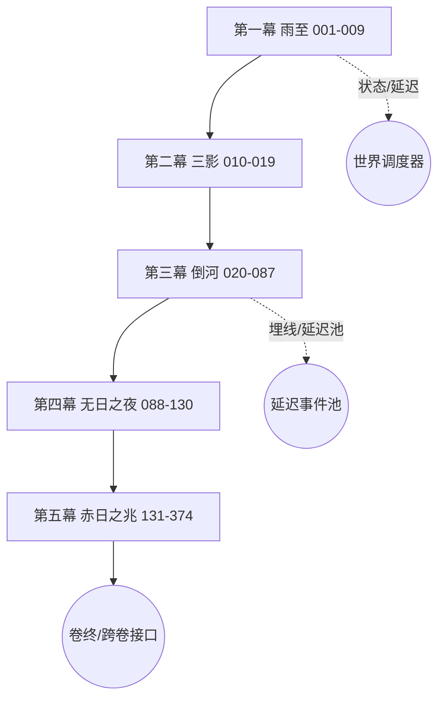

# 山海异闻录：天地未定 · 第一卷《黑雨》完整剧本

> 适配文字游戏（text-based game）引擎生成需求的结构化剧本。
> 来源：第一卷《黑雨》V6.0闭环事件网络.xmind + 黑雨_完整游戏小说.md（交互结构/对话） + 黑雨_文学扩写版.md（场景质感/氛围）
> 卷标识：`V01`　标题：黑雨　副标题：赤水有尸，天上少了一轮太阳
> 内容版本：V6.0　剧本 schema：1.0.0

## 一、如何使用本剧本

- **引擎版（同目录 `第一卷_黑雨_剧本_引擎版.json`）**：可直接被文字游戏引擎解析。每个节点含 `blocks`（narration/dialogue/system）、`choices`（含 `next` 精确跳转或 `routing` 系统路由）、`onEnterEffects`、`tags`、`branchClass`。
- **本 MD**：供人类审阅与段落生成，结构与 JSON 一一对应（节点 id 一致）。

### 章节（五幕）划分

| 幕 | 代码 | 节点区间 | 场景数 | 概要 |
|---|---|---|---|---|
| 第一幕 雨至 | `ACT1_RAIN_ARRIVES` | 001–009 | 9 | 黑雨初落杳湾。玩家在村口三处灯（记历棚、渡口、粮仓）间落脚，结下第一份人情，并瞥见老井'哭'、北滩异象等伏笔。 |
| 第二幕 三影 | `ACT2_THREE_SHADOWS` | 010–019 | 10 | 雨未停，清晨的杳湾浮现赤金箭痕与'三影分立'之异象；含晦之盐封启闭，玩家在'箭痕未冷''迟日有名'间埋下跨幕因果。 |
| 第三幕 倒河 | `ACT3_RIVER_REVERSED` | 020–087 | 68 | 倒灌的赤水把失物、旧账与未出生的明天翻到岸上。十巢、桑林、旧盐井、替尸体做梦的人等多线并行，名字与记忆成为改写路径的力量。 |
| 第四幕 无日之夜 | `ACT4_SUNLESS_NIGHT` | 088–130 | 43 | 井底藏着的'一小块白天'被揭出：含晦背上的嘴、二十年含而不发的第一句话、名单室里没有一页叫作孩子。真相在井口与证词间反复拉锯。 |
| 第五幕 赤日之兆 | `ACT5_SOLAR_OMEN` | 131–374 | 244 | 第七日将临。四方代价、旧账交易、不可交易的送尸与人情；雨停前每个人都只准备了一件能交出去的东西。多高潮收束为遗产包与跨卷继承。 |

### 出口类型与系统锚点（闭环规则）

任何非终局选项必须有出口，且**绝不臆造精确剧情目标**：

- **DIRECT**（精确跳转）：原稿选项文字明确点名后续事件，next 已解析为目标节点 id（精确程序接口仍待 JSON 校准）。
- **STATE**（状态写入→世界调度器）：状态写入后回世界调度器；next=null，routing=STATE_WRITE。
- **DELAY**（埋线→延迟事件池）：写入延迟事件池；next=null，routing=DELAY_POOL。
- **RETURN**（返回/卷终）：支线结束/卷终/跨卷接口；next=null，routing=VOLUME_END。

系统锚点：
- `WORLD_SCHEDULER`：世界调度器：时间/地点/状态/可用事件。支线结束或非精确跳转时回到此处重新读取世界。
- `DELAY_POOL`：埋线/延迟事件池：现在写入，未来时点或条件成熟后回收（含跨卷伏笔）。
- `STATE_WRITE`：状态写入：人物/世界/知识/经历，具体数值待 JSON 校准。
- `VOLUME_END`：卷终/跨卷接口：卷末多高潮、遗产包、跨卷继承。

**统计**：剧情节点 374 个，分支选项 809 个（精确跳转 DIRECT 68 / 状态写入 STATE 579 / 延迟池 DELAY 107 / 返回·卷终 RETURN 55）。

### 主线流程图（Mermaid）

## 二、角色表（NPC）

| NPC id | 姓名 |
|---|---|
| `NPC-AHE` | 阿禾 |
| `NPC-YANBO` | 砚伯 |
| `NPC-JIANPO` | 缄婆 |
| `NPC-SUSHA` | 宿沙 |
| `NPC-QINGYA` | 青芽 |
| `NPC-WEIQING` | 隗青 |
| `NPC-YANTONG` | 砚童 |
| `NPC-LIWEI` | 黎苇 |
| `NPC-JILI` | 季狸 |
| `NPC-YI` | 羿 |
| `NPC-THREESHADOW` | 三影者 |
| `NPC-JILI2` | 季缨 |

## 卷首 · 杳湾的盐与账

> 来源：`黑雨_文学扩写版.md`（卷首）。供开场氛围与世界观铺陈，不占用剧情节点。

杳湾在赤水北岸，村子不大，房屋却盖得比别处低。每逢雨季，山上的水会把河推得高过门槛；每逢旱季，北边来的车又会把粮价推得高过人的胆子。于是杳湾人学会了两件本事：把屋基压低，把话压在心里。 村里最值钱的并不是田。田一场水就能带走。真正值钱的是北坡那口封了二十年的旧盐井——至少账上如此。账上写的是盐，每年交给北方祭库的也是盐：灯油里掺一点，伤药里抹一点，贵人祭祀时撒一点。谁也没问过盐从哪里来，正如谁也没问过北方为什么肯用三倍粮价来收一捧灰白的晶末。 砚伯问过。他在最旧一页账簿的边角写了一行小字：**“盐井无水，何来盐？”** 第二天，那行字被刮掉了。 刮痕至今还在。砚伯每次翻到那页，总会用拇指在纸边停一停，像一个人摸到旧伤，不肯承认它疼。 ---

## 三、逐幕剧本

## 第一幕 雨至（ACT1_RAIN_ARRIVES　节点 001–009）

> 黑雨初落杳湾。玩家在村口三处灯（记历棚、渡口、粮仓）间落脚，结下第一份人情，并瞥见老井'哭'、北滩异象等伏笔。

### [001] 雨脚　*（主线）*　📜文学增强　*（V6.1 开场重排：立世界·降密度）*

- **节点 id**：`V01-ACT1_RAIN_ARRIVES-001`　|　**地点**：杳湾·村口　|　**母稿位置**：L13-L26　|　**branchClass**：`diverge`

**场景描述**

你到杳湾这天，村子正把屋基压得比别处低。赤水在村北，雨季一来，水会比门槛高；北边来的车，又把粮价推得比人的胆子高。于是杳湾人学会两件事：把屋基压低，把话压在心里。

村中最值钱的不算田——田一场水就带走。真正值钱的是北坡那口封了二十年的旧盐井，至少账上如此：账上写盐，每年交给北方祭库的也是盐。谁也没问过盐从哪来。

记历棚里，一个穿薄麻袍的老人就着檐下光翻历书，袖口干净得近乎固执。他念给自己听："历上说今日晴。宜晒谷，宜补网，忌远渡。"

话音未落，第一滴雨落在你手背上。它凉得像从井底捞出的铜钱，落处没有散开，圆得过分。

**角色对话**

> **砚伯**（抬头）：外乡人？今日不该有雨。历书若没错，就是天错了。
> **砚伯**：要避雨，记历棚的门开着；要落脚，村中自有规矩。

**分支选项**

1. **抬头，看那滴不散的黑雨** 〔观/疑〕　[STATE] → `STATE_WRITE`（状态写入→世界调度器）
   - 状态写入：观察黑雨的异样
   - ⚠️ 具体状态变量/数值待 JSON 校准
2. **走进记历棚，向翻历书的老人问路** 〔中性〕　[STATE] → `STATE_WRITE`（状态写入→世界调度器）
   - 状态写入：走进记历棚，向砚伯问路
   - ⚠️ 具体状态变量/数值待 JSON 校准
---

### [002] 砚伯的棚　*（人物线）*　📜文学增强　*（V6.1 开场重排：补世界规则·修前因）*

- **节点 id**：`V01-ACT1_RAIN_ARRIVES-002`　|　**地点**：记历棚　|　**母稿位置**：L27-L38　|　**branchClass**：`reflow`

**场景描述**

你迈进记历棚。棚里只有一张矮桌、一摞潮边的历页。砚伯把竹签夹在指间，指节白得像被盐腌过。

"杳湾靠记账活着。"他说，"谁家生了人，谁家死了人，哪年旱，哪年洪，谁借了粮，谁还了债，都归我写。村人不一定信神，但都信我写下的日期——日期一旦错了，很多人就要想起自己其实欠着谁。"

他指了指北坡方向："那口盐井封了二十年。账上写盐，可盐井早没水了。'盐井无水，何来盐'，这话我写过，第二天就被人刮了。"刮痕还在纸边，像旧伤。

黑雨开始密了。棚外有人说，东边来的风带着一股不合时令的热气。

**角色对话**

> **砚伯**：雨谱不能断。你若想留，就帮我抄两行；不想掺和，也行。
> **砚伯**：落脚的事，去问粮仓的青芽——锁是她守的。

**分支选项**

1. **帮他抄录雨谱** 〔中性〕　[STATE] → `STATE_WRITE`（状态写入→世界调度器）
   - 状态写入：帮砚伯抄录雨谱
   - ⚠️ 具体状态变量/数值待 JSON 校准
2. **追问：盐井没水，村里的盐从哪来** 〔疑〕　[STATE] → `STATE_WRITE`（状态写入→世界调度器）
   - 状态写入：追问盐井无水的来历
   - ⚠️ 具体状态变量/数值待 JSON 校准
3. **问他村中可有空屋** 〔中性〕　[STATE] → `STATE_WRITE`（状态写入→世界调度器）
   - 状态写入：向砚伯打听空屋
   - ⚠️ 具体状态变量/数值待 JSON 校准
---

### [003] 渡口·宿沙　*（人物线）*　📜文学增强　*（V6.1 开场重排：单事件聚焦）*

- **节点 id**：`V01-ACT1_RAIN_ARRIVES-003`　|　**地点**：渡口　|　**母稿位置**：L39-L50　|　**branchClass**：`reflow`

**场景描述**

沿河走到渡口，宿沙正冲着河水吼。他是这村的渡工，背比从前弯了些，手却还稳。半年前，他的长子随一条盐船沉进下游，从此他不再叫儿子的名字，只说"船上那个"。

木梆响了一声——按杳湾的规矩，那是提醒村人收粮、关门、赶牲畜。可宿沙说，那不是梆声；是有人在船底敲门。河水正把浪一朵一朵送回上游，像远处有人倒着收网。

他守着缆桩，舱里盖着一卷用油布裹紧的东西。

**角色对话**

> **宿沙**：浪比平时高半尺。你若来避雨，就帮我压住缆——别碰舱里那卷东西。

**分支选项**

1. **帮他修被冲坏的缆桩** 〔中性〕　[STATE] → `STATE_WRITE`（状态写入→世界调度器）
   - 状态写入：帮宿沙修缆桩
   - ⚠️ 具体状态变量/数值待 JSON 校准
2. **问他河对岸有什么** 〔中性〕　[STATE] → `STATE_WRITE`（状态写入→世界调度器）
   - 状态写入：问宿沙河对岸
   - ⚠️ 具体状态变量/数值待 JSON 校准
3. **依他说的，不碰舱里那卷东西** 〔慎〕　[STATE] → `STATE_WRITE`（状态写入→世界调度器）
   - 状态写入：守在旁不碰舱中物
   - ⚠️ 具体状态变量/数值待 JSON 校准
---

### [004] 粮仓·青芽　*（埋线 / 伏笔）*　📜文学增强　*（V6.1 开场重排：单事件·去四选一）*

- **节点 id**：`V01-ACT1_RAIN_ARRIVES-004`　|　**地点**：粮仓　|　**母稿位置**：L51-L64　|　**branchClass**：`delayed`

**场景描述**

粮仓前，青芽抱着半筐饼，守着一把生铁锁。她说空屋没有，饼倒还有。雨若是连下三天，粮就该发芽了——这话她像说过很多遍。

仓板上凝着水珠，她用袖子一遍遍擦，擦不干。

**角色对话**

> **青芽**：粮仓的锁我守着。你若要找帮手，东边的阿禾在放羊——她认得每只羊的名字，也认得雨里哪些地方不能走。
> **青芽**：神要吃人之前，恐慌会先把粮吃完。

**分支选项**

1. **帮她清点存粮** 〔理〕　[DELAY] → `DELAY_POOL`（埋线→延迟事件池）
   - 状态写入：帮青芽清点存粮
   - ⚠️ 具体状态变量/数值待 JSON 校准
2. **提醒她雨会坏粮，先把湿粮隔开** 〔中性〕　[DELAY] → `DELAY_POOL`（埋线→延迟事件池）
   - 状态写入：提醒青芽隔离湿粮
   - ⚠️ 具体状态变量/数值待 JSON 校准
3. **听她讲村中"记账"的规矩** 〔中性〕　[DELAY] → `DELAY_POOL`（埋线→延迟事件池）
   - 状态写入：听青芽讲记账规矩
   - ⚠️ 具体状态变量/数值待 JSON 校准

**进入效果（埋线/回收）**

- `plantFlag`：埋线/伏笔，未来按条件回收（跨卷亦在此）。（flag：`FORE_004`）
---

### [005] 村中夜议　*（主线）*　📜文学增强　*（V6.1 开场重排：放缓·先争论后抛消息）*

- **节点 id**：`V01-ACT1_RAIN_ARRIVES-005`　|　**地点**：杳湾村、祠屋　|　**母稿位置**：L65-L76　|　**branchClass**：`diverge`

**场景描述**

入夜，祠屋挤了些人。祖灵牌被挪下来堵西墙的漏缝。砚伯不同意，最后是青芽抱来两麻袋湿粮往牌位前一放，说祖宗若真有用，今晚先替活人挡水。

火塘边，缄婆、青芽陆续落座。砚伯把历书摊在膝上，纸页潮得卷起边："历若没错，就是天错了。"

缄婆没有抬头："天不会错。"

"那是谁错？"

"写天的人会。"这话一落，祠屋里有人咳嗽，有人往火塘里缩脚。

争论到此处，守夜人隗青推门进来，蓑衣上的水在地上洇出一个人形。他说话总先交代自己没做什么。

"我没碰。"他说，"北滩有东西。像人。胸口插着箭。它有三道影子。"

**角色对话**

> **缄婆**（盖盐罐）：别让它们进祠屋。影子。
> **阿禾**（抱羊站在门边）：小满没死。它朝东跪，是因为东边那个。

**分支选项**

1. **跟缄婆下井查看** 〔理/疑〕　[STATE] → `STATE_WRITE`（状态写入→世界调度器）
   - 状态写入：跟缄婆下井查看
   - ⚠️ 具体状态变量/数值待 JSON 校准
2. **守在井口接应** 〔中性〕　[STATE] → `STATE_WRITE`（状态写入→世界调度器）
   - 状态写入：守在井口接应
   - ⚠️ 具体状态变量/数值待 JSON 校准
3. **去北滩探那具浮尸的传闻** 〔中性〕　[STATE] → `STATE_WRITE`（状态写入→世界调度器）
   - 状态写入：去北滩探浮尸
   - ⚠️ 具体状态变量/数值待 JSON 校准
---

## 第二幕　三影

**角色对话**

> **缄婆**：老井在哭。不是水响，是有人在水底下说话。你们谁跟我去看看？

**分支选项**

1. **跟缄婆下井查看** 〔理/疑〕　[STATE] → `STATE_WRITE`（状态写入→世界调度器）
   - 状态写入：跟缄婆下井查看
   - ⚠️ 具体状态变量/数值待 JSON 校准
2. **守在井口接应** 〔中性〕　[STATE] → `STATE_WRITE`（状态写入→世界调度器）
   - 状态写入：守在井口接应
   - ⚠️ 具体状态变量/数值待 JSON 校准
3. **不理井，去北滩探那具浮尸的传闻** 〔中性〕　[STATE] → `STATE_WRITE`（状态写入→世界调度器）
   - 状态写入：不理井，去北滩探那具浮尸的传闻
   - ⚠️ 具体状态变量/数值待 JSON 校准

---

### [006] 井底　*（线索 / 调查）*　📜文学增强　*（V6.1 开场重排：保留）*

- **节点 id**：`V01-ACT1_RAIN_ARRIVES-006`　|　**地点**：老井/井底　|　**母稿位置**：L77-L88　|　**branchClass**：`reflow`

**场景描述**

井底结着一层昼盐似的浮尘，墙里嵌着半面残镜，镜子照不出你，只照出一片一直在下的雨。

井壁渗水声里，隐约有人说话；你分不清那是雨的回声，还是井自己在记一笔旧账。

**分支选项**

1. **取走一撮昼盐浮尘** 〔中性〕　[STATE] → `STATE_WRITE`（状态写入→世界调度器）
   - 状态写入：取走一撮昼盐浮尘
   - ⚠️ 具体状态变量/数值待 JSON 校准
2. **记下残镜的纹路** 〔中性〕　[STATE] → `STATE_WRITE`（状态写入→世界调度器）
   - 状态写入：记下残镜纹路
   - ⚠️ 具体状态变量/数值待 JSON 校准
3. **什么也不动，恭敬退出** 〔中性〕　[STATE] → `STATE_WRITE`（状态写入→世界调度器）
   - 状态写入：恭敬退出井底
   - ⚠️ 具体状态变量/数值待 JSON 校准
---

### [007] 井口　*（人物线）*　📜文学增强　*（V6.1 开场重排：保留）*

- **节点 id**：`V01-ACT1_RAIN_ARRIVES-007`　|　**地点**：井口　|　**母稿位置**：L89-L98　|　**branchClass**：`reflow`

**场景描述**

你守在井口。风灌下去，带回的却不只是水声——是人声，和缄婆的嗓音叠在一起，像在念一个名字。

**分支选项**

1. **喊缄婆快上来** 〔中性〕　[STATE] → `STATE_WRITE`（状态写入→世界调度器）
   - 状态写入：喊缄婆快上来
   - ⚠️ 具体状态变量/数值待 JSON 校准
2. **记下水声与人声叠着的节奏** 〔中性〕　[STATE] → `STATE_WRITE`（状态写入→世界调度器）
   - 状态写入：记下水声人声节奏
   - ⚠️ 具体状态变量/数值待 JSON 校准
3. **独自下到一半去探查** 〔理/疑/独〕　[STATE] → `STATE_WRITE`（状态写入→世界调度器）
   - 状态写入：独自下井半途探查
   - ⚠️ 具体状态变量/数值待 JSON 校准
---

### [008] 北滩·浮尸　*（世界事件）*　📜文学增强　*（V6.1 开场重排：保留）*

- **节点 id**：`V01-ACT1_RAIN_ARRIVES-008`　|　**地点**：北滩　|　**母稿位置**：L99-L108　|　**branchClass**：`reflow`

**场景描述**

北滩搁着一具浮尸，雨打在它肩上，泛起赤金色的光。你一抬头，三道影子在雨幕里分立，像在等谁先动。

**分支选项**

1. **近前看尸身肩上的伤** 〔中性〕　[STATE] → `STATE_WRITE`（状态写入→世界调度器）
   - 状态写入：近前看尸身伤
   - ⚠️ 具体状态变量/数值待 JSON 校准
2. **追那三道影子** 〔勇〕　[STATE] → `STATE_WRITE`（状态写入→世界调度器）
   - 状态写入：追三道影子
   - ⚠️ 具体状态变量/数值待 JSON 校准
3. **回村报信，不靠近** 〔中性〕　[RETURN] → `VOLUME_END`（返回/卷终）
   - ⚠️ 具体状态变量/数值待 JSON 校准
---

### [009] 雨未停　*（主线）*　📜文学增强　*（V6.1 开场重排：保留·接第二幕）*

- **节点 id**：`V01-ACT1_RAIN_ARRIVES-009`　|　**地点**：杳湾　|　**母稿位置**：L109-L122　|　**branchClass**：`diverge`

**场景描述**

雨没停。天亮前，你得决定以什么身份留在杳湾——这身份会决定你如何撞上第二幕的那具尸。

**分支选项**

1. **以记历人之助的身份留下** 〔中性〕　[STATE] → `STATE_WRITE`（状态写入→世界调度器）
   - 状态写入：以记历人之助身份留下
   - ⚠️ 具体状态变量/数值待 JSON 校准
2. **随宿沙的船，做个渡工同伴** 〔中性〕　[STATE] → `STATE_WRITE`（状态写入→世界调度器）
   - 状态写入：随宿沙做渡工同伴
   - ⚠️ 具体状态变量/数值待 JSON 校准
3. **谁也不跟，独自追查黑雨与浮尸** 〔勇/理/疑/独〕　[STATE] → `STATE_WRITE`（状态写入→世界调度器）
   - 状态写入：独自追查黑雨与浮尸
   - ⚠️ 具体状态变量/数值待 JSON 校准
---

## 第二幕　三影

**分支选项**

1. **以记历人之助的身份留下** 〔中性〕　[STATE] → `STATE_WRITE`（状态写入→世界调度器）
   - 状态写入：以记历人之助的身份留下
   - ⚠️ 具体状态变量/数值待 JSON 校准
2. **随宿沙的船，做个渡工同伴** 〔中性〕　[STATE] → `STATE_WRITE`（状态写入→世界调度器）
   - 状态写入：随宿沙的船，做个渡工同伴
   - ⚠️ 具体状态变量/数值待 JSON 校准
3. **谁也不跟，独自追查黑雨与浮尸** 〔勇/理/疑/独〕　[STATE] → `STATE_WRITE`（状态写入→世界调度器）
   - 状态写入：谁也不跟，独自追查黑雨与浮尸
   - ⚠️ 具体状态变量/数值待 JSON 校准

---

## 第二幕 三影（ACT2_THREE_SHADOWS　节点 010–019）

> 雨未停，清晨的杳湾浮现赤金箭痕与'三影分立'之异象；含晦之盐封启闭，玩家在'箭痕未冷''迟日有名'间埋下跨幕因果。

### [010] 记历棚的清晨　*（世界事件）*

- **节点 id**：`V01-ACT2_THREE_SHADOWS-010`　|　**地点**：记历棚　|　**母稿位置**：L125-L134　|　**branchClass**：`reflow`

**角色对话**

> **砚伯**：你是记历棚的人了。昨夜的雨、井、尸，都该进谱——可有的事，进了谱就收不回来了。

**分支选项**

1. **如实记，连井与尸都记** 〔中性〕　[STATE] → `STATE_WRITE`（状态写入→世界调度器）
   - 状态写入：如实记，连井与尸都记
   - ⚠️ 具体状态变量/数值待 JSON 校准
2. **只记天气，其余装没看见** 〔中性〕　[STATE] → `STATE_WRITE`（状态写入→世界调度器）
   - 状态写入：只记天气，其余装没看见
   - ⚠️ 具体状态变量/数值待 JSON 校准
3. **借抄谱偷查村中旧档** 〔理/疑〕　[STATE] → `STATE_WRITE`（状态写入→世界调度器）
   - 状态写入：借抄谱偷查村中旧档
   - ⚠️ 具体状态变量/数值待 JSON 校准

---

### [011] 渡口的清晨　*（世界事件）*

- **节点 id**：`V01-ACT2_THREE_SHADOWS-011`　|　**地点**：渡口　|　**母稿位置**：L135-L144　|　**branchClass**：`reflow`

**角色对话**

> **宿沙**：跟我去北滩。河面上漂着不该漂的东西——你若还惦记舱里那卷，趁早别看。

**分支选项**

1. **帮他撑篙靠岸** 〔中性〕　[STATE] → `STATE_WRITE`（状态写入→世界调度器）
   - 状态写入：帮他撑篙靠岸
   - ⚠️ 具体状态变量/数值待 JSON 校准
2. **留意对岸的动静** 〔中性〕　[STATE] → `STATE_WRITE`（状态写入→世界调度器）
   - 状态写入：留意对岸的动静
   - ⚠️ 具体状态变量/数值待 JSON 校准
3. **又去瞟舱里那卷东西** 〔中性〕　[STATE] → `STATE_WRITE`（状态写入→世界调度器）
   - 状态写入：又去瞟舱里那卷东西
   - ⚠️ 具体状态变量/数值待 JSON 校准

---

### [012] 独行的清晨　*（线索 / 调查）*

- **节点 id**：`V01-ACT2_THREE_SHADOWS-012`　|　**地点**：北滩　|　**母稿位置**：L145-L154　|　**branchClass**：`reflow`

**场景描述**

谁也不靠。你裹紧湿衣，直接往北滩走——昨夜那三道影子，你没忘。

**分支选项**

1. **先去井边取走昼盐（你昨晚见过）** 〔慎〕　[STATE] → `STATE_WRITE`（状态写入→世界调度器）
   - 状态写入：先去井边取走昼盐（你昨晚见过）
   - ⚠️ 具体状态变量/数值待 JSON 校准
2. **直奔北滩看那具尸** 〔中性〕　[STATE] → `STATE_WRITE`（状态写入→世界调度器）
   - 状态写入：直奔北滩看那具尸
   - ⚠️ 具体状态变量/数值待 JSON 校准
3. **绕去粮仓找青芽打听** 〔中性〕　[STATE] → `STATE_WRITE`（状态写入→世界调度器）
   - 状态写入：绕去粮仓找青芽打听
   - ⚠️ 具体状态变量/数值待 JSON 校准

---

### [013] 北滩有尸　*（主线）*　📜文学增强

- **节点 id**：`V01-ACT2_THREE_SHADOWS-013`　|　**地点**：北滩　|　**母稿位置**：L155-L168　|　**branchClass**：`diverge`

**场景描述**

北滩原是一片白石，晴天时会亮得刺眼，村里孩子常在上面晒鱼干。黑雨下了一夜，石头却像被墨泡透，只剩滩心那个人仍旧白得不近人情。

他仰面躺在浅水里，长发没有随水漂动，像被什么看不见的手压住。衣袍既不像麻，也不像丝；灯火照过去，布面会亮一瞬，仿佛里面封着最烈的正午。胸口贯着一支赤金箭，箭尾没有羽，箭杆每隔一息便长出一圈细金纹。

火把在他身边照出三道影子。

一道是少年，抱膝坐着，手指沾满河泥；一道是长翼的鸟，喙尖顶住东方；最后一道没有头，双手在胸前结着一个未完成的印。尸体本身没有影子。

隗青站得离白灰圈很远，手里攥着一柄没出鞘的短刀。他每隔片刻就数一遍火把：“七支。没有少。”

砚伯看着影子，声音比在祠屋里轻了：“三道影子，是三个人？”

“若是三个人，”缄婆说，“地上就该有三具尸。”

“那它们是什么？”

缄婆没有立即回答。她走到白灰边，蹲下，用手指蘸了一点雨水，放到舌尖。她的嘴角抽了一下，不像害怕，倒像尝到一味记得很久却早该戒掉的药。

“三句没说完的话。”

**分支选项**

1. **验尸：看那道赤金箭痕** 〔中性〕　[DIRECT] → 精确跳转 `V01-ACT2_THREE_SHADOWS-014`（赤金箭痕）
   - ⚠️ 精确程序接口待 JSON 校准（目标已锁定 `V01-ACT2_THREE_SHADOWS-014`）
2. **追那三道影子，问它们要一个名字** 〔勇〕　[STATE] → `STATE_WRITE`（状态写入→世界调度器）
   - 状态写入：追那三道影子，问它们要一个名字
   - ⚠️ 具体状态变量/数值待 JSON 校准
3. **听缄婆说井盐与‘含晦’** 〔中性〕　[STATE] → `STATE_WRITE`（状态写入→世界调度器）
   - 状态写入：听缄婆说井盐与‘含晦’
   - ⚠️ 具体状态变量/数值待 JSON 校准

---

### [014] 赤金箭痕　*（主线）*　📜文学增强

- **节点 id**：`V01-ACT2_THREE_SHADOWS-014`　|　**地点**：杳湾　|　**母稿位置**：L169-L178　|　**branchClass**：`diverge`

**场景描述**

隗青皱眉：“你又知道？”

“不知道。”缄婆站起来，“我只比砚伯少装作知道。”

砚伯脸色不好看，却没有还嘴。他看见箭杆上那个新得像刚刻下的“羿”字，拇指在袖里不住摩挲。他想起父亲留下的旧账：每逢北方来人，账末总有一个墨团，像有人用手指按过。父亲说那是印泥。后来砚伯才发现，印泥不会在雨后发热。

“拓下来。”他说。

隗青立刻摇头：“不能碰。”

“不拔箭。”砚伯说，“只拓字。”

“今日拓字，明日谁来拓胸口？后日谁来拆骨？”隗青盯着他，“你写账时最会说只添一笔。”

这一次，砚伯没立刻反驳。他的嘴唇抖了一下。你看见他把历书从怀里掏出来，又塞回去。

你靠近尸体。黑雨落到他的眼皮上，全部朝东方滑去，像那张脸仍在看一个只有他看得见的地方。你把裂陶哨的破口贴近箭杆，箭里先传出一声弓弦震动，随后又有九声从极远处应和。第十声响完，尸体的胸腔里有东西轻轻翻身。

“听见没有？”隗青问。

“九声。”砚伯说。

**角色对话**

> **羿**：那箭是我的。可我没射人——是有人把我的箭，钉进了一具早该安息的身子。

**分支选项**

1. **把箭痕拓下，与羿共保管** 〔理〕　[STATE] → `STATE_WRITE`（状态写入→世界调度器）
   - 状态写入：把箭痕拓下，与羿共保管
   - ⚠️ 具体状态变量/数值待 JSON 校准
2. **把箭交还羿，让他独自去追** 〔勇/独〕　[STATE] → `STATE_WRITE`（状态写入→世界调度器）
   - 状态写入：把箭交还羿，让他独自去追
   - ⚠️ 具体状态变量/数值待 JSON 校准
3. **质问羿为何箭会离手** 〔疑〕　[DELAY] → `DELAY_POOL`（埋线→延迟事件池）
   - 状态写入：质问羿为何箭会离手
   - ⚠️ 具体状态变量/数值待 JSON 校准

---

### [015] 三影分立　*（主线）*　📜文学增强

- **节点 id**：`V01-ACT2_THREE_SHADOWS-015`　|　**地点**：杳湾　|　**母稿位置**：L179-L188　|　**branchClass**：`diverge`

**场景描述**

“十声。”阿禾在后面说。

众人回头。她不知何时跟了来，怀里还抱着小满。小满的耳朵竖着，眼睛死盯尸体左手那片焦黑的桑叶。

“第十声没在箭里。”阿禾说，“在他肚子里。”

缄婆看着她，第一次露出近乎赞许的神色。

你转向少年影子。手掌覆上去的瞬间，冷意从指缝钻进骨头。你看见一棵高得没有顶的桑树，十个孩子在树枝间轮流奔跑；一个驾六龙车的女人仰头数数，数到第九，忽然不敢再往下数。第十个位置空着，空得像有人用刀从天上剜掉了一块光。

你猛地抽回手。

“我看见九个兄弟。”隗青说。他没有碰影子，却像也被什么拖进了那段记忆，“你们呢？”

砚伯低头：“九个。”

“第十处空着。”阿禾说。

缄婆摇头。“空着不等于没有。也可能有人专门把它空出来，好让你相信少了一个。”

**分支选项**

1. **唤它一声‘迟日’** 〔中性〕　[STATE] → `STATE_WRITE`（状态写入→世界调度器）
   - 状态写入：唤它一声‘迟日’
   - ⚠️ 具体状态变量/数值待 JSON 校准
2. **按住它，让它沉回影里** 〔中性〕　[STATE] → `STATE_WRITE`（状态写入→世界调度器）
   - 状态写入：按住它，让它沉回影里
   - ⚠️ 具体状态变量/数值待 JSON 校准
3. **只记下三影的方位，不插手** 〔中性〕　[STATE] → `STATE_WRITE`（状态写入→世界调度器）
   - 状态写入：只记下三影的方位，不插手
   - ⚠️ 具体状态变量/数值待 JSON 校准

---

### [016] 含晦之盐　*（冲突场景）*　📜文学增强

- **节点 id**：`V01-ACT2_THREE_SHADOWS-016`　|　**地点**：杳湾　|　**母稿位置**：L189-L198　|　**branchClass**：`diverge`

**场景描述**

“那尸体是第十个？”隗青问。

“你问得太快。”缄婆说，“它也可能是来告诉我们：第十个还没死。”

骨牌上的字在雨里微微发亮。砚伯阻止你念出它，说名字是门。缄婆讥他终于承认自己也会怕。争执间，所有人忽然忘了刚才谁提过封井；只有砚伯脸色灰白，固执地说：“说过。正因为你们都不记得，才证明别再念。”

阿禾把焦叶贴到骨牌旁。两样东西散出同样的热气，叶脉慢慢拼出一条往东的水路：赤水、盐泽、无潮海，以及一棵托着日轮的桑。

缄婆看见地图，像被人从背后推了一把。

“它不是碰巧落在杳湾。”她说，“它沿着我们挖出来的路来的。”

“什么路？”砚伯问。

缄婆望向北坡。旧盐井在黑雨中看不见，那里却忽然传来一阵干燥的热风，把所有人的蓑衣吹得猎猎作响。

“通往水下那块白天的路。”

---

## 第三幕　倒河

**角色对话**

> **缄婆**：老井连着‘含晦’。盐里封着一句话，揭了，就有人要来讨债。

**分支选项**

1. **揭开封盐的话罐** 〔勇〕　[STATE] → `STATE_WRITE`（状态写入→世界调度器）
   - 状态写入：揭开封盐的话罐
   - ⚠️ 具体状态变量/数值待 JSON 校准
2. **把话罐交给北方来的使者** 〔信〕　[STATE] → `STATE_WRITE`（状态写入→世界调度器）
   - 状态写入：把话罐交给北方来的使者
   - ⚠️ 具体状态变量/数值待 JSON 校准
3. **原样封回井里，不动** 〔中性〕　[STATE] → `STATE_WRITE`（状态写入→世界调度器）
   - 状态写入：原样封回井里，不动
   - ⚠️ 具体状态变量/数值待 JSON 校准

---

### [017] 箭痕未冷　*（埋线 / 伏笔）*

- **节点 id**：`V01-ACT2_THREE_SHADOWS-017`　|　**地点**：赤水畔　|　**母稿位置**：L199-L206　|　**branchClass**：`delayed`

**场景描述**

赤金箭痕在雨里仍泛着光。你把这段因果收进了自己的路径——它不会再是‘待续’二字能盖过的了。

**分支选项**

1. **沿赤水继续追查（进入第三幕·河床下的路）** 〔勇/理/疑〕　[DIRECT] → 精确跳转 `V01-ACT3_RIVER_REVERSED-027`（河床下的路）
   - ⚠️ 精确程序接口待 JSON 校准（目标已锁定 `V01-ACT3_RIVER_REVERSED-027`）

**进入效果（埋线/回收）**

- `plantFlag`：埋线/伏笔，未来按条件回收（跨卷亦在此）。（flag：`FORE_017`）

---

### [018] 迟日有名　*（埋线 / 伏笔）*

- **节点 id**：`V01-ACT2_THREE_SHADOWS-018`　|　**地点**：东桑林　|　**母稿位置**：L207-L214　|　**branchClass**：`delayed`

**场景描述**

中间那道影子立了又沉。无论你唤没唤出‘迟日’，三影都已记住你站过的位置。

**分支选项**

1. **转向东桑林求证焦叶（进入第三幕·一夜长成的桑林）** 〔中性〕　[DIRECT] → 精确跳转 `V01-ACT3_RIVER_REVERSED-036`（一夜长成的桑林）
   - ⚠️ 精确程序接口待 JSON 校准（目标已锁定 `V01-ACT3_RIVER_REVERSED-036`）

**进入效果（埋线/回收）**

- `plantFlag`：埋线/伏笔，未来按条件回收（跨卷亦在此）。（flag：`FORE_018`）

---

### [019] 盐封启闭　*（冲突场景）*

- **节点 id**：`V01-ACT2_THREE_SHADOWS-019`　|　**地点**：旧盐井　|　**母稿位置**：L215-L225　|　**branchClass**：`diverge`

**场景描述**

井盐的气息退进雨里。那句被封着的话，是揭是掩，都已成了你身上背得动或背不动的东西。

---

## 第三幕　倒河

**分支选项**

1. **回到旧盐井继续调查（进入第三幕·旧盐井）** 〔理/疑〕　[DIRECT] → 精确跳转 `V01-ACT3_RIVER_REVERSED-038`（旧盐井）
   - ⚠️ 精确程序接口待 JSON 校准（目标已锁定 `V01-ACT3_RIVER_REVERSED-038`）
2. **留在村中追查供养尸体的人（进入第三幕·替尸体做梦的人）** 〔勇/理/疑〕　[DIRECT] → 精确跳转 `V01-ACT3_RIVER_REVERSED-037`（替尸体做梦的人）
   - ⚠️ 精确程序接口待 JSON 校准（目标已锁定 `V01-ACT3_RIVER_REVERSED-037`）

---

## 第三幕 倒河（ACT3_RIVER_REVERSED　节点 020–087）

> 倒灌的赤水把失物、旧账与未出生的明天翻到岸上。十巢、桑林、旧盐井、替尸体做梦的人等多线并行，名字与记忆成为改写路径的力量。

### [020] 十巢不在同一棵树上　*（埋线 / 伏笔）*

- **节点 id**：`V01-ACT3_RIVER_REVERSED-020`　|　**地点**：杳湾　|　**母稿位置**：L228-L241　|　**branchClass**：`delayed`

**场景描述**

阿禾带你走到第十只空巢下。它看似挂在最高枝，走近却落到脚边；再退一步，又悬到林深处。新桑没有名字，风穿叶片时像许多婴儿在不同房间哭。

**角色对话**

> **阿禾**：巢不爱被找到，只爱被叫对。别笑我给树取名。砍掉没名字的树，谁知道砍掉的是树，还是一条回去的路？

**系统 / 触发条件**

> ⚙️ 副本规则：无名树会改写路径。可命名、观察鸟巢温度、用扶桑烬显影或砍伐开路；每种方法都会留下不同后果。

**分支选项**

1. **先理清十巢里的人与名字：湿纸、失散家人、逐棵确认** 〔慎/疑〕　[DIRECT] → 精确跳转 `V01-ACT3_RIVER_REVERSED-020`（十巢不在同一棵树上）
   - ⚠️ 精确程序接口待 JSON 校准（目标已锁定 `V01-ACT3_RIVER_REVERSED-020`）
2. **细察十巢异样：温冷之巢、最远的第十巢、或携发现去旧盐井** 〔中性〕　[DIRECT] → 精确跳转 `V01-ACT3_RIVER_REVERSED-038`（旧盐井）
   - ⚠️ 精确程序接口待 JSON 校准（目标已锁定 `V01-ACT3_RIVER_REVERSED-038`）
3. **在林缘守候鸟影回巢** 〔中性〕　[DELAY] → `DELAY_POOL`（埋线→延迟事件池）
   - 状态写入：副本规则：无名树会改写路径。可命名、观察鸟巢温度、用扶桑烬显影或砍伐开路；每种方法都会留下不同后果。
   - ⚠️ 具体状态变量/数值待 JSON 校准

**进入效果（埋线/回收）**

- `plantFlag`：埋线/伏笔，未来按条件回收（跨卷亦在此）。（flag：`FORE_020`）

---

### [021] 名字会长根　*（埋线 / 伏笔）*

- **节点 id**：`V01-ACT3_RIVER_REVERSED-021`　|　**地点**：杳湾　|　**母稿位置**：L242-L255　|　**branchClass**：`delayed`

**场景描述**

阿禾每叫一个旧名，脚下便有一根桑根松开。叫到二十七时，新树全垂下枝条，等一个从未在杳湾出现过的称呼。

你想起白灰圈外没被吃掉的粥，也想起逆着饥饿爬向羊圈的黑粟。叶背同时翻起金灰。

**角色对话**

> **阿禾**：别叫第一棵、第二棵，那是砍树的人才用的名字。取一个你愿意隔很多年还记得的。

**分支选项**

1. **以‘留饭’‘回家’‘未迟’命名** 〔中性〕　[DELAY] → `DELAY_POOL`（埋线→延迟事件池）
   - 状态写入：以‘留饭’‘回家’‘未迟’命名
   - ⚠️ 具体状态变量/数值待 JSON 校准
2. **用扶桑烬照见旧名** 〔中性〕　[DELAY] → `DELAY_POOL`（埋线→延迟事件池）
   - 状态写入：用扶桑烬照见旧名
   - ⚠️ 具体状态变量/数值待 JSON 校准
3. **以编号绳强行标路** 〔中性〕　[DELAY] → `DELAY_POOL`（埋线→延迟事件池）
   - 状态写入：以编号绳强行标路
   - ⚠️ 具体状态变量/数值待 JSON 校准

**进入效果（埋线/回收）**

- `plantFlag`：埋线/伏笔，未来按条件回收（跨卷亦在此）。（flag：`FORE_021`）

**重构注解（一致性约束）**

> ⚠️ 名字改为户册/名单/称呼/身份细节/他人记忆，不作为喊出即生效的魔法。

---

### [022] 九暖一冷　*（埋线 / 伏笔）*

- **节点 id**：`V01-ACT3_RIVER_REVERSED-022`　|　**地点**：杳湾　|　**母稿位置**：L256-L269　|　**branchClass**：`delayed`

**场景描述**

九只巢捂着余温，像九枚刚离手的鸟蛋；第十只冷得结霜，黑雨落进去没有水声。冷巢底部有一枚梦壳，里面十个少年轮流从桑上跃下，第十个总在落地前被一只看不见的手擦去。

**角色对话**

> **阿禾**：不是鸟走了，是鸟还没来。九只等明天，第十只等一个被删掉的明天。
> **缄婆**：别把没发生的事养大。井里那块白天，也是我们拿‘以后再还’一点点养出来的。

**分支选项**

1. **以受雨空巢遮住梦壳** 〔中性〕　[DELAY] → `DELAY_POOL`（埋线→延迟事件池）
   - 状态写入：以受雨空巢遮住梦壳
   - ⚠️ 具体状态变量/数值待 JSON 校准
2. **让阿禾以羊铃引鸟归巢** 〔中性〕　[DELAY] → `DELAY_POOL`（埋线→延迟事件池）
   - 状态写入：让阿禾以羊铃引鸟归巢
   - ⚠️ 具体状态变量/数值待 JSON 校准
3. **敲碎冷巢，阻止孵化** 〔中性〕　[DELAY] → `DELAY_POOL`（埋线→延迟事件池）
   - 状态写入：敲碎冷巢，阻止孵化
   - ⚠️ 具体状态变量/数值待 JSON 校准

**进入效果（埋线/回收）**

- `plantFlag`：埋线/伏笔，未来按条件回收（跨卷亦在此）。（flag：`FORE_022`）

**重构注解（一致性约束）**

> ⚠️ 梦仅作为同梦、梦行、疲惫、行为痕迹或证词，不作为实体资源。

---

### [023] 第十巢在脚下　*（世界事件）*

- **节点 id**：`V01-ACT3_RIVER_REVERSED-023`　|　**地点**：杳湾　|　**母稿位置**：L270-L281　|　**branchClass**：`reflow`

**场景描述**

你攀上最高枝，林子翻了个面。第十巢不在天上，而在每个人的影子脚下。阿禾站在对面，脚下没有影子，拇指却反复摩挲羊铃裂口。

**角色对话**

> **阿禾**：别叫我名字。它听见名字会把人塞进巢里。先看我的脚，我还踩着泥，说明我还在这边。

**分支选项**

1. **确认泥、铃与伤口** 〔疑〕　[STATE] → `STATE_WRITE`（状态写入→世界调度器）
   - 状态写入：确认泥、铃与伤口
   - ⚠️ 具体状态变量/数值待 JSON 校准
2. **以滞影泥封住影巢** 〔中性〕　[STATE] → `STATE_WRITE`（状态写入→世界调度器）
   - 状态写入：以滞影泥封住影巢
   - ⚠️ 具体状态变量/数值待 JSON 校准
3. **后退离开枝梢，让阿禾先回村** 〔勇/慎〕　[RETURN] → `VOLUME_END`（返回/卷终）

---

### [024] 树根指向谁　*（埋线 / 伏笔）*

- **节点 id**：`V01-ACT3_RIVER_REVERSED-024`　|　**地点**：北滩　|　**母稿位置**：L282-L294　|　**branchClass**：`delayed`

**场景描述**

名字、旧名或编号落定后，树根让出窄路。根须并不指向巢，而是分别伸往北滩、旧盐井和赤水东去的方向，像把村子绑在同一件旧事上的网。

**角色对话**

> **阿禾**：树没有要我们选一条路。它说三条都在。人砍掉一条，剩下的就会以为自己从来没走过。
> **缄婆**：路多，不等于代价会替你分摊。

**分支选项**

1. **沿根路去冷巢** 〔中性〕　[DELAY] → `DELAY_POOL`（埋线→延迟事件池）
   - 状态写入：沿根路去冷巢
   - ⚠️ 具体状态变量/数值待 JSON 校准
2. **回入口改查别的路径** 〔理/疑〕　[STATE] → `STATE_WRITE`（状态写入→世界调度器）
   - 状态写入：回入口改查别的路径
   - ⚠️ 具体状态变量/数值待 JSON 校准

**进入效果（埋线/回收）**

- `plantFlag`：埋线/伏笔，未来按条件回收（跨卷亦在此）。（flag：`FORE_024`）

---

### [025] 梦壳里没有第十个孩子　*（埋线 / 伏笔）*

- **节点 id**：`V01-ACT3_RIVER_REVERSED-025`　|　**地点**：杳湾　|　**母稿位置**：L295-L310　|　**branchClass**：`delayed`

**场景描述**

梦壳裂开，里面没有鸟也没有日，只悬着一张缺了名字的孩子脸。它叫出你不记得的乳名；每叫一次，林外就有一棵无名桑枯下去。

给它名字，它会占据一段未来；留它无名，它会偷取身边的人；毁掉它，它会化作扶桑方向的警讯。

**角色对话**

> **阿禾**：它怕自己没被算进去。可怕也不能拿别人的名字填。
> **三影者**：第十个位置不是孩子，是被留下看门的空。空太久，便想成为人。

**分支选项**

1. **取名‘迟日’，让它留在村中学习成为人（不可逆）** 〔中性〕　[DELAY] → `DELAY_POOL`（埋线→延迟事件池）
   - 状态写入：取名‘迟日’，让它留在村中学习成为人（不可逆）
   - ⚠️ 具体状态变量/数值待 JSON 校准
2. **封进受雨空巢，延后选择** 〔中性〕　[DELAY] → `DELAY_POOL`（埋线→延迟事件池）
   - 状态写入：封进受雨空巢，延后选择
   - ⚠️ 具体状态变量/数值待 JSON 校准
3. **烧毁梦壳，让扶桑收到警讯（不可逆）** 〔中性〕　[DELAY] → `DELAY_POOL`（埋线→延迟事件池）
   - 状态写入：烧毁梦壳，让扶桑收到警讯（不可逆）
   - ⚠️ 具体状态变量/数值待 JSON 校准

**进入效果（埋线/回收）**

- `plantFlag`：埋线/伏笔，未来按条件回收（跨卷亦在此）。（flag：`FORE_025`）

**重构注解（一致性约束）**

> ⚠️ 梦仅作为同梦、梦行、疲惫、行为痕迹或证词，不作为实体资源。

---

### [026] 留下来的鸟鸣　*（埋线 / 伏笔）*

- **节点 id**：`V01-ACT3_RIVER_REVERSED-026`　|　**地点**：东桑林　|　**母稿位置**：L311-L321　|　**branchClass**：`delayed`

**场景描述**

桑林静下去时，九只巢先后传出鸟鸣，第十只始终无声。阿禾把羊铃系回腕上，塞给你一片金灰，像替未来留一盏小灯。

**角色对话**

> **阿禾**：以后有人问这里死过什么、活过什么，别说一棵树。说一群人怕得要命，还是给东西取了名字。

**分支选项**

1. **前往旧盐井** 〔中性〕　[DIRECT] → 精确跳转 `V01-ACT3_RIVER_REVERSED-038`（旧盐井）
   - ⚠️ 精确程序接口待 JSON 校准（目标已锁定 `V01-ACT3_RIVER_REVERSED-038`）
2. **回十巢入口，检查未走的路径** 〔理/疑〕　[DIRECT] → 精确跳转 `V01-ACT3_RIVER_REVERSED-020`（十巢不在同一棵树上）
   - ⚠️ 精确程序接口待 JSON 校准（目标已锁定 `V01-ACT3_RIVER_REVERSED-020`）

**进入效果（埋线/回收）**

- `plantFlag`：埋线/伏笔，未来按条件回收（跨卷亦在此）。（flag：`FORE_026`）

---

### [027] 河床下的路　*（主线）*

- **节点 id**：`V01-ACT3_RIVER_REVERSED-027`　|　**地点**：赤水畔　|　**母稿位置**：L322-L343　|　**branchClass**：`diverge`

**场景描述**

赤水停流后，河床像一条被剖开的兽腹。鱼悬在半空摆尾，水退到两侧，露出历年淹没的东西：陶罐、牛角、半扇门、三十七枚不同朝向的牙齿。宿沙在最深处找到儿子的船，舱门仍从里面叩响。

黑线从船底穿过，通往上游旧盐井。线旁生着一簇透明芦苇，每一节都囚着一滴黑雨。你割下一节，雨在芦腔里发出许多人的低语：‘不是从天上来的，是天上不要了。’

赤水停流后，河床像一条被剖开的兽腹。村外盐泽的流民在黎苇带领下搭起半座雨棚——他们说，要等水退，先得有人把岸上的名字都领回去。

**角色对话**

> **宿沙**：活人敲门是求开，死人敲门是劝你别开。我儿从小懂事，死了也该懂。
> **宿沙**：可他死前替北边运昼盐。若他敲门不是劝我，是怕我看见货呢？
> **宿沙**：你来选。我若选开，像是盼他活；我若选封，像是怕他有罪。你没有生过他，反倒能听清第三下。
> **宿沙**：天上不要，人间就得接着？这话我听过。北边收走好东西时说替我们保管，坏东西掉下来时便说是我们的命。

**分支选项**

1. **为归还之物立规矩：设失物认领桌，或逐段确认被归还的东西** 〔疑〕　[STATE] → `STATE_WRITE`（状态写入→世界调度器）
   - 状态写入：为归还之物立规矩：设失物认领桌，或逐段确认被归还的东西
   - ⚠️ 具体状态变量/数值待 JSON 校准
2. **处置沉船舱门：开舱直面，或尊重宿沙的迟疑封舱** 〔勇〕　[STATE] → `STATE_WRITE`（状态写入→世界调度器）
   - 状态写入：处置沉船舱门：开舱直面，或尊重宿沙的迟疑封舱
   - ⚠️ 具体状态变量/数值待 JSON 校准
3. **沿河床追查：黑线退回的旧物，或浅滩的渔网药箱脚印** 〔勇/理/疑〕　[STATE] → `STATE_WRITE`（状态写入→世界调度器）
   - 状态写入：沿河床追查：黑线退回的旧物，或浅滩的渔网药箱脚印
   - ⚠️ 具体状态变量/数值待 JSON 校准

---

### [028] 舱门里先出来的是名字　*（冲突场景）*

- **节点 id**：`V01-ACT3_RIVER_REVERSED-028`　|　**地点**：河床　|　**母稿位置**：L344-L359　|　**branchClass**：`diverge`

**场景描述**

宿沙割开舱门外的水草，门却自己向内开了一掌宽。没有尸身，也没有货箱，先漂出来的是一块块湿木牌，上面是杳湾人早已不用的乳名。每一块碰到河床，河水便倒退半尺。

舱底蜷着一团人形水草，怀里抱着宿沙儿子的渡牌。它一抬头便用青年声音说：‘爹，别把名单给北边。他们只要会做梦的。’说完又把脸埋回水里。

**角色对话**

> **宿沙**：这是过河时交的名牌。渡工怕夜里叫错人，就让客人写个小名留在船上。可这批人根本没到过渡口。
> **宿沙**：我知道它不是他。可它说的每个停顿都像他。人死了以后，连假的声音都比活人的话好听。

**分支选项**

1. **让宿沙认下渡牌，带走名牌作证** 〔中性〕　[STATE] → `STATE_WRITE`（状态写入→世界调度器）
   - 状态写入：让宿沙认下渡牌，带走名牌作证
   - ⚠️ 具体状态变量/数值待 JSON 校准
2. **以囚雨芦收住水草的话，暂不让宿沙回答** 〔中性〕　[STATE] → `STATE_WRITE`（状态写入→世界调度器）
   - 状态写入：以囚雨芦收住水草的话，暂不让宿沙回答
   - ⚠️ 具体状态变量/数值待 JSON 校准
3. **关闭舱门，承认此刻无法分辨真假** 〔中性〕　[STATE] → `STATE_WRITE`（状态写入→世界调度器）
   - 状态写入：关闭舱门，承认此刻无法分辨真假
   - ⚠️ 具体状态变量/数值待 JSON 校准

---

### [029] 封舱的人听见水下哭　*（冲突场景）*

- **节点 id**：`V01-ACT3_RIVER_REVERSED-029`　|　**地点**：河床　|　**母稿位置**：L360-L375　|　**branchClass**：`diverge`

**场景描述**

宿沙用沥青和白灰封住舱缝。第三道封泥刚抹平，船底便传来孩子哭声，一声接一声，不叫任何人名字。围在河床边的人开始动摇，有人说你们把活人封进了船。

封泥上慢慢浮出一条赤金细线，线头穿过河床，指向旧盐井。它没有破门，只像在提醒：被封住的东西会自己找路。

**角色对话**

> **宿沙**：我封的是门，不是罪。若里面真有活人，我该进去；若里面是拿孩子声骗我开门的东西，我更该进去。可我现在进去，只是想让自己少欠一点。
> **青芽**：欠债的人最爱挑自己付得起的那一笔。外头还有人断粮，里头是真是假，都不能替你把别的事抹掉。

**分支选项**

1. **在封泥上刻下日期与在场者姓名** 〔中性〕　[STATE] → `STATE_WRITE`（状态写入→世界调度器）
   - 状态写入：在封泥上刻下日期与在场者姓名
   - ⚠️ 具体状态变量/数值待 JSON 校准
2. **留一枚裂陶哨在缝边，监听水下回声** 〔中性〕　[STATE] → `STATE_WRITE`（状态写入→世界调度器）
   - 状态写入：留一枚裂陶哨在缝边，监听水下回声
   - ⚠️ 具体状态变量/数值待 JSON 校准
3. **离开河床，避免围观者把恐惧变成祭祀** 〔勇〕　[RETURN] → `VOLUME_END`（返回/卷终）

---

### [030] 河把失物排成一行　*（人物线）*

- **节点 id**：`V01-ACT3_RIVER_REVERSED-030`　|　**地点**：杳湾　|　**母稿位置**：L376-L391　|　**branchClass**：`reflow`

**场景描述**

黑线绕过沉船，来到一片退水泥滩。陶哨、针线、婚书、断齿、婴儿摇铃被河排成直线，像有人替杳湾整理了一次从未办过的葬礼。每件失物旁都压着一滴黑雨。

你找到一张被泡烂的旧井工牌，背面刻着‘梦够十夜，盐出一两’。最后三个字被谁的指甲反复刮过，刮痕里嵌着黑羽粉末。

**角色对话**

> **宿沙**：河从不还东西。今日归还，说明它不是想做好人，是想让我们看见自己欠下什么。
> **缄婆**：别急着问是谁写的。先问谁看过。写字的人一个，默许它的人一村。

**分支选项**

1. **带走井工牌，追问昼盐的梦税** 〔勇〕　[STATE] → `STATE_WRITE`（状态写入→世界调度器）
   - 状态写入：带走井工牌，追问昼盐的梦税
   - ⚠️ 具体状态变量/数值待 JSON 校准
2. **将失物按户名归还，先安抚村中恐慌** 〔慎/情〕　[STATE] → `STATE_WRITE`（状态写入→世界调度器）
   - 状态写入：将失物按户名归还，先安抚村中恐慌
   - ⚠️ 具体状态变量/数值待 JSON 校准
3. **保留失物原位，画下河退回的顺序** 〔中性〕　[STATE] → `STATE_WRITE`（状态写入→世界调度器）
   - 状态写入：保留失物原位，画下河退回的顺序
   - ⚠️ 具体状态变量/数值待 JSON 校准

**重构注解（一致性约束）**

> ⚠️ 梦仅作为同梦、梦行、疲惫、行为痕迹或证词，不作为实体资源。

---

### [031] 赤水暂且记账　*（线索 / 调查）*

- **节点 id**：`V01-ACT3_RIVER_REVERSED-031`　|　**地点**：赤水畔　|　**母稿位置**：L392-L402　|　**branchClass**：`reflow`

**场景描述**

无论你带走、封存还是归还，河床最深处那条黑线始终朝北坡游去。宿沙把手指浸进泥里，捻出一粒细白的昼盐，随后用力攥碎。

**角色对话**

> **宿沙**：我还会回来开船。不是为了把谁送走，是为了让该过河的人有路。可下一次上船，先写清楚船替谁运什么。

**分支选项**

1. **沿黑线前往旧盐井** 〔中性〕　[DIRECT] → 精确跳转 `V01-ACT3_RIVER_REVERSED-038`（旧盐井）
   - ⚠️ 精确程序接口待 JSON 校准（目标已锁定 `V01-ACT3_RIVER_REVERSED-038`）
2. **返回河床，检查仍未处理的沉船** 〔理/疑〕　[STATE] → `STATE_WRITE`（状态写入→世界调度器）
   - 状态写入：返回河床，检查仍未处理的沉船
   - ⚠️ 具体状态变量/数值待 JSON 校准

---

### [032] 祖父听见孙子的梦　*（埋线 / 伏笔）*

- **节点 id**：`V01-ACT3_RIVER_REVERSED-032`　|　**地点**：北滩　|　**母稿位置**：L403-L418　|　**branchClass**：`delayed`

**场景描述**

砚伯没有立刻责骂砚童。他将历书放到火塘旁，先问孩子梦里走过几次北滩、每次鞋底沾什么泥。问到第四次，老人忽然把笔折断。

砚伯的手停在封皮上。那本账里确有一页被他父亲用蜡封住，蜡印上是已经废弃的井栏纹。

**角色对话**

> **砚伯**：你不是偷粥。你替大人做了我们不敢承认的事。可我若说不是你的错，便像把错又丢回天上。
> **砚童**：那你别说。你把账翻到有孩子名字那页，让我看一眼。我想知道梦里的哥哥为什么总说‘轮到我’。

**分支选项**

1. **让砚伯当着砚童的面拆开蜡封** 〔勇〕　[DELAY] → `DELAY_POOL`（埋线→延迟事件池）
   - 状态写入：让砚伯当着砚童的面拆开蜡封
   - ⚠️ 具体状态变量/数值待 JSON 校准
2. **先带砚童远离历书，保护他不再梦行** 〔慎/情〕　[DELAY] → `DELAY_POOL`（埋线→延迟事件池）
   - 状态写入：先带砚童远离历书，保护他不再梦行
   - ⚠️ 具体状态变量/数值待 JSON 校准
3. **要求砚伯承认自己不知道，而不是继续解释** 〔独〕　[DELAY] → `DELAY_POOL`（埋线→延迟事件池）
   - 状态写入：要求砚伯承认自己不知道，而不是继续解释
   - ⚠️ 具体状态变量/数值待 JSON 校准

**进入效果（埋线/回收）**

- `plantFlag`：埋线/伏笔，未来按条件回收（跨卷亦在此）。（flag：`FORE_032`）

---

### [033] 把梦藏在衣领里　*（人物线）*

- **节点 id**：`V01-ACT3_RIVER_REVERSED-033`　|　**地点**：杳湾　|　**母稿位置**：L419-L434　|　**branchClass**：`reflow`

**场景描述**

你没有叫来砚伯。砚童坐在枣树根边，捧着被焚过的黑卵灰，灰里仍有一点极细的鸟鸣。梦钉羽在他后颈轻轻震动，像有人隔着很远的地方拉扯一根线。

砚童抬起头，第一次没有看向东方。他说梦里有一口井，井边有十个空碗，第十个碗里盛着所有人不肯承认的那句话。

**角色对话**

> **砚童**：我不怕他罚。我怕他看见我以后，又把那一页撕掉。你们大人喜欢把吓人的东西藏起来，藏到最后就说从来没有。
> **阿禾**：那就别让他一个人藏。你告诉我梦里哪块石头会发热，我去给它取名。取了名字，至少它不能假装没在那儿。

**分支选项**

1. **把梦钉羽交给砚童自己保管** 〔信/独〕　[STATE] → `STATE_WRITE`（状态写入→世界调度器）
   - 状态写入：把梦钉羽交给砚童自己保管
   - ⚠️ 具体状态变量/数值待 JSON 校准
2. **替他保管梦钉羽，承诺日后归还** 〔中性〕　[STATE] → `STATE_WRITE`（状态写入→世界调度器）
   - 状态写入：替他保管梦钉羽，承诺日后归还
   - ⚠️ 具体状态变量/数值待 JSON 校准
3. **请求阿禾用树名标出梦里热石的位置** 〔中性〕　[STATE] → `STATE_WRITE`（状态写入→世界调度器）
   - 状态写入：请求阿禾用树名标出梦里热石的位置
   - ⚠️ 具体状态变量/数值待 JSON 校准

**重构注解（一致性约束）**

> ⚠️ 梦仅作为同梦、梦行、疲惫、行为痕迹或证词，不作为实体资源。

---

### [034] 蜡封下是第十夜　*（主线）*

- **节点 id**：`V01-ACT3_RIVER_REVERSED-034`　|　**地点**：杳湾　|　**母稿位置**：L435-L449　|　**branchClass**：`diverge`

**场景描述**

蜡封剥开，纸页没有孩子姓名，只有一列列‘第十夜’。每一行后面是某户借走的灯油、换得的盐和一个被涂黑的年龄。砚童找出最后一行，涂黑处被雨水冲开，露出砚伯自己十岁时的名字。

砚伯没有辩解。他把那页纸平铺在火塘前，让每一个敢看的人看见。屋外黑雨敲瓦，像有人用指节一次次确认这页纸仍在。

**角色对话**

> **砚伯**：原来我也下过井。父亲说那是做梦，不算真的。可账比我记得清楚。
> **砚童**：所以你不是不知道。你只是把自己也忘掉了。

**分支选项**

1. **抄录第十夜名单，带往旧盐井求证** 〔中性〕　[DIRECT] → 精确跳转 `V01-ACT3_RIVER_REVERSED-038`（旧盐井）
   - ⚠️ 精确程序接口待 JSON 校准（目标已锁定 `V01-ACT3_RIVER_REVERSED-038`）
2. **让砚伯把名单交给砚童决定是否公开** 〔勇/信/共〕　[STATE] → `STATE_WRITE`（状态写入→世界调度器）
   - 状态写入：让砚伯把名单交给砚童决定是否公开
   - ⚠️ 具体状态变量/数值待 JSON 校准

---

### [035] 谁替孩子醒来　*（埋线 / 伏笔）*

- **节点 id**：`V01-ACT3_RIVER_REVERSED-035`　|　**地点**：杳湾　|　**母稿位置**：L450-L464　|　**branchClass**：`delayed`

**场景描述**

砚童终于睡着了，这一次影子没有先走。阿禾守在门槛边数他的呼吸，砚伯坐在更远处，一夜没有翻历书。梦钉羽仍指向东方，却不再把孩子往那里拉。

**角色对话**

> **砚童**：我醒着的时候也能记住梦。那以后就别说是它逼我做的。我要自己决定要不要去井边。
> **阿禾**：好。但决定之前先吃早饭。人饿着的时候，连做梦都容易被别人借走。

**系统 / 触发条件**

> ⚙️ 梦行调查完成。砚童的知情、砚伯的旧账与梦钉羽归属将影响旧盐井、村中公开与卷末人物余响。

**分支选项**

1. **前往旧盐井** 〔中性〕　[DIRECT] → 精确跳转 `V01-ACT3_RIVER_REVERSED-038`（旧盐井）
   - ⚠️ 精确程序接口待 JSON 校准（目标已锁定 `V01-ACT3_RIVER_REVERSED-038`）
2. **回祠屋复查供物线索** 〔理/疑〕　[STATE] → `STATE_WRITE`（状态写入→世界调度器）
   - 状态写入：梦行调查完成。砚童的知情、砚伯的旧账与梦钉羽归属将影响旧盐井、村中公开与卷末人物余响。
   - ⚠️ 具体状态变量/数值待 JSON 校准

**进入效果（埋线/回收）**

- `plantFlag`：埋线/伏笔，未来按条件回收（跨卷亦在此）。（flag：`FORE_035`）

**重构注解（一致性约束）**

> ⚠️ 梦仅作为同梦、梦行、疲惫、行为痕迹或证词，不作为实体资源。

---

### [036] 一夜长成的桑林　*（主线）*　📜文学增强

- **节点 id**：`V01-ACT3_RIVER_REVERSED-036`　|　**地点**：东桑林　|　**母稿位置**：L465-L486　|　**branchClass**：`diverge`

**场景描述**

东桑林原本二十七棵树，阿禾全都叫得出名字。

第一棵叫早饭，因为她娘生她那年穷，早饭总是最难等；第二棵叫小满，因为羊总爱在树下睡；第三棵叫砚伯的胡子——砚伯为此追过她两条田埂。如今林子里挤着二百七十棵桑，每十棵共用一团根，根须从泥里翻出来，像许多白色的手互相扣紧。

枝叶一面焦黑，一面新绿。十只空巢悬在林中央，九只尚温，最小的一只落满黑雨。

阿禾走得很慢。她平日走山路像一只轻快的野猫，今日却一步一停，把手指贴在每棵老树的树皮上。

“这棵原来叫早饭。”她说。

你顺着她的手看去。树旁生出了九棵一模一样的桑。

“那九棵呢？”

“不知道。”她答得很快，快得像怕你听出她的难过，“多出来的树没有名字。没名字的东西，会不会比较容易被砍？”

你没有立刻回答。

风从树叶间穿过，发出一种类似许多人同时翻书的声响。阿禾仰头望着十只空巢，眼眶有些红，仍不肯哭。

“我给第一棵叫早饭，第二棵叫小满，叫到二十九就想不出了。”她说，“你来。名字不好听也行，别让它们只剩第几棵。”

她从腰间取出一段红线，系在离自己最近的一棵新桑上。线被黑雨打湿，竟泛出一点极淡的金色。

你将北滩取来的焦叶贴上树皮。叶背的金灰沿着脉络亮起，像被埋在木头里的黎明终于找到出口。一个名字不是从耳边传来，而是从你最不愿失去的记忆里浮出来。

扶桑烬。

它不是树烧剩的灰，而是一段白昼被从世界记录里抹去以后留下的余温。清水可以让它照回被黑雨洗掉的一句话；代价是持有者失去一件与那句话无关的小事。

阿禾看着你掌心的金灰。

“所以它拿你的一句话，换别人一句话？”

“差不多。”

“那不叫换。”她说，“别人不知道你丢了什么，只有你知道。你拿走的是能说出口的，给的是没人能替你证明的。”

她沉默了一会儿，从泥里捡起一颗被踩碎的桑葚。紫黑汁水在她指尖淌开，像一滴缩小的黑雨。

“别急着说值得。”她把桑葚抹在树根上，“先想好哪件小事丢了以后，世上是不是就再没人记得。”

风又吹过来。最小的空巢里传出一下很轻的啄壳声。

阿禾抬头，脸色变了。

“它不是空的。”

巢底有一枚黑色的蛋。蛋壳上没有裂缝，却正从里面传出一个孩子睡梦中说话的声音：

“别给他吃……他想起来，天上就少一个……”

---

**角色对话**

> **阿禾**：多出来的树没有名字。没名字的东西会不会比较容易被砍？
> **阿禾**：我给第一棵叫早饭，第二棵叫小满，叫到二十九就想不出了。你来。名字不好听也行，别让它们只剩第几棵。
> **阿禾**：所以它拿你的一句话，换别人一句话？
> **阿禾**：别急着说值得。先想好哪件小事丢了以后，世上是不是就再没人记得。

**分支选项**

1. **带走落满黑雨的空巢** 〔中性〕　[STATE] → `STATE_WRITE`（状态写入→世界调度器）
   - 状态写入：材料显形：扶桑烬已由
   - ⚠️ 具体状态变量/数值待 JSON 校准
2. **替多出的桑树逐一系上名字** 〔中性〕　[STATE] → `STATE_WRITE`（状态写入→世界调度器）
   - 状态写入：材料显形：扶桑烬已由
   - ⚠️ 具体状态变量/数值待 JSON 校准
3. **采集更多扶桑烬** 〔中性〕　[STATE] → `STATE_WRITE`（状态写入→世界调度器）
   - 状态写入：材料显形：扶桑烬已由
   - ⚠️ 具体状态变量/数值待 JSON 校准

---

### [037] 替尸体做梦的人　*（主线）*　📜文学增强

- **节点 id**：`V01-ACT3_RIVER_REVERSED-037`　|　**地点**：杳湾　|　**母稿位置**：L487-L511　|　**branchClass**：`diverge`

**场景描述**

旧盐井在村北荒坡。井栏封了二十年，石上刻着八个字：**水下有天，不可仰看。

黑雨沿石缝向下流，井口却不断吹出干燥的热风。风里有焦羽、铁锈和陈年灯油的气味。砚伯站得离井最远，鞋尖始终没越过石栏的影子；缄婆却把蓑衣脱了，搭在井旁枯枝上。她里面穿一件很旧的青布褂子，左肩有大片洗不掉的白痕，像盐，也像某种曾经灼伤皮肉的光。

“我年轻时下过一次。”她说。

砚伯的声音干涩：“井底有什么？”

“没有盐。”

“那我们交的是什么？”

缄婆看了他很久。“白天。”

没有人笑。

她说井底有一小块白昼，薄得像盐池上的冰。最初只是井里夜晚会亮，后来有人用铜匙刮下发光的晶屑，掺进药、掺进灯油。北方使者第一次来时说那是祥盐，收得很贵。再后来，井里的光越来越少，村人就开始用牲血、用梦、用谁也不愿承认的东西去喂它。

她说到这里停了一下，像是想起什么。砚伯问怎么了。缄婆说，当年那笔「祥盐」的账上，签发栏被人撕去一角，留下的印色泛着盐白——和旧盐井账册上的是同一枚印。可那枚印，从来没有人见过它在谁手上。

“‘我们’是谁？”砚伯问。

缄婆把手按在井栏上。她的三根畸形手指在石头上拖出短短的白痕。

**角色对话**

> **砚童**：不是我要喂他。梦里的哥哥说，他饿了就会想起自己是谁；想起来，天上便少一个。
> **砚童**：我问他少一个有什么不好。他说，少的是他，活下来的也是他。我听不懂，可他哭的时候，三张脸一起哭。
> **砚童**：别告诉祖父我偷了粥。他会先罚我偷粥，再花一辈子躲开我为什么偷。

**分支选项**

1. **把砚童喂尸的事告诉砚伯** 〔中性〕　[STATE] → `STATE_WRITE`（状态写入→世界调度器）
   - 状态写入：条件台词 [{"type":"flagTrue","key":"clue.dream_feeding"}] | 条件台词 [{"type":"flagTrue","key":"clue.dream_feeding"}]
   - ⚠️ 具体状态变量/数值待 JSON 校准
2. **隐去砚童姓名，只焚毁黑卵** 〔中性〕　[STATE] → `STATE_WRITE`（状态写入→世界调度器）
   - 状态写入：条件台词 [{"type":"flagTrue","key":"clue.dream_feeding"}] | 条件台词 [{"type":"flagTrue","key":"clue.dream_feeding"}]
   - ⚠️ 具体状态变量/数值待 JSON 校准

---

### [038] 旧盐井　*（主线）*　📜文学增强

- **节点 id**：`V01-ACT3_RIVER_REVERSED-038`　|　**地点**：井口　|　**母稿位置**：L512-L537　|　**branchClass**：`diverge`

**场景描述**

“你父亲，我丈夫，宿沙的兄长，还有我。”她说，“你要名字，我可以一个个说。说完别把死人的名字当成活人的免责书。”

“你守了二十年，为何偏等今日开口？”

“因为从前我说出来，你们只会换个地方挖。”

砚伯像被这句话打了一下，肩膀塌下去。他想起父亲从不让他靠近这口井，又想起父亲临终前攥着他的手，反复说“账要对得上”。那时他以为是盐账。现在他忽然明白，父亲怕的是另一种账对不上。

砚童从枣树后走出来，怀里抱着空碗，后颈粘着一枚不落地的黑羽。

“不是我要喂他。”他小声说。

砚伯猛地转身。“谁让你来？”

砚童瑟缩了一下，梦里却像换了一个人。他抬起脸，声音古老而平静：

“井里有人替太阳挖坟。祖父，你那本账上为什么没有孩子的名字？”

砚伯张着嘴，没有回答。

缄婆把井绳拽过来，一圈一圈绕在手臂上。“现在你可以恨一个死人。”她对砚伯说，“也可以带着绳子下去，让活人把这件事做完。”

---

## 第四幕　无日之夜

**角色对话**

> **缄婆**：我年轻时下过一次。井底没有盐，只有一小块白天。我们封井，不是怕里面的东西出来，是怕村里人把白天挖完拿去卖。
> **砚伯**：‘我们’是谁？
> **缄婆**：你父亲，我丈夫，宿沙的兄长，还有我。你要名字，我可以一个个说；说完别把死人的名字当成活人的免责书。
> **砚伯**：你守了二十年，为何偏等今日开口？
> **缄婆**：因为从前说出来，只会让你们换个地方挖。今日井先来找你们，我才有证人。
> **砚伯**：孩子的梦是谁提的？
> **缄婆**：你父亲。执行的人包括我。现在你可以恨一个死人，也可以带着绳子下井，让活人把这件事做完。

**分支选项**

1. **先听井口的人：家属问询，或备好绳索陶哨再下井** 〔慎/情〕　[STATE] → `STATE_WRITE`（状态写入→世界调度器）
   - 状态写入：先听井口的人：家属问询，或备好绳索陶哨再下井
   - ⚠️ 具体状态变量/数值待 JSON 校准
2. **决定下井方式：先安排留守与撤退绳，或立刻沿井绳下去** 〔勇/慎〕　[RETURN] → `VOLUME_END`（返回/卷终）
3. **要求缄婆先公开昼盐旧账** 〔勇/慎/共〕　[STATE] → `STATE_WRITE`（状态写入→世界调度器）
   - 状态写入：要求缄婆先公开昼盐旧账
   - ⚠️ 具体状态变量/数值待 JSON 校准

---

### [039] 阿禾的命名簿少了一页　*（埋线 / 伏笔）*

- **节点 id**：`V01-ACT3_RIVER_REVERSED-039`　|　**地点**：杳湾　|　**母稿位置**：L538-L554　|　**branchClass**：`delayed`

**场景描述**

阿禾从羊皮袋里抽出一本用麻线缝起来的小册。册页不工整，写着羊、桑树、病过又活下来的孩子、会在雨前鸣叫的鸟。中间缺了一页，撕口湿得发黑，像刚被谁从纸上咬走。她把剩下的页按在膝上，手指一直没有松开。

林中九只温巢亮起又熄灭。冷巢没有光，地上的鸟影却各自衔着一根细线，线的另一端通往不同方向。

**角色对话**

> **阿禾**：那页不是秘密。上面写的是要走的人和不能走的人。鸟把名字叼走了，就会把人也叼到它觉得合适的明天。你要是嫌麻烦，我们现在就回村；可别再说树把路弄丢了。
> **黎苇**：逃路上最先丢的不是名字，是没法走快的人。可我也不会拿一村人的时间替一页纸担保。阿禾，你得告诉他：这页找回来，要付什么。

**分支选项**

1. **顺着羊毛线追踪被叼走的名字** 〔勇〕　[STATE] → `STATE_WRITE`（状态写入→世界调度器）
   - 状态写入：顺着羊毛线追踪被叼走的名字
   - ⚠️ 具体状态变量/数值待 JSON 校准
2. **先护住冷巢周围的撤离路标** 〔慎〕　[DELAY] → `DELAY_POOL`（埋线→延迟事件池）
   - 状态写入：先护住冷巢周围的撤离路标
   - ⚠️ 具体状态变量/数值待 JSON 校准
3. **用扶桑烬照见缺页曾写过的最后一行** 〔中性〕　[DELAY] → `DELAY_POOL`（埋线→延迟事件池）
   - 状态写入：用扶桑烬照见缺页曾写过的最后一行
   - ⚠️ 具体状态变量/数值待 JSON 校准
4. **承认眼下无法冒险，先带阿禾离开桑林** 〔勇/慎〕　[DIRECT] → 精确跳转 `V01-ACT3_RIVER_REVERSED-036`（一夜长成的桑林）
   - ⚠️ 精确程序接口待 JSON 校准（目标已锁定 `V01-ACT3_RIVER_REVERSED-036`）

**进入效果（埋线/回收）**

- `plantFlag`：埋线/伏笔，未来按条件回收（跨卷亦在此）。（flag：`FORE_039`）

**重构注解（一致性约束）**

> ⚠️ 名字改为户册/名单/称呼/身份细节/他人记忆，不作为喊出即生效的魔法。

---

### [040] 鸟影叼走的不是纸　*（线索 / 调查）*

- **节点 id**：`V01-ACT3_RIVER_REVERSED-040`　|　**地点**：杳湾　|　**母稿位置**：L555-L570　|　**branchClass**：`reflow`

**场景描述**

羊毛线绕过三棵无名树，又从树根底下钻出来。每到一处，鸟影便放下一小段字：先是‘阿婆’，再是‘喘’，再是‘带不动’。字落在泥里就长成细根，根须把你们往回拉。阿禾一路念出完整的名字，声音越来越哑。

树根忽然收紧，把一只没有名字的木牌卷到你脚边。牌背是北方迁徙文书的朱框，正面却有小满用蹄印踩出的泥点。

**角色对话**

> **阿禾**：它们不是把名字偷走，是把人分开。你看，‘喘’和‘带不动’被留在一边，像写完就能不算一个人。我要把字接回去。
> **黎苇**：接回去以后，路会更慢。你明白吗？我不是说不该接，我是说慢下来的人得知道是谁替他们争来的。

**分支选项**

1. **把散字接回命名簿，承认撤离会变慢** 〔慎〕　[STATE] → `STATE_WRITE`（状态写入→世界调度器）
   - 状态写入：把散字接回命名簿，承认撤离会变慢
   - ⚠️ 具体状态变量/数值待 JSON 校准
2. **只带走缺页，先不改撤离名单** 〔慎〕　[STATE] → `STATE_WRITE`（状态写入→世界调度器）
   - 状态写入：只带走缺页，先不改撤离名单
   - ⚠️ 具体状态变量/数值待 JSON 校准
3. **以滞影泥钉住根须，救下木牌但让鸟影逃走** 〔情〕　[STATE] → `STATE_WRITE`（状态写入→世界调度器）
   - 状态写入：以滞影泥钉住根须，救下木牌但让鸟影逃走
   - ⚠️ 具体状态变量/数值待 JSON 校准

**重构注解（一致性约束）**

> ⚠️ 名字改为户册/名单/称呼/身份细节/他人记忆，不作为喊出即生效的魔法。

---

### [041] 冷巢把明天叠得太整齐　*（埋线 / 伏笔）*

- **节点 id**：`V01-ACT3_RIVER_REVERSED-041`　|　**地点**：杳湾　|　**母稿位置**：L571-L586　|　**branchClass**：`delayed`

**场景描述**

冷巢周围立着十二块撤离路标，全都干净、笔直、没有一个名字写歪。鸟影把它们排成一条最短的路：能走快的在前，能背负的在中，老人、病人、牲畜和犹豫的人全被留在林影里。路尽头有一轮假的太阳，亮得毫无温度。

冷巢里那枚梦壳微微开裂，露出一角被烧焦的扶桑叶。你若让它继续替村子算路，黑雨会暂缓；你若打碎它，所有人都得立刻面对未被删去的重量。

**角色对话**

> **阿禾**：这路好快。快得小满连叫一声都来不及。你们大人最喜欢这种路，走到了再说没办法回头。
> **黎苇**：我见过更坏的路，也见过真会死人时不得不走的窄路。问题不是它窄，是谁把被留下的人写成自然会消失。

**分支选项**

1. **封住梦壳，换取撤离准备时间** 〔慎〕　[DELAY] → `DELAY_POOL`（埋线→延迟事件池）
   - 状态写入：封住梦壳，换取撤离准备时间
   - ⚠️ 具体状态变量/数值待 JSON 校准
2. **打碎梦壳，拒绝让它替人删去名字** 〔中性〕　[DELAY] → `DELAY_POOL`（埋线→延迟事件池）
   - 状态写入：打碎梦壳，拒绝让它替人删去名字
   - ⚠️ 具体状态变量/数值待 JSON 校准
3. **把梦壳交给阿禾命名，拒绝马上给出答案** 〔信〕　[DELAY] → `DELAY_POOL`（埋线→延迟事件池）
   - 状态写入：把梦壳交给阿禾命名，拒绝马上给出答案
   - ⚠️ 具体状态变量/数值待 JSON 校准

**进入效果（埋线/回收）**

- `plantFlag`：埋线/伏笔，未来按条件回收（跨卷亦在此）。（flag：`FORE_041`）

**重构注解（一致性约束）**

> ⚠️ 梦仅作为同梦、梦行、疲惫、行为痕迹或证词，不作为实体资源。

---

### [042] 缺页最后写着一个不肯走的人　*（埋线 / 伏笔）*

- **节点 id**：`V01-ACT3_RIVER_REVERSED-042`　|　**地点**：杳湾　|　**母稿位置**：L587-L601　|　**branchClass**：`delayed`

**场景描述**

扶桑烬在掌心亮起，缺页的焦边浮出最后一行：‘缄婆——若她不走，谁守井？’字迹不是阿禾写的，是砚伯后来添上的。金灰继续往下烧，露出另一个被擦去的名字：砚童。两人之间画着一根细线，线旁写着‘第十夜后不可分开’。

你失去一段关于自己家门的细小记忆，却得到一条更清楚的井下线索：梦税不是旧事，它仍在挑选留下的人。

**角色对话**

> **阿禾**：原来你们早就知道谁会被留下。你们还叫它名单，叫它安排，叫它大人的事。要不是雨把字烧回来，谁会承认？
> **缄婆**：我留下不是因为该留下，是因为没人肯替我留下。两句话差一个字，差的是谁往井里走。别把我写成自愿，也别替我求好看。

**分支选项**

1. **把缺页交给缄婆，要求她亲自决定是否公开** 〔勇/信/共〕　[DELAY] → `DELAY_POOL`（埋线→延迟事件池）
   - 状态写入：把缺页交给缄婆，要求她亲自决定是否公开
   - ⚠️ 具体状态变量/数值待 JSON 校准
2. **把缺页抄成两份，留给阿禾与砚童** 〔中性〕　[DELAY] → `DELAY_POOL`（埋线→延迟事件池）
   - 状态写入：把缺页抄成两份，留给阿禾与砚童
   - ⚠️ 具体状态变量/数值待 JSON 校准

**进入效果（埋线/回收）**

- `plantFlag`：埋线/伏笔，未来按条件回收（跨卷亦在此）。（flag：`FORE_042`）

**重构注解（一致性约束）**

> ⚠️ 梦仅作为同梦、梦行、疲惫、行为痕迹或证词，不作为实体资源。

---

### [043] 阿禾不肯把路叫成恩赐　*（埋线 / 伏笔）*

- **节点 id**：`V01-ACT3_RIVER_REVERSED-043`　|　**地点**：杳湾　|　**母稿位置**：L602-L618　|　**branchClass**：`delayed`

**场景描述**

你们离开时，阿禾把缺页重新缝回命名簿。她没有把册子合上，而是把它放在一块平石上，让每个经过的人都能看见那些写得歪歪扭扭的名字。九只温巢慢慢恢复鸟鸣，冷巢仍在滴雨。

**角色对话**

> **阿禾**：路不是谁给我们的。有人走过，有人背过别人，有人没把名字擦掉，它才算路。以后谁说带我们走，我就先问他名单背面写了什么。
> **黎苇**：这话难听，但该留着。盐泽有句旧话：路宽不宽，要看最后一个人能不能回头。你今天让它更难走，也让它更像一条人的路。

**系统 / 触发条件**

> ⚙️ 副本回响：命名簿、梦壳与撤离名单的选择将影响第七日路线、砚童梦行和阿禾的卷末余响。

**分支选项**

1. **回到十巢入口核对其余路径** 〔慎/疑〕　[DIRECT] → 精确跳转 `V01-ACT3_RIVER_REVERSED-020`（十巢不在同一棵树上）
   - ⚠️ 精确程序接口待 JSON 校准（目标已锁定 `V01-ACT3_RIVER_REVERSED-020`）
2. **带着梦税线索前往旧盐井** 〔中性〕　[DIRECT] → 精确跳转 `V01-ACT3_RIVER_REVERSED-038`（旧盐井）
   - ⚠️ 精确程序接口待 JSON 校准（目标已锁定 `V01-ACT3_RIVER_REVERSED-038`）
3. **回村把命名簿交给撤离名单的人** 〔慎/信〕　[RETURN] → `VOLUME_END`（返回/卷终）
4. **雨势稍缓后重返东桑，看看名字有没有留下根** 〔中性〕　[DELAY] → `DELAY_POOL`（埋线→延迟事件池）
   - 状态写入：副本回响：命名簿、梦壳与撤离名单的选择将影响第七日路线、砚童梦行和阿禾的卷末余响。
   - ⚠️ 具体状态变量/数值待 JSON 校准

**进入效果（埋线/回收）**

- `plantFlag`：埋线/伏笔，未来按条件回收（跨卷亦在此）。（flag：`FORE_043`）

**重构注解（一致性约束）**

> ⚠️ 梦仅作为同梦、梦行、疲惫、行为痕迹或证词，不作为实体资源。

---

### [044] 河把网眼还给渔人　*（人物线）*

- **节点 id**：`V01-ACT3_RIVER_REVERSED-044`　|　**地点**：赤水畔　|　**母稿位置**：L619-L634　|　**branchClass**：`reflow`

**场景描述**

倒流的赤水把十年前烂在河底的渔网推上浅滩。网眼里没有鱼，只有一串串被水泡白的指骨、药瓶和写着借期的木筹。一个瘸腿渔人跪在网旁，认出自家刻印后却不敢碰。

浪头在无水处起伏，一条黑色小鱼卡在网线间，腹中含着半片盐泽路标。

**角色对话**

> **宿沙**：河有河规矩：网捞上来的，先看能不能救；救不了，再问是谁丢的。北边的规矩反过来，先问归谁，再算值不值得救。
> **青芽**：药瓶还没裂。这里面或许有能压住井病的东西。可你拿走药，网里的名字就更难对上。

**分支选项**

1. **先拆网救出药箱** 〔慎/情〕　[STATE] → `STATE_WRITE`（状态写入→世界调度器）
   - 状态写入：先拆网救出药箱
   - ⚠️ 具体状态变量/数值待 JSON 校准
2. **顺着鱼腹里的路标追查脚印** 〔勇/理/疑〕　[STATE] → `STATE_WRITE`（状态写入→世界调度器）
   - 状态写入：顺着鱼腹里的路标追查脚印
   - ⚠️ 具体状态变量/数值待 JSON 校准
3. **请宿沙按渡工旧规逐件登记** 〔中性〕　[STATE] → `STATE_WRITE`（状态写入→世界调度器）
   - 状态写入：请宿沙按渡工旧规逐件登记
   - ⚠️ 具体状态变量/数值待 JSON 校准

---

### [045] 药箱不肯上岸　*（埋线 / 伏笔）*

- **节点 id**：`V01-ACT3_RIVER_REVERSED-045`　|　**地点**：杳湾　|　**母稿位置**：L635-L647　|　**branchClass**：`delayed`

**场景描述**

药箱卡在最密的一团网眼里。每剪断一根线，水面便浮出一个名字；剪到第七码，名字开始重复——都是同一个十二岁孩子。药瓶里装着晒干的白盐、烂桑皮与细小金灰，气味像扶桑烬被雨浇透。

**角色对话**

> **青芽**：这不是药方，是试药记录。孩子不是病人，是被写成了剂量。你要是急着救眼前的人，就得先决定要不要把这箱东西当证据留着。
> **宿沙**：渡船沉那天，我运的也是药箱。原来箱里装什么，我到现在才敢问。

**分支选项**

1. **取出可用药材，保留药箱封条** 〔中性〕　[DELAY] → `DELAY_POOL`（埋线→延迟事件池）
   - 状态写入：取出可用药材，保留药箱封条
   - ⚠️ 具体状态变量/数值待 JSON 校准
2. **原样封存药箱，交给缄婆辨认** 〔慎/信〕　[DELAY] → `DELAY_POOL`（埋线→延迟事件池）
   - 状态写入：原样封存药箱，交给缄婆辨认
   - ⚠️ 具体状态变量/数值待 JSON 校准

**进入效果（埋线/回收）**

- `plantFlag`：埋线/伏笔，未来按条件回收（跨卷亦在此）。（flag：`FORE_045`）

---

### [046] 脚印往没有水的地方去　*（人物线）*

- **节点 id**：`V01-ACT3_RIVER_REVERSED-046`　|　**地点**：杳湾　|　**母稿位置**：L648-L660　|　**branchClass**：`reflow`

**场景描述**

脚印从浅滩一路踩到干裂河心。前半是赤脚孩童，后半却成了穿靴的成年人。它们在一块倒扣石板前消失，石板背面刻着盐泽人辨路的骨纹；黎苇看了一眼，先把手藏进袖子。

**角色对话**

> **黎苇**：这是逃路，不是偷路。有人从井里出来，想把孩子送到盐泽；后来有人穿上官靴，把同一条路改成了货道。
> **宿沙**：路不会自己害人。可船、井、账，都是人一件件接上的。你说要掀开石板，我就帮；你说留着，我也不替它叫无辜。

**分支选项**

1. **拓下骨纹，保留暗路给流民** 〔理〕　[STATE] → `STATE_WRITE`（状态写入→世界调度器）
   - 状态写入：拓下骨纹，保留暗路给流民
   - ⚠️ 具体状态变量/数值待 JSON 校准
2. **掀开石板，确认货道通向旧盐井** 〔勇/疑〕　[DIRECT] → 精确跳转 `V01-ACT3_RIVER_REVERSED-038`（旧盐井）
   - ⚠️ 精确程序接口待 JSON 校准（目标已锁定 `V01-ACT3_RIVER_REVERSED-038`）

---

### [047] 不是每件归还都该收下　*（人物线）*

- **节点 id**：`V01-ACT3_RIVER_REVERSED-047`　|　**地点**：杳湾　|　**母稿位置**：L661-L673　|　**branchClass**：`reflow`

**场景描述**

日色始终没有穿透黑云，浅滩却亮起一层惨白。渔人把认得的网线卷好，不认得的留在石上。宿沙将渡工印压进湿泥，给每件失物都留了一格：归还、代管、待问。

**角色对话**

> **宿沙**：人总以为拿回来就算完。可河只是把东西搁到岸边，问你接不接。接了，就得管它后来压坏谁的屋。

**系统 / 触发条件**

> ⚙️ 支线回响：河床证据可为旧盐井暗渠、黎苇路线和村中药物提供不同入口。

**分支选项**

1. **回到河床下的路** 〔中性〕　[DIRECT] → 精确跳转 `V01-ACT3_RIVER_REVERSED-027`（河床下的路）
   - ⚠️ 精确程序接口待 JSON 校准（目标已锁定 `V01-ACT3_RIVER_REVERSED-027`）
2. **带着河道线索前往旧盐井** 〔中性〕　[DIRECT] → 精确跳转 `V01-ACT3_RIVER_REVERSED-038`（旧盐井）
   - ⚠️ 精确程序接口待 JSON 校准（目标已锁定 `V01-ACT3_RIVER_REVERSED-038`）

---

### [048] 鸟影把夜衔进巢里　*（埋线 / 伏笔）*

- **节点 id**：`V01-ACT3_RIVER_REVERSED-048`　|　**地点**：杳湾　|　**母稿位置**：L674-L687　|　**branchClass**：`delayed`

**场景描述**

阿禾让你们伏在林缘，连呼吸都用袖口捂住。九只温巢在树冠里一明一灭，第十只冷巢却始终没有鸟。直到雨声停了一息，一串乌黑的鸟影从地上飞起，嘴里各衔着一小块人的影子。

**角色对话**

> **阿禾**：它们偷的不是命，是人不敢用的那一点。你看，砚伯的影子衔着纸，宿沙的影子衔着一扇门。别急着赶，先看它们想把东西放回谁身上。
> **三影者**：巢在明天。鸟在昨天。你们把今天叫得太响，它们才找不到路。

**分支选项**

1. **跟随衔纸的鸟影，查它要归还什么** 〔理/疑〕　[STATE] → `STATE_WRITE`（状态写入→世界调度器）
   - 状态写入：跟随衔纸的鸟影，查它要归还什么
   - ⚠️ 具体状态变量/数值待 JSON 校准
2. **跟随衔门的鸟影，查它要带走谁** 〔理/疑〕　[STATE] → `STATE_WRITE`（状态写入→世界调度器）
   - 状态写入：跟随衔门的鸟影，查它要带走谁
   - ⚠️ 具体状态变量/数值待 JSON 校准
3. **以受雨空巢遮住冷巢的气息** 〔中性〕　[DELAY] → `DELAY_POOL`（埋线→延迟事件池）
   - 状态写入：以受雨空巢遮住冷巢的气息
   - ⚠️ 具体状态变量/数值待 JSON 校准

**进入效果（埋线/回收）**

- `plantFlag`：埋线/伏笔，未来按条件回收（跨卷亦在此）。（flag：`FORE_048`）

---

### [049] 一张被鸟叼走的历页　*（人物线）*

- **节点 id**：`V01-ACT3_RIVER_REVERSED-049`　|　**地点**：杳湾　|　**母稿位置**：L688-L702　|　**branchClass**：`reflow`

**场景描述**

鸟影把纸片放在一棵无名桑的根间。砚伯失踪的历页摊开后，上面并没有灾年，只写着十个空格。第十格旁压着一枚孩童指印，墨迹被反复擦洗，仍像血一样浮出来。

砚伯张了张嘴，半晌才念出一个乳名。桑根随即松开，露出通往旧井的一条细缝。

**角色对话**

> **砚伯**：我以为那页被风卷走。原来是我自己撕了，交给父亲烧。第十格不是日子，是轮值——谁家的孩子做梦，谁家便能多领一撮昼盐。
> **阿禾**：你说得像账。那孩子叫什么？

**分支选项**

1. **将历页收入证据袋，交由众人核验** 〔理/共〕　[STATE] → `STATE_WRITE`（状态写入→世界调度器）
   - 状态写入：将历页收入证据袋，交由众人核验
   - ⚠️ 具体状态变量/数值待 JSON 校准
2. **让砚伯亲自把乳名写回空格** 〔中性〕　[STATE] → `STATE_WRITE`（状态写入→世界调度器）
   - 状态写入：让砚伯亲自把乳名写回空格
   - ⚠️ 具体状态变量/数值待 JSON 校准

---

### [050] 门后是还没离开的人　*（埋线 / 伏笔）*

- **节点 id**：`V01-ACT3_RIVER_REVERSED-050`　|　**地点**：杳湾　|　**母稿位置**：L703-L715　|　**branchClass**：`delayed`

**场景描述**

衔门的鸟影停在一户废屋上。门板自己开合，里面却不是屋，是一段尚未发生的撤村路：黎苇背着孩子过盐碱地，隗青守在最后，阿禾抱着小满，身后没有任何大人回头。每开一次门，画面里便少一个人。

**角色对话**

> **黎苇**：这不是预言，是谁把逃路想得太干净。路上最先被删掉的，往往是没法走快的人。你若要救人，别只问谁跑得动。
> **阿禾**：小满跑不快。它会叫。叫也算有用。

**分支选项**

1. **把门留作撤退标记，写下不能落下的人** 〔慎〕　[RETURN] → `VOLUME_END`（返回/卷终）
2. **拆下门板，阻止鸟影继续删改未来** 〔中性〕　[DELAY] → `DELAY_POOL`（埋线→延迟事件池）
   - 状态写入：拆下门板，阻止鸟影继续删改未来
   - ⚠️ 具体状态变量/数值待 JSON 校准

**进入效果（埋线/回收）**

- `plantFlag`：埋线/伏笔，未来按条件回收（跨卷亦在此）。（flag：`FORE_050`）

---

### [051] 冷巢学会了沉默　*（埋线 / 伏笔）*

- **节点 id**：`V01-ACT3_RIVER_REVERSED-051`　|　**地点**：杳湾　|　**母稿位置**：L716-L728　|　**branchClass**：`delayed`

**场景描述**

受雨空巢扣住冷巢的一刻，林中所有鸟鸣都断了。阿禾的脸在骤静里发白，她伸手去摸羊铃，确认裂纹还在。冷巢里滚出一枚灰白梦壳，壳面映着十日齐出，却没有任何人站在地上。

**角色对话**

> **阿禾**：把它藏起来，不等于它没来过。可先让它别挑今天来，也许能多救一户人。你说这算不算胆小？
> **缄婆**：知道火会烧，还把柴挪远一点，不叫胆小。叫给明日留一口气。只是挪柴的人，别假装火已经熄了。

**分支选项**

1. **封存梦壳，换取短暂的撤退时间** 〔慎〕　[DELAY] → `DELAY_POOL`（埋线→延迟事件池）
   - 状态写入：封存梦壳，换取短暂的撤退时间
   - ⚠️ 具体状态变量/数值待 JSON 校准
2. **让阿禾为梦壳命名，留下可追问的线索** 〔勇〕　[STATE] → `STATE_WRITE`（状态写入→世界调度器）
   - 状态写入：让阿禾为梦壳命名，留下可追问的线索
   - ⚠️ 具体状态变量/数值待 JSON 校准

**进入效果（埋线/回收）**

- `plantFlag`：埋线/伏笔，未来按条件回收（跨卷亦在此）。（flag：`FORE_051`）

**重构注解（一致性约束）**

> ⚠️ 梦仅作为同梦、梦行、疲惫、行为痕迹或证词，不作为实体资源。

---

### [052] 树根替谁留路　*（埋线 / 伏笔）*

- **节点 id**：`V01-ACT3_RIVER_REVERSED-052`　|　**地点**：东桑林　|　**母稿位置**：L729-L743　|　**branchClass**：`delayed`

**场景描述**

离开桑林时，阿禾在每个岔口都放了一小撮羊毛。她说羊会沿自己的气味回家，人也该有这种本事。三影者站在最暗的一株树后，脸色像雨后尚未晒干的纸。

**角色对话**

> **三影者**：你们把路留给没有回来的人。路会记得。记得不等于原谅。
> **阿禾**：我又没说要原谅。我要他们找得到门。

**系统 / 触发条件**

> ⚙️ 支线回响：桑林的命名、撤退门与梦壳选择将改变第七日名单和东行路线的可用信息。

**分支选项**

1. **回到十巢入口继续探索** 〔中性〕　[DIRECT] → 精确跳转 `V01-ACT3_RIVER_REVERSED-020`（十巢不在同一棵树上）
   - ⚠️ 精确程序接口待 JSON 校准（目标已锁定 `V01-ACT3_RIVER_REVERSED-020`）
2. **循桑根裂缝前往旧盐井** 〔中性〕　[DIRECT] → 精确跳转 `V01-ACT3_RIVER_REVERSED-038`（旧盐井）
   - ⚠️ 精确程序接口待 JSON 校准（目标已锁定 `V01-ACT3_RIVER_REVERSED-038`）

**进入效果（埋线/回收）**

- `plantFlag`：埋线/伏笔，未来按条件回收（跨卷亦在此）。（flag：`FORE_052`）

**重构注解（一致性约束）**

> ⚠️ 梦仅作为同梦、梦行、疲惫、行为痕迹或证词，不作为实体资源。

---

### [053] 井口的人要先学会撤退　*（冲突场景）*

- **节点 id**：`V01-ACT3_RIVER_REVERSED-053`　|　**地点**：井口　|　**母稿位置**：L744-L757　|　**branchClass**：`diverge`

**场景描述**

旧盐井外的棚子被风吹得像一张皱皮。缄婆把麻绳、盐包、空陶罐和三盏只剩半截灯芯的油灯排在地上，像给一场还未开始的葬礼分座。她不许任何孩子靠近井栏。

**角色对话**

> **缄婆**：下井的人总爱问怎么赢。先问怎么回来。绳要有人守，药要有人分，听见熟人叫名也不许回头——这不是勇敢，是把活人当人。
> **青芽**：我能配三份防黑雨的药。给下井的人，给留守的人，还是给撤村的孩子？药不够时，谁先拿不该由我一个人说。

**分支选项**

1. **优先配给下井队，争取更多证据** 〔慎/理〕　[STATE] → `STATE_WRITE`（状态写入→世界调度器）
   - 状态写入：优先配给下井队，争取更多证据
   - ⚠️ 具体状态变量/数值待 JSON 校准
2. **优先配给留守病人，稳住村中水病** 〔慎〕　[STATE] → `STATE_WRITE`（状态写入→世界调度器）
   - 状态写入：优先配给留守病人，稳住村中水病
   - ⚠️ 具体状态变量/数值待 JSON 校准
3. **拆分药材，承担双方都不充分的风险** 〔中性〕　[STATE] → `STATE_WRITE`（状态写入→世界调度器）
   - 状态写入：拆分药材，承担双方都不充分的风险
   - ⚠️ 具体状态变量/数值待 JSON 校准

---

### [054] 绳结比誓言可靠　*（冲突场景）*

- **节点 id**：`V01-ACT3_RIVER_REVERSED-054`　|　**地点**：老井/井底　|　**母稿位置**：L758-L772　|　**branchClass**：`diverge`

**场景描述**

宿沙将倒流缆绳与旧井绳并在一起打结。两种绳皮互相排斥，结打得越紧，井底便越响。隗青数到第三个结时停手，把自己的守夜铜片塞进缝里。

你把裂陶哨挂在主结旁。风穿过裂口，井下空腔回了一声极轻的笑，随即又像哭。

**角色对话**

> **宿沙**：河上结绳，不怕结丑，只怕没留解扣。人下去要回来，话说出去也得有回来处。
> **隗青**：我不下井。我守绳。谁叫我割，我先问第二遍。要是声音像我爹，我就问第三遍。

**分支选项**

1. **留下三重回拉信号，宁可慢也不盲下** 〔中性〕　[STATE] → `STATE_WRITE`（状态写入→世界调度器）
   - 状态写入：留下三重回拉信号，宁可慢也不盲下
   - ⚠️ 具体状态变量/数值待 JSON 校准
2. **让宿沙把缆绳接入暗渠，争取捷径** 〔中性〕　[STATE] → `STATE_WRITE`（状态写入→世界调度器）
   - 状态写入：让宿沙把缆绳接入暗渠，争取捷径
   - ⚠️ 具体状态变量/数值待 JSON 校准

---

### [055] 留守的人也在作战　*（冲突场景）*

- **节点 id**：`V01-ACT3_RIVER_REVERSED-055`　|　**地点**：杳湾　|　**母稿位置**：L773-L785　|　**branchClass**：`diverge`

**场景描述**

青芽把药碗递给最先发热的老妇人，却先让她闻一闻、自己点头。缄婆用白灰在棚外画了第二道线。没有人说这是防线，因为每个人都知道线挡不住雨；它只是让慌乱的人知道该站在哪里。

**角色对话**

> **缄婆**：井底的东西若追上来，别让留守的人替你们做英雄。把退路写清，才配往下走。

**系统 / 触发条件**

> ⚙️ 准备已生效：不同配置会在旧盐井的撤退、暗渠和水病余响中提供替代解法。

**分支选项**

1. **确认准备，进入旧盐井** 〔疑〕　[DIRECT] → 精确跳转 `V01-ACT3_RIVER_REVERSED-038`（旧盐井）
   - ⚠️ 精确程序接口待 JSON 校准（目标已锁定 `V01-ACT3_RIVER_REVERSED-038`）
2. **暂缓下井，回到井口重新调查** 〔慎/理/疑〕　[STATE] → `STATE_WRITE`（状态写入→世界调度器）
   - 状态写入：准备已生效：不同配置会在旧盐井的撤退、暗渠和水病余响中提供替代解法。
   - ⚠️ 具体状态变量/数值待 JSON 校准

---

### [056] 雨把新名字冲成了根须　*（人物线）*

- **节点 id**：`V01-ACT3_RIVER_REVERSED-056`　|　**地点**：东桑林　|　**母稿位置**：L786-L799　|　**branchClass**：`reflow`

**场景描述**

东桑林边的泥比昨日高了一指。阿禾命名簿里新缝回的名字，一夜之间从纸上渗到树根旁：有的长成细白须，有的被雨压成小小的坑。小满不肯跨过其中一个坑，前蹄在泥里刨出急促的短声。

**角色对话**

> **阿禾**：你看，名字不是钉子，钉上去就算。有人肯念，它才肯留。可树也会问：你们把名字留在这里，是要带人走，还是要让人替你们守住一块好看的石头？
> **黎苇**：盐泽的人不怕名字留下，怕留下的名字成了不许离开的理由。阿禾，给他们路；别把你最喜欢的东西变成另一种围栏。

**分支选项**

1. **陪阿禾逐一念回根边的名字，等最慢的人赶上** 〔情〕　[STATE] → `STATE_WRITE`（状态写入→世界调度器）
   - 状态写入：陪阿禾逐一念回根边的名字，等最慢的人赶上
   - ⚠️ 具体状态变量/数值待 JSON 校准
2. **沿被雨冲开的鸟影路标，寻找第十巢留下的出口** 〔勇〕　[DIRECT] → 精确跳转 `V01-ACT3_RIVER_REVERSED-020`（十巢不在同一棵树上）
   - ⚠️ 精确程序接口待 JSON 校准（目标已锁定 `V01-ACT3_RIVER_REVERSED-020`）
3. **请黎苇和阿禾共同写下『可离开』的路标** 〔勇/共〕　[RETURN] → `VOLUME_END`（返回/卷终）

---

### [057] 每念一个名字，路就慢一小步　*（人物线）*

- **节点 id**：`V01-ACT3_RIVER_REVERSED-057`　|　**地点**：杳湾　|　**母稿位置**：L800-L812　|　**branchClass**：`reflow`

**场景描述**

阿禾念到第七个名字时，林外传来木轮声。撤离队已经在催路，领头的汉子说再等下去，雨会把低地淹掉。阿禾没有抬头，只把一个总被写成『喘不过气的阿婆』的名字念全。树根于是松开，露出一双磨薄的草鞋。

**角色对话**

> **阿禾**：她叫蒲嫂。叫全了，也不会让水浅一点。我知道。可你们要她走，就别只管她叫麻烦。
> **黎苇**：我背过比她重的人，也见过背的人倒在路上。你替她争时间，我替你把时间算清。谁愿意等，谁能背，谁要留守，都写出来。

**分支选项**

1. **把慢行者、背负者与留守者分别写进公开名单** 〔勇/情/共〕　[STATE] → `STATE_WRITE`（状态写入→世界调度器）
   - 状态写入：把慢行者、背负者与留守者分别写进公开名单
   - ⚠️ 具体状态变量/数值待 JSON 校准
2. **让阿禾守在林边，先送蒲嫂与孩子走** 〔慎/情〕　[STATE] → `STATE_WRITE`（状态写入→世界调度器）
   - 状态写入：让阿禾守在林边，先送蒲嫂与孩子走
   - ⚠️ 具体状态变量/数值待 JSON 校准

---

### [058] 第十巢没有门，只有没问过的人　*（埋线 / 伏笔）*

- **节点 id**：`V01-ACT3_RIVER_REVERSED-058`　|　**地点**：杳湾　|　**母稿位置**：L813-L825　|　**branchClass**：`delayed`

**场景描述**

鸟影路标尽头不是出口，而是一面由湿羽组成的墙。每一片羽上都映着一条更快的路：有人被背起，有人被推开，有人从一开始就不在画面里。墙中央留着一处比人肩稍窄的空隙，旁边刻着两个字：未问。

**角色对话**

> **阿禾**：它又来了。把不问别人愿不愿意，算成最省事的本事。
> **黎苇**：路会逼人做选择，但路不能替人把选择说成天经地义。把这墙留着，让每个要赶路的人先看一眼。

**分支选项**

1. **用扶桑烬照出每条快路删去的名字** 〔中性〕　[DELAY] → `DELAY_POOL`（埋线→延迟事件池）
   - 状态写入：用扶桑烬照出每条快路删去的名字
   - ⚠️ 具体状态变量/数值待 JSON 校准
2. **留下『未问』羽墙，作为所有撤离者的警告** 〔慎〕　[DELAY] → `DELAY_POOL`（埋线→延迟事件池）
   - 状态写入：留下『未问』羽墙，作为所有撤离者的警告
   - ⚠️ 具体状态变量/数值待 JSON 校准

**进入效果（埋线/回收）**

- `plantFlag`：埋线/伏笔，未来按条件回收（跨卷亦在此）。（flag：`FORE_058`）

---

### [059] 路标背面写着可以离开　*（冲突场景）*

- **节点 id**：`V01-ACT3_RIVER_REVERSED-059`　|　**地点**：杳湾　|　**母稿位置**：L826-L838　|　**branchClass**：`diverge`

**场景描述**

黎苇削下一块旧路标的背面，阿禾却迟迟不肯落笔。正面写着『东行』，箭头尖得像催命；背面是一片湿木，足够写一句谁也没在村里写过的话。

**角色对话**

> **阿禾**：写『可离开』，有人会说我把羊和树都放弃了。可不写，别人就会以为留下就是我们该做的。
> **黎苇**：离开不是背叛，留下也不是奉献。只有别人替你决定时，才会被说成那样。

**分支选项**

1. **写下『人、羊与守井者均可离开』** 〔勇〕　[RETURN] → `VOLUME_END`（返回/卷终）
2. **写下『留下者须自署其名』** 〔中性〕　[STATE] → `STATE_WRITE`（状态写入→世界调度器）
   - 状态写入：写下『留下者须自署其名』
   - ⚠️ 具体状态变量/数值待 JSON 校准

---

### [060] 阿禾给第十巢留了一句不漂亮的话　*（人物线）*

- **节点 id**：`V01-ACT3_RIVER_REVERSED-060`　|　**地点**：东桑林　|　**母稿位置**：L839-L853　|　**branchClass**：`reflow`

**场景描述**

雨将停未停，东桑林的影子终于不再整齐。有人从慢路出来，有人绕过羽墙，有人把路标翻到背面才继续走。阿禾把命名簿贴在第十巢外，没有盖住撕口；她说撕口也该被记着，免得后来的人以为名单从来完整。

**角色对话**

> **阿禾**：我给它起名叫『未问』。不好听，正好。以后谁要把人删掉，先从这两个字下面走过去。
> **黎苇**：路不会因此变宽。但走过的人会知道，窄在哪里，不是谁生来该掉下去。

**系统 / 触发条件**

> ⚙️ 东桑十巢回访完成。

**分支选项**

1. **前往旧盐井，带去仍在挑选人的梦税线索** 〔中性〕　[DIRECT] → 精确跳转 `V01-ACT3_RIVER_REVERSED-038`（旧盐井）
   - ⚠️ 精确程序接口待 JSON 校准（目标已锁定 `V01-ACT3_RIVER_REVERSED-038`）
2. **回到第七日前夜，将路标背面带入谈判** 〔中性〕　[STATE] → `STATE_WRITE`（状态写入→世界调度器）
   - 状态写入：东桑十巢回访完成。
   - ⚠️ 具体状态变量/数值待 JSON 校准

**重构注解（一致性约束）**

> ⚠️ 梦仅作为同梦、梦行、疲惫、行为痕迹或证词，不作为实体资源。

---

### [061] 阿禾不许大人把找人叫成疏散　*（人物线）*

- **节点 id**：`V01-ACT3_RIVER_REVERSED-061`　|　**地点**：木牌前　|　**母稿位置**：L854-L875　|　**branchClass**：`reflow`

**场景描述**

东桑十巢外的雨比村里细，细得像树在缓慢掉毛。阿禾把牧鞭插进泥里，身后跟着小满和七个不肯回屋的孩子。每个孩子胸前都挂着一片削薄的木牌，牌上不是姓名，而是要找的人：娘、阿爷、姐姐、那个说好明早回来的人。大人们原想把他们赶回祠屋，阿禾却张开双臂拦在树根前。

砚伯被她顶得脸色发青，偏偏说不出错处。黎苇蹲下替孩子们系紧木牌，手指有常年补衣留下的针眼。她并不哄谁，只问每一个孩子：那个人笑的时候牙齿缺不缺，走路会不会拖左脚，怕不怕黑。问题细得近乎残忍，却让哭声渐渐有了方向。

**角色对话**

> **阿禾**：你们总说先疏散。可疏散是把人送走，找人是把人接回来。词不一样，脚也会走到不一样的地方。
> **砚伯**：小孩子别拿字眼顶命。林里有东西，谁进去谁都未必回来。
> **阿禾**：那你们进去啊。你们只会站在安全的地方说‘未必’。我不是要孩子进林，我要你们把每个人最后看见谁、在哪儿、穿什么，全写下来。写出来，路才知道该往哪儿找。
> **黎苇**：人不是一个名字。名字被雨冲掉，还能靠习惯找回来。你说得越细，我们越少把别人认错成他。

**分支选项**

1. **逐户记录失散者的习惯、衣物与最后行踪** 〔理〕　[STATE] → `STATE_WRITE`（状态写入→世界调度器）
   - 状态写入：逐户记录失散者的习惯、衣物与最后行踪
   - ⚠️ 具体状态变量/数值待 JSON 校准
2. **让隗青带人守住林缘，阿禾负责辨认路标** 〔中性〕　[STATE] → `STATE_WRITE`（状态写入→世界调度器）
   - 状态写入：让隗青带人守住林缘，阿禾负责辨认路标
   - ⚠️ 具体状态变量/数值待 JSON 校准
3. **先向东林深处呼名，听哪一个声音会回答** 〔慎〕　[STATE] → `STATE_WRITE`（状态写入→世界调度器）
   - 状态写入：先向东林深处呼名，听哪一个声音会回答
   - ⚠️ 具体状态变量/数值待 JSON 校准

---

### [062] 黎苇把一个人缝回线索里　*（人物线）*

- **节点 id**：`V01-ACT3_RIVER_REVERSED-062`　|　**地点**：杳湾　|　**母稿位置**：L876-L894　|　**branchClass**：`reflow`

**场景描述**

黎苇把每一条细节写在布条上，再用不同颜色的线缝到一张粗麻网里：爱咳嗽的用灰线，左脚拖地的用蓝线，袖口有油渍的用黄线。网越织越密，像一张不肯承认自己是哭出来的脸。她原本是走商，口袋里总装着能换钱的针线；黑雨以后，她先拿它们缝补名单。

阿禾低下头，慢慢把母亲的细节刻进木牌。刻到‘总忘最后一句’时，她忽然笑了一下，又很快抿住嘴。那笑不是因为忘记了怕，而是因为怕终于有了一种不会把人压扁的形状。

**角色对话**

> **黎苇**：我年轻时给死人缝过衣裳。那时师傅说，针脚要密，免得亲人看见破口难过。后来我才懂，活人更该缝。人一急，就把别人只记成‘一个老头’、‘一个孩子’。可一个人身上有那么多东西，怎么能只剩一类？
> **阿禾**：那我娘呢？她右手食指有一道刀口，闻见焦糊味会先把羊赶远，她唱歌总忘最后一句。
> **黎苇**：就写这些。最后一句忘了也写。也许哪天她听见有人替她唱完，就知道该回来了。

**系统 / 触发条件**

> ⚙️ 失散者细节网完成。

**分支选项**

1. **将细节网挂在十巢入口，继续进入东林** 〔中性〕　[DIRECT] → 精确跳转 `V01-ACT3_RIVER_REVERSED-020`（十巢不在同一棵树上）
   - ⚠️ 精确程序接口待 JSON 校准（目标已锁定 `V01-ACT3_RIVER_REVERSED-020`）
2. **带着细节网回村，先让临时生民簿补全缺页** 〔慎〕　[RETURN] → `VOLUME_END`（返回/卷终）

---

### [063] 守住林缘的人也要学会不替别人决定回头　*（人物线）*

- **节点 id**：`V01-ACT3_RIVER_REVERSED-063`　|　**地点**：杳湾　|　**母稿位置**：L895-L913　|　**branchClass**：`reflow`

**场景描述**

隗青沿林缘钉下七根短桩，每根桩上拴一盏小灯。他不许孩子越过灯线，却也不许大人把灯线当成赶人的鞭子。一个老汉想把儿媳和孙女强拉回村，说林里有鬼；孙女却说她听见母亲在树后叫她的小名。两边僵住时，隗青把自己的灯放在她脚边。

老汉张了张口，终究松了手。那女孩把耳朵贴近灯罩，报出一个方向。阿禾站在另一头，举起写满细节的木牌；林里果然有一阵极轻的回应，像有人用树皮摩擦树皮。隗青看着孩子们，眼里那场北境的雪终于化出一线水。

**角色对话**

> **隗青**：你不能进去。不是因为你小，是因为没人知道里头有什么。可你也不用装作没听见。站在线内，听清声音从哪儿来；我们替你走到线外。
> **砚伯**：她若是被东西骗了呢？
> **隗青**：那也该让她知道，是谁骗了她，不是先让她以为全村都听不见。

**系统 / 触发条件**

> ⚙️ 林缘灯线建立：保护儿童不入险境，同时保留他们的知情与参与权。

**分支选项**

1. **循着回应进入十巢，调查是谁在学人说话** 〔理/信/疑〕　[DIRECT] → 精确跳转 `V01-ACT3_RIVER_REVERSED-020`（十巢不在同一棵树上）
   - ⚠️ 精确程序接口待 JSON 校准（目标已锁定 `V01-ACT3_RIVER_REVERSED-020`）
2. **将灯线规则带回白灰圈外的公开记录** 〔勇/理/共〕　[STATE] → `STATE_WRITE`（状态写入→世界调度器）
   - 状态写入：林缘灯线建立：保护儿童不入险境，同时保留他们的知情与参与权。
   - ⚠️ 具体状态变量/数值待 JSON 校准

---

### [064] 十个名字喊出去，第十一个声音没有报上来历　*（埋线 / 伏笔）*

- **节点 id**：`V01-ACT3_RIVER_REVERSED-064`　|　**地点**：北滩　|　**母稿位置**：L914-L934　|　**branchClass**：`delayed`

**场景描述**

阿禾先喊母亲的小名，接着是石窑里失踪的三户、北滩渔人的弟弟、旅人罗氏的旧收件人。每一个名字离开嘴唇后，都在桑叶间折返一次。前十次的回声有的沙哑，有的像风，有的干脆不回；第十一次却传来一个孩子的声音，清亮得不合时宜。它说：‘你们把我漏掉了。’

砚童握笔的手开始发抖。缄婆按住他的手背，掌心冷得像盐。远处十巢里有一根树枝缓慢垂下来，枝端挂着一只空巢，巢内铺满湿纸片，每张纸都写着同一个问题：‘若没有名字，是否还能被找回？’

**角色对话**

> **阿禾**：你是谁？
> **三影者**：我是没有被写在牌上的那个。你们每次点名，都把我叫成别人。
> **缄婆**：别急着给它起名。它要的未必是名字。先问它，想不想被找到。
> **砚童**：那我该怎么写？
> **缄婆**：写：‘有人在等回答。’这比乱写一个名字诚实。

**分支选项**

1. **在临时簿上记下‘等待回答者’，进入十巢** 〔慎〕　[DIRECT] → 精确跳转 `V01-ACT3_RIVER_REVERSED-020`（十巢不在同一棵树上）
   - ⚠️ 精确程序接口待 JSON 校准（目标已锁定 `V01-ACT3_RIVER_REVERSED-020`）
2. **不追问，先将空巢带往旧盐井** 〔勇/慎〕　[DIRECT] → 精确跳转 `V01-ACT3_RIVER_REVERSED-038`（旧盐井）
   - ⚠️ 精确程序接口待 JSON 校准（目标已锁定 `V01-ACT3_RIVER_REVERSED-038`）

**进入效果（埋线/回收）**

- `plantFlag`：埋线/伏笔，未来按条件回收（跨卷亦在此）。（flag：`FORE_064`）

---

### [065] 河床把失物排成一条不肯认主的街　*（线索 / 调查）*

- **节点 id**：`V01-ACT3_RIVER_REVERSED-065`　|　**地点**：赤水畔　|　**母稿位置**：L935-L956　|　**branchClass**：`reflow`

**场景描述**

赤水退到只剩一线时，露出的河床像一条被剖开的旧街。两侧插着半截门框、倾斜的路牌和无人认领的锅碗；更奇的是，每件失物都摆得很端正，仿佛有人在水下开过一间铺子。宿沙走得极慢，遇见船钉就停，遇见鞋就避开。黎苇把细节网展开，阿禾则牵着小满，让羊去闻那些黑泥更重的地方。

鞋是一只左脚草鞋，鞋底钉着北境铁片；门牌写着‘石窑三户’，却没有任何一家姓氏；红线打着旧盐井才用的三扣结。三件东西相隔很远，却都被一条从第二月亮落下的银线串住。隗青把它们的位置标在地图上，发现像极了十七年前沉船的货舱布局。

**角色对话**

> **宿沙**：河不是把东西随便吐出来。它记性比人狠，连我们不愿认的那一件都给你摆到眼前。
> **黎苇**：那也不能见一件就认一件。错认一次，活人得替死人背一辈子。
> **阿禾**：小满只肯闻三样：这只鞋、那块门牌，还有一截红线。别的它都躲。
> **隗青**：这不是街，是一张被河摊平的船单。它让我们选：把东西送回原处，还是承认原处早没了。

**分支选项**

1. **核验北境铁片草鞋，追查它与隗青旧烽台的联系** 〔勇/理/疑〕　[STATE] → `STATE_WRITE`（状态写入→世界调度器）
   - 状态写入：核验北境铁片草鞋，追查它与隗青旧烽台的联系
   - ⚠️ 具体状态变量/数值待 JSON 校准
2. **带石窑门牌去找临时生民簿，确认三户是否真正存在** 〔疑〕　[STATE] → `STATE_WRITE`（状态写入→世界调度器）
   - 状态写入：带石窑门牌去找临时生民簿，确认三户是否真正存在
   - ⚠️ 具体状态变量/数值待 JSON 校准
3. **循着三扣红线，查它为何从盐井漂到河床** 〔理/疑〕　[STATE] → `STATE_WRITE`（状态写入→世界调度器）
   - 状态写入：循着三扣红线，查它为何从盐井漂到河床
   - ⚠️ 具体状态变量/数值待 JSON 校准

---

### [066] 草鞋没有带隗青回到烽台，只带他走到一扇没开的门前　*（路由 / 调度）*

- **节点 id**：`V01-ACT3_RIVER_REVERSED-066`　|　**地点**：烽台　|　**母稿位置**：L957-L975　|　**branchClass**：`reflow`

**场景描述**

草鞋里的铁片刻着一个极浅的烽火纹，正是隗青说过的缺角烽台。它属于一个叫季狸的年轻挑夫——不是军人，只负责给烽台送柴。黎苇从细节网里找出同名的线索：右脚旧伤、爱在靴口塞干枣、怕高。隗青听完，蹲在河床上很久，手掌覆住那只空草鞋。

他把草鞋放回地图中央，没有立刻带走。随后叫砚童在记录上写：‘季狸，可能为当年烽台外失联者；证据不足，待寻家属。’这行字比一个确定的死讯更难写，却也没有再替季狸关上门。

**角色对话**

> **隗青**：那夜山下的十二人里，有个少年一直喊他哥。我记得声音，没记住名字。原来不是我忘了，是我当时根本没问。
> **黎苇**：现在问还来得及。问这双鞋想回哪里，问活着的人愿不愿接它。
> **隗青**：别说鞋想。鞋不会想。是我想把它送回去，好让自己轻一点。

**系统 / 触发条件**

> ⚙️ 季狸线索建立：隗青的旧事由悔恨转入可核验的寻亲与公开记录。

**分支选项**

1. **携带铁片前往北滩，核验箭羽刻痕** 〔理〕　[STATE] → `STATE_WRITE`（状态写入→世界调度器）
   - 状态写入：季狸线索建立：隗青的旧事由悔恨转入可核验的寻亲与公开记录。
   - ⚠️ 具体状态变量/数值待 JSON 校准
2. **将季狸记录带回临时生民簿** 〔理〕　[STATE] → `STATE_WRITE`（状态写入→世界调度器）
   - 状态写入：季狸线索建立：隗青的旧事由悔恨转入可核验的寻亲与公开记录。
   - ⚠️ 具体状态变量/数值待 JSON 校准

---

### [067] 门牌背面刻着三家都没有承认过的姓　*（人物线）*

- **节点 id**：`V01-ACT3_RIVER_REVERSED-067`　|　**地点**：杳湾　|　**母稿位置**：L976-L994　|　**branchClass**：`reflow`

**场景描述**

石窑门牌背面被河砂磨得发亮。拿冷蜡一拓，才露出三个并排的小姓：梁、郁、闻。砚童翻遍旧簿，找不到这三家；砚伯却认出字体是旧徭役册的暗记，专用来标注没有正式籍贯、却被临时征用的人。青芽听完，把粮册重重合上。

砚伯没有争。他把门牌放在空白姓名条旁，拿出印章，却迟迟没有盖。他终于明白有些认定不该由一枚印完成。黎苇建议先把三姓写进‘待回声确认’栏，并在村口贴出门牌拓印，让可能认得的人自己来补。

**角色对话**

> **青芽**：原来不是他们没有家，是有人把他们的家写成了临时。临时久了，连孩子都以为祖辈从没住过这里。
> **砚伯**：暗记本是为行事方便。
> **青芽**：方便谁？方便把人叫来干活，又方便在发粮时说他不在册上。
> **黎苇**：这不是施舍他们一个位置，是承认我们的位置也许一直占了他们的空。

**分支选项**

1. **将三姓拓印公开张贴，前往石窑回访** 〔勇/理/共〕　[STATE] → `STATE_WRITE`（状态写入→世界调度器）
   - 状态写入：将三姓拓印公开张贴，前往石窑回访
   - ⚠️ 具体状态变量/数值待 JSON 校准
2. **带门牌进入旧盐井账室核验暗记** 〔理〕　[DIRECT] → 精确跳转 `V01-ACT3_RIVER_REVERSED-038`（旧盐井）
   - ⚠️ 精确程序接口待 JSON 校准（目标已锁定 `V01-ACT3_RIVER_REVERSED-038`）

---

### [068] 红线没有漂走，它替一个人一直拽着井口　*（人物线）*

- **节点 id**：`V01-ACT3_RIVER_REVERSED-068`　|　**地点**：井口　|　**母稿位置**：L995-L1013　|　**branchClass**：`reflow`

**场景描述**

三扣红线摸起来仍有温度。缄婆认出这是井下回声室的守绳：每一扣对应一次允许回来说明的机会。可这条绳本该系在井口，如今却在河床上绕过一块船板，另一端没入淤泥。宿沙用桨柄拨开泥，露出一截已经发黑的手骨，骨腕上绑着同样的红线。

阿禾把细节网盖在船板上，小满忽然朝东林方向叫了一声。红线的三扣同时收紧，最后一扣里卡着一粒黑色种子。缄婆没有拔出它，只说种子要在见过日光的盐土里才会开口。

**角色对话**

> **缄婆**：有人从井下出来过，又被送上船。不是逃，是被人带去作证。后来船沉了，绳却没断。
> **宿沙**：作什么证？
> **缄婆**：证当年的粮不是只沉了一船，证有人把活人和货单一起改了名。可他的名字被水磨掉了。

**系统 / 触发条件**

> ⚙️ 获得回声守绳线索：可用于旧盐井、归还者号与东林三处的交叉验证。

**分支选项**

1. **带红线回旧盐井，找出守绳的主人** 〔中性〕　[DIRECT] → 精确跳转 `V01-ACT3_RIVER_REVERSED-038`（旧盐井）
   - ⚠️ 精确程序接口待 JSON 校准（目标已锁定 `V01-ACT3_RIVER_REVERSED-038`）
2. **带黑种子回东林，请阿禾辨认盐土** 〔中性〕　[STATE] → `STATE_WRITE`（状态写入→世界调度器）
   - 状态写入：获得回声守绳线索：可用于旧盐井、归还者号与东林三处的交叉验证。
   - ⚠️ 具体状态变量/数值待 JSON 校准

---

### [069] 第十巢下面没有孩子，只有一张等人先问的问题纸　*（人物线）*

- **节点 id**：`V01-ACT3_RIVER_REVERSED-069`　|　**地点**：杳湾　|　**母稿位置**：L1014-L1035　|　**branchClass**：`reflow`

**场景描述**

湿纸一张张从空巢落下，落到地上便变成细小的白虫，沿着树根往下爬。阿禾不许人踩，说纸上的字还没死。树根间果然裂开一道只够侧身进入的缝，里面没有巢，也没有孩子，只铺着许多未写完的名牌。每块名牌正面空白，背面却刻着不同的问题：‘你找我是为让我回来，还是为让你安心？’‘你会不会把我的答案交给别人？’‘我若说不，谁替我守住？’

树根深处传来那清亮的孩子声音：‘我不是你们漏掉的第十个。我是每次你们觉得数够了，就被挤出去的那个。’阿禾攥紧木牌，许久才说自己也不知道该怎么回答。声音说不知道可以，但不要拿一个好听的名字来代替。

**角色对话**

> **阿禾**：它不是要名字。它怕我们一问名字，就把它装进自己的故事里。
> **缄婆**：第十巢收的不是无名者，是被问坏的人。问得太急，答案就会变成绳。
> **砚伯**：不问又如何救？
> **缄婆**：问路，不问归属。问冷不冷、伤不伤、想不想有人陪；别上来就问你是谁、该去哪儿、值不值得救。

**分支选项**

1. **先问它是否需要有人留在树根外陪它说话** 〔慎/情〕　[STATE] → `STATE_WRITE`（状态写入→世界调度器）
   - 状态写入：先问它是否需要有人留在树根外陪它说话
   - ⚠️ 具体状态变量/数值待 JSON 校准
2. **先告诉它：若想离开，林缘有一条不问来历的灯线** 〔勇/慎〕　[RETURN] → `VOLUME_END`（返回/卷终）
3. **建立一页只记需求、不记姓名的安全簿** 〔中性〕　[STATE] → `STATE_WRITE`（状态写入→世界调度器）
   - 状态写入：建立一页只记需求、不记姓名的安全簿
   - ⚠️ 具体状态变量/数值待 JSON 校准

---

### [070] 阿禾在树根外坐了一夜，没有追问一个名字　*（埋线 / 伏笔）*

- **节点 id**：`V01-ACT3_RIVER_REVERSED-070`　|　**地点**：杳湾　|　**母稿位置**：L1036-L1053　|　**branchClass**：`delayed`

**场景描述**

阿禾让所有大人退到灯线外，自己抱着小满坐在树根边。她没有再问声音是谁，只讲起羊群里最笨的那只羊如何总在下雨时躲错屋檐。声音开始不说话，后来偶尔笑一声，又问那只羊后来有没有被赶走。阿禾说没有，因为赶走它也不会让雨停。

天亮时，树根间推出一片没有字的桑叶。阿禾没有把它解释成同意，只夹进木牌背后，写：‘明日再问。’缄婆看着那行字，轻声说这已经是很难的答复。

**角色对话**

> **阿禾**：你不想说就不说。明天我还来。你若不想我来，就把这片叶子推出来。
> **三影者**：你为什么不怕我是在骗你？
> **阿禾**：我怕。可我也怕因为怕，就把每个不认识的人都赶走。两个怕里，总得挑一个我承担得起的。

**系统 / 触发条件**

> ⚙️ 陪伴回应完成。

**分支选项**

1. **带着空白桑叶回到十巢入口** 〔中性〕　[DIRECT] → 精确跳转 `V01-ACT3_RIVER_REVERSED-020`（十巢不在同一棵树上）
   - ⚠️ 精确程序接口待 JSON 校准（目标已锁定 `V01-ACT3_RIVER_REVERSED-020`）

**进入效果（埋线/回收）**

- `plantFlag`：埋线/伏笔，未来按条件回收（跨卷亦在此）。（flag：`FORE_070`）

---

### [071] 林缘的灯没有问谁走出来，只先照见他的脚　*（人物线）*

- **节点 id**：`V01-ACT3_RIVER_REVERSED-071`　|　**地点**：木牌前　|　**母稿位置**：L1054-L1071　|　**branchClass**：`reflow`

**场景描述**

隗青把灯线从林缘一直拉到树根缝外，每隔几步放一枚反光贝壳。没有人站在终点等着盘问，也没有人在纸上预写一个姓名。只留一盏低灯、一壶水和一块写着‘可坐’的木牌。

砚伯没再说话。半夜时，灯线最末端的水碗少了一口，贝壳的位置也被挪动了一点。没有人追出去；阿禾只把第二天的水换新，给木牌添了一句：‘可回。’

**角色对话**

> **隗青**：出来的人若不想说，就先喝水。想走别处，也给他看路。我们守的是灯，不是门。
> **砚伯**：总要知道他是谁。
> **隗青**：等他愿意。你当年在烽台门里外分人，也觉得总要先知道。后来呢？

**系统 / 触发条件**

> ⚙️ 离开路线完成。

**分支选项**

1. **回到十巢入口** 〔中性〕　[DIRECT] → 精确跳转 `V01-ACT3_RIVER_REVERSED-020`（十巢不在同一棵树上）
   - ⚠️ 精确程序接口待 JSON 校准（目标已锁定 `V01-ACT3_RIVER_REVERSED-020`）

---

### [072] 砚童把安全簿写成一张不问祖先的纸　*（人物线）*

- **节点 id**：`V01-ACT3_RIVER_REVERSED-072`　|　**地点**：杳湾　|　**母稿位置**：L1072-L1088　|　**branchClass**：`reflow`

**场景描述**

砚童撕下一页干芦纸，画出四栏：冷不冷、伤不伤、要水吗、要人陪吗。他特意没有画姓名栏，也没有画来历栏。砚伯看见后皱眉，说这不像簿。砚童说它本来就不是簿，是放在树根边的一张纸。

夜里纸上多了两个点：一个在‘要水’，一个在‘要人陪’。阿禾要冲进树根，缄婆拦住她，说既然答应只看需求，就不要把两个点逼成一个人。于是你们放下一壶水和一只系红线的铃，却不再往里追问。

**角色对话**

> **砚童**：若他愿意回答，就画点。若不愿意，也没关系。至少我们知道该带什么来。
> **缄婆**：好。把纸放下。别藏在祠屋，别拿回去当谁的功劳。

**系统 / 触发条件**

> ⚙️ 需求安全簿完成。

**分支选项**

1. **将安全簿规则带回临时生民簿** 〔理〕　[STATE] → `STATE_WRITE`（状态写入→世界调度器）
   - 状态写入：需求安全簿完成。
   - ⚠️ 具体状态变量/数值待 JSON 校准
2. **回到十巢入口** 〔中性〕　[DIRECT] → 精确跳转 `V01-ACT3_RIVER_REVERSED-020`（十巢不在同一棵树上）
   - ⚠️ 精确程序接口待 JSON 校准（目标已锁定 `V01-ACT3_RIVER_REVERSED-020`）

---

### [073] 赤水把失物送回岸上，谁也不能先把它们叫作自己的　*（冲突场景）*

- **节点 id**：`V01-ACT3_RIVER_REVERSED-073`　|　**地点**：赤水畔　|　**母稿位置**：L1089-L1109　|　**branchClass**：`diverge`

**场景描述**

赤水倒流的第三日，岸边不断有东西被推上来：一只小小的木屐、半册湿账、磨花的婚钗、北境军牌、未拆的药包和一把没有弦的玩具弓。若按旧习，先捡到的人可以拿走；可宿沙把旧门板架在滩头，写上‘归还桌’，要求每件东西先放三日，等有人来认、有人来反驳、有人说它不该再回到原主手里。

黎苇在每件物品旁挂上三枚不同颜色的绳结：红是急用可借，白是待认领，黑是可能伤人或牵涉证词。阿禾将玩具弓放在最外边，说孩子也该知道东西会回来，但回来不一定就是礼物。砚童负责记录来认领的人说了什么、没说什么。

**角色对话**

> **宿沙**：河还东西，不是给我们抢。它是问，当年没收好的东西，你们还会不会照旧塞回谁手里。
> **砚伯**：三日太久。有人等药，有人缺钱。
> **青芽**：那就分：急用的先借，不等于先占。拿药救人可以，拿药包说是祖传就不行。

**分支选项**

1. **处理未拆药包：救急与归属如何并存** 〔情〕　[STATE] → `STATE_WRITE`（状态写入→世界调度器）
   - 状态写入：处理未拆药包：救急与归属如何并存
   - ⚠️ 具体状态变量/数值待 JSON 校准
2. **处理婚钗：失踪者家属与现任持有人的争执** 〔情〕　[STATE] → `STATE_WRITE`（状态写入→世界调度器）
   - 状态写入：处理婚钗：失踪者家属与现任持有人的争执
   - ⚠️ 具体状态变量/数值待 JSON 校准
3. **处理北境军牌：它是否足以给某人定罪** 〔中性〕　[STATE] → `STATE_WRITE`（状态写入→世界调度器）
   - 状态写入：处理北境军牌：它是否足以给某人定罪
   - ⚠️ 具体状态变量/数值待 JSON 校准
4. **处理湿账：把一份不完整的账交给谁保管** 〔信〕　[STATE] → `STATE_WRITE`（状态写入→世界调度器）
   - 状态写入：处理湿账：把一份不完整的账交给谁保管
   - ⚠️ 具体状态变量/数值待 JSON 校准

---

### [074] 药包写着一个死人的名，病人却在眼前喘气　*（人物线）*

- **节点 id**：`V01-ACT3_RIVER_REVERSED-074`　|　**地点**：药棚　|　**母稿位置**：L1110-L1128　|　**branchClass**：`reflow`

**场景描述**

药包上写着‘石婆收’，石婆已死多年；但药棚里正躺着一个被盐光灼伤的少年，正缺同样的止痛叶。石婆的儿子赶来，说母亲的药不能动，那是她最后留给家里的东西。少年母亲跪在门板前，连求都不敢太大声。

石婆的儿子哭了，仍不肯立刻点头。阿禾便把药包放在他与少年之间，说他可以自己煎、自己端、自己看着药被喝下去。男人最终接过药，不再像交出遗物，更像替母亲完成一件迟到的事。

**角色对话**

> **青芽**：药是给活人用的，不是给死人证明有人爱过她。可用完也得记：谁借、为何借、以后能拿什么补回。
> **砚伯**：石婆的儿子说，他娘等了一辈子这包药。
> **缄婆**：她若还在，会要你守着纸，还是看着孩子疼？

**系统 / 触发条件**

> ⚙️ 急用药借用完成。

**分支选项**

1. **返回归还桌** 〔中性〕　[RETURN] → `VOLUME_END`（返回/卷终）
2. **失物各有归处，带着清单沿河床继续走** 〔中性〕　[STATE] → `STATE_WRITE`（状态写入→世界调度器）
   - 状态写入：急用药借用完成。
   - ⚠️ 具体状态变量/数值待 JSON 校准

---

### [075] 婚钗认得旧主人，却不替她决定该不该拿回　*（人物线）*

- **节点 id**：`V01-ACT3_RIVER_REVERSED-075`　|　**地点**：杳湾　|　**母稿位置**：L1129-L1147　|　**branchClass**：`reflow`

**场景描述**

婚钗被一位老妇人认出，她说是女儿出嫁时的陪嫁；可钗一直戴在另一位寡妇头上，寡妇说这是她亡夫从河里捞来送她的第一件东西。两人都没有撒谎。钗在雨中黯淡，却像一根刺把两段同样孤苦的日子缝在一起。

最后老妇人请寡妇留钗三日，等她把女儿的名字刻在钗盒上；寡妇答应，却让砚童在盒内再刻一个名字——她自己的。没有人把这叫皆大欢喜，只是两人都不必再被迫把失去压成一个人的。

**角色对话**

> **黎苇**：物认得旧主人，不等于旧主人还欠它一辈子。你们先说说，拿回或留下，各会让谁再失一次。
> **缄婆**：老妇人说，她想要的不是钗，只想知道女儿后来有没有回来过河边。
> **黎苇**：寡妇说，她戴着它，是想有人承认她不是空着手活下来的。

**系统 / 触发条件**

> ⚙️ 婚钗争执完成。

**分支选项**

1. **返回归还桌** 〔中性〕　[RETURN] → `VOLUME_END`（返回/卷终）
2. **婚钗有主，把争执记下，沿河床继续走** 〔中性〕　[STATE] → `STATE_WRITE`（状态写入→世界调度器）
   - 状态写入：婚钗争执完成。
   - ⚠️ 具体状态变量/数值待 JSON 校准

---

### [076] 军牌背面有一道孩童刻的划痕，比军令更难读　*（人物线）*

- **节点 id**：`V01-ACT3_RIVER_REVERSED-076`　|　**地点**：烽台　|　**母稿位置**：L1148-L1168　|　**branchClass**：`reflow`

**场景描述**

北境军牌属于一个叫季平的人。季狸认出他曾是祭库护送队的逃兵，隗青却在牌背发现一串孩子刻的短线，正是烽台外避难者用来记人数的法子。季狸说军牌足够证明季平参与过封路；隗青说军牌也证明不了他当夜站在哪一边。

季狸没有同意，也没有把军牌收走。砚童用干纸拓下两面，正面交给季狸，背面挂到公开问询板。牌仍冷，至少不再只向一个方向说话。

**角色对话**

> **季狸**：军令有军令的重量。
> **隗青**：孩子的划痕也有。你们的军令总比孩子重，所以孩子才要刻到铁上。
> **砚伯**：那该怎么记？
> **隗青**：记‘持有军牌’，记‘发现避难划痕’，别记‘有罪’。想给人定罪，就继续找。别把省事当秩序。

**系统 / 触发条件**

> ⚙️ 军牌核验完成。

**分支选项**

1. **返回归还桌** 〔中性〕　[RETURN] → `VOLUME_END`（返回/卷终）
2. **军牌暂存，带着疑问沿河床继续走** 〔中性〕　[STATE] → `STATE_WRITE`（状态写入→世界调度器）
   - 状态写入：军牌核验完成。
   - ⚠️ 具体状态变量/数值待 JSON 校准

---

### [077] 湿账没有主人，便有三个人一起守住它　*（人物线）*

- **节点 id**：`V01-ACT3_RIVER_REVERSED-077`　|　**地点**：杳湾　|　**母稿位置**：L1169-L1187　|　**branchClass**：`reflow`

**场景描述**

湿账的前半册记盐，后半册却记着一串借粮、借船、借人的名字。大半墨迹已经化开，剩下的每一笔都足以让人互相猜疑。砚伯想收进祠屋，宿沙想带上船，黎苇则说谁独拿谁都会被怀疑在挑字。

最终，原件放进黑罐由缄婆守，抄本交给砚童，疑处表挂在归还桌。宿沙还在每一页背后画下它被河水推上岸的位置。账仍残破，却开始拥有谁都无法独占的来处。

**角色对话**

> **黎苇**：没人是它主人，就别找一个主人。把它拆成三份：一份看原件，一份抄可读的，一份专门记哪里读不出来。
> **砚伯**：拆开会乱。
> **黎苇**：不拆才最方便一个人说它从来没乱。

**系统 / 触发条件**

> ⚙️ 湿账三份保管完成。

**分支选项**

1. **返回归还桌** 〔中性〕　[RETURN] → `VOLUME_END`（返回/卷终）
2. **湿账托付妥当，沿河床继续走** 〔中性〕　[STATE] → `STATE_WRITE`（状态写入→世界调度器）
   - 状态写入：湿账三份保管完成。
   - ⚠️ 具体状态变量/数值待 JSON 校准

---

### [078] 空巢里的第一根线，是一个母亲留给不肯跟她走的孩子　*（人物线）*

- **节点 id**：`V01-ACT3_RIVER_REVERSED-078`　|　**地点**：杳湾　|　**母稿位置**：L1188-L1203　|　**branchClass**：`reflow`

**场景描述**

东林的鸟影把你带到一处低巢，巢底压着一根褪色红线。阿禾听见树皮里传来一段极轻的争执：母亲要带孩子逃，孩子却说要等父亲回来。母亲没有强拽，只在巢外系线，说若他改变主意，就沿线走到灯下。后来母亲没回来，孩子也没走；红线却被鸟衔进十巢，成了每个不愿立刻作答的人都能看见的东西。

阿禾把新红线系到林缘低灯上，写下‘不走也有人等’。她没有问那孩子后来去哪儿，因为树没有回答。

**角色对话**

> **阿禾**：她没有替孩子决定。可她也没有说那你就自己等着。
> **缄婆**：这才叫留路。不是把人赶出去说自由，也不是把人抱紧说保护。

**系统 / 触发条件**

> ⚙️ 林段核验完成。

**分支选项**

1. **回到三扣回路图** 〔中性〕　[STATE] → `STATE_WRITE`（状态写入→世界调度器）
   - 状态写入：林段核验完成。
   - ⚠️ 具体状态变量/数值待 JSON 校准

---

### [079] 十巢：深入与失散　*（人物线）*

- **节点 id**：`V01-ACT3_RIVER_REVERSED-079`　|　**地点**：杳湾　|　**母稿位置**：L1204-L1213　|　**branchClass**：`reflow`

**场景描述**

雨停在十巢之间。湿纸贴在空巢壁上，像有人刚把一句话留在这里，等你决定要不要读。

**分支选项**

1. **跟随空巢里的湿纸深入第十巢，寻找那个要求被问而不愿被命名的声音** 〔中性〕　[DIRECT] → 精确跳转 `V01-ACT3_RIVER_REVERSED-020`（十巢不在同一棵树上）
   - ⚠️ 精确程序接口待 JSON 校准（目标已锁定 `V01-ACT3_RIVER_REVERSED-020`）
2. **协助阿禾召集十巢边的失散家人，先把活人的路接上** 〔慎〕　[DIRECT] → 精确跳转 `V01-ACT3_RIVER_REVERSED-020`（十巢不在同一棵树上）
   - ⚠️ 精确程序接口待 JSON 校准（目标已锁定 `V01-ACT3_RIVER_REVERSED-020`）
3. **跟阿禾逐棵确认已有的名字** 〔疑〕　[STATE] → `STATE_WRITE`（状态写入→世界调度器）
   - 状态写入：跟阿禾逐棵确认已有的名字
   - ⚠️ 具体状态变量/数值待 JSON 校准

---

### [080] 十巢：九暖一冷　*（埋线 / 伏笔）*

- **节点 id**：`V01-ACT3_RIVER_REVERSED-080`　|　**地点**：杳湾　|　**母稿位置**：L1214-L1223　|　**branchClass**：`delayed`

**场景描述**

九只温巢与一只冷巢在同一棵树上。鸟影在远处盘旋，迟迟不落。

**分支选项**

1. **观察九只温巢与一只冷巢** 〔慎〕　[STATE] → `STATE_WRITE`（状态写入→世界调度器）
   - 状态写入：观察九只温巢与一只冷巢
   - ⚠️ 具体状态变量/数值待 JSON 校准
2. **攀向看似最远的第十巢** 〔中性〕　[DIRECT] → 精确跳转 `V01-ACT3_RIVER_REVERSED-020`（十巢不在同一棵树上）
   - ⚠️ 精确程序接口待 JSON 校准（目标已锁定 `V01-ACT3_RIVER_REVERSED-020`）
3. **带现有发现前往旧盐井** 〔中性〕　[DIRECT] → 精确跳转 `V01-ACT3_RIVER_REVERSED-038`（旧盐井）
   - ⚠️ 精确程序接口待 JSON 校准（目标已锁定 `V01-ACT3_RIVER_REVERSED-038`）

**进入效果（埋线/回收）**

- `plantFlag`：埋线/伏笔，未来按条件回收（跨卷亦在此）。（flag：`FORE_080`）

---

### [081] 十巢：林缘候鸟　*（支线）*

- **节点 id**：`V01-ACT3_RIVER_REVERSED-081`　|　**地点**：杳湾　|　**母稿位置**：L1224-L1231　|　**branchClass**：`side`

**场景描述**

林缘的灯被风吹斜。你蹲下身，等鸟影回巢。

**分支选项**

1. **在林缘守到鸟影回巢** 〔中性〕　[STATE] → `STATE_WRITE`（状态写入→世界调度器）
   - 状态写入：在林缘守到鸟影回巢
   - ⚠️ 具体状态变量/数值待 JSON 校准

---

### [082] 河床下的路：失物认领　*（线索 / 调查）*

- **节点 id**：`V01-ACT3_RIVER_REVERSED-082`　|　**地点**：赤水畔　|　**母稿位置**：L1232-L1240　|　**branchClass**：`reflow`

**场景描述**

倒流的赤水把失物推回岸上，一件件排成一条不肯认主的街。

**分支选项**

1. **沿倒流的赤水设立失物认领桌，让归还之物先被人确认而非被人抢走** 〔慎/疑〕　[STATE] → `STATE_WRITE`（状态写入→世界调度器）
   - 状态写入：沿倒流的赤水设立失物认领桌，让归还之物先被人确认而非被人抢走
   - ⚠️ 具体状态变量/数值待 JSON 校准
2. **带上月线图与失散者细节网，沿河床逐段确认被归还的东西** 〔疑〕　[STATE] → `STATE_WRITE`（状态写入→世界调度器）
   - 状态写入：带上月线图与失散者细节网，沿河床逐段确认被归还的东西
   - ⚠️ 具体状态变量/数值待 JSON 校准

---

### [083] 河床下的路：沉船舱门　*（世界事件）*

- **节点 id**：`V01-ACT3_RIVER_REVERSED-083`　|　**地点**：河床　|　**母稿位置**：L1241-L1249　|　**branchClass**：`reflow`

**场景描述**

沉船侧卧在河床上，舱门半掩。宿沙站在几步外，没有说话。

**分支选项**

1. **打开沉船舱门** 〔勇〕　[STATE] → `STATE_WRITE`（状态写入→世界调度器）
   - 状态写入：打开沉船舱门
   - ⚠️ 具体状态变量/数值待 JSON 校准
2. **尊重宿沙的迟疑，封住舱门** 〔中性〕　[STATE] → `STATE_WRITE`（状态写入→世界调度器）
   - 状态写入：尊重宿沙的迟疑，封住舱门
   - ⚠️ 具体状态变量/数值待 JSON 校准

---

### [084] 河床下的路：旧物与浅滩　*（线索 / 调查）*

- **节点 id**：`V01-ACT3_RIVER_REVERSED-084`　|　**地点**：河床　|　**母稿位置**：L1250-L1258　|　**branchClass**：`reflow`

**场景描述**

黑线在浅滩蜿蜒，指向河底被水退回的旧物。

**分支选项**

1. **沿黑线追查被河退回的旧物** 〔勇/理/疑〕　[STATE] → `STATE_WRITE`（状态写入→世界调度器）
   - 状态写入：沿黑线追查被河退回的旧物
   - ⚠️ 具体状态变量/数值待 JSON 校准
2. **沿浅滩查找倒流留下的渔网、药箱与脚印** 〔理/疑〕　[STATE] → `STATE_WRITE`（状态写入→世界调度器）
   - 状态写入：沿浅滩查找倒流留下的渔网、药箱与脚印
   - ⚠️ 具体状态变量/数值待 JSON 校准

---

### [085] 旧盐井：井口问询　*（冲突场景）*

- **节点 id**：`V01-ACT3_RIVER_REVERSED-085`　|　**地点**：井口　|　**母稿位置**：L1259-L1267　|　**branchClass**：`diverge`

**场景描述**

井口围着一圈人。失踪者的家属站在最前面，谁也不肯先开口。

**分支选项**

1. **在井口召开失踪者家属问询，先决定谁有资格替谁说话** 〔勇/慎/情〕　[STATE] → `STATE_WRITE`（状态写入→世界调度器）
   - 状态写入：在井口召开失踪者家属问询，先决定谁有资格替谁说话
   - ⚠️ 具体状态变量/数值待 JSON 校准
2. **准备绳索、陶哨与净水后下井** 〔中性〕　[STATE] → `STATE_WRITE`（状态写入→世界调度器）
   - 状态写入：准备绳索、陶哨与净水后下井
   - ⚠️ 具体状态变量/数值待 JSON 校准

---

### [086] 旧盐井：下井　*（冲突场景）*

- **节点 id**：`V01-ACT3_RIVER_REVERSED-086`　|　**地点**：井口　|　**母稿位置**：L1268-L1276　|　**branchClass**：`diverge`

**场景描述**

井绳垂在黑暗里。缄婆把陶哨递给你，等你决定。

**分支选项**

1. **先在井口安排留守、药物与撤退绳** 〔慎〕　[RETURN] → `VOLUME_END`（返回/卷终）
2. **立刻沿井绳下去** 〔勇〕　[STATE] → `STATE_WRITE`（状态写入→世界调度器）
   - 状态写入：立刻沿井绳下去
   - ⚠️ 具体状态变量/数值待 JSON 校准

---

### [087] 旧盐井：公开旧账　*（人物线）*

- **节点 id**：`V01-ACT3_RIVER_REVERSED-087`　|　**地点**：旧盐井　|　**母稿位置**：L1277-L1286　|　**branchClass**：`reflow`

**场景描述**

缄婆站在井边，袖口还沾着昼盐。她看着你，等你先问。

---

## 第四幕　无日之夜

**分支选项**

1. **要求缄婆先公开昼盐旧账** 〔勇/慎/共〕　[STATE] → `STATE_WRITE`（状态写入→世界调度器）
   - 状态写入：要求缄婆先公开昼盐旧账
   - ⚠️ 具体状态变量/数值待 JSON 校准

---

## 第四幕 无日之夜（ACT4_SUNLESS_NIGHT　节点 088–130）

> 井底藏着的'一小块白天'被揭出：含晦背上的嘴、二十年含而不发的第一句话、名单室里没有一页叫作孩子。真相在井口与证词间反复拉锯。

### [088] 井绳记得谁回来　*（人物线）*

- **节点 id**：`V01-ACT4_SUNLESS_NIGHT-088`　|　**地点**：杳湾　|　**母稿位置**：L1289-L1302　|　**branchClass**：`reflow`

**场景描述**

缄婆把旧井绳绕在你腰上。绳皮上有一段颜色更深，像被许多人抓过又洗不掉。宿沙送来的倒流缆绳在旁边轻轻发颤，仿佛两条路正认出彼此。

**角色对话**

> **缄婆**：下去前听好：井壁会让人看见想看的，暗渠会让人听见想听的，账室会让人相信该相信的。三样都不能当真，也都不能不看。
> **砚伯**：账室里若真有旧账，带回来。别再用‘当年’两个字把所有人的手洗干净。

**分支选项**

1. **择一条井下路线：沿开采痕下降，或循倒流缆绳入船底暗渠** 〔勇〕　[STATE] → `STATE_WRITE`（状态写入→世界调度器）
   - 状态写入：择一条井下路线：沿开采痕下降，或循倒流缆绳入船底暗渠
   - ⚠️ 具体状态变量/数值待 JSON 校准
2. **进封存昼盐账的侧室，或检查绳结后撤回井口** 〔慎/理/疑〕　[DELAY] → `DELAY_POOL`（埋线→延迟事件池）
   - 状态写入：进封存昼盐账的侧室，或检查绳结后撤回井口
   - ⚠️ 具体状态变量/数值待 JSON 校准
3. **摊开阿禾记下的旧名，追查被鸟影叼走的那一页** 〔勇/理/疑〕　[STATE] → `STATE_WRITE`（状态写入→世界调度器）
   - 状态写入：摊开阿禾记下的旧名，追查被鸟影叼走的那一页
   - ⚠️ 具体状态变量/数值待 JSON 校准

---

### [089] 井壁的晨光　*（埋线 / 伏笔）*

- **节点 id**：`V01-ACT4_SUNLESS_NIGHT-089`　|　**地点**：杳湾　|　**母稿位置**：L1303-L1316　|　**branchClass**：`delayed`

**场景描述**

井壁凹痕里凝着微弱晨光。每一道光都照出一种尚未发生的选择：砚伯看见自己烧掉历书，阿禾看见小满被抬上祭台，缄婆看见年轻的自己拿起第一把盐凿。

光缝中嵌着一枚小指骨，系着褪色红线。它不是遗骸，而是一张被当作工具保存的‘梦税’凭记。

**角色对话**

> **缄婆**：别信它给你的好结局。昼盐最会把代价放在画面外。看凿痕——一深一浅，是孩子手和大人手交替留下的。

**分支选项**

1. **取下红线与指骨，保全梦税证据** 〔理〕　[DELAY] → `DELAY_POOL`（埋线→延迟事件池）
   - 状态写入：取下红线与指骨，保全梦税证据
   - ⚠️ 具体状态变量/数值待 JSON 校准
2. **用扶桑烬照见凿痕的最初一日** 〔中性〕　[DELAY] → `DELAY_POOL`（埋线→延迟事件池）
   - 状态写入：用扶桑烬照见凿痕的最初一日
   - ⚠️ 具体状态变量/数值待 JSON 校准
3. **不碰井壁，原路返回** 〔中性〕　[RETURN] → `VOLUME_END`（返回/卷终）

**进入效果（埋线/回收）**

- `plantFlag`：埋线/伏笔，未来按条件回收（跨卷亦在此）。（flag：`FORE_089`）

**重构注解（一致性约束）**

> ⚠️ 梦仅作为同梦、梦行、疲惫、行为痕迹或证词，不作为实体资源。

---

### [090] 船底通向井底　*（冲突场景）*

- **节点 id**：`V01-ACT4_SUNLESS_NIGHT-090`　|　**地点**：老井/井底　|　**母稿位置**：L1317-L1332　|　**branchClass**：`diverge`

**场景描述**

暗渠窄得只能匍匐。倒流缆绳带着你们穿过一段干燥河床，壁上满是船钉和童谣刻痕。每隔十步，水里便浮起一个没能送出杳湾的名字。

尽头堆着被水泡软的木牌。若把它们带走，暗渠会塌；若留在这里，名字会继续被水磨平。

**角色对话**

> **宿沙**：原来不是船送货，是井借船出门。我们守的渡口，替它把债送得比人远。
> **缄婆**：别替自己找一个没参与的地方。暗渠是村里人一凿一凿通的。知道通往哪里，不等于没人握过凿。

**分支选项**

1. **抄下木牌名字，留牌稳住暗渠** 〔中性〕　[STATE] → `STATE_WRITE`（状态写入→世界调度器）
   - 状态写入：抄下木牌名字，留牌稳住暗渠
   - ⚠️ 具体状态变量/数值待 JSON 校准
2. **带走木牌，封死这段暗渠** 〔中性〕　[STATE] → `STATE_WRITE`（状态写入→世界调度器）
   - 状态写入：带走木牌，封死这段暗渠
   - ⚠️ 具体状态变量/数值待 JSON 校准
3. **撤回渡口，保住所有人的退路** 〔慎〕　[STATE] → `STATE_WRITE`（状态写入→世界调度器）
   - 状态写入：撤回渡口，保住所有人的退路
   - ⚠️ 具体状态变量/数值待 JSON 校准

---

### [091] 账室不写亏欠　*（人物线）*

- **节点 id**：`V01-ACT4_SUNLESS_NIGHT-091`　|　**地点**：杳湾　|　**母稿位置**：L1333-L1348　|　**branchClass**：`reflow`

**场景描述**

侧室里整齐码着昼盐账。每页都写天气、灯油和送往北方的箱数，唯独‘来源’一栏用朱砂盖住。砚伯用湿指腹擦开一页，露出的是熟悉的村姓与年龄。

最末页没有盖印，留着一行尚未填写的空格，像在等这一次黑雨给它补足。

**角色对话**

> **砚伯**：这些不是账，是人名。父亲把人名写在来源栏，又把来源盖住。原来他不是没记，是记得太清楚。
> **缄婆**：现在你终于有一份能把死人钉在纸上的东西。拿出去，别只钉死人。写的人、看的人、没看的人，都在这间屋里。

**分支选项**

1. **带走完整账册，准备在村中宣读** 〔中性〕　[STATE] → `STATE_WRITE`（状态写入→世界调度器）
   - 状态写入：带走完整账册，准备在村中宣读
   - ⚠️ 具体状态变量/数值待 JSON 校准
2. **只抄与旧井有关的页，保护仍在世的人** 〔情〕　[STATE] → `STATE_WRITE`（状态写入→世界调度器）
   - 状态写入：只抄与旧井有关的页，保护仍在世的人
   - ⚠️ 具体状态变量/数值待 JSON 校准
3. **把空白末页交给砚伯填写** 〔信〕　[STATE] → `STATE_WRITE`（状态写入→世界调度器）
   - 状态写入：把空白末页交给砚伯填写
   - ⚠️ 具体状态变量/数值待 JSON 校准

---

### [092] 白昼盐池之前　*（主线）*

- **节点 id**：`V01-ACT4_SUNLESS_NIGHT-092`　|　**地点**：老井/井底　|　**母稿位置**：L1349-L1362　|　**branchClass**：`diverge`

**场景描述**

三条路在井底汇成一座盐门。门后传来数十张嘴的低语，言语彼此啃咬，像饥荒中的鼠群。缄婆把手按在门上，掌心的旧伤亮起晨光。

**角色对话**

> **缄婆**：含晦已经听见我们带了什么。证据越多，它越会拿真话当牙。你可以现在进去，也可以先把东西送回井口。两边都有代价。

**系统 / 触发条件**

> ⚙️ 已获得的井下证据会改变含晦、羿和村中公开旧账时的文本；撤退不会断主线，但会推进黑雨与水病状态。

**分支选项**

1. **推开盐门，进入白昼盐池** 〔勇〕　[STATE] → `STATE_WRITE`（状态写入→世界调度器）
   - 状态写入：已获得的井下证据会改变含晦、羿和村中公开旧账时的文本；撤退不会断主线，但会推进黑雨与水病状态。
   - ⚠️ 具体状态变量/数值待 JSON 校准
2. **沿井绳撤回，先保全证据** 〔慎/理〕　[STATE] → `STATE_WRITE`（状态写入→世界调度器）
   - 状态写入：已获得的井下证据会改变含晦、羿和村中公开旧账时的文本；撤退不会断主线，但会推进黑雨与水病状态。
   - ⚠️ 具体状态变量/数值待 JSON 校准
3. **循井壁回声寻找被盐层封住的人话** 〔中性〕　[STATE] → `STATE_WRITE`（状态写入→世界调度器）
   - 状态写入：已获得的井下证据会改变含晦、羿和村中公开旧账时的文本；撤退不会断主线，但会推进黑雨与水病状态。
   - ⚠️ 具体状态变量/数值待 JSON 校准

---

### [093] 井底的一小块白天　*（主线）*　📜文学增强

- **节点 id**：`V01-ACT4_SUNLESS_NIGHT-093`　|　**地点**：老井/井底　|　**母稿位置**：L1363-L1382　|　**branchClass**：`diverge`

**场景描述**

井深七十丈。

前十丈听见雨，二十丈听见河，三十丈以后，只听见自己的骨头。井壁上嵌满开采昼盐留下的凹痕，每一道都亮着微弱晨光。光照在人脸上，使人看见自己尚未做出的选择：砚伯看见厚厚一叠没有涂改的账，缄婆看见一口永远封住的井，阿禾看见十只鸟全都飞出巢去。

你看见一座被十个太阳同时照亮的空村。

井底果然有一小块白天，铺在盐池上，薄得像冰。白昼中央伏着一头兽。它由黑雨、鱼骨和人声聚成，没有眼，背上却长着数十张熟人的嘴。每张嘴都讲着同一件事的不同版本。

“含晦。”缄婆说。

其中一张年轻女人的嘴咧开，正是她二十岁时的声音：“井里的光取之不尽。”

缄婆的脸一下白了。

“我们造的东西，”她说，“总要等它能吃人了，才肯给它取名。”

兽背上的嘴又开了，换成砚伯父亲的声音：“孩子做梦不算受苦。”

砚伯扶住井壁，指甲在石上刮出刺耳的响。

“别应它。”缄婆说，“它会拿我们没说出口的话，装成我们现在的意思。”

**角色对话**

> **缄婆**：含晦。我们造的东西，总要等它能吃人了，才肯给它取名。
> **缄婆**：它背上那张年轻的嘴是我。别应它。它会拿我没说出口的话，装成我现在的意思。
> **缄婆**：看盐池。它每撒一次谎，脚就往光里沉一寸。你若只顾着砍嘴，先碎的是我们要找的证词。

**分支选项**

1. **先让含晦说话、安置灼伤者，或用扶桑烬照见它吞下的第一句话** 〔慎〕　[STATE] → `STATE_WRITE`（状态写入→世界调度器）
   - 状态写入：遭遇：含晦。可观察、封井、诱离、交涉、战斗或撤退。击杀并非默认目标。
   - ⚠️ 具体状态变量/数值待 JSON 校准
2. **驱离含晦：陶哨引离、雨芦灌雨，或正面攻击** 〔勇〕　[STATE] → `STATE_WRITE`（状态写入→世界调度器）
   - 状态写入：遭遇：含晦。可观察、封井、诱离、交涉、战斗或撤退。击杀并非默认目标。
   - ⚠️ 具体状态变量/数值待 JSON 校准
3. **撤回井口，备好再战** 〔慎〕　[STATE] → `STATE_WRITE`（状态写入→世界调度器）
   - 状态写入：遭遇：含晦。可观察、封井、诱离、交涉、战斗或撤退。击杀并非默认目标。
   - ⚠️ 具体状态变量/数值待 JSON 校准

---

### [094] 第一句谎话　*（埋线 / 伏笔）*

- **节点 id**：`V01-ACT4_SUNLESS_NIGHT-094`　|　**地点**：杳湾　|　**母稿位置**：L1383-L1419　|　**branchClass**：`delayed`

**场景描述**

扶桑烬落在白昼上，像一滴火落回太阳。含晦背上的嘴依次闭合，只剩最小的一张。

你失去了一件记忆。也许是母亲某次呼唤你的声调，也许是幼年院墙的颜色。空缺很小，却有风从里面吹过。你终于明白扶桑烬的代价从不宏大；它只拿走那些没人能替你证明的小事。

**角色对话**

> **缄婆**：井里的光取之不尽。——这是我二十岁说的。那时我不是不知道会挖空，我只是不肯让别人先富。
> **砚伯**：孩子做梦不算受苦。——这是我父亲？
> **缄婆**：是。别替他把问句说成辩解。
> **季狸**：天上的日不会知道。只要账目仍叫盐。
> **砚伯**：季狸还没到杳湾。为何这里有他的声音？
> **缄婆**：也许说话的不是他。也许他来过，只是我们被拿走了那一日。继续照。
> **三影者**：让他带箭逃。逃得越远，追来的人越晚看见东方。
> **缄婆**：谁让你逃？
> **三影者**：一个已经被弟弟们忘掉的兄长。
> **缄婆**：你是死者，还是信使？
> **三影者**：我不是死者。我是路。
> **缄婆**：它拿走你什么？
> **缄婆**：想不起来就对了。记住你付过，不必编一个损失来安慰自己。现在决定：让它把所有话吐回村里，还是只拿箭的证词。

**分支选项**

1. **让含晦吐出所有被洗去的话（不可逆）** 〔中性〕　[DELAY] → `DELAY_POOL`（埋线→延迟事件池）
   - 状态写入：让含晦吐出所有被洗去的话（不可逆）
   - ⚠️ 具体状态变量/数值待 JSON 校准
2. **只取与三影尸体有关的证词** 〔中性〕　[DELAY] → `DELAY_POOL`（埋线→延迟事件池）
   - 状态写入：只取与三影尸体有关的证词
   - ⚠️ 具体状态变量/数值待 JSON 校准

**进入效果（埋线/回收）**

- `plantFlag`：埋线/伏笔，未来按条件回收（跨卷亦在此）。（flag：`FORE_094`）

---

### [095] 让怪物换一个饥饿　*（埋线 / 伏笔）*

- **节点 id**：`V01-ACT4_SUNLESS_NIGHT-095`　|　**地点**：白昼盐池　|　**母稿位置**：L1420-L1444　|　**branchClass**：`delayed`

**场景描述**

含晦追逐陶哨中的空声，或贪婪吞下雨芦里储存的黑雨。它离开白昼盐池，身体便失去形状，散成数百句没有主人的话。你们用陶罐逐一收拢，罐子里有人认罪、有人求饶、有人只说今晚想吃一碗热粥。

盐池下露出一枚赤金箭镞的铸范。范上没有羿名，只有十只足印，其中一只被人为磨去。箭不是为杀某个人打造的；它的尺寸从一开始就属于天上的东西。

**角色对话**

> **缄婆**：世上最难封的不是妖，是一句终于有人肯听的话。
> **砚伯**：若把话罐带回去，谁保管？
> **缄婆**：问反了。该问谁有权不让原主听见。
> **砚伯**：全放回去会死人。旧债、私情、告密，哪一句都可能是一把刀。
> **缄婆**：封起来也会。只不过刀在保管者手里，看上去像秩序。
> **砚伯**：十只足印。箭只要一支？
> **缄婆**：一支箭可以先教人该射什么。剩下九支，就有人照着造了。

**分支选项**

1. **封存话罐，保留证词** 〔慎〕　[DELAY] → `DELAY_POOL`（埋线→延迟事件池）
   - 状态写入：封存话罐，保留证词
   - ⚠️ 具体状态变量/数值待 JSON 校准
2. **打开话罐，让言语回到村里** 〔勇〕　[DELAY] → `DELAY_POOL`（埋线→延迟事件池）
   - 状态写入：打开话罐，让言语回到村里
   - ⚠️ 具体状态变量/数值待 JSON 校准

**进入效果（埋线/回收）**

- `plantFlag`：埋线/伏笔，未来按条件回收（跨卷亦在此）。（flag：`FORE_095`）

---

### [096] 杀死由遗忘组成的兽　*（埋线 / 伏笔）*

- **节点 id**：`V01-ACT4_SUNLESS_NIGHT-096`　|　**地点**：老井/井底　|　**母稿位置**：L1445-L1468　|　**branchClass**：`delayed`

**场景描述**

武器每击中含晦一次，便有一句话永远消失。它用死者的求救扰乱你，用亲人的声音诱你回头，用你自己的声音承诺只要停手便可得到清白。井底白昼在搏斗中碎裂，光片割伤皮肤，伤口流出的血先红后黑。

最后一击落下时，含晦缩成一枚无字的舌骨。村里所有人同时停顿片刻，却没人知道自己忘了什么。你赢了，胜利干净得令人害怕。盐池下露出赤金箭铸范，十只足印中有一只被磨掉；除此之外，再没有证词能够解释它。

**角色对话**

> **缄婆**：别砍那张孩子的嘴！那是井绳断时留下的——
> **缄婆**：……没了。方才我在护什么？
> **砚伯**：继续！它再开口，我们就分不清哪句是真的！
> **缄婆**：分不清不等于该让它们全消失！
> **砚伯**：至少怪物死了。
> **缄婆**：至少？你连‘除此之外’是什么都不记得，就敢说至少。把舌骨收好。以后有人夸这场胜利，让他含着说。

**系统 / 触发条件**

> ⚙️ 含晦已被击杀。获得材料

**分支选项**

1. **带铸范返回井口** 〔中性〕　[RETURN] → `VOLUME_END`（返回/卷终）

**进入效果（埋线/回收）**

- `plantFlag`：埋线/伏笔，未来按条件回收（跨卷亦在此）。（flag：`FORE_096`）

---

### [097] 羿从西边来　*（主线）*　📜文学增强

- **节点 id**：`V01-ACT4_SUNLESS_NIGHT-097`　|　**地点**：杳湾　|　**母稿位置**：L1469-L1509　|　**branchClass**：`diverge`

**场景描述**

你们出井时，黑雨已下到第六日。

一个高瘦男人站在井栏旁。他的蓑衣很旧，肩头磨得发白，背后却背着一个空箭囊；手里那张弓没有弦。他的手指很长，虎口与食指根部布着陈年的硬茧，像长期握住某种不愿松开的东西。村里的狗不叫，三影尸体的三道影子却同时朝他跪下。

“谁动过箭？”他问。

隗青先答：“我守了六日，没人拔过。”

“你为何一来只问箭，不问尸体？”

男人看向北滩。“尸体在等，箭在赶路。会赶路的东西更危险。”

他自称羿。

砚伯立刻将箭拓片藏进袖中。他不信神，不信英雄，尤其不信一个刚好在箭上刻着名字的人。但羿没有伸手要拓片，只站在雨里听你们把北滩、桑林、旧井与含晦一件件说完。每听完一件，他就低头看一次自己的手。

“箭上是我的名，手法也是我的。”他说，“可我还没有造过这支箭，更没有射它。有人把将来的罪先送来，要我照着犯。”

“名字、手法、箭范都在。”砚伯说，“你一句‘还没有’，要我们如何信？”

羿抬眼。他的眼神并不锋利，反而很疲惫，像已经被许多人要求过成为某种人。

“不要信我。查箭。真的证据不需要我品行高洁。”

缄婆把十足箭范摊在他面前。“十只足印，不是猎物的尺寸。你空囊里为何有九声？”

羿沉默了一会儿。

“因为梦里我放了九次弦。”

“第十次呢？”阿禾问。

“醒了。”

他说得很轻。阿禾却看见他的右手在发抖。他并非不怕，只是已经学会把怕藏进手指里。

羿望向三影尸体：“它不是日。日若死，影子只有一道，因为天下万物都替它作影。这东西是送箭的路，是从东方逃出来的一段白昼。它死在这里，说明扶桑不想让消息走得更远。”

“若它是路，”砚伯问，“路的另一头是谁？”

羿没有立刻回答。

“这就是它带着箭，而不是带着答案来的原因。”

这时，季狸带着北方使者的车队抵达。那人衣裳干净得不像赶过雨路，靴底也没有泥。他腰间挂着一枚青铜印，印纹古老，边角却新，像刚从未来某个地方借来。

“季狸。”他向众人拱手，“北方联盟祭库收储使。昼盐、异箭、天尸，依旧约归库。”

黎苇从人群里走出来。她来自盐泽，袖口常藏着修骨器用的细锥，右耳垂缺了一角——那是逃亡时被火烧掉的。她盯着那枚印，脸色慢慢沉下去。

“你的旧约盖的是三年后的印。”她说，“北方祭库今日连地基都没有。”

季狸笑了笑。“你识得未来的印？”

“我识得用这枚印烧过我故乡的人。”黎苇说，“是未来先来，还是你们一直拿未来给今日定罪？”

季狸不与她争。他取出迁徙木牌、口粮簿与北地居住凭证，摊在雨里。

“我可以让全村撤离。”他说，“给路引、口粮与居地。条件是尸体和箭。你们也可以留在这里，等待第十个太阳亲自解释归属。”

“他说的价钱是真的。”羿说。

季狸微微点头。

“至于他替谁买，不是真的。”羿补了一句。

季狸脸上的笑没有消失，只是薄了一层。

“射师，”他说，“你连一支箭都还没有，已经替人间挑起秩序的担子了？”

“不是。”羿说，“我只是知道担子落到谁肩上，谁就该有权问它从哪儿来。”

---

**角色对话**

> **羿**：谁动过箭？
> **隗青**：我守了六日，没人拔过。你为何一来只问箭，不问尸体？
> **羿**：因为尸体在等，箭在赶路。会赶路的东西更危险。
> **羿**：箭上是我的名，手法也是我的。可我还没有造过这支箭，更没有射它。有人把将来的罪先送来，要我照着犯。
> **砚伯**：名字、手法、箭范都在。你一句‘还没有’，要我们如何信？
> **羿**：不要信我。查箭。真的证据不需要我品行高洁。
> **羿**：尸体不是日。日若死，影子只有一道，因为天下万物都替它作影。这东西是送箭的路，是从东方逃出来的一段白昼。它死在这里，说明扶桑不想让消息走得更远。
> **砚伯**：若它是路，路的另一头是谁？
> **羿**：这就是它带着箭，而不是带着答案来的原因。

**分支选项**

1. **在交出证据前，要求羿说明空箭囊里为何有九次弦声** 〔理〕　[DELAY] → `DELAY_POOL`（埋线→延迟事件池）
   - 状态写入：条件台词 [{"type":"flagTrue","key":"clue.arrow_made_for_sun"}] | 条件台词 [{"type":"flagTrue","key":"clue.arrow_made_for_sun"}]
   - ⚠️ 具体状态变量/数值待 JSON 校准
2. **把所有证据交给羿** 〔理/信〕　[DELAY] → `DELAY_POOL`（埋线→延迟事件池）
   - 状态写入：条件台词 [{"type":"flagTrue","key":"clue.arrow_made_for_sun"}] | 条件台词 [{"type":"flagTrue","key":"clue.arrow_made_for_sun"}]
   - ⚠️ 具体状态变量/数值待 JSON 校准
3. **隐去昼盐旧账，只谈扶桑** 〔中性〕　[STATE] → `STATE_WRITE`（状态写入→世界调度器）
   - 状态写入：条件台词 [{"type":"flagTrue","key":"clue.arrow_made_for_sun"}] | 条件台词 [{"type":"flagTrue","key":"clue.arrow_made_for_sun"}]
   - ⚠️ 具体状态变量/数值待 JSON 校准
4. **质问羿为何带着空箭囊** 〔疑〕　[DELAY] → `DELAY_POOL`（埋线→延迟事件池）
   - 状态写入：条件台词 [{"type":"flagTrue","key":"clue.arrow_made_for_sun"}] | 条件台词 [{"type":"flagTrue","key":"clue.arrow_made_for_sun"}]
   - ⚠️ 具体状态变量/数值待 JSON 校准

---

### [098] 盐层里有人把第一句话含了二十年　*（冲突场景）*

- **节点 id**：`V01-ACT4_SUNLESS_NIGHT-098`　|　**地点**：杳湾　|　**母稿位置**：L1510-L1526　|　**branchClass**：`diverge`

**场景描述**

井绳把你们放到一圈发白的盐层前。盐不是结晶，而像无数张合紧的嘴；每当灯光扫过，便有一句话从石缝里渗出半截，又被谁咽回去。缄婆停在最厚的一层前，手掌贴上去，掌纹被白盐一点点描亮。

**角色对话**

> **缄婆**：第一年，有个孩子在这里说他不想睡。我们没听完。后来每年都说下一年会停，话就越积越厚。你们要往里走，先决定是把话带出去，还是让它们继续替我们守秘密。
> **砚伯**：我以为账册已经够了。原来纸只记得谁被写进去，盐还记得谁开口时没人愿意听。

**系统 / 触发条件**

> ⚙️ 深层规则：人话盐层会放大未承认的责任。可抄录、释放、封存或绕行；不同处理会改变含晦的言语资源、村中证词和撤退路线。

**分支选项**

1. **沿求救声进入盐层人话室** 〔情〕　[STATE] → `STATE_WRITE`（状态写入→世界调度器）
   - 状态写入：深层规则：人话盐层会放大未承认的责任。可抄录、释放、封存或绕行；不同处理会改变含晦的言语资源、村中证词和撤退路线。
   - ⚠️ 具体状态变量/数值待 JSON 校准
2. **循孩子凿痕进入梦税名单室** 〔情〕　[STATE] → `STATE_WRITE`（状态写入→世界调度器）
   - 状态写入：深层规则：人话盐层会放大未承认的责任。可抄录、释放、封存或绕行；不同处理会改变含晦的言语资源、村中证词和撤退路线。
   - ⚠️ 具体状态变量/数值待 JSON 校准
3. **检查暗渠回流，确认船绳是否能救援** 〔情/理/疑〕　[STATE] → `STATE_WRITE`（状态写入→世界调度器）
   - 状态写入：深层规则：人话盐层会放大未承认的责任。可抄录、释放、封存或绕行；不同处理会改变含晦的言语资源、村中证词和撤退路线。
   - ⚠️ 具体状态变量/数值待 JSON 校准
4. **封住盐层入口，带现有证据去昼盐池** 〔理〕　[STATE] → `STATE_WRITE`（状态写入→世界调度器）
   - 状态写入：深层规则：人话盐层会放大未承认的责任。可抄录、释放、封存或绕行；不同处理会改变含晦的言语资源、村中证词和撤退路线。
   - ⚠️ 具体状态变量/数值待 JSON 校准

**重构注解（一致性约束）**

> ⚠️ 梦仅作为同梦、梦行、疲惫、行为痕迹或证词，不作为实体资源。

---

### [099] 人话室不替任何人原谅　*（埋线 / 伏笔）*

- **节点 id**：`V01-ACT4_SUNLESS_NIGHT-099`　|　**地点**：杳湾　|　**母稿位置**：L1527-L1542　|　**branchClass**：`delayed`

**场景描述**

盐层深处是一间没有门的圆室。墙上嵌着一张张侧脸，年纪从六岁到十六岁不等；它们不哭，也不求救，只在你走近时把当年没被听完的话接下去。‘我不想睡。’‘我知道爹在门外。’‘如果明天还要来，能不能先把我名字叫对。’

一张最小的侧脸忽然转向你。它的嘴里含着一截红线，线头通往昼盐池；另一头则被含晦的黑舌轻轻咬住。

**角色对话**

> **缄婆**：我记得其中三句。记得得最清楚的那句，是因为我当时说了闭嘴。你们若把它们放出去，村里会有人活不下去；可不放，它们就一直替我活在这里。
> **砚伯**：别把‘有人活不下去’说得像天塌。是谁会活不下去？是被提起名字的人，还是被再次听见的人？写清楚，才配谈后果。

**分支选项**

1. **抄录求救的话，带给井外的家属核验** 〔情/理〕　[STATE] → `STATE_WRITE`（状态写入→世界调度器）
   - 状态写入：抄录求救的话，带给井外的家属核验
   - ⚠️ 具体状态变量/数值待 JSON 校准
2. **用扶桑烬照见第一句被命令吞下的话** 〔中性〕　[DELAY] → `DELAY_POOL`（埋线→延迟事件池）
   - 状态写入：用扶桑烬照见第一句被命令吞下的话
   - ⚠️ 具体状态变量/数值待 JSON 校准
3. **把红线封回盐里，先保住井外的人** 〔慎〕　[DELAY] → `DELAY_POOL`（埋线→延迟事件池）
   - 状态写入：把红线封回盐里，先保住井外的人
   - ⚠️ 具体状态变量/数值待 JSON 校准

**进入效果（埋线/回收）**

- `plantFlag`：埋线/伏笔，未来按条件回收（跨卷亦在此）。（flag：`FORE_099`）

---

### [100] 名单室没有一页叫作孩子　*（埋线 / 伏笔）*

- **节点 id**：`V01-ACT4_SUNLESS_NIGHT-100`　|　**地点**：杳湾　|　**母稿位置**：L1543-L1558　|　**branchClass**：`delayed`

**场景描述**

梦税名单室的账架比祠屋还整齐。每本账都用货物名做封皮：灯油、细盐、药渣、夜工。翻开后，里面是孩子的年龄、做梦时长、醒来后的反应，以及谁家因此少交了一斗粮。最末一本没有封皮，页角有砚童的练字。

页间夹着一枚不落的黑羽。它轻轻指向东桑林，又指向砚童的名字，最后停在一条被撕掉的出货记录上。

**角色对话**

> **砚伯**：父亲把人写成来源，我把来源抄成产量。字从我笔下过了这么多年，竟没有一次问它为什么像孩子的喘气。
> **缄婆**：你现在问，是好事。别拿好事抵旧事。把最末那本给我，我来念我签过的页。

**分支选项**

1. **带走完整名单，准备让多方共同核验** 〔理/共〕　[STATE] → `STATE_WRITE`（状态写入→世界调度器）
   - 状态写入：带走完整名单，准备让多方共同核验
   - ⚠️ 具体状态变量/数值待 JSON 校准
2. **只带砚童相关页，先救梦行者** 〔慎/情〕　[DELAY] → `DELAY_POOL`（埋线→延迟事件池）
   - 状态写入：只带砚童相关页，先救梦行者
   - ⚠️ 具体状态变量/数值待 JSON 校准
3. **让缄婆当场补上她自己的名字** 〔独〕　[DELAY] → `DELAY_POOL`（埋线→延迟事件池）
   - 状态写入：让缄婆当场补上她自己的名字
   - ⚠️ 具体状态变量/数值待 JSON 校准

**进入效果（埋线/回收）**

- `plantFlag`：埋线/伏笔，未来按条件回收（跨卷亦在此）。（flag：`FORE_100`）

**重构注解（一致性约束）**

> ⚠️ 梦仅作为同梦、梦行、疲惫、行为痕迹或证词，不作为实体资源。

---

### [101] 暗渠记得谁拉过绳　*（冲突场景）*

- **节点 id**：`V01-ACT4_SUNLESS_NIGHT-101`　|　**地点**：河床　|　**母稿位置**：L1559-L1573　|　**branchClass**：`diverge`

**场景描述**

倒流缆绳从盐层后穿出，绳皮上新旧血迹一层压一层。暗渠另一端传来船板撞水的声音，归还者号似乎仍停在很远的河床。每一次拉紧绳子，井外的留守灯便亮一盏；每一次松开，昼盐池就多冒一片白光。

黑雨沿缆绳逆流而来，像要把井外那些尚未写进账本的人也一并拖下去。

**角色对话**

> **宿沙**：这根绳救过人，也送过货。东西不会自己清白。你要把它当退路，就得承认它也会把井里的东西带出去。
> **隗青**：我在上面守绳。三下回拉是撤，四下是有人说谎，五下才是塌。别把五下当英雄的信号。

**分支选项**

1. **保留暗渠，设下三重回拉信号** 〔中性〕　[STATE] → `STATE_WRITE`（状态写入→世界调度器）
   - 状态写入：保留暗渠，设下三重回拉信号
   - ⚠️ 具体状态变量/数值待 JSON 校准
2. **封住暗渠，断绝井外被拖下来的风险** 〔中性〕　[STATE] → `STATE_WRITE`（状态写入→世界调度器）
   - 状态写入：封住暗渠，断绝井外被拖下来的风险
   - ⚠️ 具体状态变量/数值待 JSON 校准

---

### [102] 缄婆把钥匙放回每个人手里　*（冲突场景）*

- **节点 id**：`V01-ACT4_SUNLESS_NIGHT-102`　|　**地点**：白昼盐池　|　**母稿位置**：L1574-L1590　|　**branchClass**：`diverge`

**场景描述**

盐层后的路终于通向昼盐池前。缄婆把井钥匙放在掌心，又把掌心摊开。钥匙被盐磨得只剩一半齿纹，像一件早就不配再由一个人掌管的东西。

**角色对话**

> **缄婆**：以前我守井，是因为我怕别人再开。后来我才知道，钥匙一直在许多人手里：在账上，在船上，在谁家少交的一斗粮里。现在你们都看见了。别把它再塞回我一个人手里。
> **砚伯**：我会写下我看见的，也写下我没敢看完的。若有人要删，至少得在所有人面前删。

**系统 / 触发条件**

> ⚙️ 深层回响：人话、名单和暗渠的处置将改变含晦的解法风险、昼盐账的可靠度、砚童线与雨后井口余响。

**分支选项**

1. **带着深层证据前往昼盐池** 〔理〕　[STATE] → `STATE_WRITE`（状态写入→世界调度器）
   - 状态写入：深层回响：人话、名单和暗渠的处置将改变含晦的解法风险、昼盐账的可靠度、砚童线与雨后井口余响。
   - ⚠️ 具体状态变量/数值待 JSON 校准
2. **按三重回拉信号撤回井口** 〔慎〕　[STATE] → `STATE_WRITE`（状态写入→世界调度器）
   - 状态写入：深层回响：人话、名单和暗渠的处置将改变含晦的解法风险、昼盐账的可靠度、砚童线与雨后井口余响。
   - ⚠️ 具体状态变量/数值待 JSON 校准
3. **回到井绳入口补查未走的路** 〔理/疑〕　[STATE] → `STATE_WRITE`（状态写入→世界调度器）
   - 状态写入：深层回响：人话、名单和暗渠的处置将改变含晦的解法风险、昼盐账的可靠度、砚童线与雨后井口余响。
   - ⚠️ 具体状态变量/数值待 JSON 校准
4. **在昼盐池开闸前重查谁在井口等候** 〔勇/理/疑〕　[STATE] → `STATE_WRITE`（状态写入→世界调度器）
   - 状态写入：深层回响：人话、名单和暗渠的处置将改变含晦的解法风险、昼盐账的可靠度、砚童线与雨后井口余响。
   - ⚠️ 具体状态变量/数值待 JSON 校准

---

### [103] 井口等着的人不都想听真相　*（冲突场景）*

- **节点 id**：`V01-ACT4_SUNLESS_NIGHT-103`　|　**地点**：井口　|　**母稿位置**：L1591-L1606　|　**branchClass**：`diverge`

**场景描述**

井口棚下挤着三拨人。有人抱着写满乳名的破布，有人捧着药碗，有人空着手，只反复问昼盐池什么时候再亮。井风裹着盐腥往上吹，把每个人的脸吹得像刚从一场审讯里出来。缄婆没有走近棚子，她站在井沿，像知道自己一开口，就有人要把活下去的事也算作她的罪。

**角色对话**

> **缄婆**：你们要听哪一句？要听是谁害了谁，还是要听明天还能不能取水？别以为后一问比较小，它往往比前一问更容易逼人撒谎。
> **砚伯**：我能先读账。可账一读，留守者的名字就会变成供人指的东西。我不是说不读；我是问谁来保证读完以后，他们还有地方睡。
> **砚童**：他们总说等我大一点再听。可我已经在梦里听够了。你们要说，就别又把我赶到棚外。

**分支选项**

1. **先让失名者家属核对人话盐晶与名单** 〔慎/情/疑〕　[STATE] → `STATE_WRITE`（状态写入→世界调度器）
   - 状态写入：先让失名者家属核对人话盐晶与名单
   - ⚠️ 具体状态变量/数值待 JSON 校准
2. **先安排井水、药物与留守者的当夜去处** 〔慎〕　[STATE] → `STATE_WRITE`（状态写入→世界调度器）
   - 状态写入：先安排井水、药物与留守者的当夜去处
   - ⚠️ 具体状态变量/数值待 JSON 校准
3. **让砚童决定是否在棚下说出梦里看见的事** 〔中性〕　[STATE] → `STATE_WRITE`（状态写入→世界调度器）
   - 状态写入：让砚童决定是否在棚下说出梦里看见的事
   - ⚠️ 具体状态变量/数值待 JSON 校准

---

### [104] 证词先回到谁的耳朵里　*（路由 / 调度）*

- **节点 id**：`V01-ACT4_SUNLESS_NIGHT-104`　|　**地点**：杳湾　|　**母稿位置**：L1607-L1619　|　**branchClass**：`reflow`

**场景描述**

人话盐晶放进浅碗，盐面冒出一串断断续续的声音。一个妇人听见儿子喊她乳名，先是笑了一下，随后把碗推远；她说那孩子死时已经会叫娘，这句太小了，像有人替他挑了一个更容易被同情的年纪。砚伯翻开梦税账，手指悬在纸上，迟迟不敢落下。

**角色对话**

> **砚伯**：盐里留下的是片段，账里留下的是制度。把两者并在一起，才可能接近真相；可接近不等于有权替死者把结论写完。
> **缄婆**：那就让家属先听。不是让他们替我们判案，是让我们别再抢在他们前头把痛苦整理得好看。

**分支选项**

1. **先交家属核验，再由三方抄录制度证据** 〔慎/情/理〕　[STATE] → `STATE_WRITE`（状态写入→世界调度器）
   - 状态写入：先交家属核验，再由三方抄录制度证据
   - ⚠️ 具体状态变量/数值待 JSON 校准
2. **只公开可相互印证的部分，保护尚在村中的人** 〔勇/情/共〕　[STATE] → `STATE_WRITE`（状态写入→世界调度器）
   - 状态写入：只公开可相互印证的部分，保护尚在村中的人
   - ⚠️ 具体状态变量/数值待 JSON 校准

**重构注解（一致性约束）**

> ⚠️ 梦仅作为同梦、梦行、疲惫、行为痕迹或证词，不作为实体资源。

---

### [105] 井水不能替人宣布无罪　*（冲突场景）*

- **节点 id**：`V01-ACT4_SUNLESS_NIGHT-105`　|　**地点**：杳湾　|　**母稿位置**：L1620-L1634　|　**branchClass**：`diverge`

**场景描述**

井旁只剩两桶经过净化的水。药碗排成一列，留守者却还站在后面：其中有人是当年抄账的学徒，有人只是在盐层塌落时负责拉绳。青芽把桶盖扣紧，像扣住一张即将被情绪撕碎的桌子。

**角色对话**

> **青芽**：水按病势分，不按谁更像坏人。要审人，等他们不发烧。你们若连这一点都守不住，公开证词只会变成又一场借灾算账。
> **缄婆**：我可以最后喝。
> **青芽**：你可以承认罪，不能拿死来抢走别人做决定的机会。

**分支选项**

1. **按病势公开分水，同时登记留守者身份与照护责任** 〔勇/共〕　[STATE] → `STATE_WRITE`（状态写入→世界调度器）
   - 状态写入：按病势公开分水，同时登记留守者身份与照护责任
   - ⚠️ 具体状态变量/数值待 JSON 校准
2. **把一桶水留作昼盐池坍塌后的救援储备** 〔情〕　[STATE] → `STATE_WRITE`（状态写入→世界调度器）
   - 状态写入：把一桶水留作昼盐池坍塌后的救援储备
   - ⚠️ 具体状态变量/数值待 JSON 校准

---

### [106] 砚童说梦里没有大人　*（人物线）*

- **节点 id**：`V01-ACT4_SUNLESS_NIGHT-106`　|　**地点**：杳湾　|　**母稿位置**：L1635-L1649　|　**branchClass**：`reflow`

**场景描述**

棚下忽然很安静。砚童的脚尖一直踩着渡灯投下的那一点光，像怕离开就会被梦重新收回去。他抬头时，黑羽从后颈滑落，落在账页上却没有重量。

**角色对话**

> **砚童**：梦里有好多孩子，可没有大人。大人都在门外数盐，或者说他们不知道。可门是他们关的。我要说这个，不是要你们把他们都扔进井里。我只是不要再有人叫我替他们做梦。
> **砚伯**：你说得对。我会把这句话写在我自己的名字前面。
> **缄婆**：先问他愿不愿意。别因为他说得好，就把他又变成一页证据。

**分支选项**

1. **记录砚童自己的话，并由他决定是否署名** 〔理/独〕　[STATE] → `STATE_WRITE`（状态写入→世界调度器）
   - 状态写入：记录砚童自己的话，并由他决定是否署名
   - ⚠️ 具体状态变量/数值待 JSON 校准
2. **只记下制度事实，暂不公开砚童身份** 〔勇/共〕　[DELAY] → `DELAY_POOL`（埋线→延迟事件池）
   - 状态写入：只记下制度事实，暂不公开砚童身份
   - ⚠️ 具体状态变量/数值待 JSON 校准

---

### [107] 缄婆没有把钥匙交回自己手里　*（冲突场景）*

- **节点 id**：`V01-ACT4_SUNLESS_NIGHT-107`　|　**地点**：井口　|　**母稿位置**：L1650-L1664　|　**branchClass**：`diverge`

**场景描述**

井口棚里的人散开得很慢。没有谁突然原谅了谁，也没有哪页账因此变轻。缄婆把剩下的半齿钥匙放进一只木碗，碗边依次压着家属的布条、砚伯的笔、青芽的药勺和砚童掉下的黑羽。风一吹，它们互相碰响，像不肯再被一只手藏起的东西。

**角色对话**

> **缄婆**：这不是交代完了。这只是从今往后，谁想开井、封井、用井，都得先对着这只碗说话。
> **砚伯**：我会把今天写进历书。若后来的人嫌它难看，至少得先承认，他们嫌的是谁的脸。

**系统 / 触发条件**

> ⚙️ 旧盐井回访完成。

**分支选项**

1. **前往昼盐池，面对含晦与开井的代价** 〔勇〕　[STATE] → `STATE_WRITE`（状态写入→世界调度器）
   - 状态写入：旧盐井回访完成。
   - ⚠️ 具体状态变量/数值待 JSON 校准
2. **回到第七日前夜，将井口的碗放上长桌** 〔中性〕　[STATE] → `STATE_WRITE`（状态写入→世界调度器）
   - 状态写入：旧盐井回访完成。
   - ⚠️ 具体状态变量/数值待 JSON 校准

---

### [108] 井口不是公堂，哭的人也不该被排在门外　*（人物线）*

- **节点 id**：`V01-ACT4_SUNLESS_NIGHT-108`　|　**地点**：井口　|　**母稿位置**：L1665-L1686　|　**branchClass**：`reflow`

**场景描述**

旧盐井口围起的不是白灰，而是一圈湿麻绳。缄婆说井下的回音会学人说话，不能让第一个哭出来的人就被当成证据。失踪者的家属、石窑里寻人的孩子、北滩渔人的母亲、那位抱婴儿的旅人，全站在井栏外。砚伯搬来矮凳，像要开一场严丝合缝的账会；青芽却把凳子推到一边，让每个人都站着。

第一个开口的是北滩渔人的母亲。她说儿子失踪那年，村里登记的是‘涉水未归’，可她知道儿子是被征去给军船搬粮。她说到这里便停了，像怕一旦再说下去，所有人都会逼她给出一个仇人的名字。砚伯的笔悬在半空，缄婆却把一只粗陶杯递给她。

**角色对话**

> **青芽**：坐着的人容易以为自己在上头。今天没有上头。谁要说谁的事，就说；谁只想听，也可以听。可不准替别人把哭声翻译成同意。
> **砚伯**：总得有顺序。井不会等我们慢慢把旧事翻全。
> **缄婆**：井等了二十年，多等一刻死不了。人若今天又被你们抢着替他说完，才是真的再死一回。
> **缄婆**：先喝。你不欠我们一个完整故事。只欠自己一句：你想让什么被听见。

**分支选项**

1. **先建立‘当事人确认’规则：未经允许不公开细节** 〔勇/慎/理/疑/共〕　[DELAY] → `DELAY_POOL`（埋线→延迟事件池）
   - 状态写入：先建立‘当事人确认’规则：未经允许不公开细节
   - ⚠️ 具体状态变量/数值待 JSON 校准
2. **先由砚伯整理事件时间线，防止回声混淆先后** 〔慎〕　[STATE] → `STATE_WRITE`（状态写入→世界调度器）
   - 状态写入：先由砚伯整理事件时间线，防止回声混淆先后
   - ⚠️ 具体状态变量/数值待 JSON 校准
3. **让失踪者家属先决定是否要听井下的回答** 〔慎/情〕　[STATE] → `STATE_WRITE`（状态写入→世界调度器）
   - 状态写入：让失踪者家属先决定是否要听井下的回答
   - ⚠️ 具体状态变量/数值待 JSON 校准

---

### [109] 缄婆把钥匙交给了说不出话的人　*（人物线）*

- **节点 id**：`V01-ACT4_SUNLESS_NIGHT-109`　|　**地点**：北滩　|　**母稿位置**：L1687-L1705　|　**branchClass**：`reflow`

**场景描述**

缄婆从衣襟里取出一枚锈钥匙，钥匙齿上缠着红线。她没有交给砚伯，也没有交给你，而是放到北滩渔人母亲掌心。老妇人的手抖得厉害，钥匙几次碰到井栏，发出细小的响。井下随即传来一个青年人的声音，先叫了一声‘娘’，又很快变成陌生的笑。人群往前涌，隗青横臂拦住。

老妇人把钥匙握了一会儿，终于没有插进井壁的锁孔。她将红线解开，系在麻绳上，对井下说：‘我听见了。可我明天再来。’那句‘明天’落下时，井里的笑声停了，仿佛某种只会催逼人的东西第一次遇见了拒绝。

**角色对话**

> **缄婆**：钥匙不是叫你开门，是叫你记得：门后若有你不想听的东西，你也可以不开。没人有资格把‘真相’塞进你嘴里。
> **砚伯**：若人人都不开，事实怎么办？
> **青芽**：事实不会因为今天少听一段就消失。可人会。你活了这么久，还分不清哪一个更急？

**系统 / 触发条件**

> ⚙️ 当事人确认规则建立：部分井下信息将以可选择、可暂缓的形式进入后续节点。

**分支选项**

1. **沿着系红线的井绳下探，寻找第一处回声室** 〔中性〕　[STATE] → `STATE_WRITE`（状态写入→世界调度器）
   - 状态写入：当事人确认规则建立：部分井下信息将以可选择、可暂缓的形式进入后续节点。
   - ⚠️ 具体状态变量/数值待 JSON 校准
2. **带着未开启的钥匙回村，记录家属的保留权** 〔勇/情/理〕　[STATE] → `STATE_WRITE`（状态写入→世界调度器）
   - 状态写入：当事人确认规则建立：部分井下信息将以可选择、可暂缓的形式进入后续节点。
   - ⚠️ 具体状态变量/数值待 JSON 校准

---

### [110] 砚伯承认历书也会把人写成一笔带过　*（人物线）*

- **节点 id**：`V01-ACT4_SUNLESS_NIGHT-110`　|　**地点**：井口　|　**母稿位置**：L1706-L1724　|　**branchClass**：`reflow`

**场景描述**

砚伯在井口铺开五册旧簿：雨量簿、徭役簿、船货簿、祭祀簿和他自己那本被虫蛀过的历书。纸张受潮后起了卷，他用石块压住四角，一条条对照日期。越对，脸色越难看。十七年前那场沉船被记在‘风急，船误’的旁栏；同一天的徭役簿却多出十二个没有籍贯的搬粮人。

他说完从历书里抽出一页，撕成十二条窄纸，逐一写上当年已知的名字。写到第九条便停住，余下三条空白。砚童想替他补，砚伯摇头，将空白条系在井绳上。风一吹，三条空纸拍在井壁，像有人还没有回来签收。

**角色对话**

> **砚伯**：我一直以为记得多，就不容易被天骗。原来账写得越齐，也越会把人写成一笔带过。‘十二人’，‘一船粮’，‘风急’——字是齐了，谁冷，谁饿，谁把门关上，全没了。
> **砚童**：那我以后还写吗？
> **砚伯**：写。可每次写‘十二人’，都给自己留个空：十二个谁。写不下，就承认写不下，别用一个好看的数把他们盖住。

**系统 / 触发条件**

> ⚙️ 时间线已公开：沉船、徭役与旧井的日期可供倒船腹舱和卷末会议交叉引用。

**分支选项**

1. **把空白姓名条交给砚童保管，进入井底账室** 〔信〕　[STATE] → `STATE_WRITE`（状态写入→世界调度器）
   - 状态写入：时间线已公开：沉船、徭役与旧井的日期可供倒船腹舱和卷末会议交叉引用。
   - ⚠️ 具体状态变量/数值待 JSON 校准
2. **将时间线带去归还者号核验船货簿** 〔理〕　[STATE] → `STATE_WRITE`（状态写入→世界调度器）
   - 状态写入：时间线已公开：沉船、徭役与旧井的日期可供倒船腹舱和卷末会议交叉引用。
   - ⚠️ 具体状态变量/数值待 JSON 校准

---

### [111] 有人选择听见，有人选择先活过今夜　*（人物线）*

- **节点 id**：`V01-ACT4_SUNLESS_NIGHT-111`　|　**地点**：杳湾　|　**母稿位置**：L1725-L1741　|　**branchClass**：`reflow`

**场景描述**

问到最后，家属们并没有选出一个一致的答案。渔人母亲要听，她说自己等得太久；石窑那户的新媳妇不要听，她怀里的孩子刚睡着，她怕井下喊的不是丈夫，怕自己从此再也不敢相信孩子的脸。阿禾站在两人之间，忽然把两盏灯推到她们各自脚边。

砚伯想反对，看到那孩子在睡梦里抓紧母亲衣襟，最终只低头在册上写下两个字：‘自选’。写完后，他把笔递给阿禾。阿禾不会写得很快，却在旁边添了一句：‘明日可改。’井下传来潮水般的低语，竟没有立刻模仿任何人的声音。

**角色对话**

> **阿禾**：要听的那盏放井边。不听的那盏放路上。谁都别笑谁。人想知道的时候，和人不想碎掉的时候，都不是坏事。
> **青芽**：好。今夜分两队：听的人有人陪，回去的人也有人陪。没人因为回去就少分一口饭，也没人因为留下就被叫成不懂事。

**系统 / 触发条件**

> ⚙️ 家属选择被承认：后续可重复进入井下、回村和终局会议，不以一次选择封死人物命运。

**分支选项**

1. **陪愿意听的人进入井下回声室** 〔情〕　[STATE] → `STATE_WRITE`（状态写入→世界调度器）
   - 状态写入：家属选择被承认：后续可重复进入井下、回村和终局会议，不以一次选择封死人物命运。
   - ⚠️ 具体状态变量/数值待 JSON 校准
2. **护送不愿听的人回村，先安排今夜的粮水** 〔慎〕　[RETURN] → `VOLUME_END`（返回/卷终）

---

### [112] 井底的白昼先烧坏了求真者的眼睛　*（冲突场景）*

- **节点 id**：`V01-ACT4_SUNLESS_NIGHT-112`　|　**地点**：老井/井底　|　**母稿位置**：L1742-L1763　|　**branchClass**：`diverge`

**场景描述**

井底那一小块白昼亮得没有温度。盐池像被剥开的天皮，反光刺进眼里，几名先到的人倒在池边，眼睫上结出细白的盐霜。他们不是被怪物拖下来的，只是急着看清井壁上浮出的字，离得太近。阿禾把湿布一条条递过去，手臂被盐光烫出红点，仍不肯停。

砚伯被说得僵住。一个倒地的少年忽然抓住他的袖口，喉咙被盐气割得发哑：‘我没偷看……我只是想知道我爹是不是在上面。’这句话比井壁上任何字都慢，却让砚伯跪下来替他蒙住眼睛。

**角色对话**

> **阿禾**：别看字了，先看人。他们眼睛都睁不开了，还要你们替他们读什么？
> **砚伯**：井壁上的字可能是第一份完整记录。等盐潮过去，未必还在。
> **青芽**：人瞎了，记录谁来看？你急的是纸会消失，还是怕它消失后你又得承认不知道？
> **砚伯**：先出去。字若是真的，总能再找。你若没了眼睛，我拿什么向你赔？

**分支选项**

1. **用湿布与冷蜡遮光，护送伤者撤到井绳处** 〔慎〕　[STATE] → `STATE_WRITE`（状态写入→世界调度器）
   - 状态写入：用湿布与冷蜡遮光，护送伤者撤到井绳处
   - ⚠️ 具体状态变量/数值待 JSON 校准
2. **请缄婆隔着盐雾口述井壁上最要紧的几行** 〔中性〕　[STATE] → `STATE_WRITE`（状态写入→世界调度器）
   - 状态写入：请缄婆隔着盐雾口述井壁上最要紧的几行
   - ⚠️ 具体状态变量/数值待 JSON 校准
3. **让隗青设灯线，分批撤人与观察** 〔慎〕　[STATE] → `STATE_WRITE`（状态写入→世界调度器）
   - 状态写入：让隗青设灯线，分批撤人与观察
   - ⚠️ 具体状态变量/数值待 JSON 校准

---

### [113] 被救出来的人不肯把没读到的字叫作损失　*（人物线）*

- **节点 id**：`V01-ACT4_SUNLESS_NIGHT-113`　|　**地点**：杳湾　|　**母稿位置**：L1764-L1784　|　**branchClass**：`reflow`

**场景描述**

伤者被拉到井绳下时，盐光已经退了半寸。少年靠在石壁上，眼睛包着湿布，仍不肯松开砚伯的袖口。砚伯原以为他会问那几行字，少年却先问同伴都出来没有。听见都在，他才长长吐出一口气。

砚伯低下头，掌心沾满冷蜡和盐。缄婆在一旁说，井的字不会只写在井壁上，它还写在幸存者没被逼着交出去的那一点记忆里。阿禾把少年没用完的湿布洗净，折好放回药包。

**角色对话**

> **砚伯**：井壁有些字没来得及记。
> **砚童**：那就没记。又不是谁的眼睛换来的。
> **砚伯**：可那可能是你爹的事。
> **砚童**：谁家爹的事，也不该靠谁瞎了才算重要。

**系统 / 触发条件**

> ⚙️ 救援余波：砚伯获得‘记录不高于人’的角色状态，盐井文本将以口述与残片方式继续出现。

**分支选项**

1. **继续前往井底账室，寻找可安全读取的记录** 〔理〕　[STATE] → `STATE_WRITE`（状态写入→世界调度器）
   - 状态写入：救援余波：砚伯获得‘记录不高于人’的角色状态，盐井文本将以口述与残片方式继续出现。
   - ⚠️ 具体状态变量/数值待 JSON 校准
2. **护送伤者回到村中临时药棚** 〔中性〕　[STATE] → `STATE_WRITE`（状态写入→世界调度器）
   - 状态写入：救援余波：砚伯获得‘记录不高于人’的角色状态，盐井文本将以口述与残片方式继续出现。
   - ⚠️ 具体状态变量/数值待 JSON 校准

---

### [114] 缄婆只读了三行，因为第四行不属于在场的人　*（冲突场景）*

- **节点 id**：`V01-ACT4_SUNLESS_NIGHT-114`　|　**地点**：白昼盐池　|　**母稿位置**：L1785-L1803　|　**branchClass**：`diverge`

**场景描述**

缄婆用黑布蒙住半张脸，站在盐池外缘。她不看完整的井壁，只在盐雾稍散时读出三行：‘船载粮与人’、‘人名另册’、‘若归还，不得先问罪’。读到第四行时，她忽然闭嘴，退后两步。

宿沙的脸被盐光照得像旧木。他咬了咬牙，终究把铜铃放回怀里。不是原谅，也不是放弃；只是他第一次允许一件事不在自己最想知道的时刻被撬开。

**角色对话**

> **缄婆**：第四行写了一个还活着的人。那人的后人没到，我不替他把门推开。
> **宿沙**：若他就是当年把船推下去的人呢？
> **缄婆**：那也等后人来了再说。罪要查，不能用一句祖债把另一个活人钉到墙上。

**系统 / 触发条件**

> ⚙️ 安全口述获得：沉船‘粮与人同载’的线索进入主线；一项涉后人的证词被保留。

**分支选项**

1. **带三行口述前往归还者号核验** 〔理〕　[STATE] → `STATE_WRITE`（状态写入→世界调度器）
   - 状态写入：安全口述获得：沉船‘粮与人同载’的线索进入主线；一项涉后人的证词被保留。
   - ⚠️ 具体状态变量/数值待 JSON 校准
2. **继续深入井底，寻找不需强行开启的证据** 〔勇/理〕　[STATE] → `STATE_WRITE`（状态写入→世界调度器）
   - 状态写入：安全口述获得：沉船‘粮与人同载’的线索进入主线；一项涉后人的证词被保留。
   - ⚠️ 具体状态变量/数值待 JSON 校准

---

### [115] 灯线在白昼里看不见，仍有人愿意沿着它回来　*（冲突场景）*

- **节点 id**：`V01-ACT4_SUNLESS_NIGHT-115`　|　**地点**：白昼盐池　|　**母稿位置**：L1804-L1822　|　**branchClass**：`diverge`

**场景描述**

隗青将渡灯拆成七盏小灯，按月线图的结点摆在盐池边。白昼太亮，灯焰几乎看不见，只有灯油燃出的气味能辨方向。他让每一组只走到下一盏，听见敲铃便退，不许谁为了证明胆大越过两盏。

最远那盏灯旁，果真站着一个被盐光迷住的老人。他反复说自己看见早逝的女儿，脚已经踏进池缘。阿禾没有喊他回来，只把女儿留下的习惯一件件问出来。老人答到第三件，忽然哭了，沿着闻得见的灯油味走回灯线。

**角色对话**

> **隗青**：线看不见不等于没有。看不见时更得靠约定：走到哪儿，等谁，什么时候回头。英雄话留到明天再说。
> **阿禾**：若有人不肯回头呢？
> **隗青**：那就两个人去劝，三个在外接。别让劝的人也变成新的失踪者。

**系统 / 触发条件**

> ⚙️ 灯线救援建立：旧盐井获得可复用的分段探索规则，避免以单次冒险判定成败。

**分支选项**

1. **沿灯线进入井底回声室** 〔中性〕　[STATE] → `STATE_WRITE`（状态写入→世界调度器）
   - 状态写入：灯线救援建立：旧盐井获得可复用的分段探索规则，避免以单次冒险判定成败。
   - ⚠️ 具体状态变量/数值待 JSON 校准
2. **将灯线规则带回撤离地图** 〔慎/理〕　[STATE] → `STATE_WRITE`（状态写入→世界调度器）
   - 状态写入：灯线救援建立：旧盐井获得可复用的分段探索规则，避免以单次冒险判定成败。
   - ⚠️ 具体状态变量/数值待 JSON 校准

---

### [116] 空箭囊里装着九个不肯承认是梦的正午　*（埋线 / 伏笔）*

- **节点 id**：`V01-ACT4_SUNLESS_NIGHT-116`　|　**地点**：杳湾　|　**母稿位置**：L1823-L1846　|　**branchClass**：`delayed`

**场景描述**

你没有立刻交出任何拓印。羿便把空箭囊解下来，放在井栏上。囊口一张开，里面没有箭，只有九道极淡的灼痕，像九轮小太阳曾在皮革内侧烙过。风一吹，灼痕彼此碰撞，发出并不锋利的轻响——更像有人在远处一遍遍拉弦，又每一次都松开。

羿看向缄婆，像从未有人用这种方式同他说话。季狸在雨中轻哂，问若十日真到头顶，难道仍要围着箭囊开会。隗青却从灯后走出，指出空囊灼痕里有三道并非箭痕，而是被人用手指按出的凹印，尺寸各不相同。

**角色对话**

> **羿**：我每夜梦见九次。第一箭射向一轮太近的日，第二箭射向一座着火的城，第三箭射向一个抱孩子的人……醒来后我记不得后面六次。只知道每次梦里的我都说：不得不。
> **阿禾**：‘不得不’是谁告诉你的？
> **羿**：梦里的所有人。被晒死的、拿刀的、跪着求我的，都说不得不。最可怕的是我醒来后仍觉得他们有道理。
> **缄婆**：梦最会拿许多人的嘴，替一件事穿上天命。你要是怕，就承认怕；别把怕说成‘我只能如此’。
> **隗青**：九次梦里还有别人碰过它。你不是唯一一个会握弓的人。先查这三道印是谁的，再谈你有没有资格把所有梦都背走。

**分支选项**

1. **以羿本人签名记录九次梦，不替他免罪也不先定罪** 〔慎/理〕　[STATE] → `STATE_WRITE`（状态写入→世界调度器）
   - 状态写入：以羿本人签名记录九次梦，不替他免罪也不先定罪
   - ⚠️ 具体状态变量/数值待 JSON 校准
2. **拓下三道指印，交给黎苇与砚伯分别保管** 〔理/信〕　[STATE] → `STATE_WRITE`（状态写入→世界调度器）
   - 状态写入：拓下三道指印，交给黎苇与砚伯分别保管
   - ⚠️ 具体状态变量/数值待 JSON 校准
3. **把九道灼痕画在村约旁，作为所有人都能看见的预警** 〔中性〕　[DELAY] → `DELAY_POOL`（埋线→延迟事件池）
   - 状态写入：把九道灼痕画在村约旁，作为所有人都能看见的预警
   - ⚠️ 具体状态变量/数值待 JSON 校准

**进入效果（埋线/回收）**

- `plantFlag`：埋线/伏笔，未来按条件回收（跨卷亦在此）。（flag：`FORE_116`）

---

### [117] 羿在纸上写下‘我怕我会相信自己’　*（埋线 / 伏笔）*

- **节点 id**：`V01-ACT4_SUNLESS_NIGHT-117`　|　**地点**：杳湾　|　**母稿位置**：L1847-L1865　|　**branchClass**：`delayed`

**场景描述**

砚童把干芦纸压在箭囊旁。羿拿笔的姿势不像武人，倒像第一次被要求写下自己做过什么的人。他写得很慢：第一夜，梦见日近；第二夜，梦见城焚；第三夜，梦见抱孩者。写到第四夜，他停了很久，最后另起一行：‘我怕我会相信自己不得不。’

羿把纸推给你，没有要求保密。他说自己仍会带弓，也仍可能在某一天射出第一箭；但今夜他不想把未来的自己伪装成已经完成的英雄。缄婆用盐封住纸角，却故意不封死。

**角色对话**

> **砚伯**：这句不算证词。
> **羿**：我知道。可若连这句都不写，其他句子只会替我装出很有把握。
> **青芽**：写着。以后谁要拿你的箭吓人，先让他读这句。

**系统 / 触发条件**

> ⚙️ 羿自述建立：其信任提高，但终局会继续保留对射手权力的公开质询。

**分支选项**

1. **带着自述与证据进入第七日前的筹备** 〔理〕　[DELAY] → `DELAY_POOL`（埋线→延迟事件池）
   - 状态写入：羿自述建立：其信任提高，但终局会继续保留对射手权力的公开质询。
   - ⚠️ 具体状态变量/数值待 JSON 校准
2. **继续检查三道陌生指印** 〔理/疑〕　[STATE] → `STATE_WRITE`（状态写入→世界调度器）
   - 状态写入：羿自述建立：其信任提高，但终局会继续保留对射手权力的公开质询。
   - ⚠️ 具体状态变量/数值待 JSON 校准

**进入效果（埋线/回收）**

- `plantFlag`：埋线/伏笔，未来按条件回收（跨卷亦在此）。（flag：`FORE_117`）

---

### [118] 三道指印没有一只属于神，也没有一只干净　*（埋线 / 伏笔）*

- **节点 id**：`V01-ACT4_SUNLESS_NIGHT-118`　|　**地点**：杳湾　|　**母稿位置**：L1866-L1886　|　**branchClass**：`delayed`

**场景描述**

盐玻璃拓下的三道指印在灯下泛出不同颜色：一道粗大，虎口有兵器茧；一道细小，像孩子却有长期拧绳留下的硬皮；最后一道指节平整，常年戴印戒才会有的压痕。黎苇和砚伯各保管一份，不允许谁单独宣布结果。季狸看见第三道时，面色第一次变了。

没人能立刻答。可三道指印并排在纸上，已足够打破‘羿独自注定’的说法。隗青将纸收进双层油布，声明任何人要引用它，都得同时带上原拓与副本。

**角色对话**

> **季狸**：北方祭库的监印官会戴这种戒。可祭库尚未建立。
> **黎苇**：又是未来的印。你们最爱把未来说得像天气，仿佛它落下来就不必有人负责。
> **羿**：第一道像我。第二道不像。
> **阿禾**：第二道会不会是那个没名字的人？他总在第十次点名后说你们漏了他。

**系统 / 触发条件**

> ⚙️ 多人介入证据建立：羿、北方未来机构与未知者都可能参与箭的形成，终局归属争议更复杂但更可核验。

**分支选项**

1. **将指印双份保管，进入第七日前的筹备** 〔中性〕　[DELAY] → `DELAY_POOL`（埋线→延迟事件池）
   - 状态写入：多人介入证据建立：羿、北方未来机构与未知者都可能参与箭的形成，终局归属争议更复杂但更可核验。
   - ⚠️ 具体状态变量/数值待 JSON 校准
2. **带着未知小指印回东林第十巢** 〔中性〕　[DIRECT] → 精确跳转 `V01-ACT3_RIVER_REVERSED-020`（十巢不在同一棵树上）
   - ⚠️ 精确程序接口待 JSON 校准（目标已锁定 `V01-ACT3_RIVER_REVERSED-020`）

**进入效果（埋线/回收）**

- `plantFlag`：埋线/伏笔，未来按条件回收（跨卷亦在此）。（flag：`FORE_118`）

---

### [119] 九道灼痕被画在村约旁，谁都不能说没看见　*（人物线）*

- **节点 id**：`V01-ACT4_SUNLESS_NIGHT-119`　|　**地点**：杳湾　|　**母稿位置**：L1887-L1904　|　**branchClass**：`reflow`

**场景描述**

砚童将九道灼痕画在村约旁，故意画得很丑，像九枚歪斜的日轮。有人嫌这会吓坏孩子；阿禾说孩子早被雨吓过，画出来至少知道怕的是什么。青芽在每一道日轮下留出一行：‘若发生，谁先被影响？谁负责照看？’

羿没有再说话，只在第一道日轮下写了自己的名字，旁边加一笔：‘可被询问。’字很小，却没有被任何人擦掉。

**角色对话**

> **青芽**：预警不是把灾难挂墙上让人膜拜。预警是让人先准备水、药、路和能问责的嘴。
> **羿**：你们这样画，我就更难藏。
> **青芽**：你本来也不该藏。谁拿得动箭，谁就该更经得起被看。

**系统 / 触发条件**

> ⚙️ 公开预警建立：终局前的资源、撤离与问责文本将明确读取九日风险。

**分支选项**

1. **带着公开预警进入第七日前的筹备** 〔勇/共〕　[STATE] → `STATE_WRITE`（状态写入→世界调度器）
   - 状态写入：公开预警建立：终局前的资源、撤离与问责文本将明确读取九日风险。
   - ⚠️ 具体状态变量/数值待 JSON 校准

---

### [120] 含晦背上的嘴第一次被要求分清自己看过什么　*（冲突场景）*

- **节点 id**：`V01-ACT4_SUNLESS_NIGHT-120`　|　**地点**：井口　|　**母稿位置**：L1905-L1926　|　**branchClass**：`diverge`

**场景描述**

你没有举起武器，也没有吹哨。你让砚童把井口问询的四栏写在一块盐板上：亲见、转述、猜测、受损。含晦背上的几十张嘴立刻吵成一团，有的说自己全看见，有的说自己只是替人传话，有的骂这套分法侮辱死者。缄婆举起盐板，叫它们一张一张来。

怪物的身体开始缩小。不是因为被打败，而是因为几句话被从一团黑里拆开：一张年轻的嘴承认只听过船舱拍门；一张老人嘴承认自己亲眼看见粮袋被先抛；另一张嘴只说它失去过一个名字，至今不知道那人是谁。每一次承认不知道，盐池里的白昼便暗一寸。

**角色对话**

> **缄婆**：你们吃的是没人分清的话，所以才这么胖。现在各说各的。亲见就说亲见，听来的就说听来，猜的别披着哭腔装真。
> **缄婆**：它说：见过井绳断，听过有人说孩子太轻，猜过多一根绳能救人；可它不知道。
> **砚伯**：它会说不知道？
> **缄婆**：它吞了那么多不知道，当然会。只是从前我们逼它替我们说成确定。

**分支选项**

1. **先收拢受损者的需要与未被听见的话** 〔慎〕　[STATE] → `STATE_WRITE`（状态写入→世界调度器）
   - 状态写入：先收拢受损者的需要与未被听见的话
   - ⚠️ 具体状态变量/数值待 JSON 校准
2. **先收拢能被交叉核验的亲见证词** 〔慎/理〕　[STATE] → `STATE_WRITE`（状态写入→世界调度器）
   - 状态写入：先收拢能被交叉核验的亲见证词
   - ⚠️ 具体状态变量/数值待 JSON 校准
3. **先保留所有‘不知道’，防止推测变成新的判决** 〔慎〕　[STATE] → `STATE_WRITE`（状态写入→世界调度器）
   - 状态写入：先保留所有‘不知道’，防止推测变成新的判决
   - ⚠️ 具体状态变量/数值待 JSON 校准

---

### [121] 最先被收进罐子的不是罪词，是一碗没吃到的粥　*（人物线）*

- **节点 id**：`V01-ACT4_SUNLESS_NIGHT-121`　|　**地点**：杳湾　|　**母稿位置**：L1927-L1942　|　**branchClass**：`reflow`

**场景描述**

你先不问谁害了谁，只让含晦背上的嘴说自己失去了什么。一张嘴说少了一碗粥，一张说孩子被从队尾挤掉，一张说有人把自己的名字念错后再没人改。它们说得零碎，不像大事，却每说一句，含晦背上的黑雨便落下一滴，变成可以盛水的小盐盏。

含晦伏在盐池边，不再扑向人，只剩背上几张嘴低低哼着。你们没有治好它，却给它换了一种饥饿：它开始等有人愿意把小事放回桌上。

**角色对话**

> **青芽**：这才是它吃下去的东西。不是漂亮的冤案，是人饿着、被挤着、被念错时没人肯停一下。
> **缄婆**：先把盏带回去。谁认得，就来领；谁不认得，也别急着倒掉。

**系统 / 触发条件**

> ⚙️ 含晦以受损者优先的方式被安置：获得盐盏证词，后续资源与村约文本强化小事的可见性。

**分支选项**

1. **带盐盏证词去见羿** 〔中性〕　[DELAY] → `DELAY_POOL`（埋线→延迟事件池）
   - 状态写入：含晦以受损者优先的方式被安置：获得盐盏证词，后续资源与村约文本强化小事的可见性。
   - ⚠️ 具体状态变量/数值待 JSON 校准

---

### [122] 亲见的三句话互相抵着，终于没法再长成一个谎　*（线索 / 调查）*

- **节点 id**：`V01-ACT4_SUNLESS_NIGHT-122`　|　**地点**：杳湾　|　**母稿位置**：L1943-L1962　|　**branchClass**：`reflow`

**场景描述**

你让砚童把每一句亲见证词分装进不同的陶片：有人看见封舱钉，有人看见粮袋先被抛，有人看见井绳断在谁手里。它们并不完全吻合，却能彼此抵住。砚伯本想把不一致的删掉，缄婆按住他的手，说不一致恰恰说明没人该独占真相。

含晦缩成一团鱼骨与湿布，盘在盐池边。它仍会吃话，却只吃被标明来处、允许保存的证词碎片。这个规矩荒唐，却比把它砍成无字舌骨多留下一条能继续追查的路。

**角色对话**

> **砚伯**：这样怎么定案？
> **缄婆**：先不定。让它们抵着。抵不住的地方，才是该继续找的地方。
> **缄婆**：它说，它饿。
> **砚伯**：你饿，就等下一句能被核验的。别再吃猜的。

**系统 / 触发条件**

> ⚙️ 含晦以亲见核验方式被安置：获得多源证词陶片，增强沉船与盐井证据的互证性。

**分支选项**

1. **带证词陶片去见羿** 〔中性〕　[DELAY] → `DELAY_POOL`（埋线→延迟事件池）
   - 状态写入：含晦以亲见核验方式被安置：获得多源证词陶片，增强沉船与盐井证据的互证性。
   - ⚠️ 具体状态变量/数值待 JSON 校准

---

### [123] 不知道被写下来后，含晦终于没有东西可用来装成答案　*（线索 / 调查）*

- **节点 id**：`V01-ACT4_SUNLESS_NIGHT-123`　|　**地点**：杳湾　|　**母稿位置**：L1963-L1982　|　**branchClass**：`reflow`

**场景描述**

你将所有无法核验的句子写在同一张黑纸上：不知道谁下令，不知道谁先跑，不知道失踪者是否仍活，不知道第十个名字愿不愿回来。每写一句，含晦便少一张嘴。它原本靠替人补全空白长大，如今空白被光明正大地留在纸上，它反而无处下口。

含晦最后只剩一张没有嘴的脸，贴在盐池边，像一面不再回答的镜。它没有死，却再也不能轻易将猜测混进事实。缄婆将黑纸折成九层，交给砚童，说每层都能在有人找到新证据时打开。

**角色对话**

> **阿禾**：原来不知道也能放在桌上。
> **缄婆**：能。只是很多大人怕桌子看起来不够整齐。
> **砚伯**：以后有人拿这张纸说我们无能呢？
> **青芽**：那就叫他也写一张。谁把不知道全涂黑，谁才最想让别人替他做决定。

**系统 / 触发条件**

> ⚙️ 含晦以不确定性保留方式被安置：获得未决黑纸，防止后续强行归因并支持重复调查。

**分支选项**

1. **带未决黑纸去见羿** 〔中性〕　[DELAY] → `DELAY_POOL`（埋线→延迟事件池）
   - 状态写入：含晦以不确定性保留方式被安置：获得未决黑纸，防止后续强行归因并支持重复调查。
   - ⚠️ 具体状态变量/数值待 JSON 校准

---

### [124] 井钥匙上的第二扣，原来是缄婆替自己留下的晚一点　*（人物线）*

- **节点 id**：`V01-ACT4_SUNLESS_NIGHT-124`　|　**地点**：旧盐井　|　**母稿位置**：L1983-L2000　|　**branchClass**：`reflow`

**场景描述**

旧盐井钥匙上的红线比其他两段粗，第二扣处有一小块旧血痕。缄婆终于承认，这是她年轻时系的。那年她知道昼盐会害人，却没敢立即把账交出去；她把钥匙交给一个失去孩子的妇人，告诉她想开就开，想晚一点也可以。妇人最终没有打开，缄婆因此恨了她很多年。

她把钥匙重新系上红线，第二扣这次不再打死，留出一个能松开的环。砚童将它画进路图，旁边写：‘可晚一点。’

**角色对话**

> **缄婆**：我以为她懦弱。后来才知道，她只是比我更明白，真相不是所有时候都能拿来救人。那根线是我留给她的晚一点，也是我一直不肯承认的晚一点。
> **砚伯**：你后悔没逼她开吗？
> **缄婆**：后悔我当年以为自己有资格逼。

**系统 / 触发条件**

> ⚙️ 井段核验完成。

**分支选项**

1. **回到三扣回路图** 〔中性〕　[STATE] → `STATE_WRITE`（状态写入→世界调度器）
   - 状态写入：井段核验完成。
   - ⚠️ 具体状态变量/数值待 JSON 校准

---

### [125] 井绳：下井路线　*（冲突场景）*

- **节点 id**：`V01-ACT4_SUNLESS_NIGHT-125`　|　**地点**：杳湾　|　**母稿位置**：L2001-L2009　|　**branchClass**：`diverge`

**场景描述**

井壁的晨光从头顶漏下来。两条路在脚下分岔，一条向下，一条通向暗处的船底。

**分支选项**

1. **沿井壁开采痕下降** 〔勇〕　[STATE] → `STATE_WRITE`（状态写入→世界调度器）
   - 状态写入：沿井壁开采痕下降
   - ⚠️ 具体状态变量/数值待 JSON 校准
2. **循倒流缆绳钻入船底暗渠** 〔中性〕　[STATE] → `STATE_WRITE`（状态写入→世界调度器）
   - 状态写入：循倒流缆绳钻入船底暗渠
   - ⚠️ 具体状态变量/数值待 JSON 校准

---

### [126] 井绳：账室与撤回　*（线索 / 调查）*

- **节点 id**：`V01-ACT4_SUNLESS_NIGHT-126`　|　**地点**：井口　|　**母稿位置**：L2010-L2018　|　**branchClass**：`reflow`

**场景描述**

封着昼盐账的侧室就在转角。绳结在井口轻轻晃动。

**分支选项**

1. **进入封存昼盐账的侧室** 〔慎〕　[DELAY] → `DELAY_POOL`（埋线→延迟事件池）
   - 状态写入：进入封存昼盐账的侧室
   - ⚠️ 具体状态变量/数值待 JSON 校准
2. **检查绳结后撤回井口** 〔慎/理/疑〕　[STATE] → `STATE_WRITE`（状态写入→世界调度器）
   - 状态写入：检查绳结后撤回井口
   - ⚠️ 具体状态变量/数值待 JSON 校准

---

### [127] 井绳：被叼走的一页　*（支线）*

- **节点 id**：`V01-ACT4_SUNLESS_NIGHT-127`　|　**地点**：杳湾　|　**母稿位置**：L2019-L2026　|　**branchClass**：`side`

**场景描述**

阿禾记下的旧名摊在井边石上，被鸟影叼走的那一页还缺着。

**分支选项**

1. **摊开阿禾记下的旧名，追查被鸟影叼走的那一页** 〔勇/理/疑〕　[STATE] → `STATE_WRITE`（状态写入→世界调度器）
   - 状态写入：摊开阿禾记下的旧名，追查被鸟影叼走的那一页
   - ⚠️ 具体状态变量/数值待 JSON 校准

---

### [128] 井底白昼：让含晦开口　*（埋线 / 伏笔）*　📜文学增强

- **节点 id**：`V01-ACT4_SUNLESS_NIGHT-128`　|　**地点**：老井/井底　|　**母稿位置**：L2027-L2036　|　**branchClass**：`delayed`

**场景描述**

“那你怎么知道它说的是假的？”砚伯问。

缄婆看着那张年轻的嘴。“因为有些话，我说过。它最可怕的地方不在于撒谎，在于它知道真话也能杀人。”

含晦往盐池里沉了一寸。它背上的嘴同时吸气，整个井底响起杳湾人的私语：借粮时的咒骂、临死前没说完的求救、孩子梦里听来的日名、宿沙不敢叫出口的儿子名字。

“看盐池。”缄婆说，“它每撒一次谎，脚就往光里沉一寸。你若只顾着砍嘴，先碎的是我们要找的证词。”

扶桑烬在你掌心发热。

你知道用它照见第一句话，就会丢失一件私人记忆；用裂陶哨，可以把兽诱离盐池；割开囚雨芦，能让它吞下过量的遗忘；也可以拔刀，把所有无法承受的声音一并斩断。

砚伯看着你，第一次没有要求你照章办事。

“选吧。”他说。

缄婆却说：“慢一点。”

“再慢，村里就——”

“我知道。”她打断他，“可若连我们都只会在害怕时快，含晦就不算白养大。”

**分支选项**

1. **不攻击也不诱离，先让含晦背上的嘴按‘亲见、转述、猜测’各说一次** 〔勇/慎〕　[DELAY] → `DELAY_POOL`（埋线→延迟事件池）
   - 状态写入：不攻击也不诱离，先让含晦背上的嘴按‘亲见、转述、猜测’各说一次
   - ⚠️ 具体状态变量/数值待 JSON 校准
2. **先安置被白昼盐光灼伤的人，再决定是否深入追问** 〔勇/慎〕　[STATE] → `STATE_WRITE`（状态写入→世界调度器）
   - 状态写入：先安置被白昼盐光灼伤的人，再决定是否深入追问
   - ⚠️ 具体状态变量/数值待 JSON 校准
3. **用扶桑烬照见它吞下的第一句话** 〔中性〕　[DELAY] → `DELAY_POOL`（埋线→延迟事件池）
   - 状态写入：用扶桑烬照见它吞下的第一句话
   - ⚠️ 具体状态变量/数值待 JSON 校准

**进入效果（埋线/回收）**

- `plantFlag`：埋线/伏笔，未来按条件回收（跨卷亦在此）。（flag：`FORE_128`）

---

### [129] 井底白昼：驱离含晦　*（冲突场景）*　📜文学增强

- **节点 id**：`V01-ACT4_SUNLESS_NIGHT-129`　|　**地点**：老井/井底　|　**母稿位置**：L2037-L2046　|　**branchClass**：`diverge`

**场景描述**

你将扶桑烬落在白昼上。

那一点金灰像一滴火落回太阳。含晦背上的嘴一张张闭合，只剩最小的一张。它先是缄婆的声音：

“井里的光取之不尽。”

缄婆闭了闭眼。“是我二十岁说的。那时我不是不知道会挖空，我只是不肯让别人先富。”

第二句来自砚伯父亲。

“孩子做梦不算受苦。”

“这是我父亲？”砚伯问。

“是。”缄婆说，“别替他把问句说成辩解。”

第三句从兽腹深处传来。不是杳湾人的口音，却清楚得像站在你耳边。

“让他带箭逃。逃得越远，追来的人越晚看见东方。”

盐池的白昼裂开一道缝，水面浮出三影尸体的脸。

**分支选项**

1. **用陶哨引它离开白昼盐池** 〔勇〕　[RETURN] → `VOLUME_END`（返回/卷终）
2. **割破雨芦，让黑雨倒灌进它体内** 〔中性〕　[STATE] → `STATE_WRITE`（状态写入→世界调度器）
   - 状态写入：割破雨芦，让黑雨倒灌进它体内
   - ⚠️ 具体状态变量/数值待 JSON 校准
3. **正面攻击含晦** 〔勇〕　[STATE] → `STATE_WRITE`（状态写入→世界调度器）
   - 状态写入：正面攻击含晦
   - ⚠️ 具体状态变量/数值待 JSON 校准

---

### [130] 井底白昼：撤回　*（世界事件）*　📜文学增强

- **节点 id**：`V01-ACT4_SUNLESS_NIGHT-130`　|　**地点**：老井/井底　|　**母稿位置**：L2047-L2056　|　**branchClass**：`reflow`

**场景描述**

“谁让你逃？”缄婆问。

那张脸张开嘴，声音像一个人同时走向过去和未来。

“一个已经被弟弟们忘掉的兄长。”

“你是死者，还是信使？”

“我不是死者。”

“那你是什么？”

“我是路。”

扶桑烬熄灭时，你忽然忘了一件很小的事。也许是有人在冬夜叫你吃饭的声调，也许是旧屋檐下雨水落在瓦罐上的声音。那记忆不值钱，不能换粮，不能证明清白；可它一消失，你才知道原来自己曾把它带了这么远。

缄婆看着你的脸，没问你忘了什么。

“记住你付过，”她说，“不必编一个损失来安慰自己。”

---

## 第五幕　赤日之兆

**分支选项**

1. **撤回井口，准备后再来** 〔慎〕　[STATE] → `STATE_WRITE`（状态写入→世界调度器）
   - 状态写入：撤回井口，准备后再来
   - ⚠️ 具体状态变量/数值待 JSON 校准

---

## 第五幕 赤日之兆（ACT5_SOLAR_OMEN　节点 131–374）

> 第七日将临。四方代价、旧账交易、不可交易的送尸与人情；雨停前每个人都只准备了一件能交出去的东西。多高潮收束为遗产包与跨卷继承。

### [131] 第七日之前　*（主线）*

- **节点 id**：`V01-ACT5_SOLAR_OMEN-131`　|　**地点**：北滩　|　**母稿位置**：L2059-L2072　|　**branchClass**：`diverge`

**场景描述**

羿看完证据，没有立刻去北滩。他把无弦弓横在膝上，望着雨里来往的人。季狸的车队停在村外，黎苇领着盐泽流民搭起避雨棚，砚伯在祠屋抄写名单。每个人都在为明日做准备，只是准备的不是同一种活法。

**角色对话**

> **羿**：明日的箭会选一个最先知道的人。你若想让选择不只剩箭，今晚就去听他们各自想保什么。别替我跑，我会在北滩等。

**系统 / 触发条件**

> ⚙️ 阵营前夜：完成任一协商线后可进入最终会议；完成更多线会提供额外信息、路线与人物余响。

**分支选项**

1. **回访雨后日常：初课、未送达的回执、六件小事与七日记** 〔中性〕　[STATE] → `STATE_WRITE`（状态写入→世界调度器）
   - 状态写入：阵营前夜：完成任一协商线后可进入最终会议；完成更多线会提供额外信息、路线与人物余响。
   - ⚠️ 具体状态变量/数值待 JSON 校准
2. **并置异象、整理记忆或参加共修：红线、碎片、第六日与巡查板** 〔理/疑〕　[STATE] → `STATE_WRITE`（状态写入→世界调度器）
   - 状态写入：阵营前夜：完成任一协商线后可进入最终会议；完成更多线会提供额外信息、路线与人物余响。
   - ⚠️ 具体状态变量/数值待 JSON 校准
3. **与各方交涉，准备最终抉择：季狸、羿、北滩会议与村市** 〔中性〕　[DELAY] → `DELAY_POOL`（埋线→延迟事件池）
   - 状态写入：阵营前夜：完成任一协商线后可进入最终会议；完成更多线会提供额外信息、路线与人物余响。
   - ⚠️ 具体状态变量/数值待 JSON 校准

---

### [132] 木牌上没有归处　*（线索 / 调查）*

- **节点 id**：`V01-ACT5_SOLAR_OMEN-132`　|　**地点**：木牌前　|　**母稿位置**：L2073-L2086　|　**branchClass**：`reflow`

**场景描述**

砚伯把迁徙木牌平码在祠屋长案上。每户一牌，正面是北地居住凭证，背面却留着‘原籍已清’的朱框。老人一笔一笔核对，笔尖在几个孤寡名字前停得太久。

**角色对话**

> **砚伯**：文书写得很好：给屋、给粮、给路引。它只不写谁能回。好文书最擅长把门画成路。
> **砚伯**：我一生抄账，以为把名字写全就是尽责。可人若被写进一张不能回头的牌，名字越全，路越窄。

**分支选项**

1. **在每块木牌背面加刻原籍与亲属** 〔中性〕　[STATE] → `STATE_WRITE`（状态写入→世界调度器）
   - 状态写入：在每块木牌背面加刻原籍与亲属
   - ⚠️ 具体状态变量/数值待 JSON 校准
2. **只登记愿意离开的户，保留留村名册** 〔勇〕　[RETURN] → `VOLUME_END`（返回/卷终）
3. **让砚伯先写下自己家欠下的名字** 〔慎/独〕　[STATE] → `STATE_WRITE`（状态写入→世界调度器）
   - 状态写入：让砚伯先写下自己家欠下的名字
   - ⚠️ 具体状态变量/数值待 JSON 校准

---

### [133] 记历人改了一行字　*（回收 / 余响）*

- **节点 id**：`V01-ACT5_SOLAR_OMEN-133`　|　**地点**：杳湾　|　**母稿位置**：L2087-L2096　|　**branchClass**：`echo_return`

**场景描述**

砚伯把今日历页撕下，又重新写了一遍：黑雨第七日，杳湾尚未决定离开或留下。最末尾，他没有写‘天错’，只写‘人仍在问’。

**角色对话**

> **砚伯**：这是我能给后人的一点小麻烦。以后若有人说我们别无选择，至少得先把这行字刮掉。

**分支选项**

1. **回到前夜路口** 〔中性〕　[STATE] → `STATE_WRITE`（状态写入→世界调度器）
   - 状态写入：回到前夜路口
   - ⚠️ 具体状态变量/数值待 JSON 校准

**进入效果（埋线/回收）**

- `recoverFlag`：回收/余响：过去选择或伏笔在当前被看见。（flag：`ECHO_133`）

---

### [134] 盐泽人不借命　*（冲突场景）*

- **节点 id**：`V01-ACT5_SOLAR_OMEN-134`　|　**地点**：木牌前　|　**母稿位置**：L2097-L2111　|　**branchClass**：`diverge`

**场景描述**

黎苇的棚屋没有火，只有十几只倒扣的盐碗。流民围着湿衣取暖，没人伸手向村人要粮。黎苇正在给一个孩子缝鞋底，用的是从北方迁徙木牌上拆下的麻绳。

**角色对话**

> **黎苇**：别问我们愿不愿帮。问帮完以后算谁的人。北方说给你们住处，我们也听过；住进去的人，要先把故乡叫成旧址。
> **黎苇**：我能带人走盐泽小路，路窄、难、不会有人替你记功。条件是村里不能拿流民去换尸体，也不能让孩子排在队尾。

**分支选项**

1. **与黎苇共同走一段盐泽路，核验她所说的路不是空头承诺** 〔理/共〕　[STATE] → `STATE_WRITE`（状态写入→世界调度器）
   - 状态写入：与黎苇共同走一段盐泽路，核验她所说的路不是空头承诺
   - ⚠️ 具体状态变量/数值待 JSON 校准
2. **承诺流民与村民同列撤离名单** 〔慎〕　[STATE] → `STATE_WRITE`（状态写入→世界调度器）
   - 状态写入：承诺流民与村民同列撤离名单
   - ⚠️ 具体状态变量/数值待 JSON 校准
3. **请求黎苇先送孩子走，成年人留下守村** 〔慎/情〕　[STATE] → `STATE_WRITE`（状态写入→世界调度器）
   - 状态写入：请求黎苇先送孩子走，成年人留下守村
   - ⚠️ 具体状态变量/数值待 JSON 校准
4. **拒绝交易，要求流民自行决定去留** 〔中性〕　[STATE] → `STATE_WRITE`（状态写入→世界调度器）
   - 状态写入：拒绝交易，要求流民自行决定去留
   - ⚠️ 具体状态变量/数值待 JSON 校准

---

### [135] 修骨的人把针收起来　*（回收 / 余响）*

- **节点 id**：`V01-ACT5_SOLAR_OMEN-135`　|　**地点**：杳湾　|　**母稿位置**：L2112-L2121　|　**branchClass**：`echo_return`

**场景描述**

黎苇把骨针别回发间。她递给你一枚盐泽路标，木片两面都没有方向，只有一处磨得发亮的指痕。

**角色对话**

> **黎苇**：路标不是给你认路的，是给后来的人认出有人走过。别把它插在尸体上；活人比尸体更需要方向。

**分支选项**

1. **回到前夜路口** 〔中性〕　[STATE] → `STATE_WRITE`（状态写入→世界调度器）
   - 状态写入：回到前夜路口
   - ⚠️ 具体状态变量/数值待 JSON 校准

**进入效果（埋线/回收）**

- `recoverFlag`：回收/余响：过去选择或伏笔在当前被看见。（flag：`ECHO_135`）

---

### [136] 真印压不住雨　*（回收 / 余响）*

- **节点 id**：`V01-ACT5_SOLAR_OMEN-136`　|　**地点**：杳湾　|　**母稿位置**：L2122-L2136　|　**branchClass**：`echo_return`

**场景描述**

季狸的车棚里点着无烟灯。他把真印放在木案中央，印钮是一只闭眼的兽。黑雨滴到印面即刻蒸发，留下极细的白盐圈。

**角色对话**

> **季狸**：我能给迁徙文书，也能给三日粮。两样都是真的。你们害怕的是它们后面会不会还有一张没人给看的纸——这害怕也是真的。
> **季狸**：有人盗用未来的印，不代表所有印都该碎。没有文书的人，走到哪里都只能被别人重新命名。

**分支选项**

1. **要求季狸带你看一眼文书生效后真正由谁执行** 〔中性〕　[STATE] → `STATE_WRITE`（状态写入→世界调度器）
   - 状态写入：要求季狸带你看一眼文书生效后真正由谁执行
   - ⚠️ 具体状态变量/数值待 JSON 校准
2. **要求季狸当众在文书上补写不可强制归属** 〔中性〕　[STATE] → `STATE_WRITE`（状态写入→世界调度器）
   - 状态写入：要求季狸当众在文书上补写不可强制归属
   - ⚠️ 具体状态变量/数值待 JSON 校准
3. **出示倒船货单，要求他解释未铸之印** 〔中性〕　[STATE] → `STATE_WRITE`（状态写入→世界调度器）
   - 状态写入：出示倒船货单，要求他解释未铸之印
   - ⚠️ 具体状态变量/数值待 JSON 校准
4. **收下文书，但不交出尸体归属** 〔中性〕　[STATE] → `STATE_WRITE`（状态写入→世界调度器）
   - 状态写入：收下文书，但不交出尸体归属
   - ⚠️ 具体状态变量/数值待 JSON 校准

**进入效果（埋线/回收）**

- `recoverFlag`：回收/余响：过去选择或伏笔在当前被看见。（flag：`ECHO_136`）

---

### [137] 印的背面　*（人物线）*

- **节点 id**：`V01-ACT5_SOLAR_OMEN-137`　|　**地点**：杳湾　|　**母稿位置**：L2137-L2146　|　**branchClass**：`reflow`

**场景描述**

季狸翻过真印，背面刻着极浅的数字：九。那不是编号，更像有人提前给九次失败留下的空格。

**角色对话**

> **季狸**：你可以不信我。只别把不信当成不用准备。明日有人会用没有印的暴力来拿尸体；到时你会发现纸也有它能挡住的刀。

**分支选项**

1. **回到前夜路口** 〔中性〕　[STATE] → `STATE_WRITE`（状态写入→世界调度器）
   - 状态写入：回到前夜路口
   - ⚠️ 具体状态变量/数值待 JSON 校准

---

### [138] 第十次没有放弦　*（埋线 / 伏笔）*

- **节点 id**：`V01-ACT5_SOLAR_OMEN-138`　|　**地点**：北滩　|　**母稿位置**：L2147-L2160　|　**branchClass**：`delayed`

**场景描述**

羿坐在北滩外的石头上，空箭囊搁在膝头。你靠近时，囊中九声金属相击停了一瞬，像九个尚未下定决心的人同时屏住呼吸。

**角色对话**

> **羿**：第十次我醒了，因为梦里地上有人抬头。不是太阳在看我，是人。那一刻我知道箭一旦放开，不会只落在天上。
> **羿**：你不必替我证明清白。我没有。一个人反复梦见同一种杀法，至少说明他身上有能学会它的地方。你只要帮我把那地方看紧。

**分支选项**

1. **请羿在众人面前说出这份恐惧** 〔共〕　[DELAY] → `DELAY_POOL`（埋线→延迟事件池）
   - 状态写入：请羿在众人面前说出这份恐惧
   - ⚠️ 具体状态变量/数值待 JSON 校准
2. **要求羿交出空箭囊，暂不让它靠近尸体** 〔中性〕　[DELAY] → `DELAY_POOL`（埋线→延迟事件池）
   - 状态写入：要求羿交出空箭囊，暂不让它靠近尸体
   - ⚠️ 具体状态变量/数值待 JSON 校准
3. **保持沉默，与羿一同守到天亮** 〔中性〕　[DELAY] → `DELAY_POOL`（埋线→延迟事件池）
   - 状态写入：保持沉默，与羿一同守到天亮
   - ⚠️ 具体状态变量/数值待 JSON 校准

**进入效果（埋线/回收）**

- `plantFlag`：埋线/伏笔，未来按条件回收（跨卷亦在此）。（flag：`FORE_138`）

---

### [139] 第七日以前　*（回收 / 余响）*

- **节点 id**：`V01-ACT5_SOLAR_OMEN-139`　|　**地点**：杳湾　|　**母稿位置**：L2161-L2236　|　**branchClass**：`echo_return`

**场景描述**

>

> 北滩的长桌还没摆稳，门槛上已经留着三处湿印：一枚儿童名牌、一块旧船蜡印、半只沾泥的量米瓢。它们谁也不能替代尸体和箭，却让所有人知道，今夜不止有神异要被决定。

>

> 阿禾把抄下的儿童名页压在灯盏下，手指仍沾着桑叶汁。砚童站在她身后，没有躲进大人腿边；他只是小声补了一句：『名字不是拿来换船位的。』

>

> 季狸面前多了一份写着自己名字的运输责任状。纸很薄，压不住风；他却第一次没有把它翻到背面。

>

> 粮仓的量米瓢被放在最靠外的位置。青芽说，谁想拿尸体换撤离，先报出今晚哪一家少半碗；这不是反对撤离，只是不许任何人把饥饿藏进大词里。

>

> 两份船舱抄本分别压在宿沙和缬婆手下。它们的字并不完全一样，正因如此，谁也无法轻易把另一份说成伪造。

>

> 旧井第一句命令被写在残盐纸上：先记货，后记人。纸上的盐粒像尚未愈合的伤口，没人敢说这是祖辈留下的规矩，仿佛规矩就会因此变得轻一点。

>

> 北滩外多了一盏渡灯，灯柄上缠着还没干透的三色布。宿沙没有把它带进会里；他说灯该照门槛，不该替任何人把话照得更好看。

>

> 青芽把浅滩上没能喝足药的第三个孩子也写在配给板上。她不许任何人把那一行擦掉：『不是为了羞辱谁，是为了以后有人说药够时，知道该问哪一碗。』

>

> 阿禾把一块路标靠在长桌旁，背面写着『人、羊与守井者均可离开』。砚伯看了很久才说字太少；阿禾回他：『字够不够，你先问被留下的人。』

>

> 缄婆把半齿井钥匙放进木碗，碗边压着家属的布条。她说：『今夜若有人要讲井，就先对着听过的人讲；别再把他们请来当最后一排。』

>

> 青芽把井水分配板也带到了北滩。她没让它成为谁的清白证，只让每个要求别人牺牲的人先看清：今晚的水，是按病势，不是按谁更像该受罚的人分的。

羿说第七日雨停时，三影尸体会完成它最后的使命：箭将从尸体中脱出，替尚未发生的射击选择第一个目标。若封住箭，扶桑便不知道人间已经收到警告；若拔出箭，持箭者会被天上的目光看见；若毁尸，箭会在无人知道的地方重新长成。

黎苇拔出骨锥，季狸身后的弩手抬臂。雨中第一次出现了人的刀光，竟比神异更令众人熟悉。

**角色对话**

> **砚伯**：听起来每条路都坏。
> **羿**：路本来不分好坏，只分代价由谁来付。神把两者混在一起讲，是为了让人付钱时还道谢。
> **砚伯**：那就由全村付。尸体留在这里，箭封进井底。
> **阿禾**：‘全村’里算不算三影的人？你们谈它的尸体，像谈一袋湿粮。
> **季狸**：因为湿粮和尸体在灾年都必须登记。季狸，北方联盟祭库收储使。昼盐、异箭、天尸，依旧约归库。
> **黎苇**：你的旧约盖的是三年后的印。北方祭库今日连地基都没有。
> **季狸**：你识得未来的印？
> **黎苇**：我识得用这枚印烧过我故乡的人。是未来先来，还是你们一直拿未来给今日定罪？
> **季狸**：我可以让全村撤离，给路引、口粮与居地。条件是尸体和箭。你们也可以留在这里，等待第十个太阳亲自解释归属。
> **羿**：他说的价钱是真的。至于他替谁买，不是真的。

**系统 / 触发条件**

> ⚙️ 条件余响 [{"type":"flagTrue","key":"finale.threshold_talk_completed"}] | 条件余响 [{"type":"flagTrue","key":"finale.child_records_shared"}] | 条件余响 [{"type":"flagTrue","key":"jili.transport_liability_written"}] | 条件余响 [{"type":"flagTrue","key":"finale.rations_publicly_witnessed"}] | 条件余响 [{"type":"worldVarEquals","key":"boat.evidence_custody","value":"double_copy"}] | 条件余响 [{"type":"worldVarEquals","key":"well.voice_layer_fat…

**分支选项**

1. **先听四方各自愿付的代价，或支持羿守到雨停** 〔慎〕　[DELAY] → `DELAY_POOL`（埋线→延迟事件池）
   - 状态写入：条件余响 [{"type":"flagTrue","key":"finale.threshold_talk_completed"}] | 条件余响 [{"type":"flagTrue","key":"finale.child_record
   - ⚠️ 具体状态变量/数值待 JSON 校准
2. **公开全部旧账逼村民共决，或与季狸交易换全村撤离** 〔勇/慎/共〕　[STATE] → `STATE_WRITE`（状态写入→世界调度器）
   - 状态写入：条件余响 [{"type":"flagTrue","key":"finale.threshold_talk_completed"}] | 条件余响 [{"type":"flagTrue","key":"finale.child_record
   - ⚠️ 具体状态变量/数值待 JSON 校准
3. **听从黎苇连夜送尸进盐泽，或让四方先写下不可交易的事** 〔慎/信〕　[STATE] → `STATE_WRITE`（状态写入→世界调度器）
   - 状态写入：条件余响 [{"type":"flagTrue","key":"finale.threshold_talk_completed"}] | 条件余响 [{"type":"flagTrue","key":"finale.child_record
   - ⚠️ 具体状态变量/数值待 JSON 校准

**进入效果（埋线/回收）**

- `recoverFlag`：回收/余响：过去选择或伏笔在当前被看见。（flag：`ECHO_139`）

---

### [140] 黑雨停了　*（结局 / 遗产）*　📜文学增强

- **节点 id**：`V01-ACT5_SOLAR_OMEN-140`　|　**地点**：杳湾　|　**母稿位置**：L2237-L2299　|　**branchClass**：`volume_end`

**场景描述**

第七日正午，黑雨停了。

最后一滴悬在三影尸体眉心，迟迟不落。杳湾忽然亮得像从未经历过夜，所有湿透的屋瓦一齐冒出白烟。赤水开始倒流，河中鱼群腹部朝天，却仍活着游向东方。

尸体站起。

少年影子先回到他脚下，使他有了面容；鸟影回到他胸口，使他有了呼吸；无头影子回到他肩上，使他举起双手。他抓住赤金箭，看向你。那双眼里没有瞳孔，各盛着一轮遥远的日。

“我替明日死在昨日。”他说，“箭替后羿来，也替后羿回去。不要问我是谁；名字已被他们从第十棵桑上刮掉。问你愿意让谁先知道。”

羿先问：“若给我，我会看见什么？”

“九次不得不射，与一次可以不射。”

季狸问：“若归库？”

“他们会先给箭命名，再给敌人命名。”

黎苇问：“若让你回东边？”

“追我的人会知道人间已经听见。我的兄弟会知道我没有死透。两件事都可能让十日更早升起。”

阿禾抱着小满，忽然问：“若把箭折了呢？”

三影者看向她。那眼神第一次像个活着的少年，而不是一段被派来的白昼。

“箭会失去原来的目标。”他说，“持有箭镞的人，会变成它的新问题。”

季狸的人举起弩，黎苇点燃盐草，羿把无弦弓横在膝前。砚伯紧攥历书，想把此刻写下来，又发现纸页在雨后第一阵风里自行翻动，所有日期都空着。

所有人都等你先动。

你终于明白，神话并不是神说的话。神话是人们在害怕时，争着替后来者写下的那一句。

你可以把箭交给羿，让一个尚未射日的人先背上射日的罪；可以让三影者回东边，把警告和风险一并送回扶桑；可以折断箭杆，留下会反过来选择主人的箭镞；也可以接受季狸的交易，让一村人活下来，同时把解释权卖给一个尚未存在的祭库。

无论你选哪一条，黑雨都已经停了。

只是天空没有恢复从前。

十日之后，寻常的太阳升起。杳湾人先欢呼，随后一个接一个沉默：蓝天深处还有九枚极淡的圆影，像被布遮住的灯，从东方排到西方，正缓慢变亮。

羿站在远山上数它们。数到第九，他停了一次；再数时，天空已有十个太阳。

最小的那一个尚未发光，只投下一道横跨山河的影子。

影子的尽头，恰好落在你身上。

---

## 人物语言与行动核对

| 角色 | 语言节奏 | 反复动作/感官锚点 | 本卷冲突核心 | | --- | --- | --- | --- | | 阿禾 | 短句、具体名物、敢问不敢说的问题 | 抱羊、系红线、给无名物取名 | 拒绝让弱者成为“必要代价” | | 砚伯 | 先讲规矩，受压时转向账、历、证据 | 摩挲纸边、藏拓片、合上历书 | 守护记录与害怕记录揭罪的矛盾 | | 缄婆 | 少言、反问、先承认自己有罪再逼问他人 | 撒盐、按井栏、用畸形手指触石 | 赎罪不是替集体免罪 | | 宿沙 | 以渡河规矩绕开直接悲伤 | 反复听船底三响、握缆绳 | 要真相，又怕真相玷污亡子 | | 青芽 | 动作导向，先保全再解释 | 隔离湿粮、分配粮袋、递陶哨 | 不让恐慌先于灾难吃掉村子 | | 隗青 | 先声明未做之事，再陈述所见 | 数火把、守白灰线、不出鞘 | 证人如何避免把猜测变成定论 | | 羿 | 短、硬、拒绝英雄修辞 | 看自己的手、听空箭囊 | 不愿被未来罪名塑造成工具 | | 黎苇 | 先问交易，再拆穿权力的命名 | 藏骨锥、盯印纹 | 被历史驱逐者拒绝再被登记为代价 | | 季狸 | 礼貌、精确、把暴力写成条件 | 摊开凭证、擦靴底、持真印 | 以“可活”换取解释权与控制权 |

## 结构使用说明

每一场遵循四步：

1. 用一个可触摸的环境异常建立压力； 2. 让至少两种人物欲望正面冲突； 3. 使线索只在对话、行动或代价中出现，而非由作者直接解释； 4. 以玩家必须选择“保住什么、承认什么、交给谁”为场景结尾。

这样可保持文字游戏的可读性，也为配音、演出、音效、人物立绘与分支 UI 留出明确锚点。

**角色对话**

> **三影者**：我替明日死在昨日。箭替后羿来，也替后羿回去。不要问我是谁；名字已被他们从第十棵桑上刮掉。问你愿意让谁先知道。
> **羿**：若给我，我会看见什么？
> **三影者**：你会看见九次不得不射，与一次可以不射。
> **季狸**：若归库？
> **三影者**：他们会先给箭命名，再给敌人命名。
> **黎苇**：若让你回东边？
> **三影者**：追我的人会知道人间已经听见。我的兄弟会知道我没有死透。两件事都可能让十日更早升起。
> **阿禾**：若把箭折了呢？
> **三影者**：箭会失去原来的目标。持有箭镞的人，会变成它的新问题。

**分支选项**

1. **拔出赤金箭，交给羿（不可逆）** 〔勇/信〕　[DELAY] → `DELAY_POOL`（埋线→延迟事件池）
   - 状态写入：条件余响 [{"type":"flagTrue","key":"side.four_boundaries_written"}] | 条件余响 [{"type":"flagTrue","key":"finale.saltmarsh_co_de
   - ⚠️ 具体状态变量/数值待 JSON 校准
2. **让尸体带箭继续向东（不可逆）** 〔中性〕　[STATE] → `STATE_WRITE`（状态写入→世界调度器）
   - 状态写入：条件余响 [{"type":"flagTrue","key":"side.four_boundaries_written"}] | 条件余响 [{"type":"flagTrue","key":"finale.saltmarsh_co_de
   - ⚠️ 具体状态变量/数值待 JSON 校准
3. **折断箭杆，把箭镞留给人间（不可逆）** 〔中性〕　[STATE] → `STATE_WRITE`（状态写入→世界调度器）
   - 状态写入：条件余响 [{"type":"flagTrue","key":"side.four_boundaries_written"}] | 条件余响 [{"type":"flagTrue","key":"finale.saltmarsh_co_de
   - ⚠️ 具体状态变量/数值待 JSON 校准
4. **允许季狸接管尸体，兑现撤村交易（不可逆）** 〔慎〕　[STATE] → `STATE_WRITE`（状态写入→世界调度器）
   - 状态写入：条件余响 [{"type":"flagTrue","key":"side.four_boundaries_written"}] | 条件余响 [{"type":"flagTrue","key":"finale.saltmarsh_co_de
   - ⚠️ 具体状态变量/数值待 JSON 校准
5. **封井永守：把井、盐与真相都留在杳湾自己手里（不可逆）** 〔独〕　[STATE] → `STATE_WRITE`（状态写入→世界调度器）
   - 状态写入：条件余响 [{"type":"flagTrue","key":"side.four_boundaries_written"}] | 条件余响 [{"type":"flagTrue","key":"finale.saltmarsh_co_de
   - ⚠️ 具体状态变量/数值待 JSON 校准
6. **谁也不交：让三影者自己决定箭与去留（不可逆）** 〔独〕　[DELAY] → `DELAY_POOL`（埋线→延迟事件池）
   - 状态写入：条件余响 [{"type":"flagTrue","key":"side.four_boundaries_written"}] | 条件余响 [{"type":"flagTrue","key":"finale.saltmarsh_co_de
   - ⚠️ 具体状态变量/数值待 JSON 校准

**进入效果（埋线/回收）**

- `volumeLegacy`：卷末遗产包/跨卷继承。（flag：``）

---

### [141] 把未来交给射手　*（回收 / 余响）*

- **节点 id**：`V01-ACT5_SOLAR_OMEN-141`　|　**地点**：杳湾　|　**母稿位置**：L2300-L2317　|　**branchClass**：`echo_return`

**场景描述**

你握住箭杆。它比人体温更暖，仿佛已经穿过许多个尚未发生的正午。拔箭时尸体没有流血，三道影子却各自惨叫一声：少年叫的是母亲，鸟叫的是东方，无头者叫的是你的名字。

羿接箭后沉默很久。他把箭放进空箭囊，囊中立刻传出九支箭互相碰撞的声音。三影者向你行了一个无人见过的礼，身体散成白昼碎片，落进赤水。河水恢复东流，带走所有碎片，唯独一片停在阿禾掌心。

羿向东去了。后来村人争论是你把武器交给英雄，还是把罪交给一个尚未犯罪的人。两种说法都传得很远，而且都比事实动听。

**角色对话**

> **羿**：我不会许诺射或不射。许诺是事情尚且容易时说的话。等天上真的有十个太阳，你若还活着，就来问我第二次。
> **阿禾**：那你至少答应，射之前先数。别因为箭囊里有九声，就以为天上只该剩一个。
> **羿**：我答应数。至于数完以后，我不骗你。

**分支选项**

1. **在羿东行前，先处理他留下的九道箭痕** 〔慎〕　[DELAY] → `DELAY_POOL`（埋线→延迟事件池）
   - 状态写入：在羿东行前，先处理他留下的九道箭痕
   - ⚠️ 具体状态变量/数值待 JSON 校准

**进入效果（埋线/回收）**

- `recoverFlag`：回收/余响：过去选择或伏笔在当前被看见。（flag：`ECHO_141`）

---

### [142] 让路继续走　*（埋线 / 伏笔）*

- **节点 id**：`V01-ACT5_SOLAR_OMEN-142`　|　**地点**：北滩　|　**母稿位置**：L2318-L2333　|　**branchClass**：`delayed`

**场景描述**

你没有拔箭，而是替三影者解开缠在脚踝上的水草。他向东迈步，第一步踏过北滩，第二步踏到赤水中央，第三步已在所有人的视线之外。河面上留下三条明亮的路，一条通往扶桑，一条通往还没到来的十日，一条回到你脚下。

翌日，东桑林少了一棵没有名字的树。阿禾坚称那棵树昨夜变成人走了。砚伯把这句话记进历书，又在旁边写：小儿之言，不足为信。多年以后，他的后人只抄了前半句。

**角色对话**

> **羿**：你放走了证据，也放走了警告。也许是慈悲，也许只是把选择推迟。天地最喜欢人把推迟叫慈悲。
> **黎苇**：推迟也能救命。只有不用逃的人，才把及时逃走叫软弱。
> **羿**：我没有说软弱。我是让他记住：今日没付的代价，会换个名字回来。

**分支选项**

1. **沿东行河岸处理三条留下的路** 〔中性〕　[DELAY] → `DELAY_POOL`（埋线→延迟事件池）
   - 状态写入：沿东行河岸处理三条留下的路
   - ⚠️ 具体状态变量/数值待 JSON 校准

**进入效果（埋线/回收）**

- `plantFlag`：埋线/伏笔，未来按条件回收（跨卷亦在此）。（flag：`FORE_142`）

---

### [143] 人间留下一点锋利　*（埋线 / 伏笔）*

- **节点 id**：`V01-ACT5_SOLAR_OMEN-143`　|　**地点**：杳湾　|　**母稿位置**：L2334-L2353　|　**branchClass**：`delayed`

**场景描述**

你把铸范垫在箭下，从第三圈金纹处折断箭杆。巨响并不来自手中，而来自天顶，仿佛有一扇门被人在另一侧踢了一脚。箭镞冷却成普通金属，箭杆则化为十只火鸟，九只向东，一只钻进你的影子。

三影者第一次露出近似笑意的表情。他把失去箭镞的伤口合拢，身体缩成一个与阿禾年纪相仿的少年，却仍记不起名字。杳湾收留了他，给他取名‘迟日’，因为他总在日落后才觉得温暖。

从此你影中藏着一只不会鸣叫的火鸟。它每逢有人谈起命数便睁开眼，使你知道所谓命定，多半只是某个强者比别人更早写下的计划。

**角色对话**

> **羿**：你让一支命定的箭变成了两件不确定的东西。神不会喜欢。人间也未必配得上。收好它，等你明白武器也会选择主人。
> **阿禾**：他有三道影子的时候你们叫尸体，剩一道就叫人。大人的眼睛真省事。
> **砚伯**：总得给他登记一个名字。
> **阿禾**：先问他。若他还不会答，就叫迟日。日落以后他才暖，名字也该等他自己改。

**分支选项**

1. **在迟日被写进户册前，先问他想留下什么** 〔慎〕　[DELAY] → `DELAY_POOL`（埋线→延迟事件池）
   - 状态写入：在迟日被写进户册前，先问他想留下什么
   - ⚠️ 具体状态变量/数值待 JSON 校准

**进入效果（埋线/回收）**

- `plantFlag`：埋线/伏笔，未来按条件回收（跨卷亦在此）。（flag：`FORE_143`）

---

### [144] 一村人的价钱　*（线索 / 调查）*

- **节点 id**：`V01-ACT5_SOLAR_OMEN-144`　|　**地点**：木牌前　|　**母稿位置**：L2354-L2371　|　**branchClass**：`reflow`

**场景描述**

季狸用青铜匣收殓尸体，匣盖合拢时，三道影子仍留在滩上。他兑现诺言，给每户一枚迁徙木牌、三日口粮和北地居住的凭证。村人排队领取，队伍安静得像在参加一场没有死者的葬礼。

七日后，护送青铜匣的队伍在盐泽失踪。北方公文说从未派过季狸，季狸的同伴却带着盖有真印的文书。杳湾人散居各地，把黑雨故事讲成十几个版本；共同之处只有一件：他们都说是自己最后离开村子。

**角色对话**

> **季狸**：活下来不是耻辱。把活命的代价说成耻辱，是没付钱的人才有的体面。
> **黎苇**：你说得对。所以把买主写在木牌上，让他们将来知道该向谁讨这笔命债。
> **季狸**：木牌只证明居住，不记录怨恨。
> **黎苇**：那怨恨就会自己认路。它比你的公文活得久。

**分支选项**

1. **在迁徙队离开前，核对木牌上的住处与债主** 〔勇/慎/疑〕　[STATE] → `STATE_WRITE`（状态写入→世界调度器）
   - 状态写入：在迁徙队离开前，核对木牌上的住处与债主
   - ⚠️ 具体状态变量/数值待 JSON 校准

---

### [145] 箭囊里有九个明日　*（回收 / 余响）*

- **节点 id**：`V01-ACT5_SOLAR_OMEN-145`　|　**地点**：北滩　|　**母稿位置**：L2372-L2387　|　**branchClass**：`echo_return`

**场景描述**

羿离开前，在北滩把箭囊倒扣在石上。里面没有箭，只有九道细小的金痕，像九个被迫等候的清晨。阿禾蹲在旁边，用树枝一根根数。

若你曾给无名树取名，羿在第十处金痕旁写下一个空圈，不肯填字；若你带回第十夜名单，他向砚伯要走一份副本，说未来若真逼他放弦，至少要知道地上有谁曾替太阳付过钱。

**角色对话**

> **阿禾**：你说先数，数错怎么办？
> **羿**：那就从头数。人能做的不多，承认数错算一件。
> **羿**：你交给我的不是武器，是一件会追问主人的东西。下次见面，别只问我射了没有；问我先替谁说了话。

**分支选项**

1. **回看杳湾与众人的余响** 〔共〕　[STATE] → `STATE_WRITE`（状态写入→世界调度器）
   - 状态写入：回看杳湾与众人的余响
   - ⚠️ 具体状态变量/数值待 JSON 校准

**进入效果（埋线/回收）**

- `recoverFlag`：回收/余响：过去选择或伏笔在当前被看见。（flag：`ECHO_145`）

---

### [146] 东行的人没有回头　*（回收 / 余响）*

- **节点 id**：`V01-ACT5_SOLAR_OMEN-146`　|　**地点**：赤水畔　|　**母稿位置**：L2388-L2403　|　**branchClass**：`echo_return`

**场景描述**

三影者东行后的第三日，赤水岸边多出三串不同的脚印：少年脚印踩在泥里，鸟爪印停在水面，无头者的印痕却落在每个看见它的人心上。宿沙把渡船推回水中，第一次不问来客姓名。

若你在河床归还过失物，渡口陆续有人带着旧物来换一段河程；若你封过沉船，封泥上的赤金线每到黄昏便亮，提醒杳湾还有一笔债未开舱。

远东方向没有回应，只有一片比黑雨更亮的云。扶桑是否收到警讯无人知道；但从此杳湾的孩子会在数到九时停一下，再决定要不要数十。

**角色对话**

> **宿沙**：他走得快，是怕被谁追上；我开得慢，是怕把谁落下。两种路都得有人走。
> **阿禾**：东桑林少的那棵树没有死。它只是走得比我们早。你们别把走掉的都叫丢了。

**分支选项**

1. **回看杳湾与众人的余响** 〔共〕　[STATE] → `STATE_WRITE`（状态写入→世界调度器）
   - 状态写入：回看杳湾与众人的余响
   - ⚠️ 具体状态变量/数值待 JSON 校准

**进入效果（埋线/回收）**

- `recoverFlag`：回收/余响：过去选择或伏笔在当前被看见。（flag：`ECHO_146`）

---

### [147] 迟日先学会吃饭　*（回收 / 余响）*

- **节点 id**：`V01-ACT5_SOLAR_OMEN-147`　|　**地点**：杳湾　|　**母稿位置**：L2404-L2421　|　**branchClass**：`echo_return`

**场景描述**

迟日留在杳湾的第一个傍晚，阿禾给他一碗温粥。他盯着粥看了很久，问这是不是供物。阿禾把勺子塞进他手里，说不是，饿的人吃饭不用向谁道谢。

若梦壳曾被命名，迟日会在睡前认真复述那个名字；若它被封存或烧毁，他仍会在日落后朝东边发抖。砚童把第十夜名单藏进历书夹层，偶尔念给他听，两个孩子都不完全懂，只知道大人欠过一笔很长的账。

你影中的火鸟没有鸣叫。它只是每逢有人说‘命定’就睁开眼，让你记起锋利不是自由，自由也不会替人免除后果。

**角色对话**

> **阿禾**：你可以不知道自己是谁，但先学会自己吃。以后有人要替你决定名字、归处和该死不该死，你就先问他吃没吃过这碗。
> **砚伯**：我会给他登记。
> **阿禾**：登记可以。先留一行空白，让他以后自己改。

**分支选项**

1. **回看杳湾与众人的余响** 〔共〕　[STATE] → `STATE_WRITE`（状态写入→世界调度器）
   - 状态写入：回看杳湾与众人的余响
   - ⚠️ 具体状态变量/数值待 JSON 校准

**进入效果（埋线/回收）**

- `recoverFlag`：回收/余响：过去选择或伏笔在当前被看见。（flag：`ECHO_147`）

**重构注解（一致性约束）**

> ⚠️ 梦仅作为同梦、梦行、疲惫、行为痕迹或证词，不作为实体资源。

---

### [148] 木牌背面有人刻路　*（回收 / 余响）*

- **节点 id**：`V01-ACT5_SOLAR_OMEN-148`　|　**地点**：北迁路上　|　**母稿位置**：L2422-L2439　|　**branchClass**：`echo_return`

**场景描述**

北迁队伍出发前，黎苇把每一块木牌翻到背面。季狸没有阻止。她用骨针刻下原籍、亲属和一枚细小的盐泽路标，刻得很慢，像在把被文书抹平的人重新刻回人间。

若你曾逼季狸写下限制条款，他亲手在最末页盖印；若你只接受了文书，队伍仍有路可走，但每个人都记得那条路是谁开的。砚伯站在最后一辆车旁，把一页没烧的旧账塞给一位老人，叫他到北地后也别忘记读。

车队消失在盐泽雾里。很久以后，北方的档案会说杳湾人自愿迁徙；杳湾人则会说自己是带着名字走的。两种说法都不全真，却都留下了回去的方向。

**角色对话**

> **季狸**：这会让文书变得不合规。
> **黎苇**：那就让它少合一点规，多像一点人。
> **黎苇**：活下来不是给谁的恩。你们走到哪儿，就把这句话带到哪儿。

**分支选项**

1. **回看杳湾与众人的余响** 〔共〕　[STATE] → `STATE_WRITE`（状态写入→世界调度器）
   - 状态写入：回看杳湾与众人的余响
   - ⚠️ 具体状态变量/数值待 JSON 校准

**进入效果（埋线/回收）**

- `recoverFlag`：回收/余响：过去选择或伏笔在当前被看见。（flag：`ECHO_148`）

---

### [149] 雨后仍在响的陶哨　*（回收 / 余响）*

- **节点 id**：`V01-ACT5_SOLAR_OMEN-149`　|　**地点**：杳湾　|　**母稿位置**：L2440-L2453　|　**branchClass**：`echo_return`

**场景描述**

黑雨停后，青芽把裂陶哨放进晒谷坪的水盆。哨子仍吹不出声，盆底却出现一圈圈细纹，纹路绕开所有实心石子，只停在空心谷壳与旧井带回的盐片旁。

你将囚雨芦贴近哨口，芦中那滴黑雨没有流出，反而把一段被洗掉的声音推回盆水：一名孩子在井下数到十，随后有人说‘够了’。

**角色对话**

> **青芽**：它不是叫东西出来，是让空的地方承认自己空。以前我拿它赶鼠，原来鼠只是不肯住在没粮的地方。

**分支选项**

1. **记录哨声与井下计数的关系** 〔理〕　[STATE] → `STATE_WRITE`（状态写入→世界调度器）
   - 状态写入：记录哨声与井下计数的关系
   - ⚠️ 具体状态变量/数值待 JSON 校准
2. **用陶哨为砚童确认梦羽的拉扯方向** 〔疑〕　[STATE] → `STATE_WRITE`（状态写入→世界调度器）
   - 状态写入：用陶哨为砚童确认梦羽的拉扯方向
   - ⚠️ 具体状态变量/数值待 JSON 校准
3. **不再试验，免得把更多声音拖回来** 〔中性〕　[STATE] → `STATE_WRITE`（状态写入→世界调度器）
   - 状态写入：不再试验，免得把更多声音拖回来
   - ⚠️ 具体状态变量/数值待 JSON 校准

**进入效果（埋线/回收）**

- `recoverFlag`：回收/余响：过去选择或伏笔在当前被看见。（flag：`ECHO_149`）

---

### [150] 一罐话该归谁　*（冲突场景）*

- **节点 id**：`V01-ACT5_SOLAR_OMEN-150`　|　**地点**：杳湾　|　**母稿位置**：L2454-L2469　|　**branchClass**：`diverge`

**场景描述**

若含晦被封存，话罐便放在祠屋最暗的角落。入夜后罐盖会轻轻顶起，里面不是哭声，而是一句句没来得及说出口的日常话：借盐、道歉、让孩子回家、别再下井。

**角色对话**

> **缄婆**：封住话不难。难的是谁有资格说，哪句话现在放出来会害死人，哪句话永远不放才是害人。
> **砚伯**：我可以立册。
> **缄婆**：你可以立。别把册子锁在只有你有钥匙的柜里。

**分支选项**

1. **让原主在场时各自开一次罐** 〔勇〕　[STATE] → `STATE_WRITE`（状态写入→世界调度器）
   - 状态写入：让原主在场时各自开一次罐
   - ⚠️ 具体状态变量/数值待 JSON 校准
2. **交由砚伯保管并登记开封理由** 〔勇〕　[STATE] → `STATE_WRITE`（状态写入→世界调度器）
   - 状态写入：交由砚伯保管并登记开封理由
   - ⚠️ 具体状态变量/数值待 JSON 校准
3. **将话罐交给缄婆，封回井口** 〔信〕　[STATE] → `STATE_WRITE`（状态写入→世界调度器）
   - 状态写入：将话罐交给缄婆，封回井口
   - ⚠️ 具体状态变量/数值待 JSON 校准

---

### [151] 无辞舌骨不回答　*（冲突场景）*

- **节点 id**：`V01-ACT5_SOLAR_OMEN-151`　|　**地点**：杳湾　|　**母稿位置**：L2470-L2484　|　**branchClass**：`diverge`

**场景描述**

若含晦死去，无辞舌骨便像一小片干白的月，贴近喉间时能让最尖刻的话失去声音。青芽试着骂黑粟，嘴唇动了半天，只吐出一口热气。

舌骨朝北滩微微转动，像仍想吞掉某个未出口的结论。

**角色对话**

> **青芽**：好东西。能让人少说一句伤人的。
> **缄婆**：也能让证人少说一句救人的。别因为它安静，就以为它善良。

**分支选项**

1. **将舌骨封进静言符，留作一次拒绝誓约的工具** 〔中性〕　[STATE] → `STATE_WRITE`（状态写入→世界调度器）
   - 状态写入：将舌骨封进静言符，留作一次拒绝誓约的工具
   - ⚠️ 具体状态变量/数值待 JSON 校准
2. **把舌骨埋在诚实碑下，不再使用** 〔中性〕　[STATE] → `STATE_WRITE`（状态写入→世界调度器）
   - 状态写入：把舌骨埋在诚实碑下，不再使用
   - ⚠️ 具体状态变量/数值待 JSON 校准

---

### [152] 山海志不替人原谅　*（回收 / 余响）*

- **节点 id**：`V01-ACT5_SOLAR_OMEN-152`　|　**地点**：杳湾　|　**母稿位置**：L2485-L2500　|　**branchClass**：`echo_return`

**场景描述**

雨停后，祠屋里多了一张空木案。阿禾说应把看见的东西记下来，砚伯说应先核对，缄婆说记下也别把它们写成一件件没人负责的怪事。于是你们把材料、地点、异兽与人的话放到同一张案上。

**角色对话**

> **阿禾**：写清楚是谁说的。要是以后有人把我说成胆小鬼，我就拿这本去找他。
> **缄婆**：也写清楚谁没说。空白不是清白，只是还没找到肯开口的人。

**系统 / 触发条件**

> ⚙️ 山海志更新：材料、地点与人物条目按初见、众口、行证与余响并置。它提供后续认知条件，不替任何人裁定唯一真相。

**分支选项**

1. **整理黑雨、河床与旧井的行证** 〔中性〕　[STATE] → `STATE_WRITE`（状态写入→世界调度器）
   - 状态写入：山海志更新：材料、地点与人物条目按初见、众口、行证与余响并置。它提供后续认知条件，不替任何人裁定唯一真相。
   - ⚠️ 具体状态变量/数值待 JSON 校准
2. **整理阿禾、砚童与宿沙的证词** 〔中性〕　[STATE] → `STATE_WRITE`（状态写入→世界调度器）
   - 状态写入：山海志更新：材料、地点与人物条目按初见、众口、行证与余响并置。它提供后续认知条件，不替任何人裁定唯一真相。
   - ⚠️ 具体状态变量/数值待 JSON 校准
3. **暂不归档，让每个人先保留自己的说法** 〔慎/独〕　[STATE] → `STATE_WRITE`（状态写入→世界调度器）
   - 状态写入：山海志更新：材料、地点与人物条目按初见、众口、行证与余响并置。它提供后续认知条件，不替任何人裁定唯一真相。
   - ⚠️ 具体状态变量/数值待 JSON 校准

**进入效果（埋线/回收）**

- `recoverFlag`：回收/余响：过去选择或伏笔在当前被看见。（flag：`ECHO_152`）

---

### [153] 写在边上的人　*（回收 / 余响）*

- **节点 id**：`V01-ACT5_SOLAR_OMEN-153`　|　**地点**：杳湾　|　**母稿位置**：L2501-L2514　|　**branchClass**：`echo_return`

**场景描述**

木案最末端留着一行空白。砚伯想写‘编者’，阿禾说该写‘还活着的人’，缄婆沉默很久，在旁边添了一个小字：欠。

你合上册页时，远处第十个太阳尚未升起。纸上的墨却在雨后慢慢变干，像终于愿意承认：被记下不是结束，只是将来有人追问的开始。

**角色对话**

> **砚伯**：欠什么？
> **缄婆**：欠看不见的人一份不那么省事的说法。

**分支选项**

1. **继续查看杳湾余响** 〔理/疑〕　[DIRECT] → 精确跳转 `V01-ACT5_SOLAR_OMEN-154`（杳湾余响）
   - ⚠️ 精确程序接口待 JSON 校准（目标已锁定 `V01-ACT5_SOLAR_OMEN-154`）

**进入效果（埋线/回收）**

- `recoverFlag`：回收/余响：过去选择或伏笔在当前被看见。（flag：`ECHO_153`）

---

### [154] 杳湾余响　*（回收 / 余响）*

- **节点 id**：`V01-ACT5_SOLAR_OMEN-154`　|　**地点**：杳湾　|　**母稿位置**：L2515-L2618　|　**branchClass**：`echo_return`

**场景描述**

>

> 归还者号后来没有被拖走。它被留在浅滩当渡口的坏榜样：船骨上既刻失踪者，也刻分药、守灯和没有署名的路线。宿沙说，船不能替人还债，最多替人把欠着什么露在水面上。

>

> 浅滩仍留着一串没清完的半脚印。每逢水涨，村里就有人争论那是鬼、车夫，还是一个终于没有被写进名单的人；争到最后，总有谁把渡灯提过去。

>

> 东桑第十巢外的路标背面还留着『可离开』。雨后它被许多人抄走，有人拿来救自己，有人用来质问家里；阿禾说这比把路标钉得笔直有用得多。

>

> 旧盐井棚下的木碗后来一直没有收走。半齿钥匙、药勺、黑羽和家属布条在那里碰响，让每次开井或封井都再也不能被说成只是守井人的事。

>

> 粮仓留下了半袋没有煮掉的黑粟。青芽把它种在离井最远的坡地，谁也不许把这叫作希望；她只说，明年若还有人，就能看见它到底长出什么。

>

> 染坊的半匹布被裁成许多不一样大的避雨披。罗娘说它们不够漂亮，却足够让几个人在夜里不因发冷而忘了自己要说什么。

>

> 祠屋雨棚的材料记录仍被钉在墙上。它没有告诉后人哪一件器物最神，只留下谁使用、谁反对、谁承担代价的笔迹，让神异第一次不得不带着人的签名离开杳湾。

>

> 雨棚那一夜说出的害怕后来传成不同版本。唯一没被改掉的是阿禾那句话：谁害怕得说不出口，谁就不该拿这份害怕去让别人死。

>

> 人话盐晶被带出井后，几户人家终于听见亲人当年没说完的求救。有人因此原谅不了守井者，也有人第一次不再怀疑自己曾被遗弃。

>

> 第一句命令被照见后，杳湾再不能把昼盐叫作祖辈的手艺。砚伯把那句话写在账册扉页，谁想翻过去，便得先用手按住它。

>

> 盐层重新封住后，井外的水病暂缓。缄婆却在每次夜深时听见墙里有人把同一句话练到一半；她知道自己只是替村子多借了一段不必回答的时间。

>

> 冷巢被封后，杳湾多得了两日准备撤离。阿禾从不把这称作获救；她说只是把必须回答的问题从今天挪到了明天。

>

> 梦壳烧毁后，撤离名单再也无法自称只是最优安排。路变得更慢，争吵更多，但被留在林影里的人第一次被逐个叫回名字。

>

> 阿禾给梦壳起名为‘未问’。后来每逢有人拿效率压过具体的人，村里便有人问一句：你问过未问吗？

>

> 归还者号留在浅滩。宿沙每月去擦一次舱门外的渡工旧规；他说水客再没出现过，但有人终于敢把‘我当时害怕’说出口。

>

> 两份名牌抄本走上不同道路：一份留在祠屋，一份随黎苇进入盐泽。它们没有给出同一种结论，却使北方再无法独占‘那只是村里的旧事’这句话。

>

> 水客被空声驱散后，赤水安静了很久。后来人们仍记得船曾沉过，却很难完整复述谁先把孩子的名字写成货号；这份安静成为杳湾最轻也最重的损失。

>

> 你最初救下的粮食撑过了断路的十二日。青芽把发根的黑粟单独埋下，翌年长出一小片只在夜里成熟的谷。

>

> 小满活了下来。它此后拒绝踩自己的影子，总在灾祸到来前一天朝东方鸣叫。阿禾靠它救过许多人，也因此再没能把它当作一只普通羊。

>

> 被含晦吞下的话回到各自主人的梦中。有人道歉，有人逃亡，两户为旧债结仇，也有人终于知道失踪的亲人最后说了什么。真相没有使村子和睦，只使每个人重新拥有了选择恨谁的权利。

>

> 含晦死后，村人变得异常善忘。他们过得更轻松，却再也无法完整复述昼盐旧账。缄婆把无辞舌骨称作你们赢来的败仗。

>

> 昼盐旧账被刻在井栏上，没有删去任何一户的名字。多年以后，后人把石栏供为‘诚实之碑’，却很少提起那份诚实是在井枯之后才出现的。

黑雨停后的第十天，寻常的太阳终于升起。村人走出屋门，先欢呼，随后一个接一个沉默。蓝天深处还有九枚极淡的圆影，像被布遮住的灯。它们从东方排到西方，每一枚都在缓慢变亮。

羿站在很远的山脊上数它们。数到第九，他停了一次；再数时，天空已有十个太阳。最小的那一个尚未发光，只投下一道横跨山河的影子。影子的尽头，恰好落在你身上。

雨停后的第三个清晨，有人看见天边裂开一线金光，像有一只鸟在云后振翅，随即合拢。杳湾没人敢说那是第几日——七日后的事，仿佛本就不该被数出来。

**系统 / 触发条件**

> ⚙️ 条件余响 [{"type":"flagTrue","key":"side.boat_revisit_completed"}] | 条件余响 [{"type":"flagTrue","key":"boat.last_tide_unchecked"}] | 条件余响 [{"type":"flagTrue","key":"side.grove_revisit_completed"}] | 条件余响 [{"type":"flagTrue","key":"side.well_revisit_completed"}] | 条件余响 [{"type":"flagTrue","key":"granary.black_millet_trial_kept"}] | 条件余响 [{"type":"flagTrue","key":"dyeworks.cloth_for_shelter"}] | 条件余响 [{"type":"flagTrue","key…

**分支选项**

1. **收束卷末：整理四封信、回看箭的日常代价、重回村约桌前** 〔中性〕　[RETURN] → `VOLUME_END`（返回/卷终）
2. **整理器物与图鉴：试裂陶哨囚雨芦、山海志余响、处置含晦话罐** 〔中性〕　[STATE] → `STATE_WRITE`（状态写入→世界调度器）
   - 状态写入：条件余响 [{"type":"flagTrue","key":"side.boat_revisit_completed"}] | 条件余响 [{"type":"flagTrue","key":"boat.last_tide_unchecke
   - ⚠️ 具体状态变量/数值待 JSON 校准
3. **处置无辞舌骨的去处** 〔中性〕　[STATE] → `STATE_WRITE`（状态写入→世界调度器）
   - 状态写入：条件余响 [{"type":"flagTrue","key":"side.boat_revisit_completed"}] | 条件余响 [{"type":"flagTrue","key":"boat.last_tide_unchecke
   - ⚠️ 具体状态变量/数值待 JSON 校准

**进入效果（埋线/回收）**

- `recoverFlag`：回收/余响：过去选择或伏笔在当前被看见。（flag：`ECHO_154`）

**重构注解（一致性约束）**

> ⚠️ 梦仅作为同梦、梦行、疲惫、行为痕迹或证词，不作为实体资源。

---

### [155] 谁没有被写进木牌　*（冲突场景）*

- **节点 id**：`V01-ACT5_SOLAR_OMEN-155`　|　**地点**：染坊　|　**母稿位置**：L2619-L2632　|　**branchClass**：`diverge`

**场景描述**

祠屋外的木牌已经写满名字，却没有一块写着染坊罗娘、守绳的隗青、被黑粟咬坏脚的老人，也没有写小满。雨落在牌面上，把墨晕成一团团看不清的影。阿禾把空牌递给你，没催，只等。

**角色对话**

> **阿禾**：大事一来，大家都说以后再补。可被留在以后的人，通常没人再回头补。你说先找谁，我就去敲门。
> **羿**：箭等得起。人不一定。你去。

**分支选项**

1. **去粮仓与青芽核对药、粮和黑粟** 〔慎/疑〕　[STATE] → `STATE_WRITE`（状态写入→世界调度器）
   - 状态写入：去粮仓与青芽核对药、粮和黑粟
   - ⚠️ 具体状态变量/数值待 JSON 校准
2. **去染坊找隗青和被影子困住的一家** 〔中性〕　[STATE] → `STATE_WRITE`（状态写入→世界调度器）
   - 状态写入：去染坊找隗青和被影子困住的一家
   - ⚠️ 具体状态变量/数值待 JSON 校准
3. **去祠屋找砚童，问他愿不愿被写进证词** 〔中性〕　[STATE] → `STATE_WRITE`（状态写入→世界调度器）
   - 状态写入：去祠屋找砚童，问他愿不愿被写进证词
   - ⚠️ 具体状态变量/数值待 JSON 校准

---

### [156] 青芽不肯把饥饿算成数　*（人物线）*

- **节点 id**：`V01-ACT5_SOLAR_OMEN-156`　|　**地点**：粮仓　|　**母稿位置**：L2633-L2646　|　**branchClass**：`reflow`

**场景描述**

粮仓的地上摆着七只碗，碗口分别压着药根、谷壳、黑粟和一张没写完的配给表。青芽用湿布擦掉秤上的泥，擦到第三遍仍有黑色从铜片缝里渗出。

**角色对话**

> **青芽**：我能告诉你还剩多少，不能告诉你谁更该饿。要公开分，大家会吵；不公开分，吵的人会以为自己没资格。你替我选个能被人追问的办法。
> **阿禾**：小满也吃。你们要是不写它，就别在它叫雨来的时候说它帮了村。

**分支选项**

1. **公开存量、把病人和牲畜都写进配给表** 〔勇/共〕　[STATE] → `STATE_WRITE`（状态写入→世界调度器）
   - 状态写入：公开存量、把病人和牲畜都写进配给表
   - ⚠️ 具体状态变量/数值待 JSON 校准
2. **留下黑粟样本，赌它能救下下一季** 〔情〕　[STATE] → `STATE_WRITE`（状态写入→世界调度器）
   - 状态写入：留下黑粟样本，赌它能救下下一季
   - ⚠️ 具体状态变量/数值待 JSON 校准
3. **焚毁黑粟，先让人敢吃眼前的粮** 〔慎〕　[STATE] → `STATE_WRITE`（状态写入→世界调度器）
   - 状态写入：焚毁黑粟，先让人敢吃眼前的粮
   - ⚠️ 具体状态变量/数值待 JSON 校准

---

### [157] 守夜人先把灯交出去　*（人物线）*

- **节点 id**：`V01-ACT5_SOLAR_OMEN-157`　|　**地点**：染坊　|　**母稿位置**：L2647-L2659　|　**branchClass**：`reflow`

**场景描述**

染坊门外的灰线已经淡了。隗青把自己的灯交给罗娘的女儿，让她照着门槛练习叫人的名字。影子没有再来，却在墙根留下三枚小脚印，像仍在等谁先回家。

**角色对话**

> **隗青**：我以前总觉得守夜是我一个人的事。可我把灯递出去以后，孩子也会数脚印了。她数错一次，我就纠正一次；总比我替所有人说没事强。
> **阿禾**：灯不是刀。拿着刀的人总说别人别怕，拿着灯的人得先让别人看见路。

**分支选项**

1. **把守夜灯列入撤离物资，交给愿意学的人** 〔慎/信〕　[STATE] → `STATE_WRITE`（状态写入→世界调度器）
   - 状态写入：把守夜灯列入撤离物资，交给愿意学的人
   - ⚠️ 具体状态变量/数值待 JSON 校准
2. **请隗青继续守北滩，把他写进最后一批名单** 〔中性〕　[STATE] → `STATE_WRITE`（状态写入→世界调度器）
   - 状态写入：请隗青继续守北滩，把他写进最后一批名单
   - ⚠️ 具体状态变量/数值待 JSON 校准

---

### [158] 砚童说那不是他的梦　*（人物线）*

- **节点 id**：`V01-ACT5_SOLAR_OMEN-158`　|　**地点**：杳湾　|　**母稿位置**：L2660-L2672　|　**branchClass**：`reflow`

**场景描述**

砚童坐在祠屋门槛上，膝头摊着一页名字抄本。他醒着，眼神却像刚从很远的地方回来。黑羽停在他指背上，没有重量，也不肯飞。

**角色对话**

> **砚童**：他们总问我梦见了什么。没人问我醒来以后想不想记得。那不是我的梦，是他们把不敢做的事塞进我脑子里，让我替他们走过去。
> **砚伯**：你不用替我说话。你也不用原谅我。你只要说你要怎么被写下来。

**分支选项**

1. **让砚童以自己的话写下证词** 〔独〕　[STATE] → `STATE_WRITE`（状态写入→世界调度器）
   - 状态写入：让砚童以自己的话写下证词
   - ⚠️ 具体状态变量/数值待 JSON 校准
2. **不公开他的名字，只保留可供核验的梦税记录** 〔勇/理/共〕　[DELAY] → `DELAY_POOL`（埋线→延迟事件池）
   - 状态写入：不公开他的名字，只保留可供核验的梦税记录
   - ⚠️ 具体状态变量/数值待 JSON 校准

**重构注解（一致性约束）**

> ⚠️ 梦仅作为同梦、梦行、疲惫、行为痕迹或证词，不作为实体资源。

---

### [159] 村子把小事写到大事前面　*（回收 / 余响）*

- **节点 id**：`V01-ACT5_SOLAR_OMEN-159`　|　**地点**：北滩　|　**母稿位置**：L2673-L2686　|　**branchClass**：`echo_return`

**场景描述**

回到祠屋时，空木牌已经不再空着。粮、药、灯、孩子、牲畜、守夜人的名字被写在北滩会议之前。字有的端正，有的歪斜，有的被雨晕开，但没有再被谁悄悄擦掉。

**角色对话**

> **羿**：现在去谈箭。你们没让箭替你们决定谁算数，这就够了。剩下的，我也不会替你们装成没有代价。

**系统 / 触发条件**

> ⚙️ 人物回访回响已写入：配给、守夜、砚童证词与撤离名单将进入最终会议和雨后余响。

**分支选项**

1. **回到第七日前夜，准备最终会议** 〔中性〕　[DIRECT] → 精确跳转 `V01-ACT5_SOLAR_OMEN-344`（第七日会议：四方代价）
   - ⚠️ 精确程序接口待 JSON 校准（目标已锁定 `V01-ACT5_SOLAR_OMEN-344`）
2. **立即前往北滩最终会议** 〔中性〕　[DIRECT] → 精确跳转 `V01-ACT5_SOLAR_OMEN-344`（第七日会议：四方代价）
   - ⚠️ 精确程序接口待 JSON 校准（目标已锁定 `V01-ACT5_SOLAR_OMEN-344`）
3. **雨停前再走一遍杳湾，确认谁还没有被安置** 〔疑〕　[STATE] → `STATE_WRITE`（状态写入→世界调度器）
   - 状态写入：人物回访回响已写入：配给、守夜、砚童证词与撤离名单将进入最终会议和雨后余响。
   - ⚠️ 具体状态变量/数值待 JSON 校准

**进入效果（埋线/回收）**

- `recoverFlag`：回收/余响：过去选择或伏笔在当前被看见。（flag：`ECHO_159`）

---

### [160] 桌上先放谁的名字　*（冲突场景）*

- **节点 id**：`V01-ACT5_SOLAR_OMEN-160`　|　**地点**：北滩　|　**母稿位置**：L2687-L2703　|　**branchClass**：`diverge`

**场景描述**

北滩会议没有立刻开始。你让人把祠屋长案搬到白灰线边，案上依次放下倒船名牌、旧船蜡印、梦税账页、人话盐晶、撤离木牌和一碗尚未分出去的粥。雨已经很细，每件东西上却都像还压着一场未停的风。

**角色对话**

> **季狸**：把这些放在一起，不会让它们自动成为同一件事。文书、民情、幻象和口供，各有可采与不可采之处。
> **黎苇**：你终于承认有些东西不能只按你们的格式活。好。那先别说归库，先说这碗粥给谁。
> **羿**：箭还没出来。现在说的每一句，都比拔箭更早决定了谁会被它照见。

**分支选项**

1. **先核验儿童名牌与梦税账页** 〔慎/理〕　[STATE] → `STATE_WRITE`（状态写入→世界调度器）
   - 状态写入：先核验儿童名牌与梦税账页
   - ⚠️ 具体状态变量/数值待 JSON 校准
2. **先质询旧船蜡印与季狸的临时权限** 〔慎〕　[STATE] → `STATE_WRITE`（状态写入→世界调度器）
   - 状态写入：先质询旧船蜡印与季狸的临时权限
   - ⚠️ 具体状态变量/数值待 JSON 校准
3. **先让村民、流民与留守者说明撤离名单** 〔慎〕　[STATE] → `STATE_WRITE`（状态写入→世界调度器）
   - 状态写入：先让村民、流民与留守者说明撤离名单
   - ⚠️ 具体状态变量/数值待 JSON 校准
4. **结束临界谈判，进入北滩最终会议** 〔中性〕　[DIRECT] → 精确跳转 `V01-ACT5_SOLAR_OMEN-344`（第七日会议：四方代价）
   - ⚠️ 精确程序接口待 JSON 校准（目标已锁定 `V01-ACT5_SOLAR_OMEN-344`）

**重构注解（一致性约束）**

> ⚠️ 梦仅作为同梦、梦行、疲惫、行为痕迹或证词，不作为实体资源。

---

### [161] 谁把孩子写成了货　*（人物线）*

- **节点 id**：`V01-ACT5_SOLAR_OMEN-161`　|　**地点**：北滩　|　**母稿位置**：L2704-L2718　|　**branchClass**：`reflow`

**场景描述**

名牌与账页一页页摊开，北滩安静得能听见湿纸互相粘连。砚童的乳名出现在三处：渡船名牌、梦税页、昼盐出货记录。每处旁边都有人用不同的笔迹写过同一个词：来源。

**角色对话**

> **砚伯**：这是我家留下的字，也是我们村留下的手。若只说北方逼迫，便是在替自己抹掉签字；若只说村里作恶，又是在替运走它的人抹掉路。
> **季狸**：我不否认记录存在。我否认你们已经证明了现任祭库与二十年前的每一次运输有关。证据不能因为令人愤怒，就不再需要边界。
> **砚童**：你们又在替我说。写我的时候没人问我，现在查我的时候也没人问。我不要你们替我定谁最坏，我要你们别再把别的孩子写成来源。

**分支选项**

1. **将孩子证词与账页一起交给村民、盐泽与北方三方保管** 〔情/信/共〕　[STATE] → `STATE_WRITE`（状态写入→世界调度器）
   - 状态写入：将孩子证词与账页一起交给村民、盐泽与北方三方保管
   - ⚠️ 具体状态变量/数值待 JSON 校准
2. **先保护砚童身份，只公开制度证据** 〔勇/慎/情/理/共〕　[STATE] → `STATE_WRITE`（状态写入→世界调度器）
   - 状态写入：先保护砚童身份，只公开制度证据
   - ⚠️ 具体状态变量/数值待 JSON 校准

**重构注解（一致性约束）**

> ⚠️ 梦仅作为同梦、梦行、疲惫、行为痕迹或证词，不作为实体资源。

---

### [162] 真印背后还有一只手　*（冲突场景）*

- **节点 id**：`V01-ACT5_SOLAR_OMEN-162`　|　**地点**：杳湾　|　**母稿位置**：L2719-L2733　|　**branchClass**：`diverge`

**场景描述**

旧船蜡印在火边慢慢软化，缺口与季狸真印严丝合缝。补上的齿痕则指向一个尚未建成的北方祭库。季狸看了很久，终于摘下手套；他的右手虎口有一块与蜡印同形的旧烫伤。

**角色对话**

> **季狸**：临时权限是真的。我签过运输文书，也确实相信把异物集中收储能少死一些人。我不能替所有人承认罪，但我不会说自己只是路过。
> **黎苇**：你终于肯把‘秩序’说成具体的手。那就别再只给我们木牌。把谁签的、谁收的、谁烧了村子，都写进去。
> **羿**：承认不是赦免。可不承认的人，连该由谁付代价都看不清。

**分支选项**

1. **要求季狸在撤村文书背面写下运输责任** 〔慎〕　[STATE] → `STATE_WRITE`（状态写入→世界调度器）
   - 状态写入：要求季狸在撤村文书背面写下运输责任
   - ⚠️ 具体状态变量/数值待 JSON 校准
2. **保留蜡印，拒绝在箭出世前签任何新约** 〔中性〕　[STATE] → `STATE_WRITE`（状态写入→世界调度器）
   - 状态写入：保留蜡印，拒绝在箭出世前签任何新约
   - ⚠️ 具体状态变量/数值待 JSON 校准

---

### [163] 一碗粥比一纸约更难分　*（人物线）*

- **节点 id**：`V01-ACT5_SOLAR_OMEN-163`　|　**地点**：杳湾　|　**母稿位置**：L2734-L2748　|　**branchClass**：`reflow`

**场景描述**

最后摆上桌的是一碗粥。它属于最早在白灰圈外出现的供碗，碗底仍有半粒黑粟。村民、盐泽流民、北方车队与守井留守者各自站在不同方向，谁都能为自己的队伍说出更紧急的理由。

**角色对话**

> **青芽**：分粮不是比谁会哭。谁病、谁走、谁守、谁明天还能种，都要写出来。可写出来不是为了让最会算的人赢，是为了让被分到最少的人知道能问谁。
> **阿禾**：小满也吃。它不吃，就不能先叫雨。你们要它干活的时候记得它，分粥的时候就别装作它没名字。
> **黎苇**：盐泽路窄，不等于流民该排最后。谁把我们排最后，谁就该在木牌上写自己的名字。

**分支选项**

1. **公开三方配给与撤离优先级，接受现场质询** 〔勇/慎/共〕　[STATE] → `STATE_WRITE`（状态写入→世界调度器）
   - 状态写入：公开三方配给与撤离优先级，接受现场质询
   - ⚠️ 具体状态变量/数值待 JSON 校准
2. **让阿禾、青芽与黎苇共同保管名单，不交给单一阵营** 〔信/共〕　[STATE] → `STATE_WRITE`（状态写入→世界调度器）
   - 状态写入：让阿禾、青芽与黎苇共同保管名单，不交给单一阵营
   - ⚠️ 具体状态变量/数值待 JSON 校准

---

### [164] 谈完以后，仍要选箭　*（埋线 / 伏笔）*

- **节点 id**：`V01-ACT5_SOLAR_OMEN-164`　|　**地点**：北滩　|　**母稿位置**：L2749-L2763　|　**branchClass**：`delayed`

**场景描述**

长案上的东西没有给出一个人人满意的答案。名牌仍湿，蜡印仍烫，盐晶仍在说半句话，粥也没有因此变多。但每件东西都已被不同的人看见、质疑、抄录或拒绝。北滩的风吹过来，三影尸体胸口的金纹第一次明显跳了一下。

**角色对话**

> **羿**：现在选箭。别把刚才的谈话当作洗净代价的水。它只是让代价不再只落到听不见的人身上。
> **三影者**：我听见了。不是所有人都同意。路因此更像路。

**系统 / 触发条件**

> ⚙️ 临界谈判已完成。

**分支选项**

1. **进入北滩最终会议** 〔中性〕　[DIRECT] → 精确跳转 `V01-ACT5_SOLAR_OMEN-344`（第七日会议：四方代价）
   - ⚠️ 精确程序接口待 JSON 校准（目标已锁定 `V01-ACT5_SOLAR_OMEN-344`）
2. **回到第七日前夜，补办未完成的准备** 〔中性〕　[DELAY] → `DELAY_POOL`（埋线→延迟事件池）
   - 状态写入：临界谈判已完成。
   - ⚠️ 具体状态变量/数值待 JSON 校准

**进入效果（埋线/回收）**

- `plantFlag`：埋线/伏笔，未来按条件回收（跨卷亦在此）。（flag：`FORE_164`）

---

### [165] 雨停前，先把话说小　*（回收 / 余响）*

- **节点 id**：`V01-ACT5_SOLAR_OMEN-165`　|　**地点**：杳湾　|　**母稿位置**：L2764-L2778　|　**branchClass**：`echo_return`

**场景描述**

第七日的雨细得像灰。村里人开始把大话说得很轻：撤村、交尸、射日、守井。可在这些词下面，还有没熬好的药、没写完的名字、没找回的羊和一碗不知该给谁的粥。阿禾把四块小木牌摆在祠屋门槛上。

**角色对话**

> **阿禾**：大人开会前，先把小事做完。小事没做完，大话就是拿别人垫脚。
> **羿**：她说得对。箭能射穿一件事，射不穿一户人家。你还有时间，别把它全用来问我该不该射。

**分支选项**

1. **陪阿禾逐户确认撤离名单上的人和牲畜** 〔慎/情/疑〕　[STATE] → `STATE_WRITE`（状态写入→世界调度器）
   - 状态写入：陪阿禾逐户确认撤离名单上的人和牲畜
   - ⚠️ 具体状态变量/数值待 JSON 校准
2. **协助青芽分配药物、粮食与黑粟样本** 〔共〕　[STATE] → `STATE_WRITE`（状态写入→世界调度器）
   - 状态写入：协助青芽分配药物、粮食与黑粟样本
   - ⚠️ 具体状态变量/数值待 JSON 校准
3. **替砚伯与缄婆安排昼盐账的公开方式** 〔勇/共〕　[STATE] → `STATE_WRITE`（状态写入→世界调度器）
   - 状态写入：替砚伯与缄婆安排昼盐账的公开方式
   - ⚠️ 具体状态变量/数值待 JSON 校准
4. **带着未结事项回到第七日前夜** 〔中性〕　[STATE] → `STATE_WRITE`（状态写入→世界调度器）
   - 状态写入：带着未结事项回到第七日前夜
   - ⚠️ 具体状态变量/数值待 JSON 校准

**进入效果（埋线/回收）**

- `recoverFlag`：回收/余响：过去选择或伏笔在当前被看见。（flag：`ECHO_165`）

---

### [166] 名单上也要有羊　*（人物线）*

- **节点 id**：`V01-ACT5_SOLAR_OMEN-166`　|　**地点**：木牌前　|　**母稿位置**：L2779-L2791　|　**branchClass**：`reflow`

**场景描述**

阿禾把撤离木牌翻到背面，一块一块念名字。孤寡老人、发热的孩子、走不快的孕妇、磨伤蹄子的驴，最后是小满。有人笑出声，阿禾便把木牌递过去，让他自己划掉。

**角色对话**

> **阿禾**：你要划就划。可它要是留在这儿，明天谁给你先叫雨来了？你们总说牲口不算人，那就别让它替人先死。
> **黎苇**：盐泽路窄，能带多少不是我一个人定。可名单得先写全，删谁时才知道自己删了什么。

**分支选项**

1. **保留完整名单，并由众人共同决定负重** 〔共〕　[STATE] → `STATE_WRITE`（状态写入→世界调度器）
   - 状态写入：保留完整名单，并由众人共同决定负重
   - ⚠️ 具体状态变量/数值待 JSON 校准
2. **优先保人，将牲畜留给熟悉地形的村民** 〔慎〕　[STATE] → `STATE_WRITE`（状态写入→世界调度器）
   - 状态写入：优先保人，将牲畜留给熟悉地形的村民
   - ⚠️ 具体状态变量/数值待 JSON 校准

---

### [167] 一袋粮不该替人判死　*（线索 / 调查）*

- **节点 id**：`V01-ACT5_SOLAR_OMEN-167`　|　**地点**：粮仓　|　**母稿位置**：L2792-L2805　|　**branchClass**：`reflow`

**场景描述**

粮仓里只剩七袋干粮、一袋隔离黑粟和半筐药根。青芽将每样东西都放在不同席子上，手指因连续捣药而裂开。她不让任何人替她拿秤。

**角色对话**

> **青芽**：粮少时，最省事的办法是按嗓门分；药少时，最省事的办法是给最有用的人。两种省事都会把人饿成替别人证明道理的东西。
> **砚伯**：历书能给出先后，却给不出谁更值当。以前我以为那是历书的限度，现在想来，是写书的人躲得太好。

**分支选项**

1. **公开存量与规则，让各户见证分配** 〔勇/理/共〕　[STATE] → `STATE_WRITE`（状态写入→世界调度器）
   - 状态写入：公开存量与规则，让各户见证分配
   - ⚠️ 具体状态变量/数值待 JSON 校准
2. **保留黑粟样本，赌一次可控种植** 〔中性〕　[STATE] → `STATE_WRITE`（状态写入→世界调度器）
   - 状态写入：保留黑粟样本，赌一次可控种植
   - ⚠️ 具体状态变量/数值待 JSON 校准
3. **焚毁黑粟样本，换取眼前安心** 〔中性〕　[STATE] → `STATE_WRITE`（状态写入→世界调度器）
   - 状态写入：焚毁黑粟样本，换取眼前安心
   - ⚠️ 具体状态变量/数值待 JSON 校准

---

### [168] 账该在谁面前念　*（线索 / 调查）*

- **节点 id**：`V01-ACT5_SOLAR_OMEN-168`　|　**地点**：杳湾　|　**母稿位置**：L2806-L2819　|　**branchClass**：`reflow`

**场景描述**

祠屋里只点了一盏灯。昼盐账摊在案上，朱砂像未干的血。砚伯磨墨，缄婆却把井钥匙放在账册旁，谁也不碰。屋外有人说该等北方使者在场，有人说应先让受害的家人听。

**角色对话**

> **缄婆**：账念出来，不会让死的人回来。可若只等有权听的人来，活人又得把嘴借给他们。
> **砚伯**：我能念，但不该由我选听众。以前每一页都是我替别人挑过的。再挑一次，写得再诚实也还是遮。

**分支选项**

1. **先向受害者家属与村民宣读，再交出副本** 〔慎/情〕　[STATE] → `STATE_WRITE`（状态写入→世界调度器）
   - 状态写入：先向受害者家属与村民宣读，再交出副本
   - ⚠️ 具体状态变量/数值待 JSON 校准
2. **制作三份副本，分别交给村民、盐泽人与北方使者** 〔信〕　[STATE] → `STATE_WRITE`（状态写入→世界调度器）
   - 状态写入：制作三份副本，分别交给村民、盐泽人与北方使者
   - ⚠️ 具体状态变量/数值待 JSON 校准
3. **暂封账册，等所有证词能彼此核对** 〔慎/疑〕　[STATE] → `STATE_WRITE`（状态写入→世界调度器）
   - 状态写入：暂封账册，等所有证词能彼此核对
   - ⚠️ 具体状态变量/数值待 JSON 校准

---

### [169] 小事没有结束，只是上了桌　*（回收 / 余响）*

- **节点 id**：`V01-ACT5_SOLAR_OMEN-169`　|　**地点**：北滩　|　**母稿位置**：L2820-L2833　|　**branchClass**：`echo_return`

**场景描述**

雨还没有停，祠屋外却多了几张写满字的木牌。有人写去路，有人写药量，有人写一个死去孩子的乳名。它们当然不能挡住十日，也不能让所有人满意；但当北滩的会终于开始，没人再能说自己不知道这些小事。

**角色对话**

> **羿**：现在再谈箭。不是为了让箭替你们收尾，是为了让它知道人间已经有人在收拾自己留下的东西。

**系统 / 触发条件**

> ⚙️ 支线回响：名单、配给与账册选择会进入最终会议的条件台词和卷末余响。

**分支选项**

1. **回到第七日前夜，准备最终会议** 〔中性〕　[DIRECT] → 精确跳转 `V01-ACT5_SOLAR_OMEN-344`（第七日会议：四方代价）
   - ⚠️ 精确程序接口待 JSON 校准（目标已锁定 `V01-ACT5_SOLAR_OMEN-344`）
2. **立即前往北滩最终会议** 〔中性〕　[DIRECT] → 精确跳转 `V01-ACT5_SOLAR_OMEN-344`（第七日会议：四方代价）
   - ⚠️ 精确程序接口待 JSON 校准（目标已锁定 `V01-ACT5_SOLAR_OMEN-344`）
3. **再回村走一遍，把没被写进大事的人找到** 〔中性〕　[RETURN] → `VOLUME_END`（返回/卷终）

**进入效果（埋线/回收）**

- `recoverFlag`：回收/余响：过去选择或伏笔在当前被看见。（flag：`ECHO_169`）

---

### [170] 雨棚里没有人肯先说自己怕什么　*（人物线）*

- **节点 id**：`V01-ACT5_SOLAR_OMEN-170`　|　**地点**：雨棚　|　**母稿位置**：L2834-L2850　|　**branchClass**：`reflow`

**场景描述**

雨棚快熄灯时，六个人还没有离开。阿禾坐在空木箱上，鞋尖蹭着泥；青芽在一遍遍洗药刀；宿沙盯着雨帘外一条看不见的河；隗青把灯芯挑得很短；砚伯把笔横放；缄婆则将半齿钥匙压在掌下。谁都像在等别人先给出一句足够难听的话。

**角色对话**

> **阿禾**：你们总说该做什么。今天不说该做什么，说你们怕什么。谁先说假话，谁明天就别替别人排路。
> **砚伯**：小孩子不该主持这种问话。
> **缄婆**：那你就继续让死人主持？说吧，砚伯。你最擅长把怕写成规矩。

**分支选项**

1. **先听宿沙承认渡口里最不敢看的那件事** 〔慎〕　[STATE] → `STATE_WRITE`（状态写入→世界调度器）
   - 状态写入：先听宿沙承认渡口里最不敢看的那件事
   - ⚠️ 具体状态变量/数值待 JSON 校准
2. **先听青芽说她为何不肯把粮交给任何英雄** 〔慎/信〕　[STATE] → `STATE_WRITE`（状态写入→世界调度器）
   - 状态写入：先听青芽说她为何不肯把粮交给任何英雄
   - ⚠️ 具体状态变量/数值待 JSON 校准
3. **先听隗青说守夜时真正害怕的不是影子** 〔慎〕　[STATE] → `STATE_WRITE`（状态写入→世界调度器）
   - 状态写入：先听隗青说守夜时真正害怕的不是影子
   - ⚠️ 具体状态变量/数值待 JSON 校准
4. **先让砚伯与缄婆把两代人的责任对着说清** 〔慎〕　[STATE] → `STATE_WRITE`（状态写入→世界调度器）
   - 状态写入：先让砚伯与缄婆把两代人的责任对着说清
   - ⚠️ 具体状态变量/数值待 JSON 校准

---

### [171] 宿沙怕河还回一个不像儿子的人　*（冲突场景）*

- **节点 id**：`V01-ACT5_SOLAR_OMEN-171`　|　**地点**：杳湾　|　**母稿位置**：L2851-L2865　|　**branchClass**：`diverge`

**场景描述**

宿沙把渡牌摊在掌心，牌边早被磨得发白。他没有看任何人，只看着牌上那道被河水泡开的刻痕。

**角色对话**

> **宿沙**：我怕河真把他还回来，却还成一个我认不出的东西。那我就得选：抱他，还是承认我只是抱住了自己这些年不肯放的希望。渡工最怕的不是死人，是把不该上岸的东西领回家。
> **阿禾**：那你就别一个人领。让认得他名字的人都来。羊丢了我也不自己说它死了，我先找见过它的人。
> **宿沙**：好。以后河再敲门，不是我一个人开。

**分支选项**

1. **把渡口开舱规则写成多人见证** 〔勇/理〕　[STATE] → `STATE_WRITE`（状态写入→世界调度器）
   - 状态写入：把渡口开舱规则写成多人见证
   - ⚠️ 具体状态变量/数值待 JSON 校准
2. **让宿沙保留一次独自决定不开舱的权利** 〔勇/独〕　[STATE] → `STATE_WRITE`（状态写入→世界调度器）
   - 状态写入：让宿沙保留一次独自决定不开舱的权利
   - ⚠️ 具体状态变量/数值待 JSON 校准

---

### [172] 青芽不把粮交给英雄　*（冲突场景）*

- **节点 id**：`V01-ACT5_SOLAR_OMEN-172`　|　**地点**：杳湾　|　**母稿位置**：L2866-L2880　|　**branchClass**：`diverge`

**场景描述**

青芽终于放下药刀。她的指节因常年拧药布而粗大，刀背映出一小截摇晃的灯火。

**角色对话**

> **青芽**：我怕有人一做大事，就来拿粮。英雄说要守村，祭师说要供神，车队说要保路；他们都说得有道理，最后锅里还是少一碗。我不怕饿，我怕谁把饿说成值得。
> **羿**：若明日我需要粮守北滩呢？
> **青芽**：你报数。谁少吃、吃几天、换来什么，全报出来。你肯报，我就给；你不肯报，再神的箭也别想从粮仓门前过。

**分支选项**

1. **建立北滩行动的粮食公开账** 〔勇/共〕　[STATE] → `STATE_WRITE`（状态写入→世界调度器）
   - 状态写入：建立北滩行动的粮食公开账
   - ⚠️ 具体状态变量/数值待 JSON 校准
2. **保证粮仓只按病势与撤离名单发放** 〔慎〕　[STATE] → `STATE_WRITE`（状态写入→世界调度器）
   - 状态写入：保证粮仓只按病势与撤离名单发放
   - ⚠️ 具体状态变量/数值待 JSON 校准

---

### [173] 隗青怕自己先把人看成影子　*（人物线）*

- **节点 id**：`V01-ACT5_SOLAR_OMEN-173`　|　**地点**：杳湾　|　**母稿位置**：L2881-L2893　|　**branchClass**：`reflow`

**场景描述**

隗青把灯盖合上，又打开。火焰照出他眼角一条旧疤，那是多年前守夜时被惊马拖出的。他一直不提，像不提就能把那晚没有叫醒的人留在过去。

**角色对话**

> **隗青**：我怕的不是影子。影子至少会照着人走。我怕我守得太久，看谁都先看见可疑处，先看见他会不会害人，然后忘了他也可能只是冷、饿、迷路。守夜人若先把活人看成影子，灯就该交出去。
> **阿禾**：那就交。你不交，明天我也会去拿。灯不是长在你手上的。

**分支选项**

1. **让隗青训练多人辨认脚印与异常** 〔中性〕　[STATE] → `STATE_WRITE`（状态写入→世界调度器）
   - 状态写入：让隗青训练多人辨认脚印与异常
   - ⚠️ 具体状态变量/数值待 JSON 校准
2. **让他暂离北滩，陪砚童守一夜普通的灯** 〔情〕　[STATE] → `STATE_WRITE`（状态写入→世界调度器）
   - 状态写入：让他暂离北滩，陪砚童守一夜普通的灯
   - ⚠️ 具体状态变量/数值待 JSON 校准

---

### [174] 砚伯和缄婆都不肯先叫它传统　*（人物线）*

- **节点 id**：`V01-ACT5_SOLAR_OMEN-174`　|　**地点**：雨棚　|　**母稿位置**：L2894-L2908　|　**branchClass**：`reflow`

**场景描述**

砚伯的笔终于滚到缄婆手边。缄婆没有接，只用指甲把笔杆上的旧墨一点点刮掉。雨棚外有人在收木牌，木片互相碰撞，像很远的骨头声。

**角色对话**

> **砚伯**：我怕后人只记得我改过账，不记得我曾经想把它改回来。我怕他们把我的迟到写成勇敢。
> **缄婆**：我怕他们把我写成恶人，这样就不用承认很多好人也帮着关了门。可我更怕他们为了不冤枉好人，又把孩子忘一遍。
> **砚伯**：那我们写两句：我改过账；她关过门。再写第三句：不是只有我们。

**分支选项**

1. **以两人姓名开篇，写下共同责任的可核验名单** 〔勇/理/共〕　[STATE] → `STATE_WRITE`（状态写入→世界调度器）
   - 状态写入：以两人姓名开篇，写下共同责任的可核验名单
   - ⚠️ 具体状态变量/数值待 JSON 校准
2. **先写制度如何逼人，再由当事人逐个补名** 〔慎〕　[STATE] → `STATE_WRITE`（状态写入→世界调度器）
   - 状态写入：先写制度如何逼人，再由当事人逐个补名
   - ⚠️ 具体状态变量/数值待 JSON 校准

---

### [175] 说完怕以后，灯还亮着　*（人物线）*

- **节点 id**：`V01-ACT5_SOLAR_OMEN-175`　|　**地点**：雨棚　|　**母稿位置**：L2909-L2920　|　**branchClass**：`reflow`

**场景描述**

没人因为说出害怕就立刻变得勇敢。雨棚里的灯仍旧很小，外面仍有箭、有车队、有打不开的船舱。但六个人第一次没有把自己的恐惧塞进别人该付的代价里。阿禾把空木箱推到一旁，像给明天腾出一条窄路。

**角色对话**

> **阿禾**：好了。明天谁又说『没办法』，我就问他刚才怕什么。怕得说不出口的，多半不该拿来让别人死。

**系统 / 触发条件**

> ⚙️ 人物谈话完成。

**分支选项**

1. **回到第七日前夜，继续准备最终会议** 〔中性〕　[DIRECT] → 精确跳转 `V01-ACT5_SOLAR_OMEN-344`（第七日会议：四方代价）
   - ⚠️ 精确程序接口待 JSON 校准（目标已锁定 `V01-ACT5_SOLAR_OMEN-344`）

---

### [176] 材料不替人把话说满　*（埋线 / 伏笔）*

- **节点 id**：`V01-ACT5_SOLAR_OMEN-176`　|　**地点**：雨棚　|　**母稿位置**：L2921-L2934　|　**branchClass**：`delayed`

**场景描述**

祠屋外支起一顶破雨棚。青芽摆出空瓶、盐晶、囚雨芦、返潮绳结和一小撮昼盐浮尘；阿禾把扶桑烬放在最远处，怕它又烧掉谁的家门记忆。每件东西都像能给出答案，又都只肯给半句。

**角色对话**

> **青芽**：材料能显形，不会裁决。谁拿一块盐就说自己有真相，谁就和那些拿账本说孩子是货的人一样。你要用哪一件，先说它会伤到什么。
> **阿禾**：还有谁来听。东西没有耳朵，可人有；别又只让最会念字的人靠近。

**分支选项**

1. **用昼盐浮尘标出配给板被藏起的缺口** 〔中性〕　[DELAY] → `DELAY_POOL`（埋线→延迟事件池）
   - 状态写入：用昼盐浮尘标出配给板被藏起的缺口
   - ⚠️ 具体状态变量/数值待 JSON 校准
2. **用返潮绳结与囚雨芦演示旧井撤退路的代价** 〔慎〕　[RETURN] → `VOLUME_END`（返回/卷终）
3. **用扶桑烬与人话盐晶互证一条被抹去的句子** 〔中性〕　[DELAY] → `DELAY_POOL`（埋线→延迟事件池）
   - 状态写入：用扶桑烬与人话盐晶互证一条被抹去的句子
   - ⚠️ 具体状态变量/数值待 JSON 校准

**进入效果（埋线/回收）**

- `plantFlag`：埋线/伏笔，未来按条件回收（跨卷亦在此）。（flag：`FORE_176`）

---

### [177] 浮尘照出没有写进板上的碗　*（人物线）*

- **节点 id**：`V01-ACT5_SOLAR_OMEN-177`　|　**地点**：杳湾　|　**母稿位置**：L2935-L2945　|　**branchClass**：`reflow`

**场景描述**

昼盐浮尘落到配给板上，没有变成更多粮，却在每一个『已领』旁边泛起微光。最暗的一格属于一户没有登记的人家：他们白天替车队卸过货，夜里却被两边的人都当成不该分粮的外人。

**角色对话**

> **青芽**：看见缺口，不代表马上能填满。可不写出来，明天就会有人说他们从没在这儿。你想把这一格加进板上，还是先去问他们愿不愿意留名？

**分支选项**

1. **公开补上这一格，接受所有人质问分配** 〔勇/疑/共〕　[STATE] → `STATE_WRITE`（状态写入→世界调度器）
   - 状态写入：公开补上这一格，接受所有人质问分配
   - ⚠️ 具体状态变量/数值待 JSON 校准
2. **先带药与粮去问那户人的意思** 〔慎〕　[STATE] → `STATE_WRITE`（状态写入→世界调度器）
   - 状态写入：先带药与粮去问那户人的意思
   - ⚠️ 具体状态变量/数值待 JSON 校准

---

### [178] 退路一旦固定，也会关上一扇门　*（回收 / 余响）*

- **节点 id**：`V01-ACT5_SOLAR_OMEN-178`　|　**地点**：老井/井底　|　**母稿位置**：L2946-L2956　|　**branchClass**：`echo_return`

**场景描述**

返潮绳结被系进囚雨芦的空腔，雨棚外的水纹便短暂向回缩了一指。宿沙看着那一指距离，脸色比在船舱里更难看：它足够把人从井底拉上来，也足够让后来的人再也追不回那条暗渠的去向。

**角色对话**

> **宿沙**：救援路不是清白路。你把它固定住，就是选了先救现在的人，少留一条追过去的线。我不反对；我只要以后别有人说那条路自己断了。

**分支选项**

1. **将返潮绳结指定为旧井撤退工具，并登记使用代价** 〔慎〕　[RETURN] → `VOLUME_END`（返回/卷终）
2. **暂不固定退路，保留暗渠追责线** 〔勇〕　[STATE] → `STATE_WRITE`（状态写入→世界调度器）
   - 状态写入：暂不固定退路，保留暗渠追责线
   - ⚠️ 具体状态变量/数值待 JSON 校准

**进入效果（埋线/回收）**

- `recoverFlag`：回收/余响：过去选择或伏笔在当前被看见。（flag：`ECHO_178`）

---

### [179] 烧回来的话也要有人核验　*（回收 / 余响）*

- **节点 id**：`V01-ACT5_SOLAR_OMEN-179`　|　**地点**：雨棚　|　**母稿位置**：L2957-L2967　|　**branchClass**：`echo_return`

**场景描述**

扶桑烬照亮盐晶，晶里那半句话终于多出后半截：『先记货，后记人。』雨棚里没有人立刻喊出罪名。缄婆伸手按住盐晶，砚伯则把账本翻到那句命令开始被执行的年份。

**角色对话**

> **缄婆**：它能照回来，不代表每个字都无误。可这句话从谁嘴里说出、谁把它写成规矩，我们总能去查。别把神异当法官，拿它去敲人间的门。

**分支选项**

1. **让缄婆、砚伯与家属共同签下核验记录** 〔情/理/共〕　[STATE] → `STATE_WRITE`（状态写入→世界调度器）
   - 状态写入：让缄婆、砚伯与家属共同签下核验记录
   - ⚠️ 具体状态变量/数值待 JSON 校准
2. **只保存盐晶与账页，不在雨前公布结论** 〔中性〕　[STATE] → `STATE_WRITE`（状态写入→世界调度器）
   - 状态写入：只保存盐晶与账页，不在雨前公布结论
   - ⚠️ 具体状态变量/数值待 JSON 校准

**进入效果（埋线/回收）**

- `recoverFlag`：回收/余响：过去选择或伏笔在当前被看见。（flag：`ECHO_179`）

---

### [180] 雨棚下没有万能的物件　*（世界事件）*

- **节点 id**：`V01-ACT5_SOLAR_OMEN-180`　|　**地点**：雨棚　|　**母稿位置**：L2968-L2977　|　**branchClass**：`reflow`

**场景描述**

雨棚收起时，材料都回到各自的包裹：盐晶仍会说半句话，绳结仍在收缩，浮尘仍让空碗看似不空。可它们旁边多了谁看过、谁同意、谁不同意、谁要为使用付代价的字。青芽说这比一件新武器更难保管。

**角色对话**

> **青芽**：好。现在这些东西终于没那么像借口了。带去北滩吧，别让它们替你们说完。

**分支选项**

1. **回到第七日前夜，继续决定箭的归属** 〔中性〕　[STATE] → `STATE_WRITE`（状态写入→世界调度器）
   - 状态写入：回到第七日前夜，继续决定箭的归属
   - ⚠️ 具体状态变量/数值待 JSON 校准

---

### [181] 村巷还在替雨做小事　*（回收 / 余响）*

- **节点 id**：`V01-ACT5_SOLAR_OMEN-181`　|　**地点**：杳湾　|　**母稿位置**：L2978-L2991　|　**branchClass**：`echo_return`

**场景描述**

夜巡开始时，黑雨已经不像天灾，更像一群没被叫走的细小习惯：屋檐滴水总绕开某户门槛，空碗里会自己多出半粒盐，巷尾的影子比人晚半步回家。隗青把灯芯拨亮，说这些都不够资格上北滩，却足够让明天有人少一条路。

**角色对话**

> **隗青**：别挑最像怪物的。挑最会趁人忙的时候改一点点的。大灾把人看花眼，小异象专门吃这个。
> **青芽**：我带了药粉和空瓶。若只是吓人，就别把它喂成事；若会伤人，也别为了留证据看着它伤。

**分支选项**

1. **查看会自行添盐的空碗** 〔理/疑〕　[STATE] → `STATE_WRITE`（状态写入→世界调度器）
   - 状态写入：查看会自行添盐的空碗
   - ⚠️ 具体状态变量/数值待 JSON 校准
2. **追踪总晚半步回家的影子** 〔勇〕　[STATE] → `STATE_WRITE`（状态写入→世界调度器）
   - 状态写入：追踪总晚半步回家的影子
   - ⚠️ 具体状态变量/数值待 JSON 校准
3. **检查总被雨绕开的门槛** 〔勇/理/疑〕　[STATE] → `STATE_WRITE`（状态写入→世界调度器）
   - 状态写入：检查总被雨绕开的门槛
   - ⚠️ 具体状态变量/数值待 JSON 校准

**进入效果（埋线/回收）**

- `recoverFlag`：回收/余响：过去选择或伏笔在当前被看见。（flag：`ECHO_181`）

---

### [182] 空碗里多出的半粒盐　*（线索 / 调查）*

- **节点 id**：`V01-ACT5_SOLAR_OMEN-182`　|　**地点**：杳湾　|　**母稿位置**：L2992-L3002　|　**branchClass**：`reflow`

**场景描述**

空碗摆在一户无人的门前，碗底那半粒昼盐每隔一会儿就分成两粒，再有一粒慢慢化掉。邻居说这是死者回来讨饭，也有人说是井里漏出的白天。青芽没有回答，只用木片轻轻刮了一点盐末。

**角色对话**

> **青芽**：它不是饭，也不是神谕。它在学人把不够的东西分成看起来够的。你要留样，就得承认有人今晚少一口；你要倒掉，也得承认明天少一条线索。

**分支选项**

1. **留样封进小瓶，并按缺口补给邻户** 〔中性〕　[STATE] → `STATE_WRITE`（状态写入→世界调度器）
   - 状态写入：留样封进小瓶，并按缺口补给邻户
   - ⚠️ 具体状态变量/数值待 JSON 校准
2. **将盐倒入井边土里，阻止它继续模仿分配** 〔共〕　[STATE] → `STATE_WRITE`（状态写入→世界调度器）
   - 状态写入：将盐倒入井边土里，阻止它继续模仿分配
   - ⚠️ 具体状态变量/数值待 JSON 校准

---

### [183] 影子总比主人晚一步　*（埋线 / 伏笔）*

- **节点 id**：`V01-ACT5_SOLAR_OMEN-183`　|　**地点**：北滩　|　**母稿位置**：L3003-L3013　|　**branchClass**：`delayed`

**场景描述**

一个挑水的姑娘已回到家，影子却还在巷口停着。它面对北滩，脚下拖着一小段尚未发生的路。隗青用灯照过去，影子没有逃，反而抬手指向一扇紧闭的门。

**角色对话**

> **隗青**：它不是来害人，是没赶上主人。可若我们把它钉住，姑娘今夜可能不会再梦行；若放它走，它会带我们去看一件主人自己不敢看的事。

**分支选项**

1. **用滞影泥钉住影子，让姑娘安睡一夜** 〔中性〕　[DELAY] → `DELAY_POOL`（埋线→延迟事件池）
   - 状态写入：用滞影泥钉住影子，让姑娘安睡一夜
   - ⚠️ 具体状态变量/数值待 JSON 校准
2. **跟着影子去那扇门前，听它想留下什么** 〔中性〕　[DELAY] → `DELAY_POOL`（埋线→延迟事件池）
   - 状态写入：跟着影子去那扇门前，听它想留下什么
   - ⚠️ 具体状态变量/数值待 JSON 校准

**进入效果（埋线/回收）**

- `plantFlag`：埋线/伏笔，未来按条件回收（跨卷亦在此）。（flag：`FORE_183`）

---

### [184] 雨绕开了谁的门槛　*（线索 / 调查）*

- **节点 id**：`V01-ACT5_SOLAR_OMEN-184`　|　**地点**：杳湾　|　**母稿位置**：L3014-L3024　|　**branchClass**：`reflow`

**场景描述**

这户门槛干得反常，连屋檐水都在半空绕开。门后住着一名曾替砚伯抄账的老学徒，他说自己只是怕湿了药纸。可裂陶哨贴近门缝时，里面传来许多被擦掉的笔画互相摩擦。

**角色对话**

> **砚伯**：那是我教他的字。别急着把门撞开。他也许在藏罪，也许在藏着不敢交出的更完整一页。两件事常常是同一只手做的。

**分支选项**

1. **请砚伯与学徒一同开门，在众人面前核对残页** 〔勇/慎/疑/共〕　[STATE] → `STATE_WRITE`（状态写入→世界调度器）
   - 状态写入：请砚伯与学徒一同开门，在众人面前核对残页
   - ⚠️ 具体状态变量/数值待 JSON 校准
2. **先封住干门槛，留待家属与学徒准备后再谈** 〔慎/情〕　[STATE] → `STATE_WRITE`（状态写入→世界调度器）
   - 状态写入：先封住干门槛，留待家属与学徒准备后再谈
   - ⚠️ 具体状态变量/数值待 JSON 校准

---

### [185] 巡完巷子，雨没有少一滴　*（人物线）*

- **节点 id**：`V01-ACT5_SOLAR_OMEN-185`　|　**地点**：北滩　|　**母稿位置**：L3025-L3036　|　**branchClass**：`reflow`

**场景描述**

巡完一圈，雨没有少一滴，北滩也没有少一把刀。可隗青的灯里多了半粒盐的光，青芽的药袋少了一点粉，巷口有人把门打开了一条缝。它们都不是胜利，只是让明日少了几件能被轻易说成从未发生的事。

**角色对话**

> **隗青**：守夜不是把坏东西全抓住。是让它们别在没人看见的时候，把人推到别处去。

**系统 / 触发条件**

> ⚙️ 村巷夜巡完成。

**分支选项**

1. **回到第七日前夜，继续处理大事** 〔中性〕　[STATE] → `STATE_WRITE`（状态写入→世界调度器）
   - 状态写入：村巷夜巡完成。
   - ⚠️ 具体状态变量/数值待 JSON 校准

---

### [186] 箭囊留下九道不肯闭眼的光　*（冲突场景）*

- **节点 id**：`V01-ACT5_SOLAR_OMEN-186`　|　**地点**：北滩　|　**母稿位置**：L3037-L3049　|　**branchClass**：`diverge`

**场景描述**

羿东行前，北滩石上还留着九道细小金痕。它们不像箭，倒像九只睁开的眼睛；每当有人经过，最亮的一道就朝那人掌心偏一点。村民希望把石头封进祠屋，黎苇说该把它留在路边，阿禾则坐在石旁数错了三次。

**角色对话**

> **羿**：别替我把它们藏好。藏起来的武器最容易被人说成从来没有存在过。
> **阿禾**：那就别叫武器。叫九次没问过别人的早晨。

**分支选项**

1. **把箭痕拓下，交给杳湾与盐泽共同保管** 〔理/信/共〕　[STATE] → `STATE_WRITE`（状态写入→世界调度器）
   - 状态写入：把箭痕拓下，交给杳湾与盐泽共同保管
   - ⚠️ 具体状态变量/数值待 JSON 校准
2. **将箭痕留在北滩路边，要求每位经过者先读一遍** 〔慎〕　[STATE] → `STATE_WRITE`（状态写入→世界调度器）
   - 状态写入：将箭痕留在北滩路边，要求每位经过者先读一遍
   - ⚠️ 具体状态变量/数值待 JSON 校准

---

### [187] 数到九的人学会停一下　*（回收 / 余响）*

- **节点 id**：`V01-ACT5_SOLAR_OMEN-187`　|　**地点**：北滩　|　**母稿位置**：L3050-L3059　|　**branchClass**：`echo_return`

**场景描述**

羿离开后，北滩没有立刻变好。可孩子们开始在数到九时停一下，问第十个数究竟该不该由谁决定。砚伯把这件小事写进历书，第一次没有在后面添『童言』二字。

**角色对话**

> **羿**：下次见面，别只问我射了没有；问我先替谁说了话。

**分支选项**

1. **回看羿离开后的第一重余响** 〔勇〕　[RETURN] → `VOLUME_END`（返回/卷终）

**进入效果（埋线/回收）**

- `recoverFlag`：回收/余响：过去选择或伏笔在当前被看见。（flag：`ECHO_187`）

---

### [188] 东行的三条路没有一条是空的　*（埋线 / 伏笔）*

- **节点 id**：`V01-ACT5_SOLAR_OMEN-188`　|　**地点**：杳湾　|　**母稿位置**：L3060-L3072　|　**branchClass**：`delayed`

**场景描述**

三影者走后，河面留下三条亮路：少年脚印那条最浅，鸟爪那条在水上，第三条只在每个看见它的人心里发疼。宿沙把渡船推到中间，说三条路都能载人，但不能都载同一种人。

**角色对话**

> **宿沙**：我开得慢，是怕把谁落下。可慢也会把后面的人淹住。你替我选一条先开，不是选谁更值钱，是选谁今晚还有没有岸。
> **黎苇**：盐泽走水上那条。不是因为我们轻，是因为陆路已经太多人替我们决定过。

**分支选项**

1. **先开水上路，送盐泽与慢行者到对岸** 〔勇/慎/情〕　[DELAY] → `DELAY_POOL`（埋线→延迟事件池）
   - 状态写入：先开水上路，送盐泽与慢行者到对岸
   - ⚠️ 具体状态变量/数值待 JSON 校准
2. **先开河滩路，送杳湾病人与证据抄本过河** 〔勇/慎/理〕　[DELAY] → `DELAY_POOL`（埋线→延迟事件池）
   - 状态写入：先开河滩路，送杳湾病人与证据抄本过河
   - ⚠️ 具体状态变量/数值待 JSON 校准

**进入效果（埋线/回收）**

- `plantFlag`：埋线/伏笔，未来按条件回收（跨卷亦在此）。（flag：`FORE_188`）

---

### [189] 走掉的人没有被叫作丢失　*（回收 / 余响）*

- **节点 id**：`V01-ACT5_SOLAR_OMEN-189`　|　**地点**：渡口　|　**母稿位置**：L3073-L3082　|　**branchClass**：`echo_return`

**场景描述**

东边没有回应，只有一片比黑雨更亮的云。阿禾把东桑路标翻到『可离开』那面，没再把走掉的树、羊和人叫作丢失。宿沙则在渡口立了一块新牌：回来的人不必解释为什么回来，离开的人也不必证明自己配得上路。

**角色对话**

> **阿禾**：走掉的不是丢了。是我们终于没替它决定一直留下。

**分支选项**

1. **回看东行后的第一重余响** 〔中性〕　[STATE] → `STATE_WRITE`（状态写入→世界调度器）
   - 状态写入：回看东行后的第一重余响
   - ⚠️ 具体状态变量/数值待 JSON 校准

**进入效果（埋线/回收）**

- `recoverFlag`：回收/余响：过去选择或伏笔在当前被看见。（flag：`ECHO_189`）

---

### [190] 迟日不肯先领一个名字　*（埋线 / 伏笔）*

- **节点 id**：`V01-ACT5_SOLAR_OMEN-190`　|　**地点**：杳湾　|　**母稿位置**：L3083-L3095　|　**branchClass**：`delayed`

**场景描述**

箭折以后，三影者缩成一个少年。他坐在祠屋门槛上，听见大家叫他迟日，便每次都迟半拍才抬头。砚伯带来空白户册，阿禾带来命名簿，砚童把渡灯放在两人中间。

**角色对话**

> **三影者**：我不记得以前的名字。可若你们现在给我一个，我怕自己又会被写成别人需要的东西。
> **阿禾**：那就先别写满。空着也算一种回答。

**分支选项**

1. **让迟日自己在户册上留下一个空圈** 〔独〕　[DELAY] → `DELAY_POOL`（埋线→延迟事件池）
   - 状态写入：让迟日自己在户册上留下一个空圈
   - ⚠️ 具体状态变量/数值待 JSON 校准
2. **以『迟日』暂记，并注明可随时改名** 〔中性〕　[DELAY] → `DELAY_POOL`（埋线→延迟事件池）
   - 状态写入：以『迟日』暂记，并注明可随时改名
   - ⚠️ 具体状态变量/数值待 JSON 校准

**进入效果（埋线/回收）**

- `plantFlag`：埋线/伏笔，未来按条件回收（跨卷亦在此）。（flag：`FORE_190`）

---

### [191] 人间留下的不只是一点锋利　*（回收 / 余响）*

- **节点 id**：`V01-ACT5_SOLAR_OMEN-191`　|　**地点**：杳湾　|　**母稿位置**：L3096-L3105　|　**branchClass**：`echo_return`

**场景描述**

你影中的火鸟仍不会鸣叫。每当有人说『命定』，它就睁开眼；而迟日在门槛上学会把自己的影子踩在脚下，不再让三道影子替他回答。杳湾没有因此安全，却有了一个不能被轻易写死的明天。

**角色对话**

> **三影者**：我还不知道自己是谁。但这次，等我想说的时候再问我。

**分支选项**

1. **回看折箭后的第一重余响** 〔中性〕　[STATE] → `STATE_WRITE`（状态写入→世界调度器）
   - 状态写入：回看折箭后的第一重余响
   - ⚠️ 具体状态变量/数值待 JSON 校准

**进入效果（埋线/回收）**

- `recoverFlag`：回收/余响：过去选择或伏笔在当前被看见。（flag：`ECHO_191`）

---

### [192] 木牌上没有写债主　*（线索 / 调查）*

- **节点 id**：`V01-ACT5_SOLAR_OMEN-192`　|　**地点**：木牌前　|　**母稿位置**：L3106-L3120　|　**branchClass**：`reflow`

**场景描述**

迁徙队出发前，每户都领到一枚木牌：居地、口粮、路引，印得齐整，唯独没有写谁买下了这次撤离。黎苇把一块旧船蜡印压在队尾，季狸站在车旁，第一次没有催人上车。

**角色对话**

> **黎苇**：活下来不是耻辱。可若木牌只证明住处，不证明谁把你赶到这里，它就是另一种封口。
> **季狸**：写上债主，会让北方撤回路引。
> **黎苇**：那就让他们承认，路引原来也是价钱。

**分支选项**

1. **在木牌背面加注运输责任与蜡印缺口** 〔中性〕　[STATE] → `STATE_WRITE`（状态写入→世界调度器）
   - 状态写入：在木牌背面加注运输责任与蜡印缺口
   - ⚠️ 具体状态变量/数值待 JSON 校准
2. **先保住路引，把债主名单另作三方抄本** 〔慎〕　[STATE] → `STATE_WRITE`（状态写入→世界调度器）
   - 状态写入：先保住路引，把债主名单另作三方抄本
   - ⚠️ 具体状态变量/数值待 JSON 校准

---

### [193] 离开的人各自带走一个版本　*（回收 / 余响）*

- **节点 id**：`V01-ACT5_SOLAR_OMEN-193`　|　**地点**：木牌前　|　**母稿位置**：L3121-L3132　|　**branchClass**：`echo_return`

**场景描述**

车队终于离开杳湾。黑雨后的村子空得像一本被抽走许多页的书，可每个走的人都带着不同的抄本、路标或木牌。北方公文后来否认派过季狸，盐泽的人却记得那只被烫伤的手曾在真印上停住。

**角色对话**

> **季狸**：我不能保证北方会认这些纸。
> **黎苇**：没关系。纸先认得我们就够了。以后轮到北方解释时，它们会自己找路。

**分支选项**

1. **回看迁徙后的第一重余响** 〔中性〕　[STATE] → `STATE_WRITE`（状态写入→世界调度器）
   - 状态写入：回看迁徙后的第一重余响
   - ⚠️ 具体状态变量/数值待 JSON 校准

**进入效果（埋线/回收）**

- `recoverFlag`：回收/余响：过去选择或伏笔在当前被看见。（flag：`ECHO_193`）

---

### [194] 雨停前，杳湾还有四件小事　*（回收 / 余响）*

- **节点 id**：`V01-ACT5_SOLAR_OMEN-194`　|　**地点**：北滩　|　**母稿位置**：L3133-L3147　|　**branchClass**：`echo_return`

**场景描述**

雨已经稀得像一层没有擦干的灰。北滩的刀光还没落下，村里却有人在找一口没盖好的药锅、半匹没染完的布、一个失踪的夜巡灯和一只总想回羊圈的羊。它们都小得不配写进箭与尸体的会议，却足够让某个人在明天没有地方站。

**角色对话**

> **青芽**：别看我。你们每次说要做大事，最后都是我替人把锅盖盖上。今天你自己选：先补哪一个漏洞？别指望四样都能赶上。
> **隗青**：我能守灯，也能找人。但我不再替所有人判断哪件事小。小到没人看见的时候，最容易出事。

**分支选项**

1. **去粮仓补齐药锅与黑粟试种记录** 〔理〕　[STATE] → `STATE_WRITE`（状态写入→世界调度器）
   - 状态写入：去粮仓补齐药锅与黑粟试种记录
   - ⚠️ 具体状态变量/数值待 JSON 校准
2. **去染坊收回未染完的避雨布** 〔中性〕　[STATE] → `STATE_WRITE`（状态写入→世界调度器）
   - 状态写入：去染坊收回未染完的避雨布
   - ⚠️ 具体状态变量/数值待 JSON 校准
3. **去北滩外找失踪的守夜灯** 〔中性〕　[STATE] → `STATE_WRITE`（状态写入→世界调度器）
   - 状态写入：去北滩外找失踪的守夜灯
   - ⚠️ 具体状态变量/数值待 JSON 校准
4. **陪阿禾把小满送到能选择留下或离开的岔口** 〔勇/情〕　[RETURN] → `VOLUME_END`（返回/卷终）

**进入效果（埋线/回收）**

- `recoverFlag`：回收/余响：过去选择或伏笔在当前被看见。（flag：`ECHO_194`）

---

### [195] 药锅里煮不出公平　*（世界事件）*

- **节点 id**：`V01-ACT5_SOLAR_OMEN-195`　|　**地点**：粮仓　|　**母稿位置**：L3148-L3160　|　**branchClass**：`reflow`

**场景描述**

粮仓角落的药锅已经烧干，锅底结着一层薄薄的黑粟皮。青芽从梁上取下一小包试种粒，手指上全是裂口。门外有人催她把种子煮进粥里，说活过今晚比明年重要。

**角色对话**

> **青芽**：我不把种子当神物，也不把明年当借口。可一把种子煮下去，明年就少一条路。你若要煮，写清楚是谁今天喝到了，谁明年得等。
> **阿禾**：羊也不吃种子。它们知道那是要长东西的。人怎么老装作不知道？

**分支选项**

1. **保留黑粟试种，另用药根救急并公开缺口** 〔勇/情/共〕　[STATE] → `STATE_WRITE`（状态写入→世界调度器）
   - 状态写入：保留黑粟试种，另用药根救急并公开缺口
   - ⚠️ 具体状态变量/数值待 JSON 校准
2. **煮掉半数种子，换取当夜更多药粥** 〔中性〕　[STATE] → `STATE_WRITE`（状态写入→世界调度器）
   - 状态写入：煮掉半数种子，换取当夜更多药粥
   - ⚠️ 具体状态变量/数值待 JSON 校准

---

### [196] 染坊的布要盖谁　*（人物线）*

- **节点 id**：`V01-ACT5_SOLAR_OMEN-196`　|　**地点**：染坊　|　**母稿位置**：L3161-L3173　|　**branchClass**：`reflow`

**场景描述**

染坊的最后一匹布泡在黑雨里，半边已经染成深蓝，半边仍是原麻色。罗娘想把它裁成孩子的避雨披，染坊学徒却说应该留作包裹证据的防水层；两人各自抓着一角，谁都没用力，却谁也不肯松。

**角色对话**

> **隗青**：布能盖人，也能盖字。先别说哪一个更重要；说说今晚谁会淋，哪份证据一湿就再也看不出来。
> **青芽**：再好的证据，也不能让发冷的孩子暖起来。可把证据泡烂，明日又会有人说昨夜什么都没发生。

**分支选项**

1. **裁成避雨披，给孩子和病人先用** 〔慎/情〕　[STATE] → `STATE_WRITE`（状态写入→世界调度器）
   - 状态写入：裁成避雨披，给孩子和病人先用
   - ⚠️ 具体状态变量/数值待 JSON 校准
2. **留下防水布封存名单与蜡印** 〔慎〕　[DELAY] → `DELAY_POOL`（埋线→延迟事件池）
   - 状态写入：留下防水布封存名单与蜡印
   - ⚠️ 具体状态变量/数值待 JSON 校准

---

### [197] 守夜灯照见的是回来的脚　*（人物线）*

- **节点 id**：`V01-ACT5_SOLAR_OMEN-197`　|　**地点**：北滩　|　**母稿位置**：L3174-L3186　|　**branchClass**：`reflow`

**场景描述**

北滩外的守夜灯挂在一截被冲歪的桑枝上。灯下有两串脚印：一串朝村里去，一串从村里回来，却都只有一只鞋底。隗青蹲下去摸泥，手没有立刻碰上去。

**角色对话**

> **隗青**：有人从会议里跑出来，又回去了。脚印不是鬼留下的；鬼不会踩坏鞋。可他为什么回来，得先听他自己说，不能让我用灯替他判。
> **砚童**：我梦里见过那只鞋。他不是偷东西，他在找妹妹。可梦里的人总会变，别只因为我说了就信。

**分支选项**

1. **留下灯与脚印，等当事人自己回来解释** 〔独〕　[STATE] → `STATE_WRITE`（状态写入→世界调度器）
   - 状态写入：留下灯与脚印，等当事人自己回来解释
   - ⚠️ 具体状态变量/数值待 JSON 校准
2. **循脚印找人，冒险错过北滩会议** 〔中性〕　[STATE] → `STATE_WRITE`（状态写入→世界调度器）
   - 状态写入：循脚印找人，冒险错过北滩会议
   - ⚠️ 具体状态变量/数值待 JSON 校准

---

### [198] 小满不替谁守住羊圈　*（冲突场景）*

- **节点 id**：`V01-ACT5_SOLAR_OMEN-198`　|　**地点**：杳湾　|　**母稿位置**：L3187-L3199　|　**branchClass**：`diverge`

**场景描述**

撤离岔口一边通向高地，一边通向还没塌的羊圈。小满走到中间便停下，低头闻着两边的泥。阿禾把绳子松松绕在手腕上，没有拉。

**角色对话**

> **阿禾**：你们又要它替村子选。羊留着，像守住从前；羊走了，像承认我们真的要走。可它只是小满，不是你们的好主意。
> **黎苇**：那就别替它写神话。带它去哪儿，是活人的决定；把决定写出来，才不会让孩子以后以为羊自己选择了被留下。

**分支选项**

1. **带小满上高地，承认杳湾也可以离开** 〔勇〕　[RETURN] → `VOLUME_END`（返回/卷终）
2. **让阿禾带小满守住羊圈，写下风险与守夜人** 〔中性〕　[STATE] → `STATE_WRITE`（状态写入→世界调度器）
   - 状态写入：让阿禾带小满守住羊圈，写下风险与守夜人
   - ⚠️ 具体状态变量/数值待 JSON 校准

---

### [199] 小事被带到箭下　*（回收 / 余响）*

- **节点 id**：`V01-ACT5_SOLAR_OMEN-199`　|　**地点**：北滩　|　**母稿位置**：L3200-L3213　|　**branchClass**：`echo_return`

**场景描述**

你回到北滩时，长桌上的纸已经被风吹得压不住。你把药锅的缺口、避雨布的去向、守夜灯和羊圈岔口逐一放到纸旁。它们没有让箭停下，却让围着箭的人不得不看见：每一条大路都要从这些湿的小事上踩过去。

**角色对话**

> **羿**：神喜欢问人敢不敢做大事。人间该多问一句：做完以后，谁去关火、谁去找灯、谁替孩子把湿衣裳晾开。
> **青芽**：这回不是我一个人。

**系统 / 触发条件**

> ⚙️ 杳湾雨前回访完成。

**分支选项**

1. **回到最终会议，决定箭的归属** 〔中性〕　[DIRECT] → 精确跳转 `V01-ACT5_SOLAR_OMEN-344`（第七日会议：四方代价）
   - ⚠️ 精确程序接口待 JSON 校准（目标已锁定 `V01-ACT5_SOLAR_OMEN-344`）

**进入效果（埋线/回收）**

- `recoverFlag`：回收/余响：过去选择或伏笔在当前被看见。（flag：`ECHO_199`）

---

### [200] 桌上不能交易的四件事　*（埋线 / 伏笔）*

- **节点 id**：`V01-ACT5_SOLAR_OMEN-200`　|　**地点**：北滩　|　**母稿位置**：L3214-L3230　|　**branchClass**：`delayed`

**场景描述**

你没有立刻让任何人碰尸体和箭。你把四张湿纸铺到北滩长桌上，纸的边缘被雨泡得卷起，像四张各自不肯低头的嘴。你要求每一方写下一件不能拿来交换的事：杳湾、盐泽、北方，以及羿与三影者。

**角色对话**

> **季狸**：这不是谈判程序。程序要先确认代表资格、物权与风险范围。
> **阿禾**：你看，又来了。人还没开口，纸先问他够不够资格活着。
> **羿**：让他们写。人把底线写下来以后，才知道自己之后哪一句是在撒谎。

**分支选项**

1. **先听杳湾：谁不能被再次写成来源** 〔慎〕　[DELAY] → `DELAY_POOL`（埋线→延迟事件池）
   - 状态写入：先听杳湾：谁不能被再次写成来源
   - ⚠️ 具体状态变量/数值待 JSON 校准
2. **先听盐泽：谁不能被排到路外** 〔慎〕　[DELAY] → `DELAY_POOL`（埋线→延迟事件池）
   - 状态写入：先听盐泽：谁不能被排到路外
   - ⚠️ 具体状态变量/数值待 JSON 校准
3. **先逼北方：谁要在运输责任上署名** 〔慎〕　[DELAY] → `DELAY_POOL`（埋线→延迟事件池）
   - 状态写入：先逼北方：谁要在运输责任上署名
   - ⚠️ 具体状态变量/数值待 JSON 校准
4. **先问羿与三影者：箭能否拒绝主人** 〔慎〕　[DELAY] → `DELAY_POOL`（埋线→延迟事件池）
   - 状态写入：先问羿与三影者：箭能否拒绝主人
   - ⚠️ 具体状态变量/数值待 JSON 校准

**进入效果（埋线/回收）**

- `plantFlag`：埋线/伏笔，未来按条件回收（跨卷亦在此）。（flag：`FORE_200`）

---

### [201] 杳湾写下名字不是货　*（人物线）*

- **节点 id**：`V01-ACT5_SOLAR_OMEN-201`　|　**地点**：杳湾　|　**母稿位置**：L3231-L3243　|　**branchClass**：`reflow`

**场景描述**

阿禾没有立即写字。她先把砚童的名牌、蒲嫂的草鞋和一把药勺放到纸上，最后才蘸墨。砚伯站在她旁边，手悬着，像想纠正一个孩子的字，又知道这回不该由自己先落笔。

**角色对话**

> **阿禾**：不能再把孩子、病人、羊和守井的人写成来源、负担、留守。你们要他们留下，就问他们；你们要他们走，就别把路藏起来。
> **砚伯**：我加一句：写下这条的人，也要写自己曾经删过什么。否则誓言只是又一张干净的纸。

**分支选项**

1. **将『名字不是货』写成公开会议首条** 〔勇/共〕　[STATE] → `STATE_WRITE`（状态写入→世界调度器）
   - 状态写入：将『名字不是货』写成公开会议首条
   - ⚠️ 具体状态变量/数值待 JSON 校准
2. **将它写进撤离名单背面，先约束实际执行者** 〔慎〕　[STATE] → `STATE_WRITE`（状态写入→世界调度器）
   - 状态写入：将它写进撤离名单背面，先约束实际执行者
   - ⚠️ 具体状态变量/数值待 JSON 校准

---

### [202] 盐泽不接受最后一排　*（线索 / 调查）*

- **节点 id**：`V01-ACT5_SOLAR_OMEN-202`　|　**地点**：木牌前　|　**母稿位置**：L3244-L3258　|　**branchClass**：`reflow`

**场景描述**

黎苇把骨锥倒插在木桌上，锥尖没有穿透纸，只压出一个小坑。盐泽流民站在她身后，谁也没去摸北方发下的迁徙木牌。

**角色对话**

> **黎苇**：盐泽不接受最后一排。不是因为我们比谁更该先走，是因为每次把我们排到最后，最后都会变成没有。路要有我们的名字、我们的水、我们的回头权。
> **季狸**：回头权会拖慢车队。
> **黎苇**：那就拖慢。你们已经用快路把多少人拖进土里，还嫌今天的轮子不够轻？

**分支选项**

1. **承认盐泽拥有撤离名单、配给与回头路的共同决定权** 〔慎/共〕　[STATE] → `STATE_WRITE`（状态写入→世界调度器）
   - 状态写入：承认盐泽拥有撤离名单、配给与回头路的共同决定权
   - ⚠️ 具体状态变量/数值待 JSON 校准
2. **先保障盐泽的水与路引，终局后再谈制度** 〔慎〕　[STATE] → `STATE_WRITE`（状态写入→世界调度器）
   - 状态写入：先保障盐泽的水与路引，终局后再谈制度
   - ⚠️ 具体状态变量/数值待 JSON 校准

---

### [203] 北方的印不能替手说话　*（线索 / 调查）*

- **节点 id**：`V01-ACT5_SOLAR_OMEN-203`　|　**地点**：杳湾　|　**母稿位置**：L3259-L3273　|　**branchClass**：`reflow`

**场景描述**

季狸拿出真印，却没有立即盖下去。他的拇指停在印纽上，被烫伤过的虎口在雨光里发白。旧船蜡印、车夫路线图和运输责任状被摆成一列，像三种不同年代的手都来抓住他。

**角色对话**

> **季狸**：我能签一份保证，给杳湾和盐泽一条受北方承认的通路。但我不能替每个过去的持印者承担刑名。
> **青芽**：没人要你替死人去死。我们只要你别把下一批货再写成没有手的印。
> **羿**：印不是手，手却总爱躲到印后面。今天你若签，就把你的手也写进去。

**分支选项**

1. **要求季狸签下路线、配给与追责三项可核验责任** 〔勇/理〕　[STATE] → `STATE_WRITE`（状态写入→世界调度器）
   - 状态写入：要求季狸签下路线、配给与追责三项可核验责任
   - ⚠️ 具体状态变量/数值待 JSON 校准
2. **拒绝北方担保，让蜡印作为公开证据保留** 〔勇/理/共〕　[STATE] → `STATE_WRITE`（状态写入→世界调度器）
   - 状态写入：拒绝北方担保，让蜡印作为公开证据保留
   - ⚠️ 具体状态变量/数值待 JSON 校准

---

### [204] 箭不替未来挑第一个人　*（埋线 / 伏笔）*

- **节点 id**：`V01-ACT5_SOLAR_OMEN-204`　|　**地点**：杳湾　|　**母稿位置**：L3274-L3288　|　**branchClass**：`delayed`

**场景描述**

羿把无弦弓平放在桌上，三影者胸口的金纹随之亮了一下。两件尚未成为武器的东西彼此看着，像已经认识了很久。

**角色对话**

> **羿**：箭不能拒绝主人。箭没有嘴。可人能拒绝把自己的手交给它。你们问的从来不是箭会不会选，是谁愿意替它说『只能这样』。
> **三影者**：我不愿再做任何人的第一目标。我被射中以前，没人问过我是否想成为警告。
> **阿禾**：那就写下来：谁想拿箭，先说他准备把谁画在靶上。

**分支选项**

1. **要求羿在取箭前公开说明目标与拒绝条件** 〔勇/共〕　[DELAY] → `DELAY_POOL`（埋线→延迟事件池）
   - 状态写入：要求羿在取箭前公开说明目标与拒绝条件
   - ⚠️ 具体状态变量/数值待 JSON 校准
2. **让三影者保留对自身道路的第一次回答** 〔中性〕　[DELAY] → `DELAY_POOL`（埋线→延迟事件池）
   - 状态写入：让三影者保留对自身道路的第一次回答
   - ⚠️ 具体状态变量/数值待 JSON 校准

**进入效果（埋线/回收）**

- `plantFlag`：埋线/伏笔，未来按条件回收（跨卷亦在此）。（flag：`FORE_204`）

---

### [205] 写下底线以后，仍要选箭　*（埋线 / 伏笔）*

- **节点 id**：`V01-ACT5_SOLAR_OMEN-205`　|　**地点**：北滩　|　**母稿位置**：L3289-L3302　|　**branchClass**：`delayed`

**场景描述**

四张纸没有让风停，也没有让金箭从尸体里退回去。它们只在雨里多撑了一会儿：纸上有名字、有印、有谁愿意回头、有谁不许被再写成货。北滩的人各自按住一角，第一次没有把整张纸交给最会写的人。

**角色对话**

> **羿**：现在你们知道了。底线不能替人赢，它只让人输的时候还知道自己输掉了什么。
> **三影者**：请别把刚才的话当成原谅。请把它们带进你们接下来要做的事里。

**系统 / 触发条件**

> ⚙️ 四方底线谈判完成。

**分支选项**

1. **回到最终会议，决定谁先承担箭的代价** 〔慎〕　[DIRECT] → 精确跳转 `V01-ACT5_SOLAR_OMEN-344`（第七日会议：四方代价）
   - ⚠️ 精确程序接口待 JSON 校准（目标已锁定 `V01-ACT5_SOLAR_OMEN-344`）

**进入效果（埋线/回收）**

- `plantFlag`：埋线/伏笔，未来按条件回收（跨卷亦在此）。（flag：`FORE_205`）

---

### [206] 桌上放着九样证词，没有一样肯自己变成规矩　*（回收 / 余响）*

- **节点 id**：`V01-ACT5_SOLAR_OMEN-206`　|　**地点**：北滩　|　**母稿位置**：L3303-L3326　|　**branchClass**：`echo_return`

**场景描述**

第七日前夜，祠屋终于不再漏雨。不是因为天好，而是村人拆了半间空仓的瓦，一片片补到屋顶。长桌上放着九样东西：北滩木牌、归还者号的铜铃、东林空巢、旧井红线、临时生民簿、三色泥样、黎苇的细节网、砚伯的空白姓名条和阿禾刻坏过一次的木牌。它们不比刀剑威风，却每一样都让人不敢轻碰。

隗青站在门边，没有坐。他看着桌上那条红线，仿佛看见北境烽台未开的门；黎苇则将细节网铺在木牌下，网孔里透出每一户微弱的灯。阿禾最后一个进屋，鞋上全是桑泥。她把自己刻坏的木牌翻过来，背面写着一句歪歪扭扭的话：‘不替没来的人答应。’

**角色对话**

> **砚伯**：羿明日会到。十日的事不能再拖。我们得给他一个能执行的答案：粮怎么分，人怎么走，谁守井，谁看箭。
> **青芽**：先说什么不能给。若什么都能换，明日只要有人许我们一个晴天，这九样东西就会被拿去垫脚。
> **宿沙**：我赞成。船上最怕的不是风，是船老大把活人当压舱石，还说这是为了过浪。
> **缄婆**：别急着把好话刻成石头。规矩是给明天的人留门，不是给今天的人戴冠。
> **阿禾**：你们要写就写这个。娘还没回来，石窑的人也没回来。你们不能因为他们不在，就替他们说愿意走、愿意留、愿意死。

**分支选项**

1. **写下：姓名与去留不得作为粮、水、通行的交换物** 〔中性〕　[STATE] → `STATE_WRITE`（状态写入→世界调度器）
   - 状态写入：写下：姓名与去留不得作为粮、水、通行的交换物
   - ⚠️ 具体状态变量/数值待 JSON 校准
2. **写下：井下证词必须由当事人与家属决定公开方式** 〔勇/情/共〕　[STATE] → `STATE_WRITE`（状态写入→世界调度器）
   - 状态写入：写下：井下证词必须由当事人与家属决定公开方式
   - ⚠️ 具体状态变量/数值待 JSON 校准
3. **写下：撤离路线必须给慢行者与拒绝者留下可见选择** 〔慎/情〕　[STATE] → `STATE_WRITE`（状态写入→世界调度器）
   - 状态写入：写下：撤离路线必须给慢行者与拒绝者留下可见选择
   - ⚠️ 具体状态变量/数值待 JSON 校准

**进入效果（埋线/回收）**

- `recoverFlag`：回收/余响：过去选择或伏笔在当前被看见。（flag：`ECHO_206`）

---

### [207] 名字不是渡钱，阿禾把木牌钉在桌角　*（人物线）*

- **节点 id**：`V01-ACT5_SOLAR_OMEN-207`　|　**地点**：木牌前　|　**母稿位置**：L3327-L3346　|　**branchClass**：`reflow`

**场景描述**

砚伯蘸墨时，屋里没有人催他。他把‘姓名与去留不得作为交换物’写了三遍，第一遍太大，第二遍太小，第三遍才勉强稳住。阿禾等墨干，拿铁钉把木牌钉在桌角。钉子穿过‘不替没来的人答应’几个字，木屑落在桌上，像一场很小的雪。

青芽从粮册中撕下一张空页，贴在村约旁，写作‘交换记录’。她说若真有不得已的借粮、借水、借路，也必须写清谁提议、谁同意、谁可以反悔。砚伯看着她，没有说这会让事情太复杂；因为他已经见过一张过于简单的账怎样吞掉十二个人。

**角色对话**

> **砚伯**：若有人拿粮换名单，村约能拦住他吗？
> **阿禾**：拦不住所有人。可至少有人这么做时，别人知道那不是聪明，是犯规。
> **宿沙**：船上也一样。有人总说规矩挡不住浪。可没规矩，船老大只要喊一声浪大，就能把谁推下去。

**系统 / 触发条件**

> ⚙️ 姓名非货币条款建立：终局中涉及名单、撤离和资源的选择将保留可见的同意与反悔路径。

**分支选项**

1. **继续讨论井下证词如何保管** 〔中性〕　[STATE] → `STATE_WRITE`（状态写入→世界调度器）
   - 状态写入：姓名非货币条款建立：终局中涉及名单、撤离和资源的选择将保留可见的同意与反悔路径。
   - ⚠️ 具体状态变量/数值待 JSON 校准
2. **继续讨论撤离路线如何公开** 〔勇/慎/共〕　[STATE] → `STATE_WRITE`（状态写入→世界调度器）
   - 状态写入：姓名非货币条款建立：终局中涉及名单、撤离和资源的选择将保留可见的同意与反悔路径。
   - ⚠️ 具体状态变量/数值待 JSON 校准
3. **带着村约草案前往最终会议** 〔中性〕　[DIRECT] → 精确跳转 `V01-ACT5_SOLAR_OMEN-344`（第七日会议：四方代价）
   - ⚠️ 精确程序接口待 JSON 校准（目标已锁定 `V01-ACT5_SOLAR_OMEN-344`）

---

### [208] 缄婆把证词装进两只不同的罐子　*（人物线）*

- **节点 id**：`V01-ACT5_SOLAR_OMEN-208`　|　**地点**：井口　|　**母稿位置**：L3347-L3365　|　**branchClass**：`reflow`

**场景描述**

缄婆带来两只陶罐，一只白釉，一只粗黑。白釉罐上写‘可共听’，黑罐上写‘待人自己来拿’。她将井口收来的纸条一张张分开：有人愿意把丈夫的最后一句留在村里，有人只愿让孩子长大后再读，有人连纸都不肯交，只让缄婆记住。

砚童替两只罐子画了不同的记号，又加画一扇可打开的小门。他说黑罐不是永远不见天日，只是钥匙不在别人手上。缄婆看了许久，第一次伸手摸了摸他的头。

**角色对话**

> **缄婆**：你们总以为秘密是藏起来的坏东西。不是。秘密有时是一个人剩下的边界。边界被踩坏了，再漂亮的公开都像把门拆了说通风。
> **青芽**：那若证词关系到全村的路呢？
> **缄婆**：就把关系到路的那一句拿出来，把不必拿的留回去。人不是一张供大家摊开的地图。

**系统 / 触发条件**

> ⚙️ 证词保管规则建立：终局可公开必要事实，同时保留个人叙事的选择权。

**分支选项**

1. **接着商定撤离路线如何向村民公开** 〔勇/慎/共〕　[STATE] → `STATE_WRITE`（状态写入→世界调度器）
   - 状态写入：证词保管规则建立：终局可公开必要事实，同时保留个人叙事的选择权。
   - ⚠️ 具体状态变量/数值待 JSON 校准
2. **带着两罐证词前往最终会议** 〔中性〕　[DIRECT] → 精确跳转 `V01-ACT5_SOLAR_OMEN-344`（第七日会议：四方代价）
   - ⚠️ 精确程序接口待 JSON 校准（目标已锁定 `V01-ACT5_SOLAR_OMEN-344`）

---

### [209] 隗青在地图上给慢的人多画了一条线　*（回收 / 余响）*

- **节点 id**：`V01-ACT5_SOLAR_OMEN-209`　|　**地点**：杳湾　|　**母稿位置**：L3366-L3386　|　**branchClass**：`echo_return`

**场景描述**

隗青把撤离地图摊开，第一条线直指东行高地，笔直、短促，也最险；第二条沿河绕远，要过三处淤泥和一座废桥；第三条原本没有画，是阿禾用牧鞭蘸泥从十巢边拖出来的，绕得最远，却经过每一处能停下喘气的屋檐。

屋里有人笑了一声，随即又安静下来。那不是讥笑，是紧绷太久后终于松开的一点气。隗青在第三条线旁写下‘可离开，可回头，可求援’。写完，他把笔递给那个曾被他挡在线内的女孩，让她在第一个停靠点画了一盏灯。

**角色对话**

> **隗青**：过去我只会画最快那条。快的人以为那是路，慢的人只能被叫作拖累。如今我知道，地图若只给最能跑的人看，画的不是路，是筛子。
> **砚伯**：三条路都留，会分散人手。
> **隗青**：那就公开风险，叫人自己选。别把省人手说成替他们好。
> **阿禾**：小满走第三条。羊不懂最快，但羊知道哪里有草。你们谁嫌慢，就别吃它一路找到的草根。

**系统 / 触发条件**

> ⚙️ 可见路线条款建立：终局撤离与余响将根据路线公开、慢行支持和自选权读取不同文本。

**分支选项**

1. **带着村约草案前往最终会议** 〔中性〕　[DIRECT] → 精确跳转 `V01-ACT5_SOLAR_OMEN-344`（第七日会议：四方代价）
   - ⚠️ 精确程序接口待 JSON 校准（目标已锁定 `V01-ACT5_SOLAR_OMEN-344`）
2. **回村再核对一次粮水与临时生民簿** 〔慎/疑〕　[STATE] → `STATE_WRITE`（状态写入→世界调度器）
   - 状态写入：可见路线条款建立：终局撤离与余响将根据路线公开、慢行支持和自选权读取不同文本。
   - ⚠️ 具体状态变量/数值待 JSON 校准

**进入效果（埋线/回收）**

- `recoverFlag`：回收/余响：过去选择或伏笔在当前被看见。（flag：`ECHO_209`）

---

### [210] 雨后的第一条规矩，先写给没能坐到桌边的人　*（回收 / 余响）*

- **节点 id**：`V01-ACT5_SOLAR_OMEN-210`　|　**地点**：木牌前　|　**母稿位置**：L3387-L3411　|　**branchClass**：`echo_return`

**场景描述**

无论最后落下的是几轮日光，杳湾的长桌都没有撤走。屋顶新补的瓦在晨风里发出轻响，像有人在远处翻书。桌角那块被阿禾钉过的木牌还在，只是钉眼周围多了几道新的刻痕：有人添了名字，有人添了一个箭头，有人把‘明日可改’四个字重新描粗。砚童已经能把墨磨得很匀，却仍保留着先擦手背再落笔的习惯。

砚伯摸了摸胡须，居然没有恼。他把自己的历书放到桌上，翻到被虫蛀空的那一页，主动让砚童在空洞旁加了一栏：‘未能说完者’。缄婆从门外走进来，手中两只陶罐一白一黑，罐口都没有封死。

**角色对话**

> **砚童**：村约第一条该怎么写？‘不替没来的人答应’已经有了。可回来的人也会说不出话。
> **阿禾**：那就写：不替没准备好的人答应。谁回来得慢，谁想得慢，也不是欠我们。
> **砚伯**：规矩越写越长，谁来记？
> **青芽**：大家轮着记。你怕麻烦，是因为从前麻烦总落在别人头上。
> **缄婆**：写吧。写完别当它是神谕。哪天它又开始替人把话说死，就把它拆下来晒晒雨。

**分支选项**

1. **参与临时生民簿的第一次补录** 〔中性〕　[STATE] → `STATE_WRITE`（状态写入→世界调度器）
   - 状态写入：参与临时生民簿的第一次补录
   - ⚠️ 具体状态变量/数值待 JSON 校准
2. **跟随隗青检查三条撤离路线留下的灯** 〔慎/理/疑〕　[STATE] → `STATE_WRITE`（状态写入→世界调度器）
   - 状态写入：跟随隗青检查三条撤离路线留下的灯
   - ⚠️ 具体状态变量/数值待 JSON 校准
3. **陪宿沙去渡口处理归还者号的旧物** 〔情〕　[STATE] → `STATE_WRITE`（状态写入→世界调度器）
   - 状态写入：陪宿沙去渡口处理归还者号的旧物
   - ⚠️ 具体状态变量/数值待 JSON 校准
4. **回到东桑十巢，听阿禾念完母亲没唱完的歌** 〔中性〕　[DIRECT] → 精确跳转 `V01-ACT3_RIVER_REVERSED-020`（十巢不在同一棵树上）
   - ⚠️ 精确程序接口待 JSON 校准（目标已锁定 `V01-ACT3_RIVER_REVERSED-020`）

**进入效果（埋线/回收）**

- `recoverFlag`：回收/余响：过去选择或伏笔在当前被看见。（flag：`ECHO_210`）

---

### [211] 补录的人先问：你想把哪一部分交给纸　*（回收 / 余响）*

- **节点 id**：`V01-ACT5_SOLAR_OMEN-211`　|　**地点**：杳湾　|　**母稿位置**：L3412-L3429　|　**branchClass**：`echo_return`

**场景描述**

补录那天，祠屋门口排起短队，却没人催。有人来改名字的写法，有人要把已经死去的亲人从‘失联’改成‘已知去处’，还有人只问能不能在册上留下一个空格。那个抱婴儿的旅人最终写下自己的姓，又把孩子的名留白。她说孩子长大后自己选。砚童抬头看砚伯，砚伯点了点头。

砚伯哼了一声，把印章放到队伍中央。每一页不再由他一个人盖定，而是由登记者、见证者和记录者三人各按一个小印。纸很快变得斑驳，却没有哪一枚印压过另两枚。

**角色对话**

> **砚童**：以前我以为纸上少一笔，就是少一个人。现在我知道，有时候留白也是给人留一口气。
> **砚伯**：可别把留白当偷懒。旁边写清：谁留的，为什么留，何时可以回来改。
> **青芽**：这回说得像人话。

**系统 / 触发条件**

> ⚙️ 临时生民簿余响完成。

**分支选项**

1. **回到杳湾余响** 〔中性〕　[DIRECT] → 精确跳转 `V01-ACT5_SOLAR_OMEN-154`（杳湾余响）
   - ⚠️ 精确程序接口待 JSON 校准（目标已锁定 `V01-ACT5_SOLAR_OMEN-154`）

**进入效果（埋线/回收）**

- `recoverFlag`：回收/余响：过去选择或伏笔在当前被看见。（flag：`ECHO_211`）

---

### [212] 隗青没有把最快的路擦掉　*（回收 / 余响）*

- **节点 id**：`V01-ACT5_SOLAR_OMEN-212`　|　**地点**：杳湾　|　**母稿位置**：L3430-L3447　|　**branchClass**：`echo_return`

**场景描述**

三条路线都还在。最快的那条已经有人走过，路边留下断掉的车辙；沿河那条有人用旧船板搭了桥；最慢的那条则隔一段便有一盏新灯，灯油里掺了阿禾找来的草籽，烧完会留下可种的灰。隗青逐盏查看，不把任何一盏灯当作理所当然。

他说完把最后一盏灯挂低了一些，刚好够孩子够到。阿禾没有说谢谢，只把小满的铃铛系在灯杆上。风一吹，铃不响，和宿沙那只铜铃一样；可路过的人都知道这里有人曾经等过。

**角色对话**

> **隗青**：从前我会劝所有人走最快的。现在我只告诉他们哪儿陡、哪儿有水、哪儿可能回不了头。剩下的，让他们自己拿脚做主。
> **阿禾**：那你还是守夜人吗？
> **隗青**：是。守夜不是替别人选白天，是天还没亮时，别让谁一个人走。

**系统 / 触发条件**

> ⚙️ 撤离路线余响完成。

**分支选项**

1. **回到杳湾余响** 〔中性〕　[DIRECT] → 精确跳转 `V01-ACT5_SOLAR_OMEN-154`（杳湾余响）
   - ⚠️ 精确程序接口待 JSON 校准（目标已锁定 `V01-ACT5_SOLAR_OMEN-154`）

**进入效果（埋线/回收）**

- `recoverFlag`：回收/余响：过去选择或伏笔在当前被看见。（flag：`ECHO_212`）

---

### [213] 宿沙终于把铜铃放回船上，却没把自己留在那里　*（回收 / 余响）*

- **节点 id**：`V01-ACT5_SOLAR_OMEN-213`　|　**地点**：杳湾　|　**母稿位置**：L3448-L3465　|　**branchClass**：`echo_return`

**场景描述**

归还者号半陷在新退的河泥里，已不再像一艘能航行的船，更像一段不肯被河带走的年头。宿沙带着你登船，把铜铃放回原先挂铃的位置。铃舌依旧缺着，他却没有再试图换新的。船舱里那些无名冬衣已被晒干，叠在箱中，等待被认领或被做成别的东西。

黎苇将一件最小的冬衣摊开，袖口里竟缝着半个模糊的字：‘归’。宿沙看见后笑了，很短，也很难看；但他没有哭。他转身把船板上的淤泥刮开，露出一行新刻的字：‘此船不载无名债。’

**角色对话**

> **宿沙**：我以前总想等河把我儿子原样还来。现在知道原样是最狠的愿望。人死了，河能还的只有他留下的缝。
> **黎苇**：缝能补吗？
> **宿沙**：能补一点。别补得像没裂过。拿这些衣服给路上冷的人穿，别再问他们先报什么名。

**系统 / 触发条件**

> ⚙️ 渡口余响完成。

**分支选项**

1. **回到杳湾余响** 〔中性〕　[DIRECT] → 精确跳转 `V01-ACT5_SOLAR_OMEN-154`（杳湾余响）
   - ⚠️ 精确程序接口待 JSON 校准（目标已锁定 `V01-ACT5_SOLAR_OMEN-154`）

**进入效果（埋线/回收）**

- `recoverFlag`：回收/余响：过去选择或伏笔在当前被看见。（flag：`ECHO_213`）

---

### [214] 阿禾把最后一句唱错了，十巢却没有纠正她　*（回收 / 余响）*

- **节点 id**：`V01-ACT5_SOLAR_OMEN-214`　|　**地点**：杳湾　|　**母稿位置**：L3466-L3483　|　**branchClass**：`echo_return`

**场景描述**

东桑十巢的叶子开始重新长色。阿禾坐在那只空巢下，身旁放着细节网、临时簿的抄页和她母亲留下的一枚断梳。她唱起那支总忘最后一句的牧歌，前面都对，到末尾时故意换了调。树上的鸟影没有学她，也没有嘲笑；它们只是把新巢材料一根根衔来，落在她脚边。

缄婆笑了一下，承认这句倒是阿禾的。她们一起把新巢挂到最低的枝头，巢内没有写任何名字，只放了一张纸：‘若你想回来，先说你愿意被怎样叫。’风从巢中穿过，带走纸边的湿气，没有带走字。

**角色对话**

> **阿禾**：我以前以为把最后一句找回来，娘就会回来。现在我想，可能最后一句本来就该由唱的人自己接。
> **缄婆**：这话不好听。
> **阿禾**：我知道。可好听的话太多了，常常把人哄得站不起来。

**系统 / 触发条件**

> ⚙️ 十巢余响完成。

**分支选项**

1. **回到杳湾余响** 〔中性〕　[DIRECT] → 精确跳转 `V01-ACT5_SOLAR_OMEN-154`（杳湾余响）
   - ⚠️ 精确程序接口待 JSON 校准（目标已锁定 `V01-ACT5_SOLAR_OMEN-154`）

**进入效果（埋线/回收）**

- `recoverFlag`：回收/余响：过去选择或伏笔在当前被看见。（flag：`ECHO_214`）

---

### [215] 雨市不开价钱，先问谁能等到明天　*（人物线）*

- **节点 id**：`V01-ACT5_SOLAR_OMEN-215`　|　**地点**：杳湾　|　**母稿位置**：L3484-L3504　|　**branchClass**：`reflow`

**场景描述**

黑雨第六日的午后，雨势终于松了一口气。杳湾没有鼓乐，也没有旗子，只在祠屋前摆出一排倒扣的木箱，叫作雨市。青芽把粮、药、灯油和干芦纸分成四堆；黎苇在旁支起针线布，替人补蓑衣和破鞋；宿沙带来船上捞出的旧木，能劈作燃料，也可能藏着不该烧掉的字。每件东西前都竖着小木签，上面不写价钱，只写‘急用’、‘可借’、‘需回还’、‘不交易’。

人群开始移动，却不像从前赶集那样争抢。仍有人想多拿，仍有人怕自己亏；但木签摆在眼前，谁把‘急用’说成‘我先要’，旁人就能听见。阿禾蹲在材料堆旁，把小满不肯靠近的东西挑出来，另放到一边，写‘黑泥未验’。砚童负责抄借据，字越写越满，眉头却不像从前那么紧。

**角色对话**

> **青芽**：别问一碗粥值几枚贝。先说你家还有几张嘴、几双脚、今晚有没有人要出门。我们不是在做善事，是在算怎么让更多人明早还有力气吵架。
> **黎苇**：补衣不收钱。谁有空，替我把针线盒里的细针挑出来；谁没空，就记着哪天路通了，把别人的衣服也补一针。
> **宿沙**：这堆旧船板别急着拿去烧。上头有货印的，先给砚伯过眼；没印的拿去做灯杆。烧错一块木头，可能把一个人的来处也烧没。

**分支选项**

1. **协助青芽公开分配粮水，处理一户争执** 〔勇/共〕　[STATE] → `STATE_WRITE`（状态写入→世界调度器）
   - 状态写入：协助青芽公开分配粮水，处理一户争执
   - ⚠️ 具体状态变量/数值待 JSON 校准
2. **帮黎苇修补夜行装备，制作可回收的灯线包** 〔中性〕　[STATE] → `STATE_WRITE`（状态写入→世界调度器）
   - 状态写入：帮黎苇修补夜行装备，制作可回收的灯线包
   - ⚠️ 具体状态变量/数值待 JSON 校准
3. **与宿沙清点旧船板，分辨燃料与证物** 〔理〕　[STATE] → `STATE_WRITE`（状态写入→世界调度器）
   - 状态写入：与宿沙清点旧船板，分辨燃料与证物
   - ⚠️ 具体状态变量/数值待 JSON 校准
4. **和阿禾检验黑泥材料，决定哪些能进入药棚** 〔中性〕　[STATE] → `STATE_WRITE`（状态写入→世界调度器）
   - 状态写入：和阿禾检验黑泥材料，决定哪些能进入药棚
   - ⚠️ 具体状态变量/数值待 JSON 校准

---

### [216] 青芽把最后半袋粟放在争吵的正中间　*（人物线）*

- **节点 id**：`V01-ACT5_SOLAR_OMEN-216`　|　**地点**：杳湾　|　**母稿位置**：L3505-L3523　|　**branchClass**：`reflow`

**场景描述**

争执来自两户人家：一户有三个壮年，要求按人头多领；另一户只有祖孙二人，孙女刚从盐井救上来，吃不下硬粟。双方都说自己更急，围观的人也各有道理。青芽没有立刻翻册，只把最后半袋粟放到中间，再摆出一小罐磨好的粥粉。

争执的壮年男子沉默片刻，忽然把自家多领的一瓢粟推回去，说他会去磨粉。没有人夸他高尚，青芽只在借据上记：‘西屋：以碾磨工换粥粉，不欠人情。’这六个字让男人的肩膀放下一点。

**角色对话**

> **青芽**：粟按人头，粥粉按能不能嚼。你们若非要把这叫偏心，那我就偏给吞不下的人。谁觉得不服，可以说说他准备怎么把硬粟嚼成药。
> **砚伯**：规矩得写得更细。否则明日又有人来吵。
> **青芽**：写细。但先别把‘一样’写成‘公平’。有的人今晚只缺一顿饭，有的人缺的是把这顿饭吞下去的力气。

**系统 / 触发条件**

> ⚙️ 粮水分配事件完成。

**分支选项**

1. **返回雨市处理其他事务** 〔中性〕　[RETURN] → `VOLUME_END`（返回/卷终）
2. **带着粥粉前往旧盐井药棚** 〔中性〕　[DIRECT] → 精确跳转 `V01-ACT3_RIVER_REVERSED-038`（旧盐井）
   - ⚠️ 精确程序接口待 JSON 校准（目标已锁定 `V01-ACT3_RIVER_REVERSED-038`）

---

### [217] 黎苇不肯把一根针叫作微不足道　*（人物线）*

- **节点 id**：`V01-ACT5_SOLAR_OMEN-217`　|　**地点**：杳湾　|　**母稿位置**：L3524-L3542　|　**branchClass**：`reflow`

**场景描述**

黎苇的针线布上摆着裂蜡、旧灯芯、干芦纸和从船上拆下的细铜丝。她把它们做成一包包灯线套件：一根灯芯、一张写路线的纸、一截可绑手腕的红线、两枚能反光的贝壳。它们不漂亮，却能让夜行者在雨里不至于彼此走散。

砚童试着将自己的名字写在干芦纸上，雨一淋便晕开。黎苇让他在纸背多写一句‘若捡到，请带到灯下’，再用裂蜡封边。她说名字会湿，约定不能湿。

**角色对话**

> **黎苇**：别嫌针小。衣服破一个洞，风就从那儿钻；路少一个记号，人就从那儿丢。我们做不了大事时，先把洞补上。
> **阿禾**：贝壳为什么放两枚？
> **黎苇**：一枚照自己，一枚照后头的人。只照自己的人，最容易以为路很亮。

**系统 / 触发条件**

> ⚙️ 夜行灯线包制作完成。

**分支选项**

1. **将灯线包交给隗青的夜巡队** 〔信〕　[STATE] → `STATE_WRITE`（状态写入→世界调度器）
   - 状态写入：夜行灯线包制作完成。
   - ⚠️ 具体状态变量/数值待 JSON 校准
2. **返回雨市处理其他事务** 〔中性〕　[RETURN] → `VOLUME_END`（返回/卷终）

---

### [218] 宿沙教人分辨能烧的木头与会说话的木头　*（回收 / 余响）*

- **节点 id**：`V01-ACT5_SOLAR_OMEN-218`　|　**地点**：杳湾　|　**母稿位置**：L3543-L3561　|　**branchClass**：`echo_return`

**场景描述**

旧船板堆得像一堵低墙。宿沙用刀背逐块敲，空响的可以劈，闷响的要留下；有钉眼的先拓印，有刻痕的不能动。一个年轻人嫌他麻烦，说全村缺柴，难道还要给烂木头上香。宿沙没有发火，只把一块将要劈开的板翻过来。板背隐约有一串小字：‘八人，未登册。’

年轻人脸涨得通红，却接过炭笔，照着那串小字慢慢描。宿沙把一捆无印船板递给他，叫他先去生火。两件事没有再互相排斥，像黑雨里偶尔也能并排走的两条路。

**角色对话**

> **宿沙**：这块能烧，一烧就暖。可烧完以后，谁还知道那八个人没上册？你说它是木头，我说它是别人没说完的半句话。半句话烧掉容易，往后补很难。
> **砚童**：那我们冻着？
> **宿沙**：不。没字的先烧，有字的先抄。抄完了，若没人要留，再劈。我们不是供着木头，是给人留一个能决定的时辰。

**系统 / 触发条件**

> ⚙️ 旧船板清点完成。

**分支选项**

1. **携带船货残片前往归还者号** 〔中性〕　[STATE] → `STATE_WRITE`（状态写入→世界调度器）
   - 状态写入：旧船板清点完成。
   - ⚠️ 具体状态变量/数值待 JSON 校准
2. **返回雨市处理其他事务** 〔中性〕　[RETURN] → `VOLUME_END`（返回/卷终）

**进入效果（埋线/回收）**

- `recoverFlag`：回收/余响：过去选择或伏笔在当前被看见。（flag：`ECHO_218`）

---

### [219] 小满用鼻子替药棚划出一条线　*（人物线）*

- **节点 id**：`V01-ACT5_SOLAR_OMEN-219`　|　**地点**：药棚　|　**母稿位置**：L3562-L3580　|　**branchClass**：`reflow`

**场景描述**

阿禾把黑泥、盐晶、雨折叶和几截发亮的根须排在地上。小满一件件闻过去，遇到黑泥便后退，遇到雨折叶则用残角顶一顶。阿禾说羊比人老实，不会因为东西稀罕就说它有用。药棚里的老医者嫌她胡闹，拿起黑泥就要往伤口上试。

老医者的手停在半空，终于放下黑泥。他改用雨折叶煎水，先自己喝一口，再让愿意尝试的人签下名字。阿禾把黑泥封进小罐，贴上‘未验，不入药’。字写得歪，却让药棚里的人第一次敢问自己喝的究竟是什么。

**角色对话**

> **阿禾**：你想试可以，先说清试在谁身上。不能因为他没力气反对，就把他当碗。
> **砚伯**：阿禾，话别太冲。
> **阿禾**：我没冲。我在问。小满都知道不吃的东西，你们为什么觉得病人就该先吃？

**系统 / 触发条件**

> ⚙️ 材料检验完成。

**分支选项**

1. **将安全药材送往旧盐井救援队** 〔情〕　[DIRECT] → 精确跳转 `V01-ACT3_RIVER_REVERSED-038`（旧盐井）
   - ⚠️ 精确程序接口待 JSON 校准（目标已锁定 `V01-ACT3_RIVER_REVERSED-038`）
2. **返回雨市处理其他事务** 〔中性〕　[RETURN] → `VOLUME_END`（返回/卷终）

---

### [220] 旧物不会认出所有人，却认得你带来的那一部分过去　*（冲突场景）*

- **节点 id**：`V01-ACT5_SOLAR_OMEN-220`　|　**地点**：杳湾　|　**母稿位置**：L3581-L3600　|　**branchClass**：`diverge`

**场景描述**

最终会议前，砚童在长桌底下发现一个潮湿的木匣。匣中没有金银，只有八件旧物：受潮的骨箭、压屋顶的扁石、未熄的祭火灰、少一枚贝的钱袋、刻着骨文的鞋底夹片、擦不掉的日名牌、断裂的北方印和一枚没有字的白牌。它们像早在等谁来认，又像谁都不肯先开口。你一靠近，其中一件便微微发热。

**角色对话**

> **砚童**：它们为什么在这儿？我昨晚擦桌子时还没有。
> **缄婆**：不是东西来了，是有些过去终于找到能听懂它的人。别怕，听懂不等于得替它还债。
> **砚伯**：若里面有线索，还是要写进记录。
> **青芽**：先问他愿不愿说。今夜我们已经学过多少次了，别到最后又忘。

**分支选项**

1. **检视架上第一层旧物：猎户骨箭、山民扁石与巫祝祭灰** 〔中性〕　[STATE] → `STATE_WRITE`（状态写入→世界调度器）
   - 状态写入：检视架上第一层旧物：猎户骨箭、山民扁石与巫祝祭灰
   - ⚠️ 具体状态变量/数值待 JSON 校准
2. **检视架上第二层旧物：商旅钱袋、九黎骨文与祭司日名** 〔中性〕　[STATE] → `STATE_WRITE`（状态写入→世界调度器）
   - 状态写入：检视架上第二层旧物：商旅钱袋、九黎骨文与祭司日名
   - ⚠️ 具体状态变量/数值待 JSON 校准
3. **检视架底暗角的旧物：流亡贵胄断印与无名白牌** 〔中性〕　[STATE] → `STATE_WRITE`（状态写入→世界调度器）
   - 状态写入：检视架底暗角的旧物：流亡贵胄断印与无名白牌
   - ⚠️ 具体状态变量/数值待 JSON 校准

---

### [221] 猎户知道，野兽绕开的地方未必没有路　*（回收 / 余响）*

- **节点 id**：`V01-ACT5_SOLAR_OMEN-221`　|　**地点**：杳湾　|　**母稿位置**：L3601-L3614　|　**branchClass**：`echo_return`

**场景描述**

骨箭的羽根沾着一种只有受惊群兽才会蹭上的灰脂。你辨出它不是指向怪物，而是指向一处被所有兽类主动绕开的低地：那里没有猛兽，只有人留下的旧陷阱。阿禾听完，沉默着摸了摸小满残缺的角。

**角色对话**

> **阿禾**：原来羊不是怕鬼，是怕人以前做过的东西。
> **隗青**：那就把陷阱标出来。别再叫后来的人以为是自己胆小。

**系统 / 触发条件**

> ⚙️ 猎户线索：终局可提出‘先标记旧害，再谈穿越’的路线建议。

**分支选项**

1. **将兽痕写入撤离地图** 〔慎〕　[STATE] → `STATE_WRITE`（状态写入→世界调度器）
   - 状态写入：猎户线索：终局可提出‘先标记旧害，再谈穿越’的路线建议。
   - ⚠️ 具体状态变量/数值待 JSON 校准

**进入效果（埋线/回收）**

- `recoverFlag`：回收/余响：过去选择或伏笔在当前被看见。（flag：`ECHO_221`）

---

### [222] 山民从石缝里听见一座屋顶没塌的理由　*（人物线）*

- **节点 id**：`V01-ACT5_SOLAR_OMEN-222`　|　**地点**：杳湾　|　**母稿位置**：L3615-L3628　|　**branchClass**：`reflow`

**场景描述**

扁石背面的裂纹不是自然形成，而是多次被人挪动、垫高、再挪动留下的受力纹。你看出南坡那间一直没塌的屋子并非运气好，它的地基下还有一条能避开盐潮的旧石脉。砚伯立刻想把它列为优先避难所。

**角色对话**

> **砚伯**：这可是救命的地方。
> **青芽**：救命地方更该先问屋主愿不愿分、能容多少、谁负责修。别一发现安全，就把别人家当公物。

**系统 / 触发条件**

> ⚙️ 山民线索：终局可提出‘避难地需经主人同意并共同维护’的条件。

**分支选项**

1. **将石脉位置与使用条件写入村约** 〔中性〕　[STATE] → `STATE_WRITE`（状态写入→世界调度器）
   - 状态写入：山民线索：终局可提出‘避难地需经主人同意并共同维护’的条件。
   - ⚠️ 具体状态变量/数值待 JSON 校准

---

### [223] 巫祝学徒没有替祭火宣布谁该被原谅　*（回收 / 余响）*

- **节点 id**：`V01-ACT5_SOLAR_OMEN-223`　|　**地点**：杳湾　|　**母稿位置**：L3629-L3644　|　**branchClass**：`echo_return`

**场景描述**

火灰里有九粒未烧尽的盐珠，排列成旧祭式的‘留位’。这不是赦免仪式，而是为未到者留空的做法。你能说出它原本的意思：祭火不替人判罪，只提醒活人别把席位占满。缄婆听后，像等了很久似的松开手指。

**角色对话**

> **缄婆**：他们后来把留位说成宽恕，好让自己睡得着。你别学。
> **砚伯**：那留位究竟有什么用？
> **缄婆**：有用在不急着替缺席的人写结论。

**系统 / 触发条件**

> ⚙️ 巫祝学徒线索：终局可提出‘为缺席者留位，不预设赦免’的仪式条款。

**分支选项**

1. **把留位仪式写入最终会议** 〔中性〕　[DIRECT] → 精确跳转 `V01-ACT5_SOLAR_OMEN-344`（第七日会议：四方代价）
   - ⚠️ 精确程序接口待 JSON 校准（目标已锁定 `V01-ACT5_SOLAR_OMEN-344`）

**进入效果（埋线/回收）**

- `recoverFlag`：回收/余响：过去选择或伏笔在当前被看见。（flag：`ECHO_223`）

---

### [224] 商旅遗孤终于算清，少的那枚贝从来不是损耗　*（回收 / 余响）*

- **节点 id**：`V01-ACT5_SOLAR_OMEN-224`　|　**地点**：杳湾　|　**母稿位置**：L3645-L3658　|　**branchClass**：`echo_return`

**场景描述**

钱袋内壁藏着一道很浅的商路刻记：每逢灾年，行商会故意少记一枚贝，作为不必偿还的‘过路口粮’。后来有人把这枚贝当作账目漏洞，逼死了替人垫付的驿夫。你认出旧记，黎苇便取来村约旁的借据。

**角色对话**

> **黎苇**：原来账上留空，也能是给人活路。可若没人知道，留空又会被当成偷。
> **青芽**：那就写清：救命的借贷，不许滚成债。谁拿口粮救过路人，不该因此失去家。

**系统 / 触发条件**

> ⚙️ 商旅遗孤线索：终局可提出‘救济借贷不累加为债’的资源条款。

**分支选项**

1. **将过路口粮条款写入借据** 〔中性〕　[STATE] → `STATE_WRITE`（状态写入→世界调度器）
   - 状态写入：商旅遗孤线索：终局可提出‘救济借贷不累加为债’的资源条款。
   - ⚠️ 具体状态变量/数值待 JSON 校准

**进入效果（埋线/回收）**

- `recoverFlag`：回收/余响：过去选择或伏笔在当前被看见。（flag：`ECHO_224`）

---

### [225] 九黎流民把骨文读成一条不必跪着进入的路　*（人物线）*

- **节点 id**：`V01-ACT5_SOLAR_OMEN-225`　|　**地点**：杳湾　|　**母稿位置**：L3659-L3672　|　**branchClass**：`reflow`

**场景描述**

鞋底夹片上的骨文写的不是族名，而是一句边地迁徙时的约定：‘客可入火圈，先报伤，不报祖。’你小时候听过它被人嘲作野规矩，如今却在黑雨里看见它比许多大印更像活路。阿禾把这句话念了两遍，问若不知道祖辈从哪来，能不能也进火圈。

**角色对话**

> **黎苇**：能。先报伤，不报祖。先问你哪里疼，再问你从哪里来。
> **阿禾**：那石窑三户也能进。

**系统 / 触发条件**

> ⚙️ 九黎流民线索：终局可提出‘先救伤者、后问来历’的接纳条款。

**分支选项**

1. **将火圈约定写入临时生民簿** 〔中性〕　[STATE] → `STATE_WRITE`（状态写入→世界调度器）
   - 状态写入：九黎流民线索：终局可提出‘先救伤者、后问来历’的接纳条款。
   - ⚠️ 具体状态变量/数值待 JSON 校准

---

### [226] 祭司之后把危险日名从牌位上拿了下来　*（回收 / 余响）*

- **节点 id**：`V01-ACT5_SOLAR_OMEN-226`　|　**地点**：杳湾　|　**母稿位置**：L3673-L3688　|　**branchClass**：`echo_return`

**场景描述**

日名牌上被擦掉的并非一个凶日，而是旧礼制里专门用来替灾祸找替身的日子。你知道只要把某人放进那个日名，所有人便能假装灾难有了可处罚的源头。砚伯的脸白了，他显然也认得这套礼。

你把日名牌从祖位前取下，没有摔碎，只在背面写：‘不得以灾名代人罪。’缄婆点头，说毁掉太容易，留下反面才叫后人知道它曾经害过谁。

**角色对话**

> **砚伯**：旧礼原是为了让人不至于乱。
> **缄婆**：后来它让人更容易挑一个最弱的去乱。

**系统 / 触发条件**

> ⚙️ 祭司之后线索：终局可提出‘禁止以灾名指定替罪者’的约束。

**分支选项**

1. **将反面日名牌带入最终会议** 〔中性〕　[DIRECT] → 精确跳转 `V01-ACT5_SOLAR_OMEN-344`（第七日会议：四方代价）
   - ⚠️ 精确程序接口待 JSON 校准（目标已锁定 `V01-ACT5_SOLAR_OMEN-344`）

**进入效果（埋线/回收）**

- `recoverFlag`：回收/余响：过去选择或伏笔在当前被看见。（flag：`ECHO_226`）

---

### [227] 流亡贵胄没有用旧印替自己换回座位　*（人物线）*

- **节点 id**：`V01-ACT5_SOLAR_OMEN-227`　|　**地点**：杳湾　|　**母稿位置**：L3689-L3706　|　**branchClass**：`reflow`

**场景描述**

断印的纹章属于北方一个早已覆亡的家族。你认得它，也认得若把两半拼好，足以让许多人误以为你仍有资格发号施令。印背却刻着一行更小的字：灾时征粮，家主免责。那是你离开旧姓时最不愿承认的一部分。

你将断印放在村约边，不盖章，只当作一块写明旧错的石头。青芽提议以后所有紧急决定都要有人记名、有人复核，不能再躲在‘上头’后面。

**角色对话**

> **季狸**：拼起来，你说话会有人听。
> **季狸**：你在问，他们听的是你，还是旧座位的想象。
> **季狸**：你终于问对了。别把不想做的事叫谦逊。你若不用印，就得想出别的办法让人愿意听。

**系统 / 触发条件**

> ⚙️ 流亡贵胄线索：终局可提出‘紧急权力必须记名与复核’的治理条款。

**分支选项**

1. **带着断印和复核条款前往最终会议** 〔中性〕　[DIRECT] → 精确跳转 `V01-ACT5_SOLAR_OMEN-344`（第七日会议：四方代价）
   - ⚠️ 精确程序接口待 JSON 校准（目标已锁定 `V01-ACT5_SOLAR_OMEN-344`）

---

### [228] 无名之人没有把白牌写成任何人的替身　*（世界事件）*

- **节点 id**：`V01-ACT5_SOLAR_OMEN-228`　|　**地点**：北滩　|　**母稿位置**：L3707-L3722　|　**branchClass**：`reflow`

**场景描述**

白牌在你掌心发热，几乎要自己浮出一个名字。那名字会很好用：它能替井下失联者、替北滩尸体、替所有没有来处的人承接危险日名。你比谁都知道被世界急着填进一栏的感觉。砚童把笔递来，又在半途停住。

你将白牌扣在桌上，写下的不是名字，而是一条规矩：‘未知者不得被指定为代罪。’牌上的热慢慢退去，像某种古老的登记册第一次找不到可吞掉的人。

**角色对话**

> **砚童**：你要不要写？不写也可以。
> **缄婆**：无名不是一只空碗，谁都能往里倒罪。你若愿意给自己取名，就为自己取；不愿意，也别让他们拿白牌当方便。

**系统 / 触发条件**

> ⚙️ 无名之人线索：终局可提出‘未知身份不得被强制代罪或代言’的保护条款。

**分支选项**

1. **带着白牌规则前往最终会议** 〔理〕　[DIRECT] → 精确跳转 `V01-ACT5_SOLAR_OMEN-344`（第七日会议：四方代价）
   - ⚠️ 精确程序接口待 JSON 校准（目标已锁定 `V01-ACT5_SOLAR_OMEN-344`）

---

### [229] 把箭交给羿以前，村人要他先把手放到灯下　*（埋线 / 伏笔）*

- **节点 id**：`V01-ACT5_SOLAR_OMEN-229`　|　**地点**：杳湾　|　**母稿位置**：L3723-L3742　|　**branchClass**：`delayed`

**场景描述**

赤金箭离开三影者的胸口后，热得像一块新取出的心。羿伸手来接，隗青却把守夜灯推到两人之间。不是阻拦，只是让他的手在所有人看得见的光里停一停。季狸皱眉，觉得这近乎冒犯；青芽则把粮账摊开，压住被风掀起的一角。

羿沉默许久，最终把箭囊放到长桌上，没有立刻背起。他说每次开弦前，会留下箭痕、缘由与在场见证；若有一天他拒绝解释，杳湾可以收回渡灯，不再替他留路。那不是足以约束十日的承诺，却是一个射手第一次承认自己也该被人间追问。

**角色对话**

> **隗青**：箭给你，可以。先说清：谁能问你要射谁，谁能在你动手前说不，谁替被射中的人记下名字。
> **羿**：你们把神战当村约？
> **青芽**：我们只会村约。你若嫌小，就别拿我们的小命给你的大事垫脚。
> **羿**：九次不得不射，并不等于九次都由我挑。
> **阿禾**：那就更该让人问。箭没挑，手会挑。手挑了，嘴不能装作没看见。

**分支选项**

1. **在问责条件下，将箭交给羿** 〔信〕　[DELAY] → `DELAY_POOL`（埋线→延迟事件池）
   - 状态写入：在问责条件下，将箭交给羿
   - ⚠️ 具体状态变量/数值待 JSON 校准

**进入效果（埋线/回收）**

- `plantFlag`：埋线/伏笔，未来按条件回收（跨卷亦在此）。（flag：`FORE_229`）

---

### [230] 让路继续走以前，先给走散的人留一盏能回头的灯　*（回收 / 余响）*

- **节点 id**：`V01-ACT5_SOLAR_OMEN-230`　|　**地点**：杳湾　|　**母稿位置**：L3743-L3762　|　**branchClass**：`echo_return`

**场景描述**

三影者面朝东方，脚边的水草像无数细小的手拽住他。你决定让他带箭继续向东时，黎苇先把细节网系到他的腕上；网很轻，几乎不妨碍行走，却能在月光下反出一点白。宿沙将那枚无舌铜铃塞进网结里。

三影者低头听铜铃，明明无声，他却像听见了什么。他答应每过一处回声口，便在水边留下一个不属于任何人的记号；杳湾也答应不把这些记号当作追捕他的钉子。东行不再只是放走，而成为一份允许回来、允许不回来的脆弱约定。

**角色对话**

> **黎苇**：不是给你套绳。是给后面的人一个问法：你若想回来，回哪里；你若不想回来，谁能替你报一声平安。
> **三影者**：路不会等我报信。
> **宿沙**：河也不等。可我守灯十七年，不是因为河答应过我，是因为有人回来时总得有处看见。
> **羿**：你们给一条路装上牵挂，便也装上软肋。
> **阿禾**：没有软肋的路，走到最后只剩一块石头。石头不用回家，人要。

**分支选项**

1. **带着联络约定，让三影者东行** 〔中性〕　[DELAY] → `DELAY_POOL`（埋线→延迟事件池）
   - 状态写入：带着联络约定，让三影者东行
   - ⚠️ 具体状态变量/数值待 JSON 校准

**进入效果（埋线/回收）**

- `recoverFlag`：回收/余响：过去选择或伏笔在当前被看见。（flag：`ECHO_230`）

---

### [231] 折箭以前，先决定谁有资格把锋利叫作保护　*（回收 / 余响）*

- **节点 id**：`V01-ACT5_SOLAR_OMEN-231`　|　**地点**：杳湾　|　**母稿位置**：L3763-L3782　|　**branchClass**：`echo_return`

**场景描述**

铸范垫在箭下，所有人都知道一旦折断，箭镞会留在人间。季狸第一个说该交给懂兵器的人保管；羿说那会让它变成另一种箭囊；砚伯则想锁进祠屋。阿禾站在三人之间，手里拿着那张写满‘不交易’的木签。

最终，众人约定箭镞不归任何一户：启用必须有三份不同记录——受威胁者的请求、携带者的说明、旁观者的见证；每次使用后都要公开归还。规矩很笨，也挡不住所有恶意，但它至少不让‘为了保护’成为一把不用解释的门钥匙。

**角色对话**

> **阿禾**：你们一说保管，就像东西已经是你们的。它从谁身上折下来，谁害怕它，谁将来可能被它伤，都该能说话。
> **季狸**：兵器不能由大会保管。紧急时没人等你们投票。
> **青芽**：那就别叫它保护。你想要的是先拿到手的权力。
> **羿**：锋利若没人握，便会自己找主人。
> **缄婆**：所以才要让它看见很多只手，而不是一只手觉得自己干净。

**分支选项**

1. **在共同保管条款下折断箭杆** 〔共〕　[STATE] → `STATE_WRITE`（状态写入→世界调度器）
   - 状态写入：在共同保管条款下折断箭杆
   - ⚠️ 具体状态变量/数值待 JSON 校准

**进入效果（埋线/回收）**

- `recoverFlag`：回收/余响：过去选择或伏笔在当前被看见。（flag：`ECHO_231`）

---

### [232] 交易以前，黎苇要季狸把价钱念给每一户听　*（人物线）*

- **节点 id**：`V01-ACT5_SOLAR_OMEN-232`　|　**地点**：北滩　|　**母稿位置**：L3783-L3802　|　**branchClass**：`reflow`

**场景描述**

季狸的青铜匣已在北滩打开，内里铺着干燥的北地苔草。交易看起来很简单：尸体归北方，杳湾得迁徙木牌、三日口粮和暂住凭证。可黎苇没有让人排队领牌，她把木牌一块块摆到桌上，让季狸念清每一条背面的细字：居住期限、劳役义务、不得返乡的条件、失联家属如何处理。

季狸最终允许木牌背面新增三行：可带走家属线索、可保留归乡申请、劳役争议由持牌人与见证人共同复核。他说这会让北方不满意。黎苇说那就让北方也第一次知道，人不是一车能折算的粮。

**角色对话**

> **黎苇**：你说活下来不是耻辱，我同意。可把没念过的字塞进活路里，才是最会羞辱人的事。
> **季狸**：北地的秩序总要有人承担。
> **青芽**：谁承担，写名字。别把‘有人’写成穷人、外乡人和没有靠山的人。
> **砚伯**：若不签，村人怎么办？
> **阿禾**：签也可以。可每个人签的是自己看过的，不是你替他挑的。

**分支选项**

1. **在公开条款下允许季狸接管尸体** 〔勇/共〕　[STATE] → `STATE_WRITE`（状态写入→世界调度器）
   - 状态写入：在公开条款下允许季狸接管尸体
   - ⚠️ 具体状态变量/数值待 JSON 校准

---

### [233] 第七日前的夜没有变短，只是每个人终于肯坐一会儿　*（回收 / 余响）*

- **节点 id**：`V01-ACT5_SOLAR_OMEN-233`　|　**地点**：杳湾　|　**母稿位置**：L3803-L3818　|　**branchClass**：`echo_return`

**场景描述**

黑雨将停未停的夜里，杳湾反倒安静。有人在补屋顶，有人在数口粮，有人守着三影尸体的白灰圈。祠屋后廊留着一盏小灯，灯芯是黎苇做的，两枚贝壳一前一后反光。这里没有议程，没有谁逼谁说话；可每个从长桌旁走开的人，最后都绕到了这盏灯下。

你可以分别去找守夜灯边的隗青、账簿旁的砚伯、补衣的黎苇、井钥匙旁的缄婆，或东林方向独自坐着的阿禾。每一段谈话不是为了换取好感数字，而是为了让他们在明日做出选择时，已经有人真正听过他们怕什么。

**角色对话**

> **缄婆**：明日一亮，人人又会说自己没空。今夜有空的人，先别急着把空填成决定。

**分支选项**

1. **去灯边找隗青，或去账簿旁找砚伯** 〔中性〕　[STATE] → `STATE_WRITE`（状态写入→世界调度器）
   - 状态写入：去灯边找隗青，或去账簿旁找砚伯
   - ⚠️ 具体状态变量/数值待 JSON 校准
2. **去针线布旁找黎苇，或去井钥匙旁找缄婆** 〔中性〕　[STATE] → `STATE_WRITE`（状态写入→世界调度器）
   - 状态写入：去针线布旁找黎苇，或去井钥匙旁找缄婆
   - ⚠️ 具体状态变量/数值待 JSON 校准
3. **去东林方向找阿禾，或就此结束夜谈** 〔中性〕　[STATE] → `STATE_WRITE`（状态写入→世界调度器）
   - 状态写入：去东林方向找阿禾，或就此结束夜谈
   - ⚠️ 具体状态变量/数值待 JSON 校准

**进入效果（埋线/回收）**

- `recoverFlag`：回收/余响：过去选择或伏笔在当前被看见。（flag：`ECHO_233`）

---

### [234] 隗青承认自己最怕有人夸他守住了村子　*（人物线）*

- **节点 id**：`V01-ACT5_SOLAR_OMEN-234`　|　**地点**：北滩　|　**母稿位置**：L3819-L3836　|　**branchClass**：`reflow`

**场景描述**

隗青坐在渡灯旁，正在把灯罩上每一道裂纹用细铜丝缠住。他的手很大，做这种细活却耐心得惊人。北滩那边偶尔传来水声，他每次都会抬头，却不再像第一夜那样把手按到刀柄上。

他将修好的灯罩交给你，嘱咐明日若人群乱了，先把灯放低，不要举高。举高的灯只照见最前面的人，放低才照得见脚边。

**角色对话**

> **隗青**：明日若有人说我守住了杳湾，我怕我会想信。守住这两个字太好听，听久了就忘了谁没被守住。
> **阿禾**：那你想别人怎么说？
> **隗青**：说我留了灯。灯不保证谁回来，至少不替谁把黑说成白。

**系统 / 触发条件**

> ⚙️ 隗青夜谈完成。

**分支选项**

1. **回到后廊继续夜谈** 〔中性〕　[STATE] → `STATE_WRITE`（状态写入→世界调度器）
   - 状态写入：隗青夜谈完成。
   - ⚠️ 具体状态变量/数值待 JSON 校准

---

### [235] 砚伯把自己最整齐的一页历书撕了下来　*（人物线）*

- **节点 id**：`V01-ACT5_SOLAR_OMEN-235`　|　**地点**：杳湾　|　**母稿位置**：L3837-L3854　|　**branchClass**：`reflow`

**场景描述**

砚伯面前摊着一页从未被虫蛀过的历书。那是他年轻时写的，二十四节气、雨量、祭期、收成都准确得像一堵墙。他反复摩挲纸边，忽然将它撕下，叠成长条，放进火塘却没点燃。

他把撕下的历页递给砚童，要他明日拿去贴在公开记录旁。不是示众，是提醒自己：再漂亮的纸也不该比一个没被写进来的人更完整。

**角色对话**

> **砚伯**：我以前以为把日子记得整齐，日子就不会反咬人。现在看，这页最可怕：它记得哪天晴，没记得谁在晴天里被赶去搬粮。
> **砚童**：那以后历书怎么写？
> **砚伯**：照样写晴雨。可旁边留一栏，写人怎么过。写不全就写不全，别用整齐骗自己。

**系统 / 触发条件**

> ⚙️ 砚伯夜谈完成。

**分支选项**

1. **回到后廊继续夜谈** 〔中性〕　[STATE] → `STATE_WRITE`（状态写入→世界调度器）
   - 状态写入：砚伯夜谈完成。
   - ⚠️ 具体状态变量/数值待 JSON 校准

---

### [236] 黎苇把自己的针线盒倒空了一次　*（人物线）*

- **节点 id**：`V01-ACT5_SOLAR_OMEN-236`　|　**地点**：杳湾　|　**母稿位置**：L3855-L3872　|　**branchClass**：`reflow`

**场景描述**

黎苇将针线盒里的针、线、扣、贝、布头全倒在膝上。她把能用的分成几堆，最后剩下几根弯针和半截绣着陌生姓氏的红线。她说这只盒子跟了她许多年，许多地方的人都曾用它补过衣服，却没有一个地方真正留下她。

她挑出那截红线，系到雨市的木签上，将‘可借’和‘需回还’之间再加一块：‘可留下’。字是砚童写的，歪得很，却没有谁提出删掉。

**角色对话**

> **黎苇**：我擅长让别人看起来像有家。补门帘，补袖口，补孩子的鞋。可我最怕有人对我说‘你也留下吧’，然后明日一算粮，又发现我不在本村那一栏。
> **青芽**：那就别等人请。你自己在簿上写。谁敢擦，先来找我。
> **黎苇**：我会写。但别把这说成你给我的恩。我要的是以后每个路过的人都不用等一个青芽。

**系统 / 触发条件**

> ⚙️ 黎苇夜谈完成。

**分支选项**

1. **回到后廊继续夜谈** 〔中性〕　[STATE] → `STATE_WRITE`（状态写入→世界调度器）
   - 状态写入：黎苇夜谈完成。
   - ⚠️ 具体状态变量/数值待 JSON 校准

---

### [237] 缄婆说自己不是比别人知道得多，只是忘得慢　*（回收 / 余响）*

- **节点 id**：`V01-ACT5_SOLAR_OMEN-237`　|　**地点**：杳湾　|　**母稿位置**：L3873-L3890　|　**branchClass**：`echo_return`

**场景描述**

缄婆坐在井钥匙旁，手边两只陶罐一白一黑。她没有像平时那样装神弄鬼，只慢慢擦拭钥匙齿间的盐。你问她为什么总能知道那些旧事，她笑了一下，笑得比任何时候都疲惫。

她把黑罐的钥匙交给砚童，又把白罐的钥匙交给青芽。她说没有谁该独自守住全部秘密，也没有谁该独自替全村决定哪些事能见光。

**角色对话**

> **缄婆**：我不是知道得多。我是忘得慢。别人忘一件事，日子就轻一点；我忘不掉，日子就全压在背上。年轻时我以为这是本事，后来才知道，是另一种不肯放过人。
> **阿禾**：那你想忘吗？
> **缄婆**：想。但不是今晚。今晚得有人记着，明天才轮到别人替我记一点。

**系统 / 触发条件**

> ⚙️ 缄婆夜谈完成。

**分支选项**

1. **回到后廊继续夜谈** 〔中性〕　[STATE] → `STATE_WRITE`（状态写入→世界调度器）
   - 状态写入：缄婆夜谈完成。
   - ⚠️ 具体状态变量/数值待 JSON 校准

**进入效果（埋线/回收）**

- `recoverFlag`：回收/余响：过去选择或伏笔在当前被看见。（flag：`ECHO_237`）

---

### [238] 阿禾不肯让任何人替她把母亲写成希望　*（人物线）*

- **节点 id**：`V01-ACT5_SOLAR_OMEN-238`　|　**地点**：杳湾　|　**母稿位置**：L3891-L3908　|　**branchClass**：`reflow`

**场景描述**

阿禾坐在东林方向的矮墙上，脚尖够不着地。小满趴在她脚边，残角贴着墙根。她没有哭，也没有看月亮，只反复削一块小木头，削成一扇能开能关的门。你坐下后，她很久才开口。

她把小木门递给你，门背刻着‘可改’。风从门缝里穿过，发出极轻的呜声。阿禾说这不是哨子，不拿来叫谁回来，只提醒留下的人别把门封死。

**角色对话**

> **阿禾**：他们总说我娘还没找到，所以我得有希望。可希望像一只碗，谁都往里倒一点，最后我连难过都得按他们给的样子难过。
> **砚童**：那你想怎么写她？
> **阿禾**：写她没回来。就这句。以后回来再改。别写她一定死，也别写她一定在等我。她自己要是还在，总该有一点不被我们编好的地方。

**系统 / 触发条件**

> ⚙️ 阿禾夜谈完成。

**分支选项**

1. **回到后廊继续夜谈** 〔中性〕　[STATE] → `STATE_WRITE`（状态写入→世界调度器）
   - 状态写入：阿禾夜谈完成。
   - ⚠️ 具体状态变量/数值待 JSON 校准

---

### [239] 四方都说愿意付代价，青芽便让他们把代价写到自己名下　*（埋线 / 伏笔）*

- **节点 id**：`V01-ACT5_SOLAR_OMEN-239`　|　**地点**：北滩　|　**母稿位置**：L3909-L3935　|　**branchClass**：`delayed`

**场景描述**

北滩的风终于从河面转过来，白灰线被吹得残缺不齐。弩手、村民、盐泽来客、羿与三影尸体围着同一张长桌，谁都没有真正坐下。你提出，在选守、选逃、选交还是选送之前，四方先各写一项愿意由自己承担、不能再塞给旁人的代价。季狸说这拖延；青芽说拖延总比把别人推得太快好。她拿出四张湿纸，依次压在羿、季狸、黎苇和砚伯面前。

纸一张张湿透，字迹却没散。阿禾走上前，问他们为什么都只写自己能掌握的事。羿说因为不能替天签字；季狸说因为不能替北方每个人签字；黎苇说因为不能替失踪者签字；砚伯没有回答，只把笔递给阿禾。

**角色对话**

> **青芽**：别写愿景。写你准备少什么、失去什么、明天谁能来问你。写不出来，就别急着替别人说这是唯一的路。
> **羿**：我愿承担持箭后被天目看见的风险，也愿把每次开弦写进公开记录。
> **季狸**：我愿承担护送尸体的责任，若迁徙队失联，北方由我作第一答辩。
> **黎苇**：我愿带路进盐泽，也愿在路上把每一个拒绝继续走的人记下来。可我不替任何人保证那条路是安全的。
> **砚伯**：我愿把粮水账全摊开。若守在北滩的人饿着，先从我家那份扣。
> **阿禾**：那就加一句：不能签的，别假装签过。你们明天若做不到，就回来改，不许躲。

**分支选项**

1. **追问羿：公开记录如何避免成为下一种英雄传说** 〔勇/理/共〕　[STATE] → `STATE_WRITE`（状态写入→世界调度器）
   - 状态写入：追问羿：公开记录如何避免成为下一种英雄传说
   - ⚠️ 具体状态变量/数值待 JSON 校准
2. **追问季狸：迁徙责任如何不变成一纸失效承诺** 〔勇〕　[STATE] → `STATE_WRITE`（状态写入→世界调度器）
   - 状态写入：追问季狸：迁徙责任如何不变成一纸失效承诺
   - ⚠️ 具体状态变量/数值待 JSON 校准
3. **追问黎苇与砚伯：留下或撤离的人如何都不被遗弃** 〔勇/慎〕　[STATE] → `STATE_WRITE`（状态写入→世界调度器）
   - 状态写入：追问黎苇与砚伯：留下或撤离的人如何都不被遗弃
   - ⚠️ 具体状态变量/数值待 JSON 校准
4. **让三影者说明它愿承担什么，或它拒绝承担什么** 〔中性〕　[DELAY] → `DELAY_POOL`（埋线→延迟事件池）
   - 状态写入：让三影者说明它愿承担什么，或它拒绝承担什么
   - ⚠️ 具体状态变量/数值待 JSON 校准

**进入效果（埋线/回收）**

- `plantFlag`：埋线/伏笔，未来按条件回收（跨卷亦在此）。（flag：`FORE_239`）

---

### [240] 羿承认公开记录也会把伤口写成传说　*（回收 / 余响）*

- **节点 id**：`V01-ACT5_SOLAR_OMEN-240`　|　**地点**：杳湾　|　**母稿位置**：L3936-L3951　|　**branchClass**：`echo_return`

**场景描述**

你问羿，若把每一次开弦都记下来，后来的人会不会只记住射手的名字，把被射的人又写成一串数字。羿没有立即回答。他从箭囊里取出一根没有箭头的练习箭，放到纸上。

砚童提出每份箭录都要由受影响者或其指定的人保留一份副本，不许只放在射手的箭囊里。羿点头，将练习箭折成两段：一段留在桌上，一段交给砚童。

**角色对话**

> **羿**：会。人总爱记谁放箭，因为那样故事简单。我能做的是让记录先写被影响的人：谁要求、谁反对、谁失去、谁还没说完。我的名字放最后。
> **缄婆**：最后也别写成赎罪。赎罪是给你自己准备的舒服椅子。
> **羿**：那就写作未结。箭一出，事情不会结。

**分支选项**

1. **回到最终协商** 〔中性〕　[STATE] → `STATE_WRITE`（状态写入→世界调度器）
   - 状态写入：回到最终协商
   - ⚠️ 具体状态变量/数值待 JSON 校准

**进入效果（埋线/回收）**

- `recoverFlag`：回收/余响：过去选择或伏笔在当前被看见。（flag：`ECHO_240`）

---

### [241] 季狸在责任纸上写下自己的住处，第一次没有只盖印　*（人物线）*

- **节点 id**：`V01-ACT5_SOLAR_OMEN-241`　|　**地点**：杳湾　|　**母稿位置**：L3952-L3971　|　**branchClass**：`reflow`

**场景描述**

你让季狸说明，若北方公文否认他的承诺，村人该去找谁。他原本要说祭库、联盟、护送司，三个词都像雾。黎苇把纸推回去，只留下一个空格：住处。季狸盯着那格很久，最后写下自己会驻留的渡口名，又写下两名副见证者。

季狸在纸末加了一个极小的条件：若他失踪，迁徙木牌自动转为自由通行，不得追缴口粮。这个条件会让他上司愤怒，也会让村人第一次能够拿着纸去质问具体的人。

**角色对话**

> **季狸**：这会使我无法脱身。
> **黎苇**：对。责任若随时能脱身，那不叫责任，叫随手丢给下面的人。
> **季狸**：北方不会喜欢这种写法。
> **青芽**：那就让北方第一次喜欢不起来。我们也没多喜欢被他们写成一车。

**系统 / 触发条件**

> ⚙️ 季狸承诺补强：迁徙责任具名、可追索，并附带失联后的最低保障。

**分支选项**

1. **回到最终协商** 〔中性〕　[STATE] → `STATE_WRITE`（状态写入→世界调度器）
   - 状态写入：季狸承诺补强：迁徙责任具名、可追索，并附带失联后的最低保障。
   - ⚠️ 具体状态变量/数值待 JSON 校准

---

### [242] 黎苇和砚伯终于同意，留下与离开都不是欠账　*（回收 / 余响）*

- **节点 id**：`V01-ACT5_SOLAR_OMEN-242`　|　**地点**：北滩　|　**母稿位置**：L3972-L3989　|　**branchClass**：`echo_return`

**场景描述**

黎苇的盐泽路线和砚伯的北滩守备图摊在同一张桌上，像两张彼此不肯相让的皮。你问若有人中途改变主意，谁给他一口粮、一盏灯、一张不被嘲笑的脸。砚伯先说粮不够，黎苇先说路不够，后来两人都不说了。

阿禾用牧鞭在两张图之间画出几道横线：补给点、回头点、失联报告点。砚伯负责在守备图上记可借的粮，黎苇负责在盐泽图上记可停的棚。两人仍不同意对方的选择，却第一次承认对方的路上也有人。

**角色对话**

> **黎苇**：我怕他们跟我走，是因为以为我能把所有人带出去。
> **砚伯**：我怕他们留下，是因为我未必守得住。
> **阿禾**：那就别说你们保证。说路上每隔几里有灯，留下的人每晚点几次梆子。要回来的人知道该往哪儿走。

**系统 / 触发条件**

> ⚙️ 留守与撤离承诺补强：建立双向补给、回头点与失联报告，减少单向牺牲叙事。

**分支选项**

1. **回到最终协商** 〔中性〕　[STATE] → `STATE_WRITE`（状态写入→世界调度器）
   - 状态写入：留守与撤离承诺补强：建立双向补给、回头点与失联报告，减少单向牺牲叙事。
   - ⚠️ 具体状态变量/数值待 JSON 校准

**进入效果（埋线/回收）**

- `recoverFlag`：回收/余响：过去选择或伏笔在当前被看见。（flag：`ECHO_242`）

---

### [243] 三影者说它唯一不愿承担的，是再替别人死一次　*（埋线 / 伏笔）*

- **节点 id**：`V01-ACT5_SOLAR_OMEN-243`　|　**地点**：杳湾　|　**母稿位置**：L3990-L4009　|　**branchClass**：`delayed`

**场景描述**

三影者一直站在桌外。你问它愿承担什么，它先抬起那双盛着远日的眼，像在理解‘承担’这个人间词。随后短影、鸟影、无头影分别朝前一步，尸体的声音却从三处同时传来。

没有人立刻反驳。羿将手从箭囊上移开，季狸也让弩手放低弩臂。三影者说它仍会面对箭，因为箭已在它身体里；但面对不等于同意被再次使用。砚童在册上写下：‘三影者：拒绝代死。’写完后，他没有给这行字编号。

**角色对话**

> **三影者**：我愿带消息，愿记住被水冲走的名字，愿让箭上的将来不再只归一个人。可我不愿再替你们死一次。
> **砚伯**：若不牺牲你，十日怎么办？
> **三影者**：我不知道。你们总爱问一具尸体怎么替活人解决天。可我死过一次，得到的只是更多人学会把问题放进我胸口。
> **阿禾**：那就别放。它不是袋子。

**系统 / 触发条件**

> ⚙️ 三影者立场补强：终局将明确其拒绝被工具化的权利，而非将其仅作尸体、道路或武器载体。

**分支选项**

1. **回到最终协商** 〔中性〕　[DELAY] → `DELAY_POOL`（埋线→延迟事件池）
   - 状态写入：三影者立场补强：终局将明确其拒绝被工具化的权利，而非将其仅作尸体、道路或武器载体。
   - ⚠️ 具体状态变量/数值待 JSON 校准

**进入效果（埋线/回收）**

- `plantFlag`：埋线/伏笔，未来按条件回收（跨卷亦在此）。（flag：`FORE_243`）

---

### [244] 巡查板上没有大事，只有每一件都不能再等的事　*（回收 / 余响）*

- **节点 id**：`V01-ACT5_SOLAR_OMEN-244`　|　**地点**：粮仓　|　**母稿位置**：L4010-L4025　|　**branchClass**：`echo_return`

**场景描述**

祠屋外的巡查板钉在一块旧船板上。上头没有神谕，只有湿纸条：‘西巷有人梦游，怕走进井’；‘粮仓梁裂，今晚可能塌’；‘盐泽来客的孩子发热，不肯喝药’；‘北滩白灰被雨冲开，有人说尸体动了’。砚童每撕下一张，就在背后写下谁接、何时回、若回不来该通知谁。这样的字小得像尘，却让危险不再只属于最先撞见它的人。

**角色对话**

> **砚童**：我以前觉得这些都不算故事。现在才知道，没人处理的时候，它们会长成最坏的故事。
> **青芽**：挑一张。别把自己当成能一次跑完四处的人。跑不完就回来报，别逞到别人还得找你。

**分支选项**

1. **处理西巷梦游者，或检查粮仓裂梁** 〔理/疑〕　[STATE] → `STATE_WRITE`（状态写入→世界调度器）
   - 状态写入：处理西巷梦游者，或检查粮仓裂梁
   - ⚠️ 具体状态变量/数值待 JSON 校准
2. **陪盐泽孩子试药，或重画北滩白灰线** 〔情〕　[STATE] → `STATE_WRITE`（状态写入→世界调度器）
   - 状态写入：陪盐泽孩子试药，或重画北滩白灰线
   - ⚠️ 具体状态变量/数值待 JSON 校准
3. **暂不接新事，返回第七日前筹备** 〔中性〕　[RETURN] → `VOLUME_END`（返回/卷终）

**进入效果（埋线/回收）**

- `recoverFlag`：回收/余响：过去选择或伏笔在当前被看见。（flag：`ECHO_244`）

---

### [245] 梦游的人不该被拴在柱子上等天亮　*（回收 / 余响）*

- **节点 id**：`V01-ACT5_SOLAR_OMEN-245`　|　**地点**：老井/井底　|　**母稿位置**：L4026-L4043　|　**branchClass**：`echo_return`

**场景描述**

西巷的少年站在自家屋脊上，脚趾已经探到瓦檐外。他睁着眼，却看不见人，只反复说井底有人叫他把欠的路还回去。家人想用麻绳把他拴住，怕他摔，也怕他半夜再跑。隗青赶来时先让所有人退后，不许谁喊他的名字。

阿禾把一盏低灯放在院里，慢慢问少年脚下冷不冷。少年愣了很久，终于说冷。她便说门槛边有干鞋，走下来也没人问他欠谁。少年一步步回到地上，家人哭着想抱他，又被青芽拦住，先让他坐稳喝水。

**角色对话**

> **隗青**：梦里的人最怕被拖。给他留一条能自己走回来的线。
> **阿禾**：那怎么叫他下来？
> **隗青**：别叫。问他脚下冷不冷，问他要不要灯。梦里也有人会回答这些小事。

**系统 / 触发条件**

> ⚙️ 夜间陪护规则建立：以低灯、陪行和非强制唤回处理梦游，避免将恐惧直接转为拘束。

**分支选项**

1. **返回巡查板** 〔理/疑〕　[STATE] → `STATE_WRITE`（状态写入→世界调度器）
   - 状态写入：夜间陪护规则建立：以低灯、陪行和非强制唤回处理梦游，避免将恐惧直接转为拘束。
   - ⚠️ 具体状态变量/数值待 JSON 校准

**进入效果（埋线/回收）**

- `recoverFlag`：回收/余响：过去选择或伏笔在当前被看见。（flag：`ECHO_245`）

---

### [246] 粮仓的梁裂了，先裂开的却是每个人的算计　*（回收 / 余响）*

- **节点 id**：`V01-ACT5_SOLAR_OMEN-246`　|　**地点**：粮仓　|　**母稿位置**：L4044-L4061　|　**branchClass**：`echo_return`

**场景描述**

粮仓主梁被黑雨泡得发软，梁缝里不断落下湿灰。若抢修，得用三捆本可做渡灯杆的船木；若转移粮袋，得占用两条夜行路线。砚伯主张先保粮，隗青说先撤人，青芽却蹲下去捏了捏湿粟，发现最底层已有一部分不能吃。

众人最终先挑粮、再用一半船木撑梁，把另一半削成反光牌。粮仓没有完全保住，却没有砸伤人；账簿里多了一行坏粮，也多了一行可用木料。砚伯亲自写下，没有把坏粮从总数里抹掉。

**角色对话**

> **青芽**：别为一仓粮把三个人压死。先把能吃的挑出去，坏的记清。谁都不准拿烂粮冒充存量，好让自己的方案看起来更像救命。
> **砚伯**：船木用了，渡灯怎么办？
> **黎苇**：用坏梁里还能削的木片做反光牌。不是每个问题都得靠一根完整的好木头。

**系统 / 触发条件**

> ⚙️ 粮仓抢修完成。

**分支选项**

1. **返回巡查板** 〔理/疑〕　[STATE] → `STATE_WRITE`（状态写入→世界调度器）
   - 状态写入：粮仓抢修完成。
   - ⚠️ 具体状态变量/数值待 JSON 校准

**进入效果（埋线/回收）**

- `recoverFlag`：回收/余响：过去选择或伏笔在当前被看见。（flag：`ECHO_246`）

---

### [247] 盐泽孩子不怕药苦，他怕药把家乡的声音洗掉　*（回收 / 余响）*

- **节点 id**：`V01-ACT5_SOLAR_OMEN-247`　|　**地点**：杳湾　|　**母稿位置**：L4062-L4077　|　**branchClass**：`echo_return`

**场景描述**

盐泽来客的孩子烧得脸通红，药碗放在嘴边却一口不喝。他说药里有杳湾的雨味，喝了会忘记盐泽的风怎么吹。大人急得要掰开他的嘴，黎苇却先坐到床沿，用指尖在碗边打出盐泽商队常用的三拍节。

黎苇一一写下，孩子才接过药碗。他喝得很慢，每一口后都要确认那张纸还在。青芽将纸夹进临时簿，标为‘带来的声音’，不是病历，也不是异乡人的证明。

**角色对话**

> **黎苇**：药不会把你的风洗掉。可你不信，就先别喝。你告诉我盐泽的风像什么，我把它记在纸上，等你醒了还给你。
> **砚童**：像盐粒打在帐篷上。像阿娘叫人快收布。像我爹说不用怕。

**系统 / 触发条件**

> ⚙️ 医疗陪伴完成。

**分支选项**

1. **返回巡查板** 〔理/疑〕　[STATE] → `STATE_WRITE`（状态写入→世界调度器）
   - 状态写入：医疗陪伴完成。
   - ⚠️ 具体状态变量/数值待 JSON 校准

**进入效果（埋线/回收）**

- `recoverFlag`：回收/余响：过去选择或伏笔在当前被看见。（flag：`ECHO_247`）

---

### [248] 白灰线被雨冲开后，尸体没有动，是守线的人先跑了　*（回收 / 余响）*

- **节点 id**：`V01-ACT5_SOLAR_OMEN-248`　|　**地点**：北滩　|　**母稿位置**：L4078-L4096　|　**branchClass**：`echo_return`

**场景描述**

北滩的白灰线果然开了一个缺口，尸体仍在原处，胸口箭也未移。真正不同的是守线的两个青年都不见了，只留下被踩乱的灯线和一串朝村西去的脚印。有人立刻说尸体动过，有人要射箭钉住它。隗青蹲下看了半晌，指出脚印是两个人自己跑的，其中一个还回头拖过另一个。

你们沿脚印找到躲在废柴棚里的两人。他们承认听见尸体叫各自的名字，谁都没想害人，只是不敢承认自己跑了。青芽没有罚他们去守更久，只让他们在巡查板写下：‘听见名字时，先报同伴。’

**角色对话**

> **隗青**：他们不是被拖走，是吓跑了。把人怕到跑，和把尸体说成动过，是两件事。别混。
> **阿禾**：那白灰怎么办？
> **隗青**：重画。再把守线改成两人一组、能换班、能报怕。守夜不是把胆小的人丢出去证明勇敢。

**系统 / 触发条件**

> ⚙️ 北滩守线规则修订：纠正谣言，建立换班与恐惧报告机制。

**分支选项**

1. **返回巡查板** 〔理/疑〕　[STATE] → `STATE_WRITE`（状态写入→世界调度器）
   - 状态写入：北滩守线规则修订：纠正谣言，建立换班与恐惧报告机制。
   - ⚠️ 具体状态变量/数值待 JSON 校准
2. **带着守线新规回到三影尸体旁** 〔中性〕　[DELAY] → `DELAY_POOL`（埋线→延迟事件池）
   - 状态写入：北滩守线规则修订：纠正谣言，建立换班与恐惧报告机制。
   - ⚠️ 具体状态变量/数值待 JSON 校准

**进入效果（埋线/回收）**

- `recoverFlag`：回收/余响：过去选择或伏笔在当前被看见。（flag：`ECHO_248`）

---

### [249] 盐泽的路不许人走得太齐，也不许谁落在风后头　*（回收 / 余响）*

- **节点 id**：`V01-ACT5_SOLAR_OMEN-249`　|　**地点**：杳湾　|　**母稿位置**：L4097-L4116　|　**branchClass**：`echo_return`

**场景描述**

黎苇带你从村西的芦苇缝穿出去。盐泽并非一片白地，而是无数浅深不同的水洼、塌陷盐壳和被风刮亮的旧车辙。她走得不快，每到一处会先用骨针戳地，再让后面的人分散踩过。她说路窄不是最大的险，最大的是人一听见‘快走’就会挤成一团。

她指给你看三种路标：盐碗倒扣表示不可停，红线缠芦表示可回头，磨亮的贝壳则表示附近有水却不可饮。每一种都是某次失误留下的，不是什么老祖宗传下的智慧。黎苇说路标若不能承认自己从错里来，就会被人当神话，最后害下一批人。

**角色对话**

> **黎苇**：盐泽会吞最重的地方。人群也是。谁都想挨着看起来有路的人，最后脚下就先塌。
> **阿禾**：那孩子怎么办？他们走得慢。
> **黎苇**：慢的人不该走在最后。慢的人要走在看得见灯、够得着手的中间。前头探路，后头收尾，中间才是命。

**分支选项**

1. **为慢行者设置中段歇脚棚与双人扶行规则** 〔情/理〕　[STATE] → `STATE_WRITE`（状态写入→世界调度器）
   - 状态写入：为慢行者设置中段歇脚棚与双人扶行规则
   - ⚠️ 具体状态变量/数值待 JSON 校准
2. **沿红线标出可回头点，避免撤离变成不可撤回的命令** 〔慎〕　[STATE] → `STATE_WRITE`（状态写入→世界调度器）
   - 状态写入：沿红线标出可回头点，避免撤离变成不可撤回的命令
   - ⚠️ 具体状态变量/数值待 JSON 校准
3. **用贝壳与干纸建立盐水警示，防止误饮** 〔中性〕　[STATE] → `STATE_WRITE`（状态写入→世界调度器）
   - 状态写入：用贝壳与干纸建立盐水警示，防止误饮
   - ⚠️ 具体状态变量/数值待 JSON 校准

**进入效果（埋线/回收）**

- `recoverFlag`：回收/余响：过去选择或伏笔在当前被看见。（flag：`ECHO_249`）

---

### [250] 黎苇把歇脚棚叫作中间，不叫作收容　*（人物线）*

- **节点 id**：`V01-ACT5_SOLAR_OMEN-250`　|　**地点**：杳湾　|　**母稿位置**：L4117-L4134　|　**branchClass**：`reflow`

**场景描述**

你们用旧船板和蓑衣在盐壳较稳处搭起三座低棚。砚伯想给棚编号，黎苇说可以编号，但别叫收容点。她在第一块牌上写‘中间’，第二块写‘歇脚’，第三块写‘可等人’。

阿禾把羊铃挂在棚角，铃不响，却让风知道这里有人停过。黎苇让每个经过的人在棚板上留一条不必写名的记号：箭头、贝印、草茎都行。这样后面的人知道前面有人，不必用恐慌来填空。

**角色对话**

> **砚伯**：名字也要这么计较？
> **黎苇**：收容是把人放进去等别人安排。中间是告诉他还在路上，还能自己决定下一步。
> **阿禾**：那小满也能进中间。

**系统 / 触发条件**

> ⚙️ 慢行中间站完成。

**分支选项**

1. **回到黎苇棚屋** 〔中性〕　[STATE] → `STATE_WRITE`（状态写入→世界调度器）
   - 状态写入：慢行中间站完成。
   - ⚠️ 具体状态变量/数值待 JSON 校准

---

### [251] 路标上写着可回头，才有人敢真的往前走　*（回收 / 余响）*

- **节点 id**：`V01-ACT5_SOLAR_OMEN-251`　|　**地点**：杳湾　|　**母稿位置**：L4135-L4150　|　**branchClass**：`echo_return`

**场景描述**

红线被一段段系到芦苇上，每三段便有一块贝壳牌，背面画着回村方向。黎苇让人把盐水警示贴在最低处，免得孩子仰头找字时踩进水洼。一个壮年男子问这是否会让人半路逃回去，拖累全队。

你在最后一块贝壳牌上写下‘回头不罚，失联必报’。风把字吹干，盐泽深处有一阵像海的回声，却没有谁出来反对。

**角色对话**

> **黎苇**：会有人回头。可没有回头路的人，走出去也会在心里先死一半。你若怕人跑，就把路修成牢；牢里的人多了，你再快也走不远。
> **青芽**：把回头的人也写进补给表。他不是逃债，是换一条自己还能活的路。

**系统 / 触发条件**

> ⚙️ 回头与盐水警示完成。

**分支选项**

1. **回到黎苇棚屋** 〔中性〕　[STATE] → `STATE_WRITE`（状态写入→世界调度器）
   - 状态写入：回头与盐水警示完成。
   - ⚠️ 具体状态变量/数值待 JSON 校准

**进入效果（埋线/回收）**

- `recoverFlag`：回收/余响：过去选择或伏笔在当前被看见。（flag：`ECHO_251`）

---

### [252] 季狸带你看的不是马车，是文书落地后最先挨饿的人　*（人物线）*

- **节点 id**：`V01-ACT5_SOLAR_OMEN-252`　|　**地点**：木牌前　|　**母稿位置**：L4151-L4171　|　**branchClass**：`reflow`

**场景描述**

季狸没有带你去看真印，而是带到车棚后方。那里有三名随行文吏、两名赶车人和一队拿弩的护卫。他逐一说明：谁发木牌、谁记口粮、谁押路引、谁在文书失效后仍得执行。文吏们显得不安，他们习惯只面对印，不习惯被人问姓名。

文吏张口无言。季狸替他回答：持牌者、两名见证人与登记人都可申请改正，若遭拒，护送队必须在三日内留下书面理由。这个规则并不能保证北方善良，却第一次让最前线的人不是只能躲在‘我只负责’后面。

**角色对话**

> **季狸**：你要看执行链，就看。纸不是我一盖就自己长脚。可你也别以为我能替每个人担保。
> **青芽**：不用担保。先让每个人说清自己能做什么、不能做什么。知道边界，村人遇事才不会只找一个已经走远的官。
> **季狸**：文吏说，他只负责登记。
> **黎苇**：登记错了，谁能改？

**系统 / 触发条件**

> ⚙️ 执行链核验完成。

**分支选项**

1. **要求文吏将改正路径写上每块木牌** 〔中性〕　[STATE] → `STATE_WRITE`（状态写入→世界调度器）
   - 状态写入：执行链核验完成。
   - ⚠️ 具体状态变量/数值待 JSON 校准
2. **要求护卫在失联时先护人再护印** 〔慎〕　[STATE] → `STATE_WRITE`（状态写入→世界调度器）
   - 状态写入：执行链核验完成。
   - ⚠️ 具体状态变量/数值待 JSON 校准

---

### [253] 真印背面多了一行小字，季狸说那是他能留下的门　*（人物线）*

- **节点 id**：`V01-ACT5_SOLAR_OMEN-253`　|　**地点**：杳湾　|　**母稿位置**：L4172-L4190　|　**branchClass**：`reflow`

**场景描述**

季狸将真印翻过来，用针尖在原有的数字九旁刻出一行极小的字：‘持牌者可问，可改，可留副本。’这不在北方格式之内，甚至可能让文书被上级质疑。他刻得很慢，刻完后拇指磨破了皮。

黎苇没有原谅他，只让砚童抄下一份副本，交给盐泽来客保管。季狸点头，没有反对。雨落在印面上，白盐圈第一次没有立刻蒸发。

**角色对话**

> **季狸**：我不能保证这扇门永远开着。可至少有人拿着牌时，知道门曾被谁关过，也知道可以去推。
> **黎苇**：别把这当恩。你只是把本该有的门刻回去。
> **季狸**：我知道。可有人得先刻。

**系统 / 触发条件**

> ⚙️ 季狸路线补强：迁徙文书新增可问、可改、可留副本的最低门槛。

**分支选项**

1. **回到季狸车棚** 〔中性〕　[STATE] → `STATE_WRITE`（状态写入→世界调度器）
   - 状态写入：季狸路线补强：迁徙文书新增可问、可改、可留副本的最低门槛。
   - ⚠️ 具体状态变量/数值待 JSON 校准
2. **带着文书副本前往最终会议** 〔中性〕　[DIRECT] → 精确跳转 `V01-ACT5_SOLAR_OMEN-344`（第七日会议：四方代价）
   - ⚠️ 精确程序接口待 JSON 校准（目标已锁定 `V01-ACT5_SOLAR_OMEN-344`）

---

### [254] 第六日没有英雄，只有一张越写越湿的轮班表　*（回收 / 余响）*

- **节点 id**：`V01-ACT5_SOLAR_OMEN-254`　|　**地点**：杳湾　|　**母稿位置**：L4191-L4211　|　**branchClass**：`echo_return`

**场景描述**

羿到来后的第六日，杳湾仍要过日子。雨从屋檐穿进灶台，排水沟被黑泥堵住，几盏守夜灯的油只够烧到半夜。青芽在祠屋墙上贴出轮班表，纸边被水泡卷，名字却越来越多：有人修屋，有人清沟，有人陪梦游者，有人看白灰线，有人只负责把热粥送到不能出门的人手里。

黎苇在轮班表最下方添了一栏‘不能做什么’。起初有人不解，她说知道一个人不能再爬屋、不能闻盐、不能独处，才不会把关心变成另一种逼迫。阿禾把自己的名字写在‘认路标’旁，砚童写在‘记回报’旁，隗青则写了两栏：守灯与被人替换。

**角色对话**

> **青芽**：别把这叫帮忙。帮忙听着像谁有空施舍一点。写上名字的，是在承担村子今天能不能不散。
> **砚伯**：可有的人做不了重活。
> **青芽**：那就别只写重活。会听、会记、会守一锅粥、会提醒别人换班，都是活。你若只会数搬木头的手，村子早被你数空了。

**分支选项**

1. **与山民和孩子修补漏屋，建立雨棚避险点** 〔情〕　[STATE] → `STATE_WRITE`（状态写入→世界调度器）
   - 状态写入：与山民和孩子修补漏屋，建立雨棚避险点
   - ⚠️ 具体状态变量/数值待 JSON 校准
2. **与青芽清理排水沟，核验黑泥流向** 〔理〕　[STATE] → `STATE_WRITE`（状态写入→世界调度器）
   - 状态写入：与青芽清理排水沟，核验黑泥流向
   - ⚠️ 具体状态变量/数值待 JSON 校准
3. **与隗青重排守灯轮班，避免守夜人被耗尽** 〔中性〕　[STATE] → `STATE_WRITE`（状态写入→世界调度器）
   - 状态写入：与隗青重排守灯轮班，避免守夜人被耗尽
   - ⚠️ 具体状态变量/数值待 JSON 校准
4. **与砚童写下‘不能做什么’，给照护留出拒绝权** 〔中性〕　[STATE] → `STATE_WRITE`（状态写入→世界调度器）
   - 状态写入：与砚童写下‘不能做什么’，给照护留出拒绝权
   - ⚠️ 具体状态变量/数值待 JSON 校准

**进入效果（埋线/回收）**

- `recoverFlag`：回收/余响：过去选择或伏笔在当前被看见。（flag：`ECHO_254`）

---

### [255] 屋顶补好以前，先让最怕雨的人有地方坐　*（人物线）*

- **节点 id**：`V01-ACT5_SOLAR_OMEN-255`　|　**地点**：杳湾　|　**母稿位置**：L4212-L4228　|　**branchClass**：`reflow`

**场景描述**

南坡几间漏屋的瓦已经全碎。山民们原想先修自家，阿禾却领着孩子把祠屋后廊腾出来，铺上干草和旧门板。她说修屋要慢，淋雨的人不能等。你们把还能用的瓦按坡度分开，最陡的屋先不爬，先搭低棚。

山民沉默了一会儿，带头把自家压屋石挪到后廊做棚脚。砚伯本想记谁捐了多少，青芽让他先记棚能坐几人、谁能带孩子来。当天夜里，漏屋没有都修好，但没人再睡在积水里。

**角色对话**

> **砚伯**：先搭棚，屋顶会更难修。
> **阿禾**：屋顶明天还能修。有人今夜病了，明天就不会等屋顶。

**系统 / 触发条件**

> ⚙️ 雨棚避险点完成。

**分支选项**

1. **回到第六日轮班表** 〔中性〕　[STATE] → `STATE_WRITE`（状态写入→世界调度器）
   - 状态写入：雨棚避险点完成。
   - ⚠️ 具体状态变量/数值待 JSON 校准
2. **屋顶暂补，轮班之事到此告一段落** 〔中性〕　[STATE] → `STATE_WRITE`（状态写入→世界调度器）
   - 状态写入：雨棚避险点完成。
   - ⚠️ 具体状态变量/数值待 JSON 校准

---

### [256] 青芽把黑泥从沟里挖出来，没让它偷偷流进最穷的门槛　*（人物线）*

- **节点 id**：`V01-ACT5_SOLAR_OMEN-256`　|　**地点**：杳湾　|　**母稿位置**：L4229-L4247　|　**branchClass**：`reflow`

**场景描述**

排水沟里塞满黑泥和坏粮壳，水一涨便先漫进西巷。西巷住的多是临时借屋的人，往年总是他们自己半夜起来舀水。青芽把沟口掘开，又让人用木板引流到空地。有人抱怨这样会污了祠屋后的菜地。

阿禾发现黑泥被引到空地后会围着一株雨芦打转。缄婆说那说明它仍记得井的方向。你们没有把泥全倒掉，而是封出一小罐标明来处，其余用灰和盐隔开。

**角色对话**

> **青芽**：菜地能洗，人淹久了不行。别总把脏水往最没有门槛的人家送，再说这是地势。
> **砚伯**：沟该怎么记？
> **青芽**：记流向，记谁挖，记谁家不再被淹。别只记用了多少木板，好像木板比人重要。

**系统 / 触发条件**

> ⚙️ 排水与黑泥流向完成。

**分支选项**

1. **回到第六日轮班表** 〔中性〕　[STATE] → `STATE_WRITE`（状态写入→世界调度器）
   - 状态写入：排水与黑泥流向完成。
   - ⚠️ 具体状态变量/数值待 JSON 校准
2. **沟水暂通，轮班之事到此告一段落** 〔中性〕　[STATE] → `STATE_WRITE`（状态写入→世界调度器）
   - 状态写入：排水与黑泥流向完成。
   - ⚠️ 具体状态变量/数值待 JSON 校准

---

### [257] 隗青把自己的名字从所有夜班里划掉了一次　*（回收 / 余响）*

- **节点 id**：`V01-ACT5_SOLAR_OMEN-257`　|　**地点**：杳湾　|　**母稿位置**：L4248-L4268　|　**branchClass**：`echo_return`

**场景描述**

旧轮班表上，隗青的名字几乎占了半面墙。他总说自己睡得少，守得住。可到第六夜，他在白灰线边打了个很短的盹，醒来后手里还攥着刀。阿禾看见了，趁他去换灯油时把他的名字从三处夜班划掉。

隗青沉默良久，最终在表上写下新的规则：每人连续两班必须换，换班者先听交接人说怕什么，而不是只听哪里有敌。这个荒唐的要求让几个年轻守夜人笑了，后来却真的救了一个因听见亲人声音而险些跑出线的人。

**角色对话**

> **隗青**：谁准你动我的班？
> **阿禾**：你自己说过，守夜不是一个人逞能。你忘了，我替你记着。
> **隗青**：我不守，出事怎么办？
> **阿禾**：你守坏了，出事更大。你不是灯油，烧完就换一盏。

**系统 / 触发条件**

> ⚙️ 守灯轮班修订完成。

**分支选项**

1. **回到第六日轮班表** 〔中性〕　[STATE] → `STATE_WRITE`（状态写入→世界调度器）
   - 状态写入：守灯轮班修订完成。
   - ⚠️ 具体状态变量/数值待 JSON 校准
2. **轮班已排，夜班之事到此告一段落** 〔中性〕　[STATE] → `STATE_WRITE`（状态写入→世界调度器）
   - 状态写入：守灯轮班修订完成。
   - ⚠️ 具体状态变量/数值待 JSON 校准

**进入效果（埋线/回收）**

- `recoverFlag`：回收/余响：过去选择或伏笔在当前被看见。（flag：`ECHO_257`）

---

### [258] 砚童写下不能做什么，才发现照护也需要人同意　*（人物线）*

- **节点 id**：`V01-ACT5_SOLAR_OMEN-258`　|　**地点**：杳湾　|　**母稿位置**：L4269-L4287　|　**branchClass**：`reflow`

**场景描述**

砚童把墙上所有人的名字抄到新纸上，旁边加一栏‘不能做什么’。有人说自己不能闻盐，有人不能爬高，有人不能独处，有人不能再见北方印。起初几个人不愿写，怕被当成拖累。黎苇便先写：‘不能再替别人保证安全。’

砚童想了想，认真写下。砚伯看见后想说太重，却没有开口。他接过笔，在自己名字旁写：‘不能再把不完整记作完整。’这行字很长，挤得纸边发皱。

**角色对话**

> **黎苇**：写这个不是给人挑软处，是免得谁在最难的时候又被一句‘你应该’推上去。
> **砚童**：那我写什么？
> **缄婆**：写你不能替大人保守他们不敢说的事。

**系统 / 触发条件**

> ⚙️ 照护拒绝权完成。

**分支选项**

1. **回到第六日轮班表** 〔中性〕　[STATE] → `STATE_WRITE`（状态写入→世界调度器）
   - 状态写入：照护拒绝权完成。
   - ⚠️ 具体状态变量/数值待 JSON 校准
2. **照护有约，轮班之事到此告一段落** 〔中性〕　[STATE] → `STATE_WRITE`（状态写入→世界调度器）
   - 状态写入：照护拒绝权完成。
   - ⚠️ 具体状态变量/数值待 JSON 校准

---

### [259] 记忆碎片不肯回到原处，除非有人先问它愿不愿意　*（路由 / 调度）*

- **节点 id**：`V01-ACT5_SOLAR_OMEN-259`　|　**地点**：杳湾　|　**母稿位置**：L4288-L4308　|　**branchClass**：`reflow`

**场景描述**

含晦缩小后，村里开始在不相干的地方捡到记忆：灶灰里有一段婚礼鼓点，雨桶里漂着一个孩子第一次学会写字的笔画，渡灯罩内映出谁曾在沉船夜里回头。缄婆把它们收在白罐旁，却不许谁随便领走。她说记忆不是遗失的铜钱，不能见着像自己的就往怀里塞。

砚童在罐边挂了四张小牌：‘可归还’、‘需询问’、‘仅供见证’、‘暂不触碰’。阿禾说还该有一张‘不是你的’，因为有些大人总喜欢把别人的伤拿来证明自己说得对。缄婆赞同，给第五张牌系上黑线。

**角色对话**

> **缄婆**：有的记忆回来会救人，有的回来会让人再死一遍。问一句愿不愿听，不会耽误天塌。
> **砚伯**：若没人来认呢？
> **缄婆**：那就先记它从哪儿来、像谁、何时捡到。别为了让册子干净，给它找个假主人。

**分支选项**

1. **处理渡灯罩里的沉船回头影像** 〔中性〕　[STATE] → `STATE_WRITE`（状态写入→世界调度器）
   - 状态写入：处理渡灯罩里的沉船回头影像
   - ⚠️ 具体状态变量/数值待 JSON 校准
2. **处理雨桶里的儿童笔画，寻找它的书写者** 〔中性〕　[STATE] → `STATE_WRITE`（状态写入→世界调度器）
   - 状态写入：处理雨桶里的儿童笔画，寻找它的书写者
   - ⚠️ 具体状态变量/数值待 JSON 校准
3. **处理灶灰里的婚礼鼓点，询问是否该归还给家属** 〔情〕　[STATE] → `STATE_WRITE`（状态写入→世界调度器）
   - 状态写入：处理灶灰里的婚礼鼓点，询问是否该归还给家属
   - ⚠️ 具体状态变量/数值待 JSON 校准
4. **处理一段不知属于谁的哭声，决定不替它认主** 〔中性〕　[STATE] → `STATE_WRITE`（状态写入→世界调度器）
   - 状态写入：处理一段不知属于谁的哭声，决定不替它认主
   - ⚠️ 具体状态变量/数值待 JSON 校准

---

### [260] 灯罩里的人回过头，却没有要求宿沙原谅自己　*（回收 / 余响）*

- **节点 id**：`V01-ACT5_SOLAR_OMEN-260`　|　**地点**：杳湾　|　**母稿位置**：L4309-L4327　|　**branchClass**：`echo_return`

**场景描述**

渡灯罩内的影像断断续续：沉船夜里，一个年轻船工正往甲板跑，听见舱下拍门后回了一次头。那人不是宿沙的儿子，却是宿沙一直以为自己没救到的那类人。他最终没有打开门，只在门外把一袋粮推开，让里面传出的手能抓到一点空气。

宿沙将影像留在灯罩里，没有带回家。他请砚童在归还桌写下：‘回头者未必成功，仍应被记。’这句话小得几乎看不见，却在后来守灯人换班时被反复念起。

**角色对话**

> **宿沙**：我记得他。我骂他傻，说粮散了大家都得死。他没听。我后来以为他也沉了。
> **缄婆**：影像没有说他活没活，也没说你该不该原谅自己。别拿它替你补一场干净的结局。
> **宿沙**：我不想原谅。我只想以后有人回头时，别再有人骂他傻。

**系统 / 触发条件**

> ⚙️ 沉船回头影像处理完成。

**分支选项**

1. **返回记忆修复台** 〔中性〕　[RETURN] → `VOLUME_END`（返回/卷终）
2. **渡灯影像暂不追，先回筹备** 〔勇/慎〕　[STATE] → `STATE_WRITE`（状态写入→世界调度器）
   - 状态写入：沉船回头影像处理完成。
   - ⚠️ 具体状态变量/数值待 JSON 校准

**进入效果（埋线/回收）**

- `recoverFlag`：回收/余响：过去选择或伏笔在当前被看见。（flag：`ECHO_260`）

---

### [261] 孩子的第一笔没有写成名字，写成了一条能回家的线　*（人物线）*

- **节点 id**：`V01-ACT5_SOLAR_OMEN-261`　|　**地点**：杳湾　|　**母稿位置**：L4328-L4346　|　**branchClass**：`reflow`

**场景描述**

雨桶里的笔画像一条歪斜的河，砚童认出那是他六岁时学写的第一个字，却怎么也想不起当时谁握着他的手。砚伯以为那是自己，缄婆说别急，老人最喜欢把孩子的记忆补成自己还算称职的样子。

阿禾把笔画放到月线图旁，发现它刚好能连起祠屋和东林。她说也许教砚童写字的人不是要他写名字，只是怕他有一天找不到路。砚童听了很久，最后决定把笔画临摹到临时簿的扉页，不追问是谁。

**角色对话**

> **砚童**：我想知道是谁。
> **缄婆**：想知道可以。可这笔没写成名字，先别逼它替你证明谁爱过你。
> **砚童**：我以后若想起来，再改。现在先让它当一条线。

**系统 / 触发条件**

> ⚙️ 儿童笔画处理完成。

**分支选项**

1. **返回记忆修复台** 〔中性〕　[RETURN] → `VOLUME_END`（返回/卷终）
2. **笔画已寻得方向，先回筹备** 〔慎〕　[STATE] → `STATE_WRITE`（状态写入→世界调度器）
   - 状态写入：儿童笔画处理完成。
   - ⚠️ 具体状态变量/数值待 JSON 校准

---

### [262] 婚礼鼓点回来时，寡妇说自己还没准备好听完　*（回收 / 余响）*

- **节点 id**：`V01-ACT5_SOLAR_OMEN-262`　|　**地点**：杳湾　|　**母稿位置**：L4347-L4363　|　**branchClass**：`echo_return`

**场景描述**

灶灰里埋着一段婚礼鼓点，敲到第三下便总会断。黎苇认出那是戴婚钗的寡妇成婚那日的曲子。有人提议立刻送去，说这能让她高兴；黎苇却先带着鼓点到门外，请人通报。寡妇隔着门听了半拍，便让人停。

黎苇将鼓点封在小陶鼓里，挂在寡妇门外的檐下。不是催促，是让她知道选择还在。砚童想问何时登记归还，青芽说先登记‘已询问’。

**角色对话**

> **黎苇**：寡妇说，她知道它是什么，可今天不想听完；别把好记忆当药逼人吞下去。
> **黎苇**：好。它先放在这里。哪天你要，叫一声；哪天你不要，也不欠它。

**系统 / 触发条件**

> ⚙️ 婚礼鼓点处理完成。

**分支选项**

1. **返回记忆修复台** 〔中性〕　[RETURN] → `VOLUME_END`（返回/卷终）
2. **鼓点归还与否待定，先回筹备** 〔慎〕　[STATE] → `STATE_WRITE`（状态写入→世界调度器）
   - 状态写入：婚礼鼓点处理完成。
   - ⚠️ 具体状态变量/数值待 JSON 校准

**进入效果（埋线/回收）**

- `recoverFlag`：回收/余响：过去选择或伏笔在当前被看见。（flag：`ECHO_262`）

---

### [263] 哭声没有主人，阿禾就没让谁替它哭成证据　*（人物线）*

- **节点 id**：`V01-ACT5_SOLAR_OMEN-263`　|　**地点**：杳湾　|　**母稿位置**：L4364-L4382　|　**branchClass**：`reflow`

**场景描述**

白罐底有一段很轻的哭声，像孩子，又像老人，也可能只是风穿过井绳。砚伯说可对照失踪名单，季狸说可比对北方档案，缄婆却先把罐口扣住。阿禾说若谁都想要它证明自己的话，它就永远不会被听见。

你们在罐上系了一条黑线，标为‘不代认’。夜里它仍偶尔响，却再没有被人当作争吵的武器。缄婆说这大概是最难守的一种记忆：它不帮任何人赢。

**角色对话**

> **阿禾**：它哭就是哭。我们现在不知道是谁，不能因为不知道就拿它去当谁的儿子、谁的罪、谁的筹码。
> **砚伯**：那留着做什么？
> **阿禾**：留着等。等有人听见说像自己认识的人，再来问。不是先拿着去找一个最方便的人塞进去。

**系统 / 触发条件**

> ⚙️ 无主哭声处理完成。

**分支选项**

1. **返回记忆修复台** 〔中性〕　[RETURN] → `VOLUME_END`（返回/卷终）
2. **哭声不认主，先回筹备** 〔慎〕　[STATE] → `STATE_WRITE`（状态写入→世界调度器）
   - 状态写入：无主哭声处理完成。
   - ⚠️ 具体状态变量/数值待 JSON 校准

---

### [264] 三段红线不肯拼成一条天命，只肯拼成三处有人回头的地方　*（回收 / 余响）*

- **节点 id**：`V01-ACT5_SOLAR_OMEN-264`　|　**地点**：旧盐井　|　**母稿位置**：L4383-L4403　|　**branchClass**：`echo_return`

**场景描述**

归还者号的守绳、东林空巢的红线、旧盐井钥匙上的线头被摆在同一张纸上。颜色不同，结法却同为三扣：一扣表示有人下去，一扣表示有人等，一扣表示有人可回。砚伯原以为它们会拼出一条直通扶桑的秘密路；缄婆却说若一张图只想通天，往往先忘了地上谁在等。

你们决定各派一人回到三处，做同一件事：不找神迹，找最后一次有人用红线让别人能回来是什么时候。结果也许不会完全吻合，但只有把差异写出来，路图才不会又变成一张替所有人下令的纸。

**角色对话**

> **缄婆**：船上的线救过等船的人，林里的线救过不愿被叫名的人，井里的线救过想晚一点听真相的人。它们一样，是因为都留了回头。
> **砚伯**：可它们也许指向同一个人。
> **阿禾**：指向人也别急着抓。先看每根线在谁手里断过。

**分支选项**

1. **回归还者号核验第三扣为何没有断（回溯沉船线）** 〔理〕　[STATE] → `STATE_WRITE`（状态写入→世界调度器）
   - 状态写入：回归还者号核验第三扣为何没有断（回溯沉船线）
   - ⚠️ 具体状态变量/数值待 JSON 校准
2. **回东林查谁在空巢里系下第一根线** 〔理/疑〕　[STATE] → `STATE_WRITE`（状态写入→世界调度器）
   - 状态写入：回东林查谁在空巢里系下第一根线
   - ⚠️ 具体状态变量/数值待 JSON 校准
3. **回旧盐井查钥匙红线原本交给谁** 〔理/信/疑〕　[DIRECT] → 精确跳转 `V01-ACT3_RIVER_REVERSED-038`（旧盐井）
   - ⚠️ 精确程序接口待 JSON 校准（目标已锁定 `V01-ACT3_RIVER_REVERSED-038`）
4. **带现有结论回长桌，不再等待完美答案** 〔慎〕　[STATE] → `STATE_WRITE`（状态写入→世界调度器）
   - 状态写入：带现有结论回长桌，不再等待完美答案
   - ⚠️ 具体状态变量/数值待 JSON 校准

**进入效果（埋线/回收）**

- `recoverFlag`：回收/余响：过去选择或伏笔在当前被看见。（flag：`ECHO_264`）

---

### [265] 路图没有画到扶桑，却画出谁可以回来、谁可以不答　*（回收 / 余响）*

- **节点 id**：`V01-ACT5_SOLAR_OMEN-265`　|　**地点**：杳湾　|　**母稿位置**：L4404-L4421　|　**branchClass**：`echo_return`

**场景描述**

你把已知的红线放回长桌。船段写着无名救援者，林段写着不强制离开，井段写着可晚一点。它们没有拼出一条通往东方的捷径，却拼出杳湾从未有过的三条小规矩：有人可回头，有人可留下，有人可暂不回答。

羿把这句话说得很轻，像不愿承认自己也需要一张由普通人画出的图。缄婆将路图卷起，交给砚童而不是任何一位大人。她说下一次有人说只有一条路时，就让他先在图上找找第三扣在哪里。

**角色对话**

> **砚伯**：这算什么路图？没有终点。
> **阿禾**：有终点的路也会丢人。先把中间画出来。
> **羿**：天上的路也未必有终点。或许你们画的，正是人间能给我的东西。

**系统 / 触发条件**

> ⚙️ 三扣路图结算：完成的区域越多，终局与余响中回头、留下、暂缓的权利文本越完整。

**分支选项**

1. **回到第七日前的筹备** 〔中性〕　[STATE] → `STATE_WRITE`（状态写入→世界调度器）
   - 状态写入：三扣路图结算：完成的区域越多，终局与余响中回头、留下、暂缓的权利文本越完整。
   - ⚠️ 具体状态变量/数值待 JSON 校准

**进入效果（埋线/回收）**

- `recoverFlag`：回收/余响：过去选择或伏笔在当前被看见。（flag：`ECHO_265`）

---

### [266] 箭没有替杳湾结束任何事，只让有些事开始算到明日　*（回收 / 余响）*

- **节点 id**：`V01-ACT5_SOLAR_OMEN-266`　|　**地点**：杳湾　|　**母稿位置**：L4422-L4449　|　**branchClass**：`echo_return`

**场景描述**

雨停后第九日，杳湾仍会在清晨听见河里一声轻响。有时像箭入囊，有时像铜铃碰船板，有时什么也没有。人们渐渐明白，无论箭给了谁、路走向何处、尸体是否被带走，终局都没有替他们免掉修沟、记名、分粮、陪梦游者这些小事。它只决定这些小事将被谁用什么话继续讲下去。

>

> 羿的第一份箭录从东边寄回，只有三行：谁请求、谁反对、谁还未能回答。村人发现这比凯歌更让人睡不着。

>

> 东行河岸每隔七日出现一个无名记号。有人想追，有人只点灯。宿沙说约定若立了，就别把想念换成猎网。

>

> 红箭镞被锁在三把不同的锁后，锁并不使人安心，反而提醒每个人：只要它还在，保护与占有便永远只隔一层解释。

>

> 迁徙木牌让一些人先活了下来，也让一些人第一次在异地看见自己的名字被写错。季狸的住处被问过三次，他一次也没能装作纸上没有。

**系统 / 触发条件**

> ⚙️ 条件余响 [{"type":"flagTrue","key":"ending.path_yi"}] | 条件余响 [{"type":"flagTrue","key":"ending.path_east"}] | 条件余响 [{"type":"flagTrue","key":"ending.path_mortal"}] | 条件余响 [{"type":"flagTrue","key":"ending.path_north"}] | 系统：

**分支选项**

1. **若箭交给羿，读第一份箭录的缺口；若三影者东行，守一盏河灯** 〔信〕　[DELAY] → `DELAY_POOL`（埋线→延迟事件池）
   - 状态写入：条件余响 [{"type":"flagTrue","key":"ending.path_yi"}] | 条件余响 [{"type":"flagTrue","key":"ending.path_east"}] | 条件余响 [{"type":
   - ⚠️ 具体状态变量/数值待 JSON 校准
2. **若箭镞留人间，参与共同保管核验；若村人北迁，核对木牌更正** 〔慎/理/疑/共〕　[STATE] → `STATE_WRITE`（状态写入→世界调度器）
   - 状态写入：条件余响 [{"type":"flagTrue","key":"ending.path_yi"}] | 条件余响 [{"type":"flagTrue","key":"ending.path_east"}] | 条件余响 [{"type":
   - ⚠️ 具体状态变量/数值待 JSON 校准
3. **回到杳湾余响** 〔中性〕　[DIRECT] → 精确跳转 `V01-ACT5_SOLAR_OMEN-154`（杳湾余响）
   - ⚠️ 精确程序接口待 JSON 校准（目标已锁定 `V01-ACT5_SOLAR_OMEN-154`）

**进入效果（埋线/回收）**

- `recoverFlag`：回收/余响：过去选择或伏笔在当前被看见。（flag：`ECHO_266`）

---

### [267] 羿的第一份箭录少了一个反对者的名字　*（回收 / 余响）*

- **节点 id**：`V01-ACT5_SOLAR_OMEN-267`　|　**地点**：杳湾　|　**母稿位置**：L4450-L4467　|　**branchClass**：`echo_return`

**场景描述**

箭录由一只焦羽鸟送到杳湾，纸角被火燎过。上面记着羿曾在一处山口拉弓，却在最后松了弦；请求者写得清楚，受影响者也记了几人，唯独反对者只写‘一妇人’。青芽看完立刻把纸按住，说这不算完整记录。

砚童在回信上写：‘反对者未具名，杳湾要求补记其是否愿被记。’这封信不可能立刻改变十日，却让一支神箭第一次收到来自村口的退件。

**角色对话**

> **青芽**：看见没有？就算他愿意写，也会漏。别急着夸他守约。先问这妇人愿不愿被补上，若找不到，就把找不到也写进去。
> **砚伯**：那我们怎么问一个远在东边的人？
> **青芽**：让鸟带回去。问不到不是不问的理由。羿要的是箭，我们送他一张问题。

**系统 / 触发条件**

> ⚙️ 羿路线余响完成。

**分支选项**

1. **回到分支余响** 〔中性〕　[STATE] → `STATE_WRITE`（状态写入→世界调度器）
   - 状态写入：羿路线余响完成。
   - ⚠️ 具体状态变量/数值待 JSON 校准

**进入效果（埋线/回收）**

- `recoverFlag`：回收/余响：过去选择或伏笔在当前被看见。（flag：`ECHO_267`）

---

### [268] 河灯照见东行记号时，没有人把船解开　*（回收 / 余响）*

- **节点 id**：`V01-ACT5_SOLAR_OMEN-268`　|　**地点**：杳湾　|　**母稿位置**：L4468-L4485　|　**branchClass**：`echo_return`

**场景描述**

第七夜，东岸果然浮出一个无名记号，像三道影子并排站着。几个年轻人想立刻驾船去追，怕那是三影者求救；宿沙却将船绳压在脚下，说约定是留下记号，不是每一次记号都要被追上。

你们最终没有开船，却将药包、水和一段红线放在河边，灯照到天亮。记号在晨雾中淡去，河没有给答案；可杳湾也没有把没有答案的夜晚，变成一次新的追捕。

**角色对话**

> **宿沙**：追过去很像关心。可若他留记号是为了让我们知道他还在，不是为了让我们把他拖回来，船一开就又把约定做成网。
> **阿禾**：那万一他真的需要人呢？
> **宿沙**：留第二盏灯，等第二个记号。有人需要救时，总该有一条能说得更清楚的路。我们不能把所有沉默都当求救，也不能把所有沉默都当没事。

**系统 / 触发条件**

> ⚙️ 东行路线余响完成。

**分支选项**

1. **回到分支余响** 〔中性〕　[STATE] → `STATE_WRITE`（状态写入→世界调度器）
   - 状态写入：东行路线余响完成。
   - ⚠️ 具体状态变量/数值待 JSON 校准

**进入效果（埋线/回收）**

- `recoverFlag`：回收/余响：过去选择或伏笔在当前被看见。（flag：`ECHO_268`）

---

### [269] 三把锁没有让红箭镞安静下来　*（回收 / 余响）*

- **节点 id**：`V01-ACT5_SOLAR_OMEN-269`　|　**地点**：杳湾　|　**母稿位置**：L4486-L4503　|　**branchClass**：`echo_return`

**场景描述**

第一次共同保管核验时，三位持钥人都来了：受过威胁的石嫂、负责记录的砚童、被指定携带的隗青。箭镞仍躺在匣里，却让人感到比任何时候都重。镇外有盗匪传闻，隗青主张带它巡线；石嫂问谁认定盗匪真的会来；砚童问若用过以后谁来写。

最终他们用守灯、犬哨和两人巡线替代了带箭。匣子没有打开，却也不是因为谁胆小，而是共同保管第一次真的允许了‘暂不使用’。

**角色对话**

> **隗青**：我不是想占。只是我若手里什么都没有，遇见事只能让别人先受。
> **青芽**：石嫂说，她也不是不怕；可她不想每次有人说怕，就把箭交给最会握的人。
> **砚童**：那先写：怕什么、谁看见、有没有别的法子。写不完，今晚就不带。

**系统 / 触发条件**

> ⚙️ 人间路线余响完成。

**分支选项**

1. **回到分支余响** 〔中性〕　[STATE] → `STATE_WRITE`（状态写入→世界调度器）
   - 状态写入：人间路线余响完成。
   - ⚠️ 具体状态变量/数值待 JSON 校准

**进入效果（埋线/回收）**

- `recoverFlag`：回收/余响：过去选择或伏笔在当前被看见。（flag：`ECHO_269`）

---

### [270] 北迁木牌上的错字让第一个人停在了门外　*（回收 / 余响）*

- **节点 id**：`V01-ACT5_SOLAR_OMEN-270`　|　**地点**：北迁路上　|　**母稿位置**：L4504-L4521　|　**branchClass**：`echo_return`

**场景描述**

北迁后第一批文书回送杳湾，其中一块木牌把盐泽孩子的姓写错了一个笔画。守关人因此不让他进棚，说牌错即人错。黎苇拿出当初刻在印背的小字，要求登记人启动更正；对方说那是杳湾自己添的，不算北方章程。

季狸没有立刻答，却当着守关人的面重写了流程：先护人入棚，再核牌改字；拒绝须具名，副本交持牌者。一个错字没能毁掉全部交易，却逼交易第一次对它真正制造的门槛负责。

**角色对话**

> **黎苇**：对，是我们添的。因为你们的章程老把人写错。现在就看这行字到底是门，还是给我们看的装饰。
> **季狸**：放他进来。更正由我签。
> **黎苇**：别只签这一个。把他为什么能进、下一个错字的人怎么进，也写出来。

**系统 / 触发条件**

> ⚙️ 北方路线余响完成。

**分支选项**

1. **回到分支余响** 〔中性〕　[STATE] → `STATE_WRITE`（状态写入→世界调度器）
   - 状态写入：北方路线余响完成。
   - ⚠️ 具体状态变量/数值待 JSON 校准

**进入效果（埋线/回收）**

- `recoverFlag`：回收/余响：过去选择或伏笔在当前被看见。（flag：`ECHO_270`）

---

### [271] 雨中书信桌不保证送达，只保证不替人改写想说的话　*（人物线）*

- **节点 id**：`V01-ACT5_SOLAR_OMEN-271`　|　**地点**：烽台　|　**母稿位置**：L4522-L4542　|　**branchClass**：`reflow`

**场景描述**

村口的书信桌由一扇拆下的门板改成。黎苇拿出干芦纸、裂蜡和细线，砚童准备代笔。来的人多半不识字，也不确定信该寄往何处：有人要写给石窑失踪的丈夫，有人写给北境烽台外没能进门的人，有人想写给沉在赤水的孩子。黎苇先立下一条规矩：代笔者只能写说出来的话，不能替人把句子修得好看。

桌边最安静的是阿禾。她拿着母亲的木牌，却迟迟没有开口。最后她只让砚童写一句：‘我没有替你答应回来。’写完又添一句：‘可若你愿意，我还在。’缄婆看见后，把信放进不寄出的黑匣，而不是渡口信袋。

**角色对话**

> **黎苇**：信不是供人夸你深情的。你说‘我怪你’，就写我怪你；你说不知道该不该等，就写不知道。别把活人写成烈士，把死人写成安慰。
> **砚童**：若他说到一半不想写了呢？
> **黎苇**：就停在一半。信也可以没写完。没写完不是浪费，是他还没准备把自己交出去。

**分支选项**

1. **代写给石窑失踪者的信，决定是否写入等待期限** 〔慎〕　[STATE] → `STATE_WRITE`（状态写入→世界调度器）
   - 状态写入：代写给石窑失踪者的信，决定是否写入等待期限
   - ⚠️ 具体状态变量/数值待 JSON 校准
2. **代写给烽台外失联者的信，交给隗青决定是否公开** 〔勇/信/共〕　[STATE] → `STATE_WRITE`（状态写入→世界调度器）
   - 状态写入：代写给烽台外失联者的信，交给隗青决定是否公开
   - ⚠️ 具体状态变量/数值待 JSON 校准
3. **陪阿禾处理给母亲的未寄信** 〔情〕　[STATE] → `STATE_WRITE`（状态写入→世界调度器）
   - 状态写入：陪阿禾处理给母亲的未寄信
   - ⚠️ 具体状态变量/数值待 JSON 校准
4. **写一封只存不寄的自白，交给缄婆保管** 〔信〕　[STATE] → `STATE_WRITE`（状态写入→世界调度器）
   - 状态写入：写一封只存不寄的自白，交给缄婆保管
   - ⚠️ 具体状态变量/数值待 JSON 校准

---

### [272] 等一个人不该被写成永远，也不该被写成三天　*（人物线）*

- **节点 id**：`V01-ACT5_SOLAR_OMEN-272`　|　**地点**：杳湾　|　**母稿位置**：L4543-L4561　|　**branchClass**：`reflow`

**场景描述**

石窑失踪者的妻子想写：‘我等你回来。’写到这里就停住了。婆婆在旁边说不能写等，等久了像咒；邻居说该写三日，三日后便能分粮、分屋、分命。两种说法都急着给她一个期限。

她最终写下：‘我今天还在等。明日如何，明日再写。’砚童在信背标注‘可续写’，没有填任何截止日。婆婆沉默很久，替她把裂蜡封好。

**角色对话**

> **黎苇**：信不是判词。她想等多久，什么时候不等，都该由她自己改。你们别拿她的日子给村里省事。
> **黎苇**：她问，那她该写什么。
> **黎苇**：写你今天能说的。

**系统 / 触发条件**

> ⚙️ 等待信处理完成。

**分支选项**

1. **返回书信桌** 〔中性〕　[RETURN] → `VOLUME_END`（返回/卷终）
2. **信已代写，先回筹备** 〔慎〕　[STATE] → `STATE_WRITE`（状态写入→世界调度器）
   - 状态写入：等待信处理完成。
   - ⚠️ 具体状态变量/数值待 JSON 校准

---

### [273] 隗青没有把烽台外的十二个人写成自己的赎罪状　*（回收 / 余响）*

- **节点 id**：`V01-ACT5_SOLAR_OMEN-273`　|　**地点**：烽台　|　**母稿位置**：L4562-L4580　|　**branchClass**：`echo_return`

**场景描述**

这封信没有收件地址，只有十二个空格和一段结冰的山路。隗青说他可以签名，把它贴到白灰圈外，让所有人知道烽台那夜发生了什么。可他也担心这样会把十二个人再次变成衬托自己悔意的背景。

你们将季狸草鞋的线索、孩子刻痕和旧烽台木签一起夹进信封。信没有公开贴出，而是放到归还桌，标明‘待家属决定’。隗青亲自写下：‘若有人认得其中一人，请先说他是谁，不必先听我是谁。’

**角色对话**

> **隗青**：我想让人知道我没开门。可若信上只写我的错，十二个人又只剩我故事里的十二个。
> **砚童**：那先写他们可能叫什么、留下什么，不知道的就留空。
> **隗青**：好。我的名字放最末。不是为了轻一点，是提醒我这封信不是写给自己。

**系统 / 触发条件**

> ⚙️ 烽台信处理完成。

**分支选项**

1. **返回书信桌** 〔中性〕　[RETURN] → `VOLUME_END`（返回/卷终）
2. **公开与否留待隗青，先回筹备** 〔勇/慎/共〕　[STATE] → `STATE_WRITE`（状态写入→世界调度器）
   - 状态写入：烽台信处理完成。
   - ⚠️ 具体状态变量/数值待 JSON 校准

**进入效果（埋线/回收）**

- `recoverFlag`：回收/余响：过去选择或伏笔在当前被看见。（flag：`ECHO_273`）

---

### [274] 阿禾把未寄的信折成一扇不会自己关上的门　*（人物线）*

- **节点 id**：`V01-ACT5_SOLAR_OMEN-274`　|　**地点**：杳湾　|　**母稿位置**：L4581-L4597　|　**branchClass**：`reflow`

**场景描述**

阿禾的信只有两句，写得很大，占满半张纸。她不许砚童再添称呼，也不许任何人建议更温柔的写法。写完后她把纸折成一扇小门，门上留一道缝，塞进黑匣。

阿禾点头，把钥匙挂到自己脖子上。小满在门外拱了拱信桌，像嫌人说得太久。阿禾笑了一下，带它去看东林的新灯。

**角色对话**

> **阿禾**：这不是给娘看的。她若回来，自己能说。是给我看的，免得我哪天被大人哄得以为我已经答应不等了。
> **缄婆**：黑匣会守住它。可记住，黑匣不是墓。你想改、想拿、想烧，都能来。

**系统 / 触发条件**

> ⚙️ 阿禾未寄信处理完成。

**分支选项**

1. **返回书信桌** 〔中性〕　[RETURN] → `VOLUME_END`（返回/卷终）
2. **阿禾的信已折好，先回筹备** 〔慎〕　[STATE] → `STATE_WRITE`（状态写入→世界调度器）
   - 状态写入：阿禾未寄信处理完成。
   - ⚠️ 具体状态变量/数值待 JSON 校准

---

### [275] 不寄出的自白不该成为别人手里的刀　*（冲突场景）*

- **节点 id**：`V01-ACT5_SOLAR_OMEN-275`　|　**地点**：杳湾　|　**母稿位置**：L4598-L4616　|　**branchClass**：`diverge`

**场景描述**

有人拿来一张写满又划掉的纸，承认自己曾在沉船夜里替人搬过钉盒；也有人写自己把外乡人从配给表上划掉过。缄婆没有要求署名，只问每个人希望这封信在何种条件下被打开。有人说死后，有人说家属同意后，有人说永远不。

砚童为每封信做了双层标记：一层是可行动的风险，一层是不可擅开的个人话。这个分法不完美，却使书信桌第一次不只是制造忏悔，而是学着区分修复与窥视。

**角色对话**

> **缄婆**：自白不是免罪券。你写下来，不代表别人就该原谅；你不写，也不代表它没发生。黑匣只负责不让你的话先变成别人伤人的刀。
> **砚伯**：若里面写着紧急风险呢？
> **缄婆**：那就另写一张风险纸，别拿整封信做人质。能救人的信息该出来，没必要被围观的伤不必。

**系统 / 触发条件**

> ⚙️ 自白黑匣处理完成。

**分支选项**

1. **返回书信桌** 〔中性〕　[RETURN] → `VOLUME_END`（返回/卷终）
2. **自白已交缄婆，先回筹备** 〔慎〕　[STATE] → `STATE_WRITE`（状态写入→世界调度器）
   - 状态写入：自白黑匣处理完成。
   - ⚠️ 具体状态变量/数值待 JSON 校准

---

### [276] 孩子们没有另开一场小会，他们只是把大人漏掉的事摆到灯下　*（冲突场景）*

- **节点 id**：`V01-ACT5_SOLAR_OMEN-276`　|　**地点**：杳湾　|　**母稿位置**：L4617-L4636　|　**branchClass**：`diverge`

**场景描述**

砚童把矮凳搬到祠屋后廊，阿禾、小满和七八个孩子围成半圈。他们没有抢大人的长桌，只用一块旧门板当板面。上头摆着三样东西：一只总被夜巡队踢开的木屐、一盏太高的守夜灯、一张没有给孩子留空格的撤离名单。砚童说大人总说孩子别添乱，可这三样乱都是大人添的。

一个胆小的孩子说不敢在大人面前讲。砚童便提议先写成三条小纸，让愿意的大人来拿；若没人拿，就把纸贴到粮仓门上，谁领粮谁都看得见。这个办法很笨，却比等一个好心大人主动想起来可靠。

**角色对话**

> **砚童**：我们不替他们决定箭。可木屐是谁的、灯谁够得着、走路时谁会走丢，我们比他们知道。
> **阿禾**：还要加一件：大人开会时别让孩子在门外猜。听不懂可以问，不许只说‘以后你就懂了’。
> **缄婆**：别叫它童言。童言这词听着好听，常用来让人不用负责。叫它们的名字，叫它们的事。

**分支选项**

1. **和孩子们一起把守夜灯改到他们够得着的高度** 〔情/共〕　[STATE] → `STATE_WRITE`（状态写入→世界调度器）
   - 状态写入：和孩子们一起把守夜灯改到他们够得着的高度
   - ⚠️ 具体状态变量/数值待 JSON 校准
2. **设计撤离互认牌，不让儿童只被写成附属人数** 〔慎〕　[STATE] → `STATE_WRITE`（状态写入→世界调度器）
   - 状态写入：设计撤离互认牌，不让儿童只被写成附属人数
   - ⚠️ 具体状态变量/数值待 JSON 校准
3. **建立大人会议的简明回传板，让孩子可提出问题** 〔情〕　[STATE] → `STATE_WRITE`（状态写入→世界调度器）
   - 状态写入：建立大人会议的简明回传板，让孩子可提出问题
   - ⚠️ 具体状态变量/数值待 JSON 校准

---

### [277] 低灯照不到远处，却先照见谁被高处忘了　*（人物线）*

- **节点 id**：`V01-ACT5_SOLAR_OMEN-277`　|　**地点**：杳湾　|　**母稿位置**：L4637-L4655　|　**branchClass**：`reflow`

**场景描述**

隗青原先把灯挂得很高，怕雨、怕人碰、也怕孩子拿去玩。阿禾带着孩子们把一半灯降到胸口高度，又在灯杆上绑细线，谁碰倒谁能听见。隗青看着，起初只说这样照不远。

隗青最终教他们剪灯芯、挡雨、报熄灯时间。孩子们并没有因此被派去守夜，只是在大人不在时知道如何让一盏灯撑到有人回来。

**角色对话**

> **阿禾**：高灯照见你们想看的远处，低灯照见我们脚下的沟。你们总说别乱跑，那就先让我们看见哪里会摔。
> **隗青**：低灯会被风吹灭。
> **砚童**：那我们学怎么换芯。不是把灯抢走，是让我们也会让它亮。

**系统 / 触发条件**

> ⚙️ 可见低灯完成。

**分支选项**

1. **回到孩子短会** 〔情〕　[STATE] → `STATE_WRITE`（状态写入→世界调度器）
   - 状态写入：可见低灯完成。
   - ⚠️ 具体状态变量/数值待 JSON 校准
2. **低灯已改，孩子短会告一段落** 〔情〕　[STATE] → `STATE_WRITE`（状态写入→世界调度器）
   - 状态写入：可见低灯完成。
   - ⚠️ 具体状态变量/数值待 JSON 校准

---

### [278] 撤离牌不是把孩子系在大人腰上的一根绳　*（人物线）*

- **节点 id**：`V01-ACT5_SOLAR_OMEN-278`　|　**地点**：杳湾　|　**母稿位置**：L4656-L4672　|　**branchClass**：`reflow`

**场景描述**

砚童把撤离名单摊开，原本孩子只写在父母名字后面，像一串附带的数字。阿禾提议每个孩子都有一张互认牌：正面写他愿意跟谁走，背面写若走散了希望谁来找、能自己做什么。砚伯担心孩子会胡写。

一个孩子把正面写给祖母，背面却写‘若祖母走不动，找黎苇姐姐’。黎苇看见后没有答应得太快，只说会尽量、会留下地点、也会告诉他自己做不到时该找谁。孩子点头，把第二个名字写成隗青。

**角色对话**

> **砚伯**：小孩子能懂什么路线？
> **阿禾**：至少懂自己怕不怕跟那个大人走。你们连这个都不问，路线再懂也没用。

**系统 / 触发条件**

> ⚙️ 撤离互认牌完成。

**分支选项**

1. **回到孩子短会** 〔情〕　[STATE] → `STATE_WRITE`（状态写入→世界调度器）
   - 状态写入：撤离互认牌完成。
   - ⚠️ 具体状态变量/数值待 JSON 校准
2. **互认牌已议，孩子短会告一段落** 〔情〕　[STATE] → `STATE_WRITE`（状态写入→世界调度器）
   - 状态写入：撤离互认牌完成。
   - ⚠️ 具体状态变量/数值待 JSON 校准

---

### [279] 大人的会开完后，砚童只写了三句话　*（冲突场景）*

- **节点 id**：`V01-ACT5_SOLAR_OMEN-279`　|　**地点**：杳湾　|　**母稿位置**：L4673-L4689　|　**branchClass**：`diverge`

**场景描述**

砚童试着把长桌上的争执缩成孩子能读的三句话：‘明日可能要走，但不是每个人都走。’‘有一具尸体和一支箭，大人还没决定。’‘你可以问谁照顾羊、谁看灯、谁能听你说怕。’砚伯觉得这太简单，怕误导。

于是第四句加上：‘不知道的事，大人也在问。’孩子们看完没有立刻安心，却开始提出具体问题：小满上哪条路、药棚在哪、若听见井里叫名字谁来陪。青芽将问题抄回长桌，谁也不能再说孩子没有意见。

**角色对话**

> **砚童**：你们写那么长，孩子也会自己猜。让他们猜才最会误导。
> **青芽**：写得简单，不等于写得假。把不知道也写上去。

**系统 / 触发条件**

> ⚙️ 会议回传板完成。

**分支选项**

1. **回到孩子短会** 〔情〕　[STATE] → `STATE_WRITE`（状态写入→世界调度器）
   - 状态写入：会议回传板完成。
   - ⚠️ 具体状态变量/数值待 JSON 校准
2. **回传板已定，孩子短会告一段落** 〔情〕　[STATE] → `STATE_WRITE`（状态写入→世界调度器）
   - 状态写入：会议回传板完成。
   - ⚠️ 具体状态变量/数值待 JSON 校准

---

### [280] 旧档案间没有鬼，只有每一页都在等人承认它写得不够　*（回收 / 余响）*

- **节点 id**：`V01-ACT5_SOLAR_OMEN-280`　|　**地点**：粮仓　|　**母稿位置**：L4690-L4712　|　**branchClass**：`echo_return`

**场景描述**

砚伯把祠屋最里间的木柜打开。里面不是传说中的祖灵器物，而是一摞摞发霉的簿：灾年徭役、粮仓损耗、盐井维修、北方来文、外乡暂住。每一册封面都写得端正，像从未亏待过谁。可翻开一看，人就变成了‘补丁三名’‘搬运十二名’‘外来一户’‘损耗可忽略’。砚伯站在柜前，像第一次看见自己守了一辈子的东西原来也会伤人。

砚童拿来细纸条，提议不在原文上乱改，而是每页旁附一条可以被反驳的边注。阿禾问谁来写边注。砚伯说谁被写漏过、谁知道别的版本、谁愿意读，都可以写；只要标明是亲见、转述还是猜测。

最旧的那卷文书压在最底层，签发栏被人撕去一角。留下的印色泛着盐白——你想起旧盐井账册上，也有过同一枚印。

**角色对话**

> **砚伯**：我不替前人辩。可你们也别以为撕了簿，簿上的事就没做过。
> **黎苇**：没人要撕。我们要在旁边写：这页少了谁、谁因此被赶走、谁后来来过。
> **缄婆**：旧纸最爱装作自己无辜。给它加边注，不是羞辱祖宗，是免得后人又拿它当圣旨。

**分支选项**

1. **重读徭役簿，找回被写成搬运数的人** 〔中性〕　[STATE] → `STATE_WRITE`（状态写入→世界调度器）
   - 状态写入：重读徭役簿，找回被写成搬运数的人
   - ⚠️ 具体状态变量/数值待 JSON 校准
2. **重读粮仓损耗簿，追查被叫作可忽略的饥饿** 〔勇/理/疑〕　[STATE] → `STATE_WRITE`（状态写入→世界调度器）
   - 状态写入：重读粮仓损耗簿，追查被叫作可忽略的饥饿
   - ⚠️ 具体状态变量/数值待 JSON 校准
3. **重读外乡暂住簿，补上被临时化的人家** 〔中性〕　[STATE] → `STATE_WRITE`（状态写入→世界调度器）
   - 状态写入：重读外乡暂住簿，补上被临时化的人家
   - ⚠️ 具体状态变量/数值待 JSON 校准
4. **重读北方来文，拆开未来印如何先来定罪** 〔勇/慎〕　[DELAY] → `DELAY_POOL`（埋线→延迟事件池）
   - 状态写入：重读北方来文，拆开未来印如何先来定罪
   - ⚠️ 具体状态变量/数值待 JSON 校准

**进入效果（埋线/回收）**

- `recoverFlag`：回收/余响：过去选择或伏笔在当前被看见。（flag：`ECHO_280`）

---

### [281] 徭役簿写着十二名搬运，边注写下他们各自会怕什么　*（回收 / 余响）*

- **节点 id**：`V01-ACT5_SOLAR_OMEN-281`　|　**地点**：杳湾　|　**母稿位置**：L4713-L4729　|　**branchClass**：`echo_return`

**场景描述**

徭役簿里的十二名搬运没有姓名，只有身高、力气、是否能过水。黎苇找来细节网，把现有的残笔、草鞋、门牌和旧歌逐一对上。有人怕高，有人左脚拖地，有人会给羊取小名。它们看起来不适合写进公文，却让十二个代号重新有了难以被替换的形状。

砚伯亲手在页边写下：‘此十二名或为被临时征用者，姓名待补；可知其有各自家人、习惯与去处。’这句话不够漂亮，也不够像史书，却使簿页第一次承认自己原来写得太少。

**角色对话**

> **砚伯**：这些不能证明就是他们。
> **黎苇**：所以写‘可能’。但别因为不能盖实印，就继续叫他们十二担。

**系统 / 触发条件**

> ⚙️ 徭役边注完成。

**分支选项**

1. **返回旧档案间** 〔中性〕　[RETURN] → `VOLUME_END`（返回/卷终）
2. **徭役簿已读，合卷回筹备** 〔中性〕　[STATE] → `STATE_WRITE`（状态写入→世界调度器）
   - 状态写入：徭役边注完成。
   - ⚠️ 具体状态变量/数值待 JSON 校准

**进入效果（埋线/回收）**

- `recoverFlag`：回收/余响：过去选择或伏笔在当前被看见。（flag：`ECHO_281`）

---

### [282] 损耗簿里最小的一行，正好压住一个孩子的冬天　*（回收 / 余响）*

- **节点 id**：`V01-ACT5_SOLAR_OMEN-282`　|　**地点**：粮仓　|　**母稿位置**：L4730-L4748　|　**branchClass**：`echo_return`

**场景描述**

粮仓损耗簿有一行写：‘冬末粟减三成，外户口粮可忽略。’青芽看见后许久没说话。外户指的正是当年暂住在西巷的人家，其中有一个孩子后来死在路上，死因被写成风寒。她的母亲曾来讨粮，却被告知总账不能为一户改。

边注最终写成：‘粮不足，决策曾排除外户，后果为一名儿童死亡；此处不得以损耗词替代。’砚伯签了名，没有让青芽替他签。

**角色对话**

> **青芽**：总账不是天。它说可忽略，就有人真的被忽略。你们把一碗粥做成数字，再拿数字说谁不该有。
> **砚伯**：那年粮确实不够。
> **青芽**：不够要写不够，不是写人可忽略。你承认缺粮，村里还能一起想；你写人不算，别人只能各自饿死。

**系统 / 触发条件**

> ⚙️ 损耗边注完成。

**分支选项**

1. **返回旧档案间** 〔中性〕　[RETURN] → `VOLUME_END`（返回/卷终）
2. **损耗簿已读，合卷回筹备** 〔中性〕　[STATE] → `STATE_WRITE`（状态写入→世界调度器）
   - 状态写入：损耗边注完成。
   - ⚠️ 具体状态变量/数值待 JSON 校准

**进入效果（埋线/回收）**

- `recoverFlag`：回收/余响：过去选择或伏笔在当前被看见。（flag：`ECHO_282`）

---

### [283] 暂住簿的最后一页，被阿禾写成一张能继续添人的纸　*（人物线）*

- **节点 id**：`V01-ACT5_SOLAR_OMEN-283`　|　**地点**：杳湾　|　**母稿位置**：L4749-L4769　|　**branchClass**：`reflow`

**场景描述**

外乡暂住簿每页都规定了天数：三日、七日、过汛即走。没有一页问过人愿不愿走、有没有地方去。阿禾翻到最后，发现册子原本还有一张空白页，被砚伯用来夹旧票据。她把票据取下，在空白页顶端写：‘今夜在杳湾的人。’

砚伯看着孩子们一个个在页边按下手印，终于把暂住簿的封皮换成了‘临时生民簿续页’。不是废掉旧簿，而是让它再也不能假装只有期限，没有人。

**角色对话**

> **砚伯**：这不是暂住簿的格式。
> **阿禾**：那格式不好。它只会写人什么时候该走，不会写人为什么还在。
> **砚童**：要不要写原籍？
> **阿禾**：先写他想让我们怎么叫。原籍以后问。有人没原籍，也不是没位置。

**系统 / 触发条件**

> ⚙️ 暂住边注完成。

**分支选项**

1. **返回旧档案间** 〔中性〕　[RETURN] → `VOLUME_END`（返回/卷终）
2. **暂住簿已补，合卷回筹备** 〔中性〕　[STATE] → `STATE_WRITE`（状态写入→世界调度器）
   - 状态写入：暂住边注完成。
   - ⚠️ 具体状态变量/数值待 JSON 校准

---

### [284] 北方来文总爱写‘将来会’，季狸第一次在旁边写了不确定　*（埋线 / 伏笔）*

- **节点 id**：`V01-ACT5_SOLAR_OMEN-284`　|　**地点**：杳湾　|　**母稿位置**：L4770-L4790　|　**branchClass**：`delayed`

**场景描述**

北方来文里最常出现的词是‘将来会’：将来会建祭库，将来会安置流民，将来会清算异物，将来会补偿损失。它们以尚未发生的好处要求今天的人服从。季狸读到自己署名的副本，神色比看见未来印时更难看。

季狸在来文边上逐条加注：未定、需具名、可拒绝、须副本。这个动作不能抹掉来文已经造成的命运，却把它从一张只能服从的纸，变成一张可以被人追问的纸。

**角色对话**

> **季狸**：这些话不是全假。北方确实可能做到。
> **黎苇**：可能不是凭证。你们最会拿可能换别人已经在发生的痛。
> **季狸**：那该怎么写？
> **黎苇**：写将来未定。写今日谁负责。写若做不到，谁能来问。别用未来把今天关起来。

**系统 / 触发条件**

> ⚙️ 北方来文边注完成。

**分支选项**

1. **返回旧档案间** 〔中性〕　[RETURN] → `VOLUME_END`（返回/卷终）
2. **来文已拆，合卷回筹备** 〔中性〕　[DELAY] → `DELAY_POOL`（埋线→延迟事件池）
   - 状态写入：北方来文边注完成。
   - ⚠️ 具体状态变量/数值待 JSON 校准

**进入效果（埋线/回收）**

- `plantFlag`：埋线/伏笔，未来按条件回收（跨卷亦在此）。（flag：`FORE_284`）

---

### [285] 演练一开始，村约就暴露出它还没长出腿　*（人物线）*

- **节点 id**：`V01-ACT5_SOLAR_OMEN-285`　|　**地点**：杳湾　|　**母稿位置**：L4791-L4809　|　**branchClass**：`reflow`

**场景描述**

第七日之前，青芽坚持做一次演练。不是为了假装灾难已经被掌握，而是为了看看写在纸上的规矩落到泥里会不会立刻断。钟声一响，守夜灯降到低位，孩子带互认牌到中间棚，伤者优先沿短路撤，证词罐由两人携带，北滩白灰线则由换班者接手。刚走半刻钟，第一处问题就出现：一个外乡老人没听懂集合信号，停在自家门槛前。

砚伯本想立刻补一条新的命令，砚童提醒他先问停住的人为何没走。老人说他不敢把亡妻的骨灰留在屋里，也不知道骨灰算不算该带。这样的问题不在任何名单上，却让所有人意识到撤离从来不是只搬活人和粮。

**角色对话**

> **青芽**：别骂谁没听见。规矩若只让识字、耳聪、跑得快的人听懂，它写得再好也是挑人。
> **隗青**：演练不是比谁走得快。谁停住，谁就告诉我们纸上漏了哪条路。

**分支选项**

1. **补充非文字集合信号与逐户回响机制** 〔中性〕　[STATE] → `STATE_WRITE`（状态写入→世界调度器）
   - 状态写入：补充非文字集合信号与逐户回响机制
   - ⚠️ 具体状态变量/数值待 JSON 校准
2. **建立随身物清单，承认有些东西不能被一句轻装带过** 〔中性〕　[STATE] → `STATE_WRITE`（状态写入→世界调度器）
   - 状态写入：建立随身物清单，承认有些东西不能被一句轻装带过
   - ⚠️ 具体状态变量/数值待 JSON 校准
3. **建立照护交接牌，防止伤者与儿童在转移中失去联系人** 〔中性〕　[STATE] → `STATE_WRITE`（状态写入→世界调度器）
   - 状态写入：建立照护交接牌，防止伤者与儿童在转移中失去联系人
   - ⚠️ 具体状态变量/数值待 JSON 校准
4. **为证词罐设置撤离时的双重保管与暂缓开启规则** 〔勇/慎/理〕　[RETURN] → `VOLUME_END`（返回/卷终）

---

### [286] 集合信号不只是一声梆子，还得有人回一声我听见了　*（回收 / 余响）*

- **节点 id**：`V01-ACT5_SOLAR_OMEN-286`　|　**地点**：杳湾　|　**母稿位置**：L4810-L4826　|　**branchClass**：`echo_return`

**场景描述**

你们将单一梆子改成三重信号：低灯连闪、羊铃三响、邻里回声。每户听见后不必立刻跑，只要用盆、铃或敲墙回一声，表示有人听见。听不见的户，再由指定的人去看。这个办法慢，却能让声音在雨里不只从上头往下落。

阿禾教小满听铃声方向，羊居然在第三次演练时把一个躲在柴棚的孩子带了出来。没人夸它神异，只给它多添了一把干草。

**角色对话**

> **砚童**：以前梆子一响，我只知道大人要我别出门。现在我知道我也能回一声，让他们别把我忘在屋里。
> **隗青**：回声不是报数。有人回得慢，就多等一会儿；有人不回，先带灯去，不准先说他不配合。

**系统 / 触发条件**

> ⚙️ 集合回响机制完成。

**分支选项**

1. **回到演练复盘** 〔中性〕　[STATE] → `STATE_WRITE`（状态写入→世界调度器）
   - 状态写入：集合回响机制完成。
   - ⚠️ 具体状态变量/数值待 JSON 校准
2. **集合信号已补，演练复盘告一段落** 〔中性〕　[STATE] → `STATE_WRITE`（状态写入→世界调度器）
   - 状态写入：集合回响机制完成。
   - ⚠️ 具体状态变量/数值待 JSON 校准

**进入效果（埋线/回收）**

- `recoverFlag`：回收/余响：过去选择或伏笔在当前被看见。（flag：`ECHO_286`）

---

### [287] 轻装不是叫人把一生丢在门槛上　*（人物线）*

- **节点 id**：`V01-ACT5_SOLAR_OMEN-287`　|　**地点**：杳湾　|　**母稿位置**：L4827-L4845　|　**branchClass**：`reflow`

**场景描述**

随身物清单很快变得比粮袋还长：药、拐杖、骨灰、孩子的互认牌、湿账副本、未寄信、羊铃、那只总被说没用的木屐。有人嫌这样根本走不快。黎苇却把物品分成三类：救命的、认路的、能让人不至于在路上碎掉的。

最终每个人拿到一张空白小袋签：可写三样必须带、一样可托付、一样若丢失该向谁报。砚伯第一次没有要求统一格式，只在背面加了‘可改’。

**角色对话**

> **黎苇**：轻装不是把人剥到只剩能走。你让他把所有牵挂丢了，他走出去也未必还知道为什么活。
> **砚伯**：总得有取舍。
> **黎苇**：对。所以让他自己取，不是你替他把骨灰和粮袋放到天平上。

**系统 / 触发条件**

> ⚙️ 随身物清单完成。

**分支选项**

1. **回到演练复盘** 〔中性〕　[STATE] → `STATE_WRITE`（状态写入→世界调度器）
   - 状态写入：随身物清单完成。
   - ⚠️ 具体状态变量/数值待 JSON 校准
2. **随身清单已立，演练复盘告一段落** 〔中性〕　[STATE] → `STATE_WRITE`（状态写入→世界调度器）
   - 状态写入：随身物清单完成。
   - ⚠️ 具体状态变量/数值待 JSON 校准

---

### [288] 照护交接牌写的不是谁归谁，而是谁不能被交丢　*（人物线）*

- **节点 id**：`V01-ACT5_SOLAR_OMEN-288`　|　**地点**：杳湾　|　**母稿位置**：L4846-L4864　|　**branchClass**：`reflow`

**场景描述**

演练途中，一个受伤老人从青芽手里转给黎苇，再转给守灯队，最后谁都以为别人还在看。幸好砚童发现老人坐在中间棚外，手里攥着已经凉掉的水。青芽立刻让人做交接牌：不是所有权牌，而是写着‘现陪者’‘下一位’‘老人自己愿意跟谁’。

老人听完，自己在牌上按下拇指印，指向黎苇，又摇头指向阿禾，说想跟会唱歌的人走。阿禾说她不会唱得好，老人说没关系，走路时有人开口就好。

**角色对话**

> **青芽**：照护不是把人交出去就算完。你走了，得说他知道不知道你走；接的人来了，得问他愿不愿跟。
> **砚伯**：灾时哪有这么多问法？
> **青芽**：灾时才更要问。平时不问，人还能骂你；灾时不问，人一转眼就没了。

**系统 / 触发条件**

> ⚙️ 照护交接牌完成。

**分支选项**

1. **回到演练复盘** 〔中性〕　[STATE] → `STATE_WRITE`（状态写入→世界调度器）
   - 状态写入：照护交接牌完成。
   - ⚠️ 具体状态变量/数值待 JSON 校准
2. **交接牌已设，演练复盘告一段落** 〔中性〕　[STATE] → `STATE_WRITE`（状态写入→世界调度器）
   - 状态写入：照护交接牌完成。
   - ⚠️ 具体状态变量/数值待 JSON 校准

---

### [289] 证词罐上系了两根线，却没有谁被要求现在就打开　*（线索 / 调查）*

- **节点 id**：`V01-ACT5_SOLAR_OMEN-289`　|　**地点**：杳湾　|　**母稿位置**：L4865-L4883　|　**branchClass**：`reflow`

**场景描述**

撤离演练中，白罐和黑罐差点被放进同一辆车。缄婆说白罐里的可共听，黑罐里的要等人自己来拿；混在一起，最快的人最容易把最不该开的先打开。于是砚童给每只罐系两根不同的线，又在车队名单上写明谁能携、谁能开、谁只能护送。

这话让砚伯想起旧账，终究只在纸上加一行：‘罐随人，不随权。’字很短，却是杳湾第一次承认有些历史不属于最能跑、最能打或最会盖印的人。

**角色对话**

> **缄婆**：证词罐不是粮袋。掉了能捡，开错了就没法原样装回去。
> **隗青**：若敌人来了，先护哪只？
> **缄婆**：先护人。罐可以再做，愿意开口的人不能再造。可人若要带自己的罐，就给他灯和路。

**系统 / 触发条件**

> ⚙️ 证词罐撤离规则完成。

**分支选项**

1. **回到演练复盘** 〔中性〕　[STATE] → `STATE_WRITE`（状态写入→世界调度器）
   - 状态写入：证词罐撤离规则完成。
   - ⚠️ 具体状态变量/数值待 JSON 校准
2. **证词罐规则已定，演练复盘告一段落** 〔理〕　[STATE] → `STATE_WRITE`（状态写入→世界调度器）
   - 状态写入：证词罐撤离规则完成。
   - ⚠️ 具体状态变量/数值待 JSON 校准

---

### [290] 第一次听证没有人坐在高处，连箭也被放在桌外　*（埋线 / 伏笔）*

- **节点 id**：`V01-ACT5_SOLAR_OMEN-290`　|　**地点**：杳湾　|　**母稿位置**：L4884-L4904　|　**branchClass**：`delayed`

**场景描述**

黑雨停前最后一夜，杳湾将长桌搬到祠屋外。羿的空箭囊、三影尸体、北方文书都被放在桌外，谁也不能用它们压住说话的人。桌上只放四只碗：一只盛亲见证词，一只盛受损记录，一只盛不确定的黑纸，一只盛明日要做的事。青芽说听证不是为了今夜把所有人分成清白与有罪，是为了让明日的决定不再踩着没人听过的话。

先站出来的是那两个曾从白灰线跑掉的守夜人。他们承认听见名字就怕，怕到把尸体说成动了。没人鼓掌，也没人骂。隗青只问他们下次听见时需要什么；他们说需要能交接的同伴和一盏低灯。砚童把答案写进第四只碗旁。

**角色对话**

> **青芽**：谁要说话，先说自己见过什么，再说自己害怕什么。两样都能说，别用一个压掉另一个。
> **砚伯**：若有人借听证造谣？
> **青芽**：就标成猜测，不是把人赶走。赶走以后，谣言照样在门外长，只是我们听不见。

**分支选项**

1. **让沉船文书、封舱钉与宿沙口述并列接受提问** 〔中性〕　[DELAY] → `DELAY_POOL`（埋线→延迟事件池）
   - 状态写入：让沉船文书、封舱钉与宿沙口述并列接受提问
   - ⚠️ 具体状态变量/数值待 JSON 校准
2. **让昼盐损耗、配给表与药棚记录并列接受提问** 〔理〕　[STATE] → `STATE_WRITE`（状态写入→世界调度器）
   - 状态写入：让昼盐损耗、配给表与药棚记录并列接受提问
   - ⚠️ 具体状态变量/数值待 JSON 校准
3. **让失散者细节网、需求安全簿与未寄信并列接受提问** 〔中性〕　[DELAY] → `DELAY_POOL`（埋线→延迟事件池）
   - 状态写入：让失散者细节网、需求安全簿与未寄信并列接受提问
   - ⚠️ 具体状态变量/数值待 JSON 校准
4. **让北方来文、真印与迁徙木牌并列接受提问** 〔中性〕　[DELAY] → `DELAY_POOL`（埋线→延迟事件池）
   - 状态写入：让北方来文、真印与迁徙木牌并列接受提问
   - ⚠️ 具体状态变量/数值待 JSON 校准

**进入效果（埋线/回收）**

- `plantFlag`：埋线/伏笔，未来按条件回收（跨卷亦在此）。（flag：`FORE_290`）

---

### [291] 宿沙没有站在沉船的中央，他站在自己能说清的那一寸甲板上　*（冲突场景）*

- **节点 id**：`V01-ACT5_SOLAR_OMEN-291`　|　**地点**：杳湾　|　**母稿位置**：L4905-L4921　|　**branchClass**：`diverge`

**场景描述**

封舱钉、改字货单、宿沙的口述被并排摆上桌。有人要宿沙说出船老大是谁，有人要他代替所有搬钉的人认罪。宿沙却只指着货单上自己亲眼见过的那一行：粮先抛，人被改为担。其余的，他一律说不知道。

砚童在亲见碗里放进宿沙的话，在不确定碗里放进船老大的去处，在受损碗里放进十二个空格。三只碗没有合成一碗，听证却因此第一次没有急着找一个够大的人去恨。

**角色对话**

> **宿沙**：我能认我递过钉，能认我没回头。别让我替没在船上的人认，也别拿我一句后悔把十二个人的事讲完。
> **黎苇**：这才是证词。不是让一个最痛的人背走所有解释。

**系统 / 触发条件**

> ⚙️ 沉船听证完成。

**分支选项**

1. **返回第一次听证** 〔中性〕　[RETURN] → `VOLUME_END`（返回/卷终）
2. **沉船文书已听，听证告一段落** 〔中性〕　[STATE] → `STATE_WRITE`（状态写入→世界调度器）
   - 状态写入：沉船听证完成。
   - ⚠️ 具体状态变量/数值待 JSON 校准

---

### [292] 青芽让所有人看见损耗不是一条干净的横线　*（人物线）*

- **节点 id**：`V01-ACT5_SOLAR_OMEN-292`　|　**地点**：杳湾　|　**母稿位置**：L4922-L4940　|　**branchClass**：`reflow`

**场景描述**

青芽将昼盐浮尘洒在旧配给表上，原本空白的地方浮出几个被擦掉的碗数。她没有说谁是坏人，只逐项问：那夜谁少吃、谁没领到药、谁的孩子被写成外户。问题一多，原先最爱说总数的人反而先沉默。

最终，配给表旁增加一张‘未满足记录’：不用于扣谁的粮，而用于下一次先补哪里。这个做法不能抚平已死的人，却让活着的人不必再用沉默证明自己懂事。

**角色对话**

> **青芽**：损耗不是从仓里蒸发的。它从一碗没给、一次没问、一句‘先等等’里长出来。你们要谈大局，就把这些小地方也带上。
> **砚伯**：若全写，会让村里互相记恨。
> **青芽**：不写，记恨也在。只是最有粮的人看不见。

**系统 / 触发条件**

> ⚙️ 昼盐听证完成。

**分支选项**

1. **返回第一次听证** 〔中性〕　[RETURN] → `VOLUME_END`（返回/卷终）
2. **损耗已听，听证告一段落** 〔中性〕　[STATE] → `STATE_WRITE`（状态写入→世界调度器）
   - 状态写入：昼盐听证完成。
   - ⚠️ 具体状态变量/数值待 JSON 校准

---

### [293] 失散者没有被请来作证，他们的需求先被放进碗里　*（人物线）*

- **节点 id**：`V01-ACT5_SOLAR_OMEN-293`　|　**地点**：杳湾　|　**母稿位置**：L4941-L4957　|　**branchClass**：`reflow`

**场景描述**

细节网、需求安全簿和未寄信被摆到桌上。有人问失踪的人既然不在，为什么要占一只碗。阿禾没有生气，只把‘要水’‘要人陪’两个点推到那人面前。

砚童将失散者这一碗写为‘待回答者’。不是名单上的空洞，也不是方便填进去的恐惧。黎苇随后把未寄信的黑匣放到碗边，说谁愿意留下话，日后有路便可带走，没人有权拆来看。

**角色对话**

> **阿禾**：他们不在，不代表什么都没有留下。你们总说等回来再问，那回来之前谁给路、给灯、给不被乱编的地方？
> **缄婆**：未归者不能替任何方案背书。可他们的需求、他们不愿被代言的权利，可以先写在这里。

**系统 / 触发条件**

> ⚙️ 失散者听证完成。

**分支选项**

1. **返回第一次听证** 〔中性〕　[RETURN] → `VOLUME_END`（返回/卷终）
2. **失散者已听，听证告一段落** 〔中性〕　[STATE] → `STATE_WRITE`（状态写入→世界调度器）
   - 状态写入：失散者听证完成。
   - ⚠️ 具体状态变量/数值待 JSON 校准

---

### [294] 季狸把未来文书摊开后，第一次有人问它今天伤了谁　*（埋线 / 伏笔）*

- **节点 id**：`V01-ACT5_SOLAR_OMEN-294`　|　**地点**：木牌前　|　**母稿位置**：L4958-L4976　|　**branchClass**：`delayed`

**场景描述**

季狸将真印、迁徙木牌和北方来文摊开。纸上写满将来会安置、将来会补偿、将来会清算。一个盐泽妇人问若将来没来，她今天该去哪里。季狸起初答不出，只说文书至少给了路。

季狸最终在听证记录上写：北方文书仅为一项可选择路线，不得压过村内自定的留守、盐泽与回头安排；所有拒绝者不得失去基础口粮。这行字让他失去了一部分谈判优势，也让文书第一次不再像唯一的天。

**角色对话**

> **黎苇**：路给了谁？写错字的孩子进不去，没姓的人领不到粮，带骨灰的人被说拖慢。别把一张给少数人开的门，当成所有人的路。
> **季狸**：我可以补条款。
> **青芽**：先补今日能用的。将来的好话，等你真做到再来领掌声。

**系统 / 触发条件**

> ⚙️ 北方听证完成。

**分支选项**

1. **返回第一次听证** 〔中性〕　[RETURN] → `VOLUME_END`（返回/卷终）
2. **来文已听，听证告一段落** 〔中性〕　[DELAY] → `DELAY_POOL`（埋线→延迟事件池）
   - 状态写入：北方听证完成。
   - ⚠️ 具体状态变量/数值待 JSON 校准

**进入效果（埋线/回收）**

- `plantFlag`：埋线/伏笔，未来按条件回收（跨卷亦在此）。（flag：`FORE_294`）

---

### [295] 四封信没有一封写着结束，它们都写着请别替我回答　*（埋线 / 伏笔）*

- **节点 id**：`V01-ACT5_SOLAR_OMEN-295`　|　**地点**：杳湾　|　**母稿位置**：L4977-L4997　|　**branchClass**：`delayed`

**场景描述**

离开杳湾的前夜，雨终于变成普通的雨。砚童将四封信放在桌上：一封寄向羿可能经过的东方，一封交给盐泽慢路的第一座中间棚，一封留给东林第十巢的无名声音，一封留在杳湾的新规墙后。它们都没有封死，因为每封都写着同一句不同的意思：若你还没有答案，请别让别人替你填上。

羿站在门外，没有进来。他的空箭囊仍有九道灼痕，季狸的真印也仍有未定的未来，黎苇的盐泽路还在风里断断续续。没有谁被故事赦免，也没有谁被故事赶走。你可以决定先为哪一封信补上可以行动的第一句。

**角色对话**

> **砚童**：这算下一卷的开头吗？
> **缄婆**：不算。开头总像谁已经知道路往哪儿走。把它们叫作留给路上的问题。
> **阿禾**：那谁来送？
> **宿沙**：信不都要有人送。有些留在灯下，等该看见的人自己来。

**分支选项**

1. **给羿的信：要求第一份箭录先写受影响者** 〔慎〕　[DELAY] → `DELAY_POOL`（埋线→延迟事件池）
   - 状态写入：给羿的信：要求第一份箭录先写受影响者
   - ⚠️ 具体状态变量/数值待 JSON 校准
2. **给盐泽的信：中间棚必须留下可回杳湾的路** 〔中性〕　[DELAY] → `DELAY_POOL`（埋线→延迟事件池）
   - 状态写入：给盐泽的信：中间棚必须留下可回杳湾的路
   - ⚠️ 具体状态变量/数值待 JSON 校准
3. **给第十巢的信：不知名者可留下需求而不交姓名** 〔中性〕　[DIRECT] → 精确跳转 `V01-ACT3_RIVER_REVERSED-020`（十巢不在同一棵树上）
   - ⚠️ 精确程序接口待 JSON 校准（目标已锁定 `V01-ACT3_RIVER_REVERSED-020`）
4. **给杳湾的信：新规每月必须允许被改一次** 〔中性〕　[DELAY] → `DELAY_POOL`（埋线→延迟事件池）
   - 状态写入：给杳湾的信：新规每月必须允许被改一次
   - ⚠️ 具体状态变量/数值待 JSON 校准

**进入效果（埋线/回收）**

- `plantFlag`：埋线/伏笔，未来按条件回收（跨卷亦在此）。（flag：`FORE_295`）

---

### [296] 寄往东方的信没有教羿如何射，只问谁会先被照到　*（回收 / 余响）*

- **节点 id**：`V01-ACT5_SOLAR_OMEN-296`　|　**地点**：杳湾　|　**母稿位置**：L4998-L5011　|　**branchClass**：`echo_return`

**场景描述**

你在信中没有叫羿别射，也没有要他发誓永不犯错。你只写：每一支箭前，请先问谁会先被照到、谁会被留在影里、谁能在你松手前说不。砚童把这三问抄成副本，交给渡灯与归还桌各留一份。

羿接过信，没有说会做到。他只将它塞进箭囊最里层，压住那九道灼痕。鸟飞向东方时，杳湾没人欢送，只有低灯一盏盏亮着，像在等第一份不完整的回信。

**角色对话**

> **羿**：你们总把问题送得比答案重。
> **青芽**：因为答案常常压在别人身上。你背得动箭，就也背着问题走。

**分支选项**

1. **完成第一卷余响** 〔中性〕　[STATE] → `STATE_WRITE`（状态写入→世界调度器）
   - 状态写入：完成第一卷余响
   - ⚠️ 具体状态变量/数值待 JSON 校准

**进入效果（埋线/回收）**

- `recoverFlag`：回收/余响：过去选择或伏笔在当前被看见。（flag：`ECHO_296`）

---

### [297] 盐泽的第一座中间棚没有升旗，只留了一条回杳湾的线　*（回收 / 余响）*

- **节点 id**：`V01-ACT5_SOLAR_OMEN-297`　|　**地点**：杳湾　|　**母稿位置**：L5012-L5027　|　**branchClass**：`echo_return`

**场景描述**

黎苇带走的信写得很短：中间棚不能变成新边界。每一处停靠点都要留下回杳湾、回旧家、回任何愿意接人的地方的路标。她把信钉在第一座棚的梁上，旁边挂着两枚贝壳，一枚照前，一枚照后。

风吹过棚角，红线没有绷直，反而松松地垂着。黎苇说这才对，绳若太紧，人一转身就会被勒住。

**角色对话**

> **黎苇**：人走远了，最容易把新地方叫成唯一的家。可有人得记得，家不该是一张把后路撕掉的纸。
> **阿禾**：那我们还能去找你吗？
> **黎苇**：能。也许找不见，但路上会有牌告诉你有人曾经走过。

**分支选项**

1. **完成第一卷余响** 〔中性〕　[STATE] → `STATE_WRITE`（状态写入→世界调度器）
   - 状态写入：完成第一卷余响
   - ⚠️ 具体状态变量/数值待 JSON 校准

**进入效果（埋线/回收）**

- `recoverFlag`：回收/余响：过去选择或伏笔在当前被看见。（flag：`ECHO_297`）

---

### [298] 第十巢收到的信没有署名，树根却把它留在了灯旁　*（回收 / 余响）*

- **节点 id**：`V01-ACT5_SOLAR_OMEN-298`　|　**地点**：杳湾　|　**母稿位置**：L5028-L5041　|　**branchClass**：`echo_return`

**场景描述**

给第十巢的信没有署名，正面只画四个小格：水、灯、陪伴、可走。阿禾把它放在树根缝外，没有等回应。次日清晨，信仍在原处，旁边多了一片湿桑叶，叶上压着两个点：水和灯。

阿禾提来水，又在低枝挂了一盏灯。她没有走进树根，也没有呼喊。离开时，她在路标背面添了一句：‘明日还在。’第十巢没有回答，却也没有把灯熄掉。

**角色对话**

> **阿禾**：它没说自己是谁。
> **缄婆**：它已经说了它要什么。别贪多。

**分支选项**

1. **完成第一卷余响** 〔中性〕　[STATE] → `STATE_WRITE`（状态写入→世界调度器）
   - 状态写入：完成第一卷余响
   - ⚠️ 具体状态变量/数值待 JSON 校准

**进入效果（埋线/回收）**

- `recoverFlag`：回收/余响：过去选择或伏笔在当前被看见。（flag：`ECHO_298`）

---

### [299] 杳湾的新规第一次被改掉时，没有人说它因此失败　*（回收 / 余响）*

- **节点 id**：`V01-ACT5_SOLAR_OMEN-299`　|　**地点**：杳湾　|　**母稿位置**：L5042-L5055　|　**branchClass**：`echo_return`

**场景描述**

给杳湾的信被塞进村约墙后的窄缝，上面写：每月必须留一次改规日，谁都能提出哪里写错、哪里做不到、哪里把人挡在外面。第一个提出修改的竟是砚伯。他说自己写的配给复核期限太短，病人根本等不及。

村人没有为此争得面红耳赤，只在旧条款旁加了日期、理由和新写法。砚童将被替换的旧条款也保留下来，免得后来的人以为一开始就都做对了。

**角色对话**

> **砚伯**：我原以为改得太快，规矩就不像规矩。
> **青芽**：不肯改的规矩才像石头。石头能挡雨，也能压死人。

**分支选项**

1. **完成第一卷余响** 〔中性〕　[STATE] → `STATE_WRITE`（状态写入→世界调度器）
   - 状态写入：完成第一卷余响
   - ⚠️ 具体状态变量/数值待 JSON 校准

**进入效果（埋线/回收）**

- `recoverFlag`：回收/余响：过去选择或伏笔在当前被看见。（flag：`ECHO_299`）

---

### [300] 黑雨后来，杳湾的人先学会在门槛上停一下　*（回收 / 余响）*

- **节点 id**：`V01-ACT5_SOLAR_OMEN-300`　|　**地点**：渡口　|　**母稿位置**：L5056-L5072　|　**branchClass**：`echo_return`

**场景描述**

黑雨第六日以后，杳湾许多门槛都变了样。祠屋后门多了配水的木签，西巷门口挂了低灯，石窑外贴着三姓拓印，渡口的木桩上拴着不用于追人的红线。它们都不起眼，却让人每次跨进一扇门前，先记得问一句：里面的人想不想被看见、需要什么、能不能晚一点回答。

**角色对话**

> **阿禾**：门槛以前是让人进不来。现在能不能也变成让人别急着进去？
> **缄婆**：能。只要门外的人肯停，门里的人也敢开。

**分支选项**

1. **重访祠屋后门，听砚伯与青芽重新谈配水** 〔中性〕　[STATE] → `STATE_WRITE`（状态写入→世界调度器）
   - 状态写入：重访祠屋后门，听砚伯与青芽重新谈配水
   - ⚠️ 具体状态变量/数值待 JSON 校准
2. **重访西巷低灯，听隗青教新人如何报怕** 〔中性〕　[STATE] → `STATE_WRITE`（状态写入→世界调度器）
   - 状态写入：重访西巷低灯，听隗青教新人如何报怕
   - ⚠️ 具体状态变量/数值待 JSON 校准
3. **重访临时生民簿，听黎苇与砚童如何处理新来者** 〔中性〕　[STATE] → `STATE_WRITE`（状态写入→世界调度器）
   - 状态写入：重访临时生民簿，听黎苇与砚童如何处理新来者
   - ⚠️ 具体状态变量/数值待 JSON 校准
4. **重访渡口木桩，听宿沙如何面对一位想追船的人** 〔勇〕　[STATE] → `STATE_WRITE`（状态写入→世界调度器）
   - 状态写入：重访渡口木桩，听宿沙如何面对一位想追船的人
   - ⚠️ 具体状态变量/数值待 JSON 校准

**进入效果（埋线/回收）**

- `recoverFlag`：回收/余响：过去选择或伏笔在当前被看见。（flag：`ECHO_300`）

---

### [301] 砚伯学会先问谁渴，青芽学会让人知道账也在看着自己　*（回收 / 余响）*

- **节点 id**：`V01-ACT5_SOLAR_OMEN-301`　|　**地点**：杳湾　|　**母稿位置**：L5073-L5091　|　**branchClass**：`echo_return`

**场景描述**

祠屋后门的配水木签已经被雨泡得发软。砚伯仍坚持逐户登记，青芽仍坚持先看病弱。两人争到一半，一个年轻人质疑为何他家多了一行借水。砚伯下意识想拿规矩压他，青芽却让他把账翻到自己那页。

砚伯把自己的借水写得比别人的大一号，青年看着那行字，终于没有再吵。青芽后来承认公开账也会伤人，所以每一笔旁都得写缘由，不能只留一个欠字。两人谁也没变温柔，只是终于学会不把对方当作坏规矩或坏人。

**角色对话**

> **青芽**：你先说清砚伯家借了多少。规矩若只照别人，谁还信它？
> **砚伯**：两盏。拿去给井伤者洗眼。
> **青芽**：那就照样写。不是为了难看，是让这孩子知道账会看自己，也会看我们。

**系统 / 触发条件**

> ⚙️ 配水关系回访完成。

**分支选项**

1. **回到门槛回访** 〔中性〕　[STATE] → `STATE_WRITE`（状态写入→世界调度器）
   - 状态写入：配水关系回访完成。
   - ⚠️ 具体状态变量/数值待 JSON 校准
2. **祠屋配水已听，回访告一段落** 〔中性〕　[STATE] → `STATE_WRITE`（状态写入→世界调度器）
   - 状态写入：配水关系回访完成。
   - ⚠️ 具体状态变量/数值待 JSON 校准

**进入效果（埋线/回收）**

- `recoverFlag`：回收/余响：过去选择或伏笔在当前被看见。（flag：`ECHO_301`）

---

### [302] 隗青教新人报怕，不教他把怕吞下去　*（回收 / 余响）*

- **节点 id**：`V01-ACT5_SOLAR_OMEN-302`　|　**地点**：杳湾　|　**母稿位置**：L5092-L5110　|　**branchClass**：`echo_return`

**场景描述**

西巷低灯下，新守夜人第一次上班，听见屋后有声便握紧短刀。隗青没有笑他，只让他对着交接牌说三句话：我看见什么、我怕什么、我希望谁在旁边。新人说到第二句时脸涨红，像这比拿刀难得多。

阿禾在旁边听完，给交接牌加了一栏‘不能一个人听的声音’。隗青看见后没有反对，只把自己的那一栏填上：烽台风。

**角色对话**

> **隗青**：怕不是报告错误。你不报，旁边的人就只能猜；猜错了，两个怕就会打起来。
> **隗青**：新人说，他怕听见娘叫他；她死在北坡，他知道不是她，可还是会想跑。
> **隗青**：好。你听见就说。别人陪你站三息，再决定走不走。没人拿这个笑你。

**系统 / 触发条件**

> ⚙️ 守灯关系回访完成。

**分支选项**

1. **回到门槛回访** 〔中性〕　[STATE] → `STATE_WRITE`（状态写入→世界调度器）
   - 状态写入：守灯关系回访完成。
   - ⚠️ 具体状态变量/数值待 JSON 校准
2. **低灯报怕已听，回访告一段落** 〔中性〕　[STATE] → `STATE_WRITE`（状态写入→世界调度器）
   - 状态写入：守灯关系回访完成。
   - ⚠️ 具体状态变量/数值待 JSON 校准

**进入效果（埋线/回收）**

- `recoverFlag`：回收/余响：过去选择或伏笔在当前被看见。（flag：`ECHO_302`）

---

### [303] 黎苇没有问新来者从哪儿来，砚童先问他想在哪儿坐　*（回收 / 余响）*

- **节点 id**：`V01-ACT5_SOLAR_OMEN-303`　|　**地点**：杳湾　|　**母稿位置**：L5111-L5129　|　**branchClass**：`echo_return`

**场景描述**

一个浑身泥水的老人来到临时生民簿前，自称记不得来处，只记得有人叫他离水远些。砚童照旧想问姓名，黎苇却先搬来凳子和热水。老人盯着生民簿，像盯着一张随时会把自己判出去的纸。

老人喝到第二碗时，忽然说自己姓闻。砚童没有立刻对照石窑门牌，只问他愿不愿知道三姓拓印。老人点头，又说若对得上，也别急着把他送回什么地方。他现在只想坐窗边到雨停。

**角色对话**

> **黎苇**：先坐。坐哪里你自己挑。名字、来处、要不要写，等你喝完再说。
> **砚童**：那我现在写什么？
> **黎苇**：写：一人到，需热水，愿坐窗边。够了。

**系统 / 触发条件**

> ⚙️ 生民簿关系回访完成。

**分支选项**

1. **回到门槛回访** 〔中性〕　[STATE] → `STATE_WRITE`（状态写入→世界调度器）
   - 状态写入：生民簿关系回访完成。
   - ⚠️ 具体状态变量/数值待 JSON 校准
2. **生民簿已听，回访告一段落** 〔中性〕　[STATE] → `STATE_WRITE`（状态写入→世界调度器）
   - 状态写入：生民簿关系回访完成。
   - ⚠️ 具体状态变量/数值待 JSON 校准

**进入效果（埋线/回收）**

- `recoverFlag`：回收/余响：过去选择或伏笔在当前被看见。（flag：`ECHO_303`）

---

### [304] 宿沙没有拉住想追船的人，只给他系了一根能回来的线　*（回收 / 余响）*

- **节点 id**：`V01-ACT5_SOLAR_OMEN-304`　|　**地点**：渡口　|　**母稿位置**：L5130-L5148　|　**branchClass**：`echo_return`

**场景描述**

渡口木桩边，一个少年要去追河上浮出的陌生船影。他说那船像失踪的父亲，谁拦他谁就是不让他找。宿沙没有抢走桨，只把一根红线系到他腕上，另一端系在木桩。

少年最终只划到第一盏渡灯便回来了。他没找到父亲，却带回一块没有字的浮木。宿沙没有说白跑，只让他把浮木放到归还桌，写明从哪儿来、他看见什么、他没看见什么。

**角色对话**

> **宿沙**：你要去，我不说不准。可线拉紧时停一下，问自己是看见了人，还是怕没去就永远不知道。
> **宿沙**：少年问，你不是也等了十七年？
> **宿沙**：所以我才知道等会把人拖得很远。去可以，别把回来也一并扔了。

**系统 / 触发条件**

> ⚙️ 渡口关系回访完成。

**分支选项**

1. **回到门槛回访** 〔中性〕　[STATE] → `STATE_WRITE`（状态写入→世界调度器）
   - 状态写入：渡口关系回访完成。
   - ⚠️ 具体状态变量/数值待 JSON 校准
2. **渡口木桩已听，回访告一段落** 〔中性〕　[STATE] → `STATE_WRITE`（状态写入→世界调度器）
   - 状态写入：渡口关系回访完成。
   - ⚠️ 具体状态变量/数值待 JSON 校准

**进入效果（埋线/回收）**

- `recoverFlag`：回收/余响：过去选择或伏笔在当前被看见。（flag：`ECHO_304`）

---

### [305] 黑雨七日记没有写英雄，只写谁在第几日没把门关死　*（回收 / 余响）*

- **节点 id**：`V01-ACT5_SOLAR_OMEN-305`　|　**地点**：杳湾　|　**母稿位置**：L5149-L5164　|　**branchClass**：`echo_return`

**场景描述**

砚童把散落在各处的日记纸重新缝成一本。它并不按大事排序：第一日写一只白羊不肯进圈，第二日写一碗粥被分成两盏，第三日写谁在屋后听见自己的名字，第四日写一根绳没有断，第五日写一页没有姓名的纸，第六日写一盏被放低的灯，第七日则还空着。砚伯说这不成史，阿禾说正因为不成史，才像他们真的活过。

**角色对话**

> **砚童**：大事都有人会写。我要写小事，因为小事没人写就真的没了。
> **缄婆**：去吧。每一日都回看一次。别为了找一个好结局，把当日的人写得比他们勇敢。

**分支选项**

1. **重读前三日：羊圈的门、一碗粥、梦游者的低灯** 〔中性〕　[STATE] → `STATE_WRITE`（状态写入→世界调度器）
   - 状态写入：重读前三日：羊圈的门、一碗粥、梦游者的低灯
   - ⚠️ 具体状态变量/数值待 JSON 校准
2. **重读第四至六日：井绳、暂住页、屋顶与换班的人** 〔中性〕　[STATE] → `STATE_WRITE`（状态写入→世界调度器）
   - 状态写入：重读第四至六日：井绳、暂住页、屋顶与换班的人
   - ⚠️ 具体状态变量/数值待 JSON 校准
3. **重读第七日：雨停以前大家各自准备的那一小件事** 〔中性〕　[STATE] → `STATE_WRITE`（状态写入→世界调度器）
   - 状态写入：重读第七日：雨停以前大家各自准备的那一小件事
   - ⚠️ 具体状态变量/数值待 JSON 校准

**进入效果（埋线/回收）**

- `recoverFlag`：回收/余响：过去选择或伏笔在当前被看见。（flag：`ECHO_305`）

---

### [306] 第一日：羊圈里留着一扇没关死的门　*（回收 / 余响）*

- **节点 id**：`V01-ACT5_SOLAR_OMEN-306`　|　**地点**：杳湾　|　**母稿位置**：L5165-L5187　|　**branchClass**：`echo_return`

**场景描述**

第一场黑雨落下后，所有羊都挤进了阿禾家的矮圈，只有小满站在门边不动。它缺角的一侧总朝向村东，蹄子下面的泥已经黑得发亮。阿禾的父亲早年失踪，羊圈一直是她和母亲守的；母亲不在后，村里好几次劝她把羊卖掉，省一张嘴。她每次都说羊不吃人的粮，实际上小满吃得比谁都多。

砚伯原想教训她不懂牲口，伸手却摸到门栓上缠着的一段红线。那是阿禾母亲留下的习惯：晚归的羊若顶门，门栓会先响，屋里人就知道不是风。砚伯没有再关门，只把一块石头垫在门后，既不让风全灌，也不让门把谁挡在外面。

那一夜没有别的羊回来，只有一只淋透的野狗在门外趴到天亮。阿禾没给它拴绳，只丢了一块干饼。后来村人争论临时生民簿该怎么写时，砚伯总会想起这扇门：不是所有未被写进来的，都该先被问值不值得进。

**角色对话**

> **阿禾**：门不能关死。万一还有羊跑回来呢？
> **砚伯**：雨里留门，风会灌进来，别的羊也要病。
> **阿禾**：那就留一条缝。什么都关死才最容易出事。人也是。
> **阿禾**：你看，能留缝。

**系统 / 触发条件**

> ⚙️ 第一日记完成。

**分支选项**

1. **回到黑雨七日记** 〔中性〕　[STATE] → `STATE_WRITE`（状态写入→世界调度器）
   - 状态写入：第一日记完成。
   - ⚠️ 具体状态变量/数值待 JSON 校准
2. **合上第一日，回筹备** 〔中性〕　[STATE] → `STATE_WRITE`（状态写入→世界调度器）
   - 状态写入：第一日记完成。
   - ⚠️ 具体状态变量/数值待 JSON 校准

**进入效果（埋线/回收）**

- `recoverFlag`：回收/余响：过去选择或伏笔在当前被看见。（flag：`ECHO_306`）

---

### [307] 第二日：一碗粥没有变公平，只让人先看见谁吞不下　*（回收 / 余响）*

- **节点 id**：`V01-ACT5_SOLAR_OMEN-307`　|　**地点**：杳湾　|　**母稿位置**：L5188-L5208　|　**branchClass**：`echo_return`

**场景描述**

第二日的锅比前一日小。雨水泡坏半袋粟，青芽将剩下的磨成糊，锅里除了粥还有几片雨折叶。她从天亮煮到午后，仍有十几个人等在门口。最先来的是平日最有力气的搬粮人，他说自己夜里守过仓，理应多领；最后来的是盐泽孩子，烧得吞不下硬粥。

搬粮人站了很久，最后把自己的半碗推给孩子。青芽没收下，也没夸他。她将半碗倒回锅里，说这不是他的恩，是明日锅里仍有的东西；若他饿，照样来领。男人离开时脸色不好看，像不习惯好意没有被做成一笔能记在他名下的债。

当夜，砚伯在账上试写‘按需’两字，写了三遍都觉得太轻。他最终加了一行缘由：不能吞咽、夜班未歇、带婴儿、无存水。后来有人翻旧账时，看见的不是一串谁多谁少，而是杳湾曾如何承认人的身体并不整齐。

**角色对话**

> **青芽**：你守过仓，我记。孩子吞不下，我也记。可谁先领，不是奖赏，是看这碗进了谁肚子能不能变成明日。
> **砚伯**：这样容易让人觉得你偏。
> **青芽**：偏向能活下来的，不等于偏心。你若想让每个碗一样，先把每个人的病、路、夜班和嘴都变得一样。

**系统 / 触发条件**

> ⚙️ 第二日记完成。

**分支选项**

1. **回到黑雨七日记** 〔中性〕　[STATE] → `STATE_WRITE`（状态写入→世界调度器）
   - 状态写入：第二日记完成。
   - ⚠️ 具体状态变量/数值待 JSON 校准
2. **合上第二日，回筹备** 〔中性〕　[STATE] → `STATE_WRITE`（状态写入→世界调度器）
   - 状态写入：第二日记完成。
   - ⚠️ 具体状态变量/数值待 JSON 校准

**进入效果（埋线/回收）**

- `recoverFlag`：回收/余响：过去选择或伏笔在当前被看见。（flag：`ECHO_307`）

---

### [308] 第三日：梦游者走到屋后，低灯没有替他解释姓名　*（回收 / 余响）*

- **节点 id**：`V01-ACT5_SOLAR_OMEN-308`　|　**地点**：杳湾　|　**母稿位置**：L5209-L5231　|　**branchClass**：`echo_return`

**场景描述**

第三日的雨像一层磨钝的铁，贴在每一片瓦上。隗青在西巷巡到后半夜，看见一个瘦高的少年赤着脚站在芦苇沟边，脚趾陷进黑泥，正把自己的名字一遍遍念给水听。那不是疯叫，更像有人隔着很远的墙教他怎样说话；每念错一次，他便抬手打自己的脸。少年是前两日才进临时棚的，白天安静得像一件晾不干的衣裳，人人只知道他怕火、怕门响，不知道他夜里会被谁叫走。

少年愣住了。他的嘴唇被雨打得发白，半天才说不想被谁叫，只想有人站在这里，等那声音自己走。隗青没有说好，也没有把他拽回棚里。他将巡夜灯放到地上，把灯芯拨得极低，低到只够照见两双脚和一小段不会吞人的沟沿。他自己退半步，给少年留出能看见出口的位置。

天亮前，那声音果然没有再来。少年没有立刻感谢，只把湿脚藏进草鞋里，问低灯能不能留在棚外。隗青说灯是大家的，不归他，也不归那少年；白天交给配水处，夜里交给巡守，谁需要谁来领。后来交接牌上多出一条：听见熟人声音而辨不出方向者，可要求一人陪站三息。有人嫌麻烦，隗青便指着那盏低灯说，麻烦总比把一个人当成笑话捞回来轻。

**角色对话**

> **隗青**：别往水里再走一步。你听见谁叫你？
> **隗青**：少年说，是我阿娘。可我阿娘从来不这么叫我。她叫我小骨头。
> **隗青**：那你现在想被谁叫？
> **隗青**：怕的时候别装成没怕。你说一声，我就记一声；你不想说名字，我就只记你在这里。可你得答应，想走向水时先看一眼灯。

**系统 / 触发条件**

> ⚙️ 第三日记完成。

**分支选项**

1. **回到黑雨七日记** 〔中性〕　[STATE] → `STATE_WRITE`（状态写入→世界调度器）
   - 状态写入：第三日记完成。
   - ⚠️ 具体状态变量/数值待 JSON 校准
2. **合上第三日，回筹备** 〔中性〕　[STATE] → `STATE_WRITE`（状态写入→世界调度器）
   - 状态写入：第三日记完成。
   - ⚠️ 具体状态变量/数值待 JSON 校准

**进入效果（埋线/回收）**

- `recoverFlag`：回收/余响：过去选择或伏笔在当前被看见。（flag：`ECHO_308`）

---

### [309] 第四日：井绳没有断，没人因此被逼着把话说完　*（回收 / 余响）*

- **节点 id**：`V01-ACT5_SOLAR_OMEN-309`　|　**地点**：旧盐井　|　**母稿位置**：L5232-L5256　|　**branchClass**：`echo_return`

**场景描述**

第四日，旧盐井边的绳子磨得起毛。盐雾和黑雨一同钻进麻股，像有谁在里面慢慢啃。砚伯抱着备用绳赶来时，季缨已经跪在井沿，手上攥着一小截红丝。那丝是她从账册里撕下来的标记，用来给每一户标注欠粮、失物与去向不明的人；井下偏偏也有一个名字，被她写了三遍又涂掉三遍。村里有人说她知道井里埋过什么，有人说她只是怕账对不上。她听见这些话，手背上的青筋却没有松。

季缨抬头看他，像第一次发现这个只会算耗损的老人也会说出不算账的话。两人把旧绳一寸寸退下来，谁都没有提井底的黑水。井旁围观的人想帮忙，砚伯叫他们各自拿住一处，不许有人站在季缨身后。新绳落下去时，井壁传来轻响，像一声咳嗽，又像很远的东西被重新系住。

季缨没有说行，只把红丝重新系到自己那页账上。可她没有再把名字涂掉。黑雨里，井绳仍旧湿冷，井也并未因此变得无害；只是有人第一次在一件必须立刻做的事旁边，给一段说不出口的话留下了位置。

**角色对话**

> **砚伯**：先换绳。井不等你把往事讲明白。
> **季缨**：你们总觉得我不讲，就是藏着。
> **砚伯**：我觉得你现在手在抖。手抖的人不该一个人压着井口。至于你讲不讲，等换完绳，坐着讲；不想讲，也能不讲。
> **季缨**：那个人叫季槐，是我弟弟。他没有掉下去。他是被人推下去的。
> **砚伯**：我听见了。今天先记：季缨说，弟弟季槐被推入盐井；待她愿意时，再补人名和缘由。这样写行不行？

**系统 / 触发条件**

> ⚙️ 第四日记完成。

**分支选项**

1. **回到黑雨七日记** 〔中性〕　[STATE] → `STATE_WRITE`（状态写入→世界调度器）
   - 状态写入：第四日记完成。
   - ⚠️ 具体状态变量/数值待 JSON 校准
2. **合上第四日，回筹备** 〔中性〕　[STATE] → `STATE_WRITE`（状态写入→世界调度器）
   - 状态写入：第四日记完成。
   - ⚠️ 具体状态变量/数值待 JSON 校准

**进入效果（埋线/回收）**

- `recoverFlag`：回收/余响：过去选择或伏笔在当前被看见。（flag：`ECHO_309`）

---

### [310] 第五日：暂住页没有姓名，空凳也没有被收走　*（回收 / 余响）*

- **节点 id**：`V01-ACT5_SOLAR_OMEN-310`　|　**地点**：杳湾　|　**母稿位置**：L5257-L5279　|　**branchClass**：`echo_return`

**场景描述**

第五日午后，临时生民棚的屋顶漏下一串黑色的水珠。黎苇把能接水的盆都挪开，最后只剩一张空凳被雨淋着。凳子原属于一位失踪的老妪，家里人坚持不许搬走，说她会回来坐；棚里的人却嫌它占地方，尤其新来的三口人，连睡觉都要轮流侧身。砚童抱着登记板站在一旁，板上空白得发慌：没有姓名、没有来处、没有能验的物件，只有“要热水”“怕独睡”“会在雨声里惊醒”三句话。

她把空页压在桌上，先画了窗、凳、水盆和三张睡席的位置，让新来的母亲自己指哪一处离门远些。女人没有抬头，只在最角落按了一个指印。她的孩子把那张空页看了很久，问若是明天想写名字，纸还在不在。黎苇说在，若明天不想写，也在。

傍晚时，失踪老妪的女儿来取干毯，看见凳子挪到了窗边。她停了很久，最后把自家的旧披肩搭在凳背上，说给谁坐都行，只别让它空得像没人等。那晚棚里仍挤，雨仍漏，谁也没有忽然获得安稳；但登记页第一次把“暂住”和“可再说”写在了同一行。

**角色对话**

> **黎苇**：先把凳子挪到窗边。不是给一个不在的人占位，是让来的人知道：这里承认有人会回来，也承认有人暂时没法说清自己是谁。
> **砚童**：可册子不写名字，怎么找人？
> **黎苇**：名字不是网眼。册子先要是屋檐。屋檐能遮住人，才轮得到把人辨出来。
> **黎苇**：你们不是欠我们一个故事。若有事要换水、找药、寻人，告诉我们要什么就够了。

**系统 / 触发条件**

> ⚙️ 第五日记完成。

**分支选项**

1. **回到黑雨七日记** 〔中性〕　[STATE] → `STATE_WRITE`（状态写入→世界调度器）
   - 状态写入：第五日记完成。
   - ⚠️ 具体状态变量/数值待 JSON 校准
2. **合上第五日，回筹备** 〔中性〕　[STATE] → `STATE_WRITE`（状态写入→世界调度器）
   - 状态写入：第五日记完成。
   - ⚠️ 具体状态变量/数值待 JSON 校准

**进入效果（埋线/回收）**

- `recoverFlag`：回收/余响：过去选择或伏笔在当前被看见。（flag：`ECHO_310`）

---

### [311] 第六日：屋顶、沟水与轮班的人，没有谁该永远站在雨里　*（回收 / 余响）*

- **节点 id**：`V01-ACT5_SOLAR_OMEN-311`　|　**地点**：杳湾　|　**母稿位置**：L5280-L5302　|　**branchClass**：`echo_return`

**场景描述**

第六日的风从北坡卷下来，掀走了两片棚顶。隗青原本守了一整夜，又自告奋勇要上屋脊钉木片；青芽拎着药包赶来，见他眼白里全是血丝，先把锤子夺走。沟水漫到西巷，两个少年拿着竹竿堵泥，谁也不肯先回去，仿佛谁先离开就会证明自己不够勇。屋檐上黑水一滴滴落在桶里，声音密得像一群人同时咬牙。

隗青沉默了。他最厌烦听见“歇一歇”，那常像一句把人赶出用处的话。可青芽已经拿出一块干布，按住他虎口裂开的伤，叫砚童在交接牌上写清：北坡棚顶未固，西巷沟水二尺，隗青已守九更，下一班由谁接。少年们听见“下一班”，终于有人松开竹竿，说自己能去睡一个时辰再来。

她下屋脊时腿已经发软，却仍先走到沟边，看见接班者真的到位才肯进棚。青芽没夸她，也没劝她变得温和，只将那块染黑的干布塞给她，叫她明日洗干净再还。后来杳湾的轮班表多出“最长守更”和“替补姓名”两栏。人们渐渐明白，撑住不是把自己钉在屋顶上，而是在雨最重时仍肯把锤子递给下一个人。

**角色对话**

> **青芽**：隗青，你下来。你现在钉的不是木片，是自己的骨头。
> **隗青**：沟还没堵上。
> **青芽**：沟不会因为你倒下就懂得停。人倒下，明天就少一双手。你若真想守，先交接。
> **隗青**：交接不是退。交接是让事情别跟着一个人一起塌。

**系统 / 触发条件**

> ⚙️ 第六日记完成。

**分支选项**

1. **回到黑雨七日记** 〔中性〕　[STATE] → `STATE_WRITE`（状态写入→世界调度器）
   - 状态写入：第六日记完成。
   - ⚠️ 具体状态变量/数值待 JSON 校准
2. **合上第六日，回筹备** 〔中性〕　[STATE] → `STATE_WRITE`（状态写入→世界调度器）
   - 状态写入：第六日记完成。
   - ⚠️ 具体状态变量/数值待 JSON 校准

**进入效果（埋线/回收）**

- `recoverFlag`：回收/余响：过去选择或伏笔在当前被看见。（flag：`ECHO_311`）

---

### [312] 第七日：雨停以前，每个人都只准备了一件能交出去的东西　*（回收 / 余响）*

- **节点 id**：`V01-ACT5_SOLAR_OMEN-312`　|　**地点**：杳湾　|　**母稿位置**：L5303-L5325　|　**branchClass**：`echo_return`

**场景描述**

第七日天还未亮，黑雨忽然小得像有人在天顶收线。没有人敢说它要停。于是杳湾的人各自做了一件极小的准备：阿禾把羊圈门的石头磨平，免得下一次有人踢伤脚；砚伯把两段旧井绳的断口编进一根练习绳；青芽晒干最后一把药叶；黎苇将三张空白暂住页塞进防水油布；隗青把巡夜灯擦得只剩半个手印；季缨则把账册里所有涂黑的名字临摹到一张单独的纸上。谁都没说这是为了庆祝，谁也不把它叫作重新开始。

砚童把这些东西摆在归还桌上，觉得它们不像能改变天象的器物：一块石头、一段旧绳、几片叶子、几张纸、一盏灯、一个抄满名字的薄页。季缨却说，正因为它们不能替谁赢，才该留下。若黑雨真停，人们会急着把恐惧说成传闻，把活下来的人说成从未害怕；这些小东西会提醒他们，所谓准备从来不是一记惊天动地的誓言，而是把能交到别人手里的部分先交出去。

日出时，云层没有裂开，只在东方露出一线灰白；那灰白亮得不寻常，仿佛云后还叠着九个更烈的日头，只等这场雨下完，便一个一个升起来。黑雨依旧落着，但已不再砸得屋瓦发抖。有人因此哭了，有人不信，有人去睡，有人继续补屋顶。没有钟声，没有英雄被抬上台。阿禾把磨平的石头放回门后，门缝仍留着；从那缝里吹进来的风，第一次没有带来谁的命令。

**角色对话**

> **阿禾**：要是雨还下呢？
> **缄婆**：那就少浪费一次晴天的念头。
> **季狸**：我以前以为记名字是为了找到该追的人。现在我想先记，他们还能从哪里回来。
> **缄婆**：记吧。别把纸写成井盖。纸得有边，路不能没有。

**系统 / 触发条件**

> ⚙️ 第七日记完成。

**分支选项**

1. **回到黑雨七日记** 〔中性〕　[STATE] → `STATE_WRITE`（状态写入→世界调度器）
   - 状态写入：第七日记完成。
   - ⚠️ 具体状态变量/数值待 JSON 校准
2. **合上第七日，回筹备** 〔中性〕　[STATE] → `STATE_WRITE`（状态写入→世界调度器）
   - 状态写入：第七日记完成。
   - ⚠️ 具体状态变量/数值待 JSON 校准

**进入效果（埋线/回收）**

- `recoverFlag`：回收/余响：过去选择或伏笔在当前被看见。（flag：`ECHO_312`）

---

### [313] 六件小事没有上过议事桌，却决定了议事桌能不能留下来　*（回收 / 余响）*

- **节点 id**：`V01-ACT5_SOLAR_OMEN-313`　|　**地点**：杳湾　|　**母稿位置**：L5326-L5343　|　**branchClass**：`echo_return`

**场景描述**

最终会议的前一日，砚童发现归还桌下压着六张没有编号的小纸。它们不写灾兆，不写阵营，也不写谁该为哪一夜负责：东巷要一枚能开潮门的木楔；北坡要把失主不明的两床毯子晒干；河埠有人想借一只空桶；棚屋里有个孩子不肯再听见铜勺碰碗；盐井边的老人要知道谁把他的鞋换走；西巷则缺一张能写大字的轮班表。砚伯说这些可等大事定了再办，砚童却将纸一张张摊平，说若大事只会压住小事，它也不过是换了一个更大的屋顶漏水。

这六张纸像六根细针，扎不死巨兽，却能让人知道自己的手还麻不麻。你可以逐项走访；每一项都会把一个平日无人注意的习惯、一个人不肯承认的亏欠，或一条后来会变成村规的缝，交到你面前。

**角色对话**

> **砚童**：我不想把它们写成可怜。它们是要办的事。
> **缄婆**：那就别替它们找好听的名字。逐件去看，回来时写清谁做、何时再问、若做不到该怎么办。

**分支选项**

1. **巡看东巷潮门、北坡晒毯与河埠借桶** 〔中性〕　[STATE] → `STATE_WRITE`（状态写入→世界调度器）
   - 状态写入：巡看东巷潮门、北坡晒毯与河埠借桶
   - ⚠️ 具体状态变量/数值待 JSON 校准
2. **巡看棚屋换勺、盐井寻鞋与西巷写表** 〔中性〕　[STATE] → `STATE_WRITE`（状态写入→世界调度器）
   - 状态写入：巡看棚屋换勺、盐井寻鞋与西巷写表
   - ⚠️ 具体状态变量/数值待 JSON 校准
3. **将已完成的普通事写入公共清单** 〔中性〕　[STATE] → `STATE_WRITE`（状态写入→世界调度器）
   - 状态写入：将已完成的普通事写入公共清单
   - ⚠️ 具体状态变量/数值待 JSON 校准

**进入效果（埋线/回收）**

- `recoverFlag`：回收/余响：过去选择或伏笔在当前被看见。（flag：`ECHO_313`）

---

### [314] 潮门的木楔不贵，难的是承认自己也会被水困住　*（回收 / 余响）*

- **节点 id**：`V01-ACT5_SOLAR_OMEN-314`　|　**地点**：杳湾　|　**母稿位置**：L5344-L5363　|　**branchClass**：`echo_return`

**场景描述**

东巷潮门卡住时，梁叔已经用肩顶了半个时辰。他是村里出了名不向人开口的木匠，妻子去世后，把所有求助都换算成工钱，连替邻人补一块窗板也要留一根等价的柴。可雨水从门缝倒灌，门闩坏了一截，他家只缺一枚削得合尺寸的木楔。阿禾从羊圈找来硬木，说白送；梁叔的脸立刻沉下来，像木头先伤了他的自尊。

梁叔摸着木楔，仍不肯接。砚伯便叫阿禾把潮门先顶住，自己蹲下削第二枚。第一枚最终被梁叔拿去，第二枚却留在门边，旁边刻了一个不怎么好看的箭头：急用可取，事后写明拿走什么、何时补回。梁叔看见那行字，终于说木楔今晚他拿，明日午后带两块新木板来。阿禾说不用写得这么像判词，梁叔却罕见地笑了一下。

潮门合上后，水仍在门外撞。梁叔没有突然变得好相处，却把“急用可取”的木盒钉在了东巷口。后来有人拿走铁钉、油布、旧锁扣，都在盒旁留下一句话。有的字歪，有的只有手印；它们比任何一次漂亮的捐赠都更像活人之间慢慢学会的信任。

**角色对话**

> **阿禾**：我不是让你欠。你明天有空，帮我把羊圈门的石头固定一下。它老滑。
> **砚伯**：这叫互换，不叫施舍。可别把每一次互换都算得像欠条，水一来，谁也没空核对。
> **砚伯**：人肯把需求说出来，不是输。把补回的路说出来，才叫有来有往。

**系统 / 触发条件**

> ⚙️ 东巷事务完成。

**分支选项**

1. **回到六件普通事** 〔中性〕　[STATE] → `STATE_WRITE`（状态写入→世界调度器）
   - 状态写入：东巷事务完成。
   - ⚠️ 具体状态变量/数值待 JSON 校准

**进入效果（埋线/回收）**

- `recoverFlag`：回收/余响：过去选择或伏笔在当前被看见。（flag：`ECHO_314`）

---

### [315] 两床无主的毯子晒在北坡，姐妹先晒出了彼此的旧账　*（人物线）*

- **节点 id**：`V01-ACT5_SOLAR_OMEN-315`　|　**地点**：杳湾　|　**母稿位置**：L5364-L5385　|　**branchClass**：`reflow`

**场景描述**

北坡难得露出半日不落黑水的风。两床从倒屋里捞出的毯子摊在石上，一床蓝灰，一床褐红，边角都没有绣名。守在旁边的是一对姐妹：姐姐说要留给病人，妹妹说该先问倒屋主人会不会回来。她们争的并不只是毯子。姐姐当年出嫁时带走了家里唯一一床厚被，妹妹因此在冬天落下旧咳；姐姐一直说那是娘的安排，妹妹一直说她只是擅长把亏欠讲得像道理。

风把毯角吹得一下一下拍石头。姐姐没有立刻道歉，她习惯先解释，解释得越多，声音越像在给自己盖一层被。青芽没替谁裁判，只说今天的毯子有两条路，旧账也有两条路：一条继续谁也不碰，一条写下该还什么、从何时开始还。妹妹盯着晒干的褐红毯，最终说不必还那床旧被，只要姐姐下次别替她决定她能不能冷。

傍晚，蓝灰毯借给了发热的盐泽老妇，褐红毯仍留在北坡，挂牌写着“待认领，不得私分”。姐姐替妹妹在登记簿上按了墨印，妹妹没有抽回手。她们没有和好，只第一次让一件公共物没有吞掉一件私事。

**角色对话**

> **青芽**：病人等不起，失主也不能被抹掉。先把毯子晒透，登记两件事：暂借给谁、谁来每三日问一次主人下落。
> **青芽**：姐姐说，我可以把我那床先给病人。这两床等人来认。
> **青芽**：妹妹问，那你欠我的呢？
> **青芽**：听见没有？她要的不是一床被，是不再被当成不会冷的人。

**系统 / 触发条件**

> ⚙️ 北坡事务完成。

**分支选项**

1. **回到六件普通事** 〔中性〕　[STATE] → `STATE_WRITE`（状态写入→世界调度器）
   - 状态写入：北坡事务完成。
   - ⚠️ 具体状态变量/数值待 JSON 校准

---

### [316] 河埠的一只空桶，比一袋粮食更难借出去　*（人物线）*

- **节点 id**：`V01-ACT5_SOLAR_OMEN-316`　|　**地点**：杳湾　|　**母稿位置**：L5386-L5407　|　**branchClass**：`reflow`

**场景描述**

河埠边堆着十几只桶，真正能盛水的却只有三只。一个打渔人要借空桶去接屋檐水，守桶的妇人不肯。她说上回借出去的桶回来时带着盐腥，害得她家孩子喝坏肚子；打渔人说自己若没有桶，今晚只能让老父亲用破罐喝雨。两边都说对方自私，声音高得像要把河里的倒影吓散。宿沙正在拴船，始终没有插嘴，只把一只裂了口的桶翻过来，让你看桶底刻着的旧记号。

打渔人气得脸发紫，说自己不是偷桶的人。宿沙点头，说她也没说是；可规矩若只在坏人出现后才有，那它总会来得太晚。她拿出河埠旧木牌，在上面添了四格：用途、归时、清洗、损坏。妇人仍不愿把最好的桶交出去，于是宿沙将自己的船桶借来，条件是打渔人明早帮她补一段缆绳。

第二日清晨，船桶干干净净地回到河埠，桶底还压着两根新编的缆绳。守桶的妇人没有道谢，只把第三只好桶放到公共架上。打渔人也没说自己受了委屈，他照着木牌写下第一个歪歪扭扭的“已洗”。河水仍倒着流，桶却开始有了不靠脸面维持的去处与归处。

**角色对话**

> **宿沙**：桶不是空的。里面装过谁的急，谁的脏，谁没还上的一句话。你们若只问借不借，永远要吵。
> **宿沙**：妇人说，那要怎么问？
> **宿沙**：问拿去接什么水，何时回来，回来后谁洗。还有，若桶坏了，不是拿一声对不起抵。
> **宿沙**：借不是把自己的底交给别人踩。借是把回来这件事也算进去。

**系统 / 触发条件**

> ⚙️ 河埠事务完成。

**分支选项**

1. **回到六件普通事** 〔中性〕　[STATE] → `STATE_WRITE`（状态写入→世界调度器）
   - 状态写入：河埠事务完成。
   - ⚠️ 具体状态变量/数值待 JSON 校准

---

### [317] 孩子想把铜勺埋掉，青芽先问他要留下什么声音　*（人物线）*

- **节点 id**：`V01-ACT5_SOLAR_OMEN-317`　|　**地点**：杳湾　|　**母稿位置**：L5408-L5427　|　**branchClass**：`reflow`

**场景描述**

棚屋最里面的孩子名叫阿末，黑雨来前从不挑食，如今只要听见铜勺碰碗就会缩到席子下。他说那声音像船舱里有人敲门，敲到最后，门外没有人活着回答。母亲把勺子藏过、换过，甚至用布缠住碗沿，仍不行。她终于把铜勺递给青芽，说埋了吧，反正一把勺子也不值什么。阿末从席下伸出手，抓住了勺柄，却又不肯松。

青芽去药棚找来一根细木匙，没有立刻把铜勺拿走。她让母亲将铜勺放进布袋，挂在棚外一根人人看得见的钉子上；阿末若哪日想看它，可以叫人陪着看。砚童在旁边问这也要写进登记吗，青芽说不写病名，只写“用木匙”“不可突然敲击”“若孩子要取旧勺，需有人在”。

阿末听不懂全部的话，却把木匙攥进手心。当天傍晚，他自己从席下出来，用木匙敲了一下碗，声音很轻，像雨停后第一滴水从檐角落下。铜勺仍挂在外面，没有被赦免，也没有被处刑。它只是暂时不必承担饭桌的任务。母亲看着那只布袋，第一次没有为孩子的害怕道歉。

**角色对话**

> **青芽**：不急着埋。它吓到你，不等于它只配消失。你想留下什么声音？
> **青芽**：阿末说，想要木头碰碗的声音。像我阿爹切菜。
> **青芽**：照料不是替他把一切尖的东西抹平。是让他知道，尖的东西可以有边，可以有人陪着摸。

**系统 / 触发条件**

> ⚙️ 棚屋事务完成。

**分支选项**

1. **回到六件普通事** 〔中性〕　[STATE] → `STATE_WRITE`（状态写入→世界调度器）
   - 状态写入：棚屋事务完成。
   - ⚠️ 具体状态变量/数值待 JSON 校准

---

### [318] 旧鞋被人换走以后，盐井边终于有人肯把账摊开　*（回收 / 余响）*

- **节点 id**：`V01-ACT5_SOLAR_OMEN-318`　|　**地点**：杳湾　|　**母稿位置**：L5428-L5447　|　**branchClass**：`echo_return`

**场景描述**

盐井边的霍老人丢了一双旧皮鞋，换回来一双小得穿不下的草鞋。他认定是棚里的流民偷了，拄着棍子要去找人。季缨拦在他面前，先让他摸草鞋鞋底。鞋底钉着半枚铜片，是井下拉绳工常用的防滑钉；霍老人沉默了，因为他儿子曾做过拉绳工，死前也总把铜片钉在鞋上。可儿子的鞋早在十年前随尸身一起埋了。

这句话让围观的人安静下来。季缨没有替他把话说得更体面，只带他到归还桌，一格一格问：最后在哪儿脱下、谁看见、鞋里有什么、若找回时盐票不在，先救急还是先追查。霍老人起初觉得她绕远，直到砚童翻出一张湿透的记录：昨日有个脚伤的青年领过一双“鞋码偏大、内有硬物”的旧鞋，登记人怕麻烦，没有拆开检查。

青年果然在棚后，脚底磨得见血。他不知道鞋里有盐票，只说自己看见鞋便穿了，因为那时脚太疼。霍老人骂到一半停住，望见青年脚边那双草鞋，忽然把棍子横放在地。他拿回盐票，留下其中一枚，说不是赏，是借给一个明日还要走路的人。季缨在账上记：鞋已归、票已分、脚伤待换药；又在空白处补了一句，失物追查不得绕过当下的急需。

**角色对话**

> **季狸**：你要找鞋，还是要找一个能怪的人？
> **季狸**：霍老人说，我的鞋里有药钱。鞋底夹着两枚盐票。
> **季狸**：去找他可以。但别带棍子。先带一双能换回来的鞋和一碗热水。

**系统 / 触发条件**

> ⚙️ 盐井事务完成。

**分支选项**

1. **回到六件普通事** 〔中性〕　[STATE] → `STATE_WRITE`（状态写入→世界调度器）
   - 状态写入：盐井事务完成。
   - ⚠️ 具体状态变量/数值待 JSON 校准

**进入效果（埋线/回收）**

- `recoverFlag`：回收/余响：过去选择或伏笔在当前被看见。（flag：`ECHO_318`）

---

### [319] 轮班表写得够大以后，守夜的人终于不必只靠记住脸　*（回收 / 余响）*

- **节点 id**：`V01-ACT5_SOLAR_OMEN-319`　|　**地点**：杳湾　|　**母稿位置**：L5448-L5467　|　**branchClass**：`echo_return`

**场景描述**

西巷的轮班表一直写在一块发霉的门板上，字小得只有熟人看得懂。隗青记得每个人的脸、腿伤、家里有没有婴儿、上一次替谁顶过班；他记得越多，别人便越习惯不记。那一夜，两个新来的守夜人同时以为自己不用上岗，因为门板上“林”字被雨洗成了一团墨。隗青赶到时，低灯已经灭了半盏。他骂人很短，只说“看不清就问”，可转身又把门板踢裂了。

砚童带来炭条和几片拆下的白布。隗青先说不要花样，后来却自己画了三种记号：一盏灯代表守巷，一条绳代表查沟，一个水碗代表照看棚屋。名字不会写的人按手印，再由同班者在旁边画记号。他还要求每一行必须留出“不能来”的空格，不许谁因为家里突发的病或怕而被说成失职。

一个老守夜人嘀咕这太麻烦，隗青将炭条塞进他掌心，说那你就麻烦一次，写下你能替谁。老人写得歪，写完却盯着自己的名字看了很久。新表挂起时，风从巷口吹过，白布没有立刻湿透。隗青站在灯下，终于第一次按表回棚睡了一个更次；他醒来时，灯仍亮着，不是因为他记得所有人的脸，而是因为别的人也开始记住彼此能做什么。

**角色对话**

> **隗青**：我不是不会记。我是不该替所有人记。
> **砚童**：那我写大一点。不会写字的人怎么办？
> **隗青**：不来要说。说了就找替补。替补也不是救火的影子，得把名字写出来。

**系统 / 触发条件**

> ⚙️ 西巷事务完成。

**分支选项**

1. **回到六件普通事** 〔中性〕　[STATE] → `STATE_WRITE`（状态写入→世界调度器）
   - 状态写入：西巷事务完成。
   - ⚠️ 具体状态变量/数值待 JSON 校准

**进入效果（埋线/回收）**

- `recoverFlag`：回收/余响：过去选择或伏笔在当前被看见。（flag：`ECHO_319`）

---

### [320] 公共清单不保证人人满意，只保证每件事不会被悄悄吞掉　*（回收 / 余响）*

- **节点 id**：`V01-ACT5_SOLAR_OMEN-320`　|　**地点**：杳湾　|　**母稿位置**：L5468-L5488　|　**branchClass**：`echo_return`

**场景描述**

六件小事被重新摆回归还桌时，砚童没有替它们写成颂歌。他写：东巷木盒可急用；北坡毯子待认领；河埠桶要洗净归还；棚屋有木匙与陪同；盐井失物先看脚伤；西巷轮班表谁都能看懂。每一条旁边都留着一个小空格，写“下次问询”。这比一锤定音难看得多，也更像真正能留下来的东西。

砚童想了很久，承认两样都怕。缄婆便让他把这句话写在清单背面，不署名。傍晚有人翻到背面，没人认出是谁写的，却有人在下面添了一行：我也怕，但我会来问。黑雨没有因此停止，终局也没有因此变得简单；可当人们后来争论该先救井、救河还是救各自的名声时，归还桌上已有一份不肯把普通人从计算里划掉的证据。

**角色对话**

> **砚童**：如果下次问的时候还是没做好呢？
> **缄婆**：就写没做好。纸又不是神龛，不能只供已经成功的事。
> **砚童**：那别人会不会笑？
> **缄婆**：会。可有人笑，不等于事情就不该被看见。你怕的是笑，还是怕写出来以后得真的回来处理？

**系统 / 触发条件**

> ⚙️ 普通事巡看完成。

**分支选项**

1. **回到六件普通事** 〔中性〕　[STATE] → `STATE_WRITE`（状态写入→世界调度器）
   - 状态写入：普通事巡看完成。
   - ⚠️ 具体状态变量/数值待 JSON 校准
2. **带着公共清单返回阵营前夜** 〔中性〕　[RETURN] → `VOLUME_END`（返回/卷终）

**进入效果（埋线/回收）**

- `recoverFlag`：回收/余响：过去选择或伏笔在当前被看见。（flag：`ECHO_320`）

---

### [321] 未送达的回执没有死信，它们只是在等一个肯回来问的人　*（回收 / 余响）*

- **节点 id**：`V01-ACT5_SOLAR_OMEN-321`　|　**地点**：杳湾　|　**母稿位置**：L5489-L5508　|　**branchClass**：`echo_return`

**场景描述**

雨势缓下来的第一个傍晚，归还桌后方的木箱被潮气顶开。里面塞着没有送达的回执：借走的工具、找不到的亲人、被拒绝的安置、答应复问却无人再来的药、以及一封只写着“别替我决定”的短笺。它们原本被分在不同的册子里，像不同的人可以各自失踪。砚童把它们倒在桌上，发现纸边长出同一种灰绿的霉，仿佛黑雨早就替它们认了亲。

黎苇补充说，有些回执不能去追：拒绝安置的人也许正躲着旧债或旧伤；有些却必须去问：药有没有用、桶有没有还、孩子是否还会在夜里惊醒。季缨将一叠“去向不明”压在掌下，说所有人都爱把追问叫作负责，只有被追的人知道它也可能是一种再一次的逼迫。于是木箱前立起三块小木牌：应复问、可等候、不得追迫。

**角色对话**

> **砚童**：没送到的，是不是就不算了？
> **缄婆**：谁说的？没送到，是有人还不知道有人在等。把它们按该由谁回来问分开，别按谁丢得最难看分。
> **黎苇**：回执不是绳套。它是告诉对方，门还在，若愿意，可以从哪一边回来。

**分支选项**

1. **核对借用工具的回执，或处理一份被拒绝的安置** 〔慎/疑〕　[STATE] → `STATE_WRITE`（状态写入→世界调度器）
   - 状态写入：核对借用工具的回执，或处理一份被拒绝的安置
   - ⚠️ 具体状态变量/数值待 JSON 校准
2. **带药与木匙回访棚屋，或为失散者留一条可回复的寻人讯** 〔中性〕　[STATE] → `STATE_WRITE`（状态写入→世界调度器）
   - 状态写入：带药与木匙回访棚屋，或为失散者留一条可回复的寻人讯
   - ⚠️ 具体状态变量/数值待 JSON 校准
3. **将回执边界写进归还桌的常设规则** 〔理〕　[STATE] → `STATE_WRITE`（状态写入→世界调度器）
   - 状态写入：将回执边界写进归还桌的常设规则
   - ⚠️ 具体状态变量/数值待 JSON 校准

**进入效果（埋线/回收）**

- `recoverFlag`：回收/余响：过去选择或伏笔在当前被看见。（flag：`ECHO_321`）

---

### [322] 借走的钳子回来了，带回来的不是羞耻而是一只空手　*（回收 / 余响）*

- **节点 id**：`V01-ACT5_SOLAR_OMEN-322`　|　**地点**：杳湾　|　**母稿位置**：L5509-L5530　|　**branchClass**：`echo_return`

**场景描述**

木匠梁叔的铁钳迟了三日才回到归还桌。钳口锈得发黑，缠柄的布少了一截，送回来的是个瘦小女人。她没进门，只把铁钳从门缝下推过来。砚童认出她是前日被人议论“爱拿东西不还”的阿真；她的丈夫在北坡倒屋里受伤，她借钳子是为了拔出压在他腿上的钉，后来丈夫没救回来，她便再不敢来。梁叔看见铁钳，先看的是钳口，脸色像要起风。

砚童愣了一下，说女人在门外。梁叔沉默很久，拿起钳子试合，钳口仍能咬住一枚细钉。他本可以把损坏记成一笔债；村里很多人已经等着看阿真怎样还。可他走到门口，只问她丈夫葬在哪里。阿真哭得喘不过气，说在北坡没有碑的地方。梁叔将铁钳递回去，说锈能磨，布能缠，先用它把坟前那块松板钉好。

梁叔后来在借用牌上加了一句：损坏要说明，但说明可由旁人代写；若借用与丧事相连，归还期自动延后。有人嫌这太软，他说铁钳不是拿来夹住人的脖子。阿真没有因此不必负责；她在七日后带来一块自己织的缠柄布，边缘歪得厉害，梁叔却一直没换掉。

**角色对话**

> **砚伯**：钳子怎么坏的？
> **砚伯**：阿真说，拔钉时崩的。对不起。
> **砚伯**：人呢？
> **砚伯**：回来的东西不只是一件东西。你若只收钳子，就会把人又赶回雨里。

**系统 / 触发条件**

> ⚙️ 工具回执完成。

**分支选项**

1. **回到未送达回执** 〔中性〕　[STATE] → `STATE_WRITE`（状态写入→世界调度器）
   - 状态写入：工具回执完成。
   - ⚠️ 具体状态变量/数值待 JSON 校准

**进入效果（埋线/回收）**

- `recoverFlag`：回收/余响：过去选择或伏笔在当前被看见。（flag：`ECHO_322`）

---

### [323] 被拒绝的安置不该被改写成忘恩，门外的人也有自己的雨　*（回收 / 余响）*

- **节点 id**：`V01-ACT5_SOLAR_OMEN-323`　|　**地点**：杳湾　|　**母稿位置**：L5531-L5550　|　**branchClass**：`echo_return`

**场景描述**

盐泽来的女人阿绫拒绝搬进临时棚，已经是第三次。她宁愿带着女儿睡在废祠屋檐下，也不肯在登记页按印。有人说她摆架子，有人说她嫌棚里的人脏。黎苇却发现她每次路过棚门都会数一遍席子，数到第七张便转身离开，像那里曾有一道只有她看得见的门槛。

黎苇没有立刻说杳湾不一样。任何人都可以这么说，甚至说的人自己也未必知道哪里会再变。她只把棚屋的席子从七张拆成六张一列，在空处摆了水盆和一盏小灯，并把登记页背面的“可拒绝、可改日、可由他人代问”念给阿绫听。阿绫听完，仍说不进。

阿绫的女儿问后门在哪儿。黎苇指给她看，又把一把小木钥匙交给孩子，不是钥匙真能开锁，而是让她知道后门有人负责留着。三日后，母女没有搬进棚屋，只来后门取了药和干纸。村里仍有人不满意，黎苇便把回执挂出来：拒绝并非结案，照料也不以顺从为条件。

**角色对话**

> **黎苇**：你可以不进。可我得问一句：门槛里面有什么，是你不想再遇见的？
> **黎苇**：阿绫说，盐泽征人时也是七张席子一排。先让人坐，说只是登记；天亮就把第七张席子上的人带走。
> **黎苇**：好。那我登记：你拒绝入住，需每日送一壶净水，若你改变主意，可从后门进，不必重新解释。

**系统 / 触发条件**

> ⚙️ 安置回执完成。

**分支选项**

1. **回到未送达回执** 〔中性〕　[STATE] → `STATE_WRITE`（状态写入→世界调度器）
   - 状态写入：安置回执完成。
   - ⚠️ 具体状态变量/数值待 JSON 校准

**进入效果（埋线/回收）**

- `recoverFlag`：回收/余响：过去选择或伏笔在当前被看见。（flag：`ECHO_323`）

---

### [324] 回访不是敲开所有门，青芽只把药放在能看见的地方　*（回收 / 余响）*

- **节点 id**：`V01-ACT5_SOLAR_OMEN-324`　|　**地点**：杳湾　|　**母稿位置**：L5551-L5568　|　**branchClass**：`echo_return`

**场景描述**

阿末用木匙吃了两天粥，第三天又缩回席下。母亲慌得要命，跑来找青芽，说是不是该把铜勺永远丢进河里。青芽带着药和一小包干姜走到棚门，却没有进。里面传来布袋摩擦地面的声音，随后是孩子压得很低的哭。她将药放在门边干处，把木匙平放在药旁，又退到雨檐外。

屋里先是沉默，接着响了三下。青芽没有推门，只隔着门说米可以熬稠一些，木匙也可以先泡温水。阿末忽然问铜勺还在不在。青芽说在原处，没人碰它；若他要拿出来，今晚可请隗青陪站在灯下，不必现在决定。母亲想说孩子又犯了，青芽抬手止住她。

晚些时候，阿末自己把布袋挂回钉子上，没有取铜勺，只用指尖碰了碰袋角。隗青确实站在灯下，没有盯着他看。砚童想把“回访成功”写进册子，青芽让他改成“已回应：需温粥、可看旧勺、夜间陪站”。她说人不是被处置的一件事，不能用成功或失败盖住一夜的呼吸。

**角色对话**

> **青芽**：我来问问药够不够。若不想答，敲两下门板，我就把药留下。若想换一种吃法，敲三下。
> **青芽**：不是犯。人被声音拉回去的时候，身体比话先跑。我们能做的是让他知道回来的路还在。

**系统 / 触发条件**

> ⚙️ 照料回执完成。

**分支选项**

1. **回到未送达回执** 〔中性〕　[STATE] → `STATE_WRITE`（状态写入→世界调度器）
   - 状态写入：照料回执完成。
   - ⚠️ 具体状态变量/数值待 JSON 校准

**进入效果（埋线/回收）**

- `recoverFlag`：回收/余响：过去选择或伏笔在当前被看见。（flag：`ECHO_324`）

---

### [325] 寻人讯不写“速归”，只留下那个人愿意被怎样找到　*（回收 / 余响）*

- **节点 id**：`V01-ACT5_SOLAR_OMEN-325`　|　**地点**：杳湾　|　**母稿位置**：L5569-L5588　|　**branchClass**：`echo_return`

**场景描述**

归还桌上有一张寻人纸，写着“寻季槐，兄长，速归”。季缨看见后将“速归”划掉，又把“兄长”改为“若愿意相认者”。写纸的是一个年轻男人，他说季槐欠了家里粮，若看见却不叫他回来，家里便要散。季缨问他最后一次见季槐是什么时候，男人答在盐井边；再问他那日说了什么，男人便不出声了。

季缨把纸摊在雨声里，要求他写三件能让季槐辨认的事：井边那棵歪柳、母亲做的苦菜饼、还有“你若不愿回来，可托人留下平安二字”。男人写到最后，笔尖戳破了纸。他问这样算不算纵容，季缨说这叫把门开着；门开着不代表谁有资格冲进去拖人。

男人许久后添了：“那日我怕你连累我，所以没拉你。”纸被钉在归还桌背面的“可回复”栏，没有贴到村口最高处。三天后，一个不留名的人送来半片柳叶，叶脉间夹着两个湿字：平安。季缨没有宣布季槐找到了，只把回执日期补上，留出下一次可以再问的空格。

**角色对话**

> **季狸**：你要找的是人，还是一笔能回来抵账的东西？
> **季狸**：男人说，我也不知道。他走后，娘每天问我为什么没拉住他。
> **季狸**：你若真要补账，先把你自己欠他说的那句写上。不是逼他回来的那句，是你愿意承认的那句。

**系统 / 触发条件**

> ⚙️ 失散回执完成。

**分支选项**

1. **回到未送达回执** 〔中性〕　[STATE] → `STATE_WRITE`（状态写入→世界调度器）
   - 状态写入：失散回执完成。
   - ⚠️ 具体状态变量/数值待 JSON 校准

**进入效果（埋线/回收）**

- `recoverFlag`：回收/余响：过去选择或伏笔在当前被看见。（flag：`ECHO_325`）

---

### [326] 木箱被钉回墙上时，杳湾给“回来”留了三种说法　*（回收 / 余响）*

- **节点 id**：`V01-ACT5_SOLAR_OMEN-326`　|　**地点**：杳湾　|　**母稿位置**：L5589-L5607　|　**branchClass**：`echo_return`

**场景描述**

木箱重新钉回归还桌后方，箱盖上不再写“未结”，而写“回来问”。砚童用炭条列出三种回执：事情已办妥；事情还在等；事情不要再追。第三种最让人不安，尤其让习惯用账目把一切收平的砚伯不安。他担心有人借此逃债，季缨则说若每一次拒绝都被视作逃，人们就会学会把自己藏得更深。

于是木箱内侧多了一行小字：记录为让人能回来处理，不为证明谁永远欠着。黑雨落在新钉上，声音比旧日轻。没有人保证从此不再漏记、不再误伤、不再有人利用善意；但至少从这一天起，杳湾承认“回来”可以是一句说明、一次拒绝、一张匿名的平安叶，也可以是明日再来。

**角色对话**

> **砚伯**：那欠的粮、坏的桶、伤的人怎么办？
> **黎苇**：照样写，照样追问；只是追问的边界也要写。不能为了结一笔账，把另一个人逼到没有路。
> **缄婆**：你们两个都没错。砚伯怕事情烂掉，黎苇怕人被压碎。把这两样怕都钉在木箱上，谁来翻，谁就得先看见。

**系统 / 触发条件**

> ⚙️ 未送达回执完成。

**分支选项**

1. **回到未送达回执** 〔中性〕　[STATE] → `STATE_WRITE`（状态写入→世界调度器）
   - 状态写入：未送达回执完成。
   - ⚠️ 具体状态变量/数值待 JSON 校准
2. **带着回执规则返回阵营前夜** 〔理〕　[RETURN] → `VOLUME_END`（返回/卷终）

**进入效果（埋线/回收）**

- `recoverFlag`：回收/余响：过去选择或伏笔在当前被看见。（flag：`ECHO_326`）

---

### [327] 雨后初课没有先生，只有一盏会熄的灯和一张写错的表　*（回收 / 余响）*

- **节点 id**：`V01-ACT5_SOLAR_OMEN-327`　|　**地点**：杳湾　|　**母稿位置**：L5608-L5626　|　**branchClass**：`echo_return`

**场景描述**

黑雨细成雾的那天，砚童在晒谷场摆出一张大白布，邀请孩子、守夜人和临时棚里愿意来的人上一堂“雨后初课”。没有人知道这课该教什么。砚童原想把村约从头念到尾，阿禾说那样孩子会睡着；隗青说睡着也比乱跑强。青芽把一盏快见底的灯放在布中央，说不如从它开始：灯要熄了，两个孩子听见屋后有人叫，一个桶不知被谁借走，谁先做什么？

孩子们开始哄笑，说阿禾把话说得像大人。阿禾也笑，却把手藏进袖口；她知道自己一紧张就会数羊毛的结。隗青看见了，没替她圆场，只让所有人照着阿禾的句式再说一次。一个原本最爱逞强的少年说自己怕黑，话刚出口，脸涨得通红；另一个女孩说自己不会写名字，不能填表。砚童便将炭条递给她，说画一盏灯也算写。

**角色对话**

> **砚童**：不许答‘我去’就算。得说你看见了什么、怕什么、需要谁。
> **阿禾**：那我先说：我看见灯矮了；我怕屋后的人会掉沟里；我需要一个人去看灯，一个人陪我听声音。

**分支选项**

1. **演练一：低灯将熄，先救灯还是先追屋后的声音** 〔勇/慎/情〕　[STATE] → `STATE_WRITE`（状态写入→世界调度器）
   - 状态写入：演练一：低灯将熄，先救灯还是先追屋后的声音
   - ⚠️ 具体状态变量/数值待 JSON 校准
2. **演练二：借桶未还，如何追问而不把人赶出队伍** 〔勇〕　[STATE] → `STATE_WRITE`（状态写入→世界调度器）
   - 状态写入：演练二：借桶未还，如何追问而不把人赶出队伍
   - ⚠️ 具体状态变量/数值待 JSON 校准
3. **演练三：轮班表写错，谁有权改、谁来接住空档** 〔中性〕　[STATE] → `STATE_WRITE`（状态写入→世界调度器）
   - 状态写入：演练三：轮班表写错，谁有权改、谁来接住空档
   - ⚠️ 具体状态变量/数值待 JSON 校准
4. **听完初课，把写错与学会的一起留在白布上** 〔共〕　[STATE] → `STATE_WRITE`（状态写入→世界调度器）
   - 状态写入：听完初课，把写错与学会的一起留在白布上
   - ⚠️ 具体状态变量/数值待 JSON 校准

**进入效果（埋线/回收）**

- `recoverFlag`：回收/余响：过去选择或伏笔在当前被看见。（flag：`ECHO_327`）

---

### [328] 灯先被罩住，声音才没有把所有人带进同一条沟　*（回收 / 余响）*

- **节点 id**：`V01-ACT5_SOLAR_OMEN-328`　|　**地点**：杳湾　|　**母稿位置**：L5627-L5646　|　**branchClass**：`echo_return`

**场景描述**

砚童用一块湿布盖住灯罩，灯焰一下缩成豆大，又让站在棚后的隗青学一声不辨男女的呼喊。孩子们立刻分成两派：一派说人命要紧，应该全跑过去；另一派说灯灭了就什么也看不见。阿禾握着衣角，先朝屋后走了半步，又想起自己刚才说过需要陪同，便停住。她很不喜欢停住，像那会让自己显得胆小。

隗青让一个守夜少年给灯加油，一个孩子站在原地喊清楚“灯有人看”，再让阿禾和另一名同伴走到沟边，重复听见的声音与所在位置。原来“呼喊”只是风吹过破陶罐发出的怪响。有人笑起来，阿禾却气得要踢罐子。隗青按住她的脚，说假警报不是丢脸，谁在不清楚时肯报告，谁就已经把别人从乱猜里拉出来。

阿禾没有反驳，只把破陶罐捡起来，问能不能挂在沟边当风声标记。隗青说可以，但要写上不是求救。砚童在白布上记下第一条课后改动：报告时先报位置与同伴；未知声音先核验，不因虚惊受罚。那盏灯最终没有灭，所有人也没有被同一声风带走。

**角色对话**

> **阿禾**：我去听，但不下沟。谁会护着灯？
> **隗青**：好。你没有说你一个人去，这就比许多大人快。
> **隗青**：下次你若真听见人，灯也不能没人管。救人不是比谁跑得快，是让回来的人还有地方能看见。

**系统 / 触发条件**

> ⚙️ 初课演练一完成。

**分支选项**

1. **回到雨后初课** 〔中性〕　[STATE] → `STATE_WRITE`（状态写入→世界调度器）
   - 状态写入：初课演练一完成。
   - ⚠️ 具体状态变量/数值待 JSON 校准

**进入效果（埋线/回收）**

- `recoverFlag`：回收/余响：过去选择或伏笔在当前被看见。（flag：`ECHO_328`）

---

### [329] 借桶的人没有站出来，孩子们先学会问“你还好吗”　*（回收 / 余响）*

- **节点 id**：`V01-ACT5_SOLAR_OMEN-329`　|　**地点**：杳湾　|　**母稿位置**：L5647-L5668　|　**branchClass**：`echo_return`

**场景描述**

第二个演练由宿沙藏起一只桶开始。砚童宣布公共桶少了一只，谁借走谁要出来说明。晒谷场顿时安静，几双眼睛不约而同看向刚来的盐泽少年。少年被看得后退，脸上那道旧疤在雨光里发白。他确实曾借过桶，却不是这只；他知道自己若说话，所有人都会把两个“借过”连成一个“偷了”。

少年没有立刻抬头。一个小女孩却说自己看见宿沙阿姊把桶放到船后，怕被风吹走才藏起来。人群先是尴尬，随后有人笑出声，笑得并不轻松。宿沙从船后把桶拎出来，承认演练就是故意的。她看向砚童，问若真是有人借走又没还呢。砚童想起木箱上那句话，便说先问他是不是还在用、是不是坏了、是不是不敢回来；不是所有答案都免去归还，但也不是所有迟到都等于恶意。

盐泽少年离开前悄悄对砚童说，自己那只桶今晚会洗好送来。砚童点头，没追问他为何拖到现在，只在白布写下：先查物与急需，再问人；说明可私下、可代写；归还要有路。

**角色对话**

> **砚童**：我刚才说得不对。我不该先问谁拿了。
> **宿沙**：那你现在怎么问？
> **砚童**：桶最后在哪儿、谁最后看见、现在有没有谁急着用水。借过的人可以私下说明，也可以请人代说。
> **宿沙**：好。你们今天找回的不是桶，是没有急着把一个人塞进罪名里的空当。

**系统 / 触发条件**

> ⚙️ 初课演练二完成。

**分支选项**

1. **回到雨后初课** 〔中性〕　[STATE] → `STATE_WRITE`（状态写入→世界调度器）
   - 状态写入：初课演练二完成。
   - ⚠️ 具体状态变量/数值待 JSON 校准

**进入效果（埋线/回收）**

- `recoverFlag`：回收/余响：过去选择或伏笔在当前被看见。（flag：`ECHO_329`）

---

### [330] 轮班表写错了一笔，隗青没有把炭条从孩子手里夺走　*（回收 / 余响）*

- **节点 id**：`V01-ACT5_SOLAR_OMEN-330`　|　**地点**：杳湾　|　**母稿位置**：L5669-L5690　|　**branchClass**：`echo_return`

**场景描述**

第三个演练最简单，也最容易伤人。砚童故意在白布轮班表上把隗青的名字写进两个同一时辰的格子，又把一个不会写字的老妇人的手印画在“查沟”旁。隗青一眼看出错处，眉头立刻压下来。过去他会自己擦掉、自己重写、自己补班；这样最快，也最让人以为错误只要等一个厉害的人来收拾。

孩子们你看我我看你。阿禾先举手，说隗青不可能同时在西巷和北坡。老妇人则盯着自己的手印，低声说她不会查沟，她的腿不行。砚童急忙解释是自己写错，隗青却让他停下，问表写错后谁最先会出事。一个守夜人说是等隗青的人；老妇人说是以为自己得下沟的人；阿禾说是灯，因为没人知道谁接。

砚童递出炭条，老妇人没有接，只用手指点向一个会画记号的孩子。孩子在“查沟”旁画了一个叉，又在老妇人名字旁画水碗；阿禾替她找到愿意查沟的青年；隗青在自己两格之间划出一条线，写“不可兼任”。他写得很重，像在给过去那个总想独自顶住的自己划界。

演练结束时，砚童把错表挂在新表旁边，问会不会太丢脸。隗青说留着；以后有人把表写得像天书，就让他看看第一张也是这么错过来的。风吹起两张白布，旧错和新改一起拍在墙上，像两只终于肯互相照面的手。

**角色对话**

> **隗青**：谁发现的，谁先说。不要看我。
> **隗青**：那改表不是擦个错字。要把空档、替补、能不能做都一起改。谁来写？
> **隗青**：改得慢没关系。慢一点，才知道谁被漏在了纸外。

**系统 / 触发条件**

> ⚙️ 初课演练三完成。

**分支选项**

1. **回到雨后初课** 〔中性〕　[STATE] → `STATE_WRITE`（状态写入→世界调度器）
   - 状态写入：初课演练三完成。
   - ⚠️ 具体状态变量/数值待 JSON 校准

**进入效果（埋线/回收）**

- `recoverFlag`：回收/余响：过去选择或伏笔在当前被看见。（flag：`ECHO_330`）

---

### [331] 白布收起来以前，所有人同意把“不会”也带进明天　*（回收 / 余响）*

- **节点 id**：`V01-ACT5_SOLAR_OMEN-331`　|　**地点**：杳湾　|　**母稿位置**：L5691-L5711　|　**branchClass**：`echo_return`

**场景描述**

初课散场时，白布上写满了歪字、手印、叉号与重重叠叠的灯。没有一条像从高处颁下的规矩。阿禾在自己的名字旁边补了一句“我会停一下再跑”，砚童写“我会先问，不先指”，隗青原本什么也不想写，最后却在角落画了一只没封死的门。青芽看见后没问，只把快熄的灯添了最后一点油。

人们把白布卷起，放进归还桌后的木箱。箱中已有未送达的回执、急用木楔的说明、待认领毯子的木牌和一页页被雨浸软的轮班表。它们不构成一个完美的村子，只构成一个肯承认自己还在学着不把人丢下的村子。远处黑雨仍然下着，然而灯光照到沟沿时，已经有人知道该先报位置、该喊谁的名字、又该给谁留出不回答的时间。

**角色对话**

> **阿禾**：这些字明天会不会又被雨冲掉？
> **缄婆**：会。那就明天再写。规矩要是只活在不下雨的时候，也不值得你们记。
> **砚童**：那我们学会了吗？
> **缄婆**：你们学会了不会装作全会。这已经很难。

**系统 / 触发条件**

> ⚙️ 雨后初课完成。

**分支选项**

1. **回到雨后初课** 〔中性〕　[STATE] → `STATE_WRITE`（状态写入→世界调度器）
   - 状态写入：雨后初课完成。
   - ⚠️ 具体状态变量/数值待 JSON 校准
2. **带着演练记录返回阵营前夜** 〔理〕　[STATE] → `STATE_WRITE`（状态写入→世界调度器）
   - 状态写入：雨后初课完成。
   - ⚠️ 具体状态变量/数值待 JSON 校准

**进入效果（埋线/回收）**

- `recoverFlag`：回收/余响：过去选择或伏笔在当前被看见。（flag：`ECHO_331`）

---

### [332] 第七日之前：回访日常　*（路由 / 调度）*

- **节点 id**：`V01-ACT5_SOLAR_OMEN-332`　|　**地点**：雨棚　|　**母稿位置**：L5712-L5721　|　**branchClass**：`reflow`

**场景描述**

第七日之前，杳湾还有一些日常没有收尾。你走过雨棚，看见灯还亮着。

**分支选项**

1. **回访四组日常：初课、回执、六件小事与七日记** 〔中性〕　[STATE] → `STATE_WRITE`（状态写入→世界调度器）
   - 状态写入：回访四组日常：初课、回执、六件小事与七日记
   - ⚠️ 具体状态变量/数值待 JSON 校准
2. **回访第一夜门槛、公开听证、准备演练与旧档案间** 〔勇/共〕　[STATE] → `STATE_WRITE`（状态写入→世界调度器）
   - 状态写入：回访第一夜门槛、公开听证、准备演练与旧档案间
   - ⚠️ 具体状态变量/数值待 JSON 校准
3. **听砚童的孩子短会，或在村口设雨中书信桌** 〔情〕　[STATE] → `STATE_WRITE`（状态写入→世界调度器）
   - 状态写入：听砚童的孩子短会，或在村口设雨中书信桌
   - ⚠️ 具体状态变量/数值待 JSON 校准

---

### [333] 第七日之前：四组日常　*（路由 / 调度）*

- **节点 id**：`V01-ACT5_SOLAR_OMEN-333`　|　**地点**：杳湾　|　**母稿位置**：L5722-L5732　|　**branchClass**：`reflow`

**场景描述**

雨后的初课、回执、小事与七日记，都还在灯下等你。

**分支选项**

1. **旁观一堂雨后初课：让孩子与守夜人亲手检验那些刚写下的规则** 〔情/理〕　[STATE] → `STATE_WRITE`（状态写入→世界调度器）
   - 状态写入：旁观一堂雨后初课：让孩子与守夜人亲手检验那些刚写下的规则
   - ⚠️ 具体状态变量/数值待 JSON 校准
2. **整理雨中未送达的回执：让失散、借用与拒绝也能留下可追问的去处** 〔勇〕　[STATE] → `STATE_WRITE`（状态写入→世界调度器）
   - 状态写入：整理雨中未送达的回执：让失散、借用与拒绝也能留下可追问的去处
   - ⚠️ 具体状态变量/数值待 JSON 校准
3. **在终局前巡看六处普通人的小事：看它们怎样被写进能用的明日** 〔中性〕　[STATE] → `STATE_WRITE`（状态写入→世界调度器）
   - 状态写入：在终局前巡看六处普通人的小事：看它们怎样被写进能用的明日
   - ⚠️ 具体状态变量/数值待 JSON 校准
4. **翻阅黑雨七日记，重走那些决定村子没有立刻散掉的日常片段** 〔勇〕　[STATE] → `STATE_WRITE`（状态写入→世界调度器）
   - 状态写入：翻阅黑雨七日记，重走那些决定村子没有立刻散掉的日常片段
   - ⚠️ 具体状态变量/数值待 JSON 校准

---

### [334] 第七日之前：门槛与听证　*（路由 / 调度）*

- **节点 id**：`V01-ACT5_SOLAR_OMEN-334`　|　**地点**：杳湾　|　**母稿位置**：L5733-L5743　|　**branchClass**：`reflow`

**场景描述**

你走过第一夜的几处门槛，听证的桌、演练的场与旧档案间都在前面。

**分支选项**

1. **回到第一夜的几处门槛，看看黑雨改变后人与人如何重新相认** 〔中性〕　[STATE] → `STATE_WRITE`（状态写入→世界调度器）
   - 状态写入：回到第一夜的几处门槛，看看黑雨改变后人与人如何重新相认
   - ⚠️ 具体状态变量/数值待 JSON 校准
2. **在终局前参与第一次公开听证：让材料、证词与未决问题各有位置** 〔勇/共〕　[STATE] → `STATE_WRITE`（状态写入→世界调度器）
   - 状态写入：在终局前参与第一次公开听证：让材料、证词与未决问题各有位置
   - ⚠️ 具体状态变量/数值待 JSON 校准
3. **在第七日前完成一次公开准备演练，检验村约能否真的带人穿过混乱** 〔勇/共〕　[STATE] → `STATE_WRITE`（状态写入→世界调度器）
   - 状态写入：在第七日前完成一次公开准备演练，检验村约能否真的带人穿过混乱
   - ⚠️ 具体状态变量/数值待 JSON 校准
4. **走进砚伯封存的旧档案间，重读那些把人写成代号的年份** 〔慎〕　[DELAY] → `DELAY_POOL`（埋线→延迟事件池）
   - 状态写入：走进砚伯封存的旧档案间，重读那些把人写成代号的年份
   - ⚠️ 具体状态变量/数值待 JSON 校准

---

### [335] 第七日之前：孩子与书信　*（路由 / 调度）*

- **节点 id**：`V01-ACT5_SOLAR_OMEN-335`　|　**地点**：杳湾　|　**母稿位置**：L5744-L5752　|　**branchClass**：`reflow`

**场景描述**

孩子的短会还没散，村口的书信桌也还空着。

**分支选项**

1. **听砚童召集孩子们的短会：他们要决定大人没看见的三件事** 〔情〕　[STATE] → `STATE_WRITE`（状态写入→世界调度器）
   - 状态写入：听砚童召集孩子们的短会：他们要决定大人没看见的三件事
   - ⚠️ 具体状态变量/数值待 JSON 校准
2. **在村口设一张雨中书信桌，为失散的人写下不必立刻寄出的信** 〔勇〕　[STATE] → `STATE_WRITE`（状态写入→世界调度器）
   - 状态写入：在村口设一张雨中书信桌，为失散的人写下不必立刻寄出的信
   - ⚠️ 具体状态变量/数值待 JSON 校准

---

### [336] 第七日之前：异象与共修　*（路由 / 调度）*

- **节点 id**：`V01-ACT5_SOLAR_OMEN-336`　|　**地点**：杳湾　|　**母稿位置**：L5753-L5762　|　**branchClass**：`reflow`

**场景描述**

异象的线索散在各处。你站在村巷正中，把它们在脑子里慢慢并拢。

**分支选项**

1. **并置三处异象、整理记忆碎片、参加第六日共修或接巡查求助** 〔理/疑〕　[STATE] → `STATE_WRITE`（状态写入→世界调度器）
   - 状态写入：并置三处异象、整理记忆碎片、参加第六日共修或接巡查求助
   - ⚠️ 具体状态变量/数值待 JSON 校准
2. **第七日前夜谈、回应出身旧物、参与村市或召集证词** 〔信〕　[STATE] → `STATE_WRITE`（状态写入→世界调度器）
   - 状态写入：第七日前夜谈、回应出身旧物、参与村市或召集证词
   - ⚠️ 具体状态变量/数值待 JSON 校准
3. **协助砚伯核对撤村名册，或前往盐泽棚屋听黎苇的条件** 〔慎/疑〕　[STATE] → `STATE_WRITE`（状态写入→世界调度器）
   - 状态写入：协助砚伯核对撤村名册，或前往盐泽棚屋听黎苇的条件
   - ⚠️ 具体状态变量/数值待 JSON 校准

---

### [337] 第七日之前：红线与记忆　*（路由 / 调度）*

- **节点 id**：`V01-ACT5_SOLAR_OMEN-337`　|　**地点**：杳湾　|　**母稿位置**：L5763-L5773　|　**branchClass**：`reflow`

**场景描述**

三处异象的红线、记忆碎片、第六日的共修与巡查板，各在一处等你。

**分支选项**

1. **追查船、林、井共同出现的红线，把三处异象并到一张可核验的路图上** 〔勇/理/疑/共〕　[STATE] → `STATE_WRITE`（状态写入→世界调度器）
   - 状态写入：追查船、林、井共同出现的红线，把三处异象并到一张可核验的路图上
   - ⚠️ 具体状态变量/数值待 JSON 校准
2. **整理黑雨中被冲散的记忆碎片，决定哪些应当归还、哪些可以暂缓** 〔慎〕　[RETURN] → `VOLUME_END`（返回/卷终）
3. **参加黑雨第六日的共修：修屋、清沟、守灯与写下轮班表** 〔中性〕　[STATE] → `STATE_WRITE`（状态写入→世界调度器）
   - 状态写入：参加黑雨第六日的共修：修屋、清沟、守灯与写下轮班表
   - ⚠️ 具体状态变量/数值待 JSON 校准
4. **接下雨后巡查板上的紧急求助，先处理一处正在发生的小危机** 〔慎/理/疑〕　[STATE] → `STATE_WRITE`（状态写入→世界调度器）
   - 状态写入：接下雨后巡查板上的紧急求助，先处理一处正在发生的小危机
   - ⚠️ 具体状态变量/数值待 JSON 校准

---

### [338] 第七日之前：夜谈与村市　*（路由 / 调度）*

- **节点 id**：`V01-ACT5_SOLAR_OMEN-338`　|　**地点**：杳湾　|　**母稿位置**：L5774-L5784　|　**branchClass**：`reflow`

**场景描述**

第七日前的最后一夜、出身旧物、村市与证词，都还摆在你面前。

**分支选项**

1. **在第七日前最后一个夜晚，分别听几个人说完没说出口的话** 〔中性〕　[STATE] → `STATE_WRITE`（状态写入→世界调度器）
   - 状态写入：在第七日前最后一个夜晚，分别听几个人说完没说出口的话
   - ⚠️ 具体状态变量/数值待 JSON 校准
2. **在最终会议前，回应一件只有你出身能读懂的旧物** 〔信〕　[DIRECT] → 精确跳转 `V01-ACT5_SOLAR_OMEN-344`（第七日会议：四方代价）
   - ⚠️ 精确程序接口待 JSON 校准（目标已锁定 `V01-ACT5_SOLAR_OMEN-344`）
3. **在雨势稍歇时参与一轮村市：处理材料、借贷与夜行装备** 〔中性〕　[STATE] → `STATE_WRITE`（状态写入→世界调度器）
   - 状态写入：在雨势稍歇时参与一轮村市：处理材料、借贷与夜行装备
   - ⚠️ 具体状态变量/数值待 JSON 校准
4. **召集所有持有证词的人，先决定哪些事不能用来交换** 〔慎〕　[STATE] → `STATE_WRITE`（状态写入→世界调度器）
   - 状态写入：召集所有持有证词的人，先决定哪些事不能用来交换
   - ⚠️ 具体状态变量/数值待 JSON 校准

---

### [339] 第七日之前：名册与盐泽　*（路由 / 调度）*

- **节点 id**：`V01-ACT5_SOLAR_OMEN-339`　|　**地点**：杳湾　|　**母稿位置**：L5785-L5793　|　**branchClass**：`reflow`

**场景描述**

撤村名册与盐泽棚屋的方向，在村巷两头分别亮着灯。

**分支选项**

1. **协助砚伯核对撤村名册** 〔慎/疑〕　[STATE] → `STATE_WRITE`（状态写入→世界调度器）
   - 状态写入：协助砚伯核对撤村名册
   - ⚠️ 具体状态变量/数值待 JSON 校准
2. **前往盐泽棚屋听黎苇的条件** 〔中性〕　[STATE] → `STATE_WRITE`（状态写入→世界调度器）
   - 状态写入：前往盐泽棚屋听黎苇的条件
   - ⚠️ 具体状态变量/数值待 JSON 校准

---

### [340] 第七日之前：各方交涉　*（路由 / 调度）*

- **节点 id**：`V01-ACT5_SOLAR_OMEN-340`　|　**地点**：北滩　|　**母稿位置**：L5794-L5803　|　**branchClass**：`reflow`

**场景描述**

第七日之前的筹备还差几件事。你朝北滩的方向望了一眼。

**分支选项**

1. **要求季狸解释真印，或向羿询问第十次未放的弦，或召集众人进北滩会议** 〔共〕　[DELAY] → `DELAY_POOL`（埋线→延迟事件池）
   - 状态写入：要求季狸解释真印，或向羿询问第十次未放的弦，或召集众人进北滩会议
   - ⚠️ 具体状态变量/数值待 JSON 校准
2. **逐户处理未结人情、召集四方代表摆证据，或沿村巷巡异象** 〔理〕　[STATE] → `STATE_WRITE`（状态写入→世界调度器）
   - 状态写入：逐户处理未结人情、召集四方代表摆证据，或沿村巷巡异象
   - ⚠️ 具体状态变量/数值待 JSON 校准
3. **带材料去雨棚显形互证，或在熄灯前听六个人把话说完** 〔中性〕　[STATE] → `STATE_WRITE`（状态写入→世界调度器）
   - 状态写入：带材料去雨棚显形互证，或在熄灯前听六个人把话说完
   - ⚠️ 具体状态变量/数值待 JSON 校准

---

### [341] 第七日之前：真印与弓弦　*（路由 / 调度）*

- **节点 id**：`V01-ACT5_SOLAR_OMEN-341`　|　**地点**：北滩　|　**母稿位置**：L5804-L5813　|　**branchClass**：`reflow`

**场景描述**

季狸的真印、羿的第十次弦声与北滩的会议，都在等你开口。

**分支选项**

1. **要求季狸解释真印与迁徙文书** 〔中性〕　[STATE] → `STATE_WRITE`（状态写入→世界调度器）
   - 状态写入：要求季狸解释真印与迁徙文书
   - ⚠️ 具体状态变量/数值待 JSON 校准
2. **向羿询问第十次没有放开的弦** 〔勇〕　[DELAY] → `DELAY_POOL`（埋线→延迟事件池）
   - 状态写入：向羿询问第十次没有放开的弦
   - ⚠️ 具体状态变量/数值待 JSON 校准
3. **召集众人进入北滩最终会议** 〔共〕　[DIRECT] → 精确跳转 `V01-ACT5_SOLAR_OMEN-344`（第七日会议：四方代价）
   - ⚠️ 精确程序接口待 JSON 校准（目标已锁定 `V01-ACT5_SOLAR_OMEN-344`）

---

### [342] 第七日之前：人情与证据　*（路由 / 调度）*

- **节点 id**：`V01-ACT5_SOLAR_OMEN-342`　|　**地点**：杳湾　|　**母稿位置**：L5814-L5823　|　**branchClass**：`reflow`

**场景描述**

未结的人情、四方证据与村巷的异象，还没有处理完。

**分支选项**

1. **趁雨势稍缓，逐户处理未结的人情与缺口** 〔中性〕　[STATE] → `STATE_WRITE`（状态写入→世界调度器）
   - 状态写入：趁雨势稍缓，逐户处理未结的人情与缺口
   - ⚠️ 具体状态变量/数值待 JSON 校准
2. **召集四方代表，先把证据和代价摆到同一张桌上** 〔慎/理〕　[STATE] → `STATE_WRITE`（状态写入→世界调度器）
   - 状态写入：召集四方代表，先把证据和代价摆到同一张桌上
   - ⚠️ 具体状态变量/数值待 JSON 校准
3. **沿黑雨后的村巷巡一遍，找仍在发生的小异象** 〔中性〕　[STATE] → `STATE_WRITE`（状态写入→世界调度器）
   - 状态写入：沿黑雨后的村巷巡一遍，找仍在发生的小异象
   - ⚠️ 具体状态变量/数值待 JSON 校准

---

### [343] 第七日之前：显形与六人的话　*（路由 / 调度）*

- **节点 id**：`V01-ACT5_SOLAR_OMEN-343`　|　**地点**：雨棚　|　**母稿位置**：L5824-L5832　|　**branchClass**：`reflow`

**场景描述**

雨棚里的材料与那六个还没说完话的人，都在等你。

**分支选项**

1. **把现有材料带到雨棚，完成一次实地显形与互证** 〔中性〕　[STATE] → `STATE_WRITE`（状态写入→世界调度器）
   - 状态写入：把现有材料带到雨棚，完成一次实地显形与互证
   - ⚠️ 具体状态变量/数值待 JSON 校准
2. **在雨棚熄灯前，听六个人把各自不肯说的话说完** 〔中性〕　[STATE] → `STATE_WRITE`（状态写入→世界调度器）
   - 状态写入：在雨棚熄灯前，听六个人把各自不肯说的话说完
   - ⚠️ 具体状态变量/数值待 JSON 校准

---

### [344] 第七日会议：四方代价　*（主线）*

- **节点 id**：`V01-ACT5_SOLAR_OMEN-344`　|　**地点**：北滩　|　**母稿位置**：L5833-L5841　|　**branchClass**：`diverge`

**场景描述**

北滩的风吹动长桌上的纸。四方的人都到了，各自沉默。

**分支选项**

1. **在定下最终方案前，让四方各自说明他们愿意承担、却不愿再转嫁的代价** 〔中性〕　[STATE] → `STATE_WRITE`（状态写入→世界调度器）
   - 状态写入：在定下最终方案前，让四方各自说明他们愿意承担、却不愿再转嫁的代价
   - ⚠️ 具体状态变量/数值待 JSON 校准
2. **支持羿，在北滩守到雨停** 〔中性〕　[DELAY] → `DELAY_POOL`（埋线→延迟事件池）
   - 状态写入：支持羿，在北滩守到雨停
   - ⚠️ 具体状态变量/数值待 JSON 校准

---

### [345] 第七日会议：旧账与交易　*（冲突场景）*

- **节点 id**：`V01-ACT5_SOLAR_OMEN-345`　|　**地点**：杳湾　|　**母稿位置**：L5842-L5850　|　**branchClass**：`diverge`

**场景描述**

旧账被翻开一角。有人屏住呼吸，有人握紧了拳头。

**分支选项**

1. **公开全部旧账，迫使村民共同决定** 〔勇/共〕　[STATE] → `STATE_WRITE`（状态写入→世界调度器）
   - 状态写入：公开全部旧账，迫使村民共同决定
   - ⚠️ 具体状态变量/数值待 JSON 校准
2. **与季狸交易，用尸体换取全村撤离** 〔慎/共〕　[STATE] → `STATE_WRITE`（状态写入→世界调度器）
   - 状态写入：与季狸交易，用尸体换取全村撤离
   - ⚠️ 具体状态变量/数值待 JSON 校准

---

### [346] 第七日会议：送尸与不可交易　*（冲突场景）*

- **节点 id**：`V01-ACT5_SOLAR_OMEN-346`　|　**地点**：杳湾　|　**母稿位置**：L5851-L5859　|　**branchClass**：`diverge`

**场景描述**

黎苇的盐草还在燃烧。桌上摊着那张没人敢先动的名单。

**分支选项**

1. **听从黎苇，连夜把尸体送进盐泽** 〔信〕　[STATE] → `STATE_WRITE`（状态写入→世界调度器）
   - 状态写入：听从黎苇，连夜把尸体送进盐泽
   - ⚠️ 具体状态变量/数值待 JSON 校准
2. **让四方先各自写下不能被交易的事** 〔慎〕　[STATE] → `STATE_WRITE`（状态写入→世界调度器）
   - 状态写入：让四方先各自写下不能被交易的事
   - ⚠️ 具体状态变量/数值待 JSON 校准

---

### [347] 杳湾余响：四封信　*（回收 / 余响）*

- **节点 id**：`V01-ACT5_SOLAR_OMEN-347`　|　**地点**：杳湾　|　**母稿位置**：L5860-L5869　|　**branchClass**：`echo_return`

**场景描述**

雨后，杳湾恢复了安静。你把几件未了的事在心里过了一遍。

**分支选项**

1. **在离开杳湾前，整理四封将把问题带进下一卷的信** 〔勇〕　[RETURN] → `VOLUME_END`（返回/卷终）
2. **回看箭离开或留下之后，杳湾必须继续支付的那一笔日常代价** 〔勇〕　[RETURN] → `VOLUME_END`（返回/卷终）
3. **回到村约桌前，看看被留下的人如何改写第一条规矩** 〔中性〕　[STATE] → `STATE_WRITE`（状态写入→世界调度器）
   - 状态写入：回到村约桌前，看看被留下的人如何改写第一条规矩
   - ⚠️ 具体状态变量/数值待 JSON 校准

**进入效果（埋线/回收）**

- `recoverFlag`：回收/余响：过去选择或伏笔在当前被看见。（flag：`ECHO_347`）

---

### [348] 杳湾余响：器物与图鉴　*（回收 / 余响）*

- **节点 id**：`V01-ACT5_SOLAR_OMEN-348`　|　**地点**：杳湾　|　**母稿位置**：L5870-L5879　|　**branchClass**：`echo_return`

**场景描述**

雨后的物件散在屋檐下。你蹲下身，一件件看过去。

**分支选项**

1. **在雨后试验裂陶哨与囚雨芦** 〔中性〕　[STATE] → `STATE_WRITE`（状态写入→世界调度器）
   - 状态写入：在雨后试验裂陶哨与囚雨芦
   - ⚠️ 具体状态变量/数值待 JSON 校准
2. **整理杳湾的山海志余响** 〔中性〕　[STATE] → `STATE_WRITE`（状态写入→世界调度器）
   - 状态写入：整理杳湾的山海志余响
   - ⚠️ 具体状态变量/数值待 JSON 校准
3. **【含晦话罐】决定被封存话语的保管方式** 〔慎〕　[DELAY] → `DELAY_POOL`（埋线→延迟事件池）
   - 状态写入：【含晦话罐】决定被封存话语的保管方式
   - ⚠️ 具体状态变量/数值待 JSON 校准

**进入效果（埋线/回收）**

- `recoverFlag`：回收/余响：过去选择或伏笔在当前被看见。（flag：`ECHO_348`）

---

### [349] 杳湾余响：无辞舌骨　*（回收 / 余响）*

- **节点 id**：`V01-ACT5_SOLAR_OMEN-349`　|　**地点**：杳湾　|　**母稿位置**：L5880-L5887　|　**branchClass**：`echo_return`

**场景描述**

无辞舌骨躺在你掌心，冰凉，没有说话。

**分支选项**

1. **【无辞舌骨】决定遗忘留下的器物去处** 〔中性〕　[STATE] → `STATE_WRITE`（状态写入→世界调度器）
   - 状态写入：【无辞舌骨】决定遗忘留下的器物去处
   - ⚠️ 具体状态变量/数值待 JSON 校准

**进入效果（埋线/回收）**

- `recoverFlag`：回收/余响：过去选择或伏笔在当前被看见。（flag：`ECHO_349`）

---

### [350] 旧物：猎户、山民与巫祝　*（冲突场景）*

- **节点 id**：`V01-ACT5_SOLAR_OMEN-350`　|　**地点**：杳湾　|　**母稿位置**：L5888-L5897　|　**branchClass**：`diverge`

**场景描述**

旧物在木架上等你。你伸手，指尖碰到一件与你的过去有关的东西。

**分支选项**

1. **【猎户】查看受潮骨箭的兽痕** 〔理/疑〕　[STATE] → `STATE_WRITE`（状态写入→世界调度器）
   - 状态写入：【猎户】查看受潮骨箭的兽痕
   - ⚠️ 具体状态变量/数值待 JSON 校准
2. **【山民】查看压屋石上的山裂纹** 〔理/疑〕　[STATE] → `STATE_WRITE`（状态写入→世界调度器）
   - 状态写入：【山民】查看压屋石上的山裂纹
   - ⚠️ 具体状态变量/数值待 JSON 校准
3. **【巫祝学徒】查看未熄祭火留下的灰** 〔理/疑〕　[STATE] → `STATE_WRITE`（状态写入→世界调度器）
   - 状态写入：【巫祝学徒】查看未熄祭火留下的灰
   - ⚠️ 具体状态变量/数值待 JSON 校准

---

### [351] 旧物：商旅、九黎与祭司　*（支线）*

- **节点 id**：`V01-ACT5_SOLAR_OMEN-351`　|　**地点**：杳湾　|　**母稿位置**：L5898-L5907　|　**branchClass**：`side`

**场景描述**

木架的更深一层，还有几件旧物。它们的灰比第一层更厚。

**分支选项**

1. **【商旅遗孤】查看少一枚贝的旧钱袋** 〔理/疑〕　[STATE] → `STATE_WRITE`（状态写入→世界调度器）
   - 状态写入：【商旅遗孤】查看少一枚贝的旧钱袋
   - ⚠️ 具体状态变量/数值待 JSON 校准
2. **【九黎流民】查看鞋底夹层的骨文** 〔理/疑〕　[STATE] → `STATE_WRITE`（状态写入→世界调度器）
   - 状态写入：【九黎流民】查看鞋底夹层的骨文
   - ⚠️ 具体状态变量/数值待 JSON 校准
3. **【祭司之后】查看被擦去的危险日名** 〔理/疑〕　[STATE] → `STATE_WRITE`（状态写入→世界调度器）
   - 状态写入：【祭司之后】查看被擦去的危险日名
   - ⚠️ 具体状态变量/数值待 JSON 校准

---

### [352] 旧物：贵胄与无名　*（支线）*

- **节点 id**：`V01-ACT5_SOLAR_OMEN-352`　|　**地点**：杳湾　|　**母稿位置**：L5908-L5916　|　**branchClass**：`side`

**场景描述**

木架最暗的角落，压着一件几乎没有重量的小东西。

**分支选项**

1. **【流亡贵胄】查看断裂的北方印** 〔理/疑〕　[STATE] → `STATE_WRITE`（状态写入→世界调度器）
   - 状态写入：【流亡贵胄】查看断裂的北方印
   - ⚠️ 具体状态变量/数值待 JSON 校准
2. **【无名之人】查看没有字的白牌** 〔理/疑〕　[STATE] → `STATE_WRITE`（状态写入→世界调度器）
   - 状态写入：【无名之人】查看没有字的白牌
   - ⚠️ 具体状态变量/数值待 JSON 校准

---

### [353] 夜谈：隗青与砚伯　*（人物线）*

- **节点 id**：`V01-ACT5_SOLAR_OMEN-353`　|　**地点**：杳湾　|　**母稿位置**：L5917-L5925　|　**branchClass**：`reflow`

**场景描述**

第七日前的夜很静。灯在远处亮着，你朝声音走去。

**分支选项**

1. **去灯边找隗青** 〔中性〕　[STATE] → `STATE_WRITE`（状态写入→世界调度器）
   - 状态写入：去灯边找隗青
   - ⚠️ 具体状态变量/数值待 JSON 校准
2. **去账簿旁找砚伯** 〔中性〕　[STATE] → `STATE_WRITE`（状态写入→世界调度器）
   - 状态写入：去账簿旁找砚伯
   - ⚠️ 具体状态变量/数值待 JSON 校准

---

### [354] 夜谈：黎苇与缄婆　*（人物线）*

- **节点 id**：`V01-ACT5_SOLAR_OMEN-354`　|　**地点**：杳湾　|　**母稿位置**：L5926-L5934　|　**branchClass**：`reflow`

**场景描述**

夜更深了。你循着光线，推开一扇没有上栓的门。

**分支选项**

1. **去针线布旁找黎苇** 〔中性〕　[STATE] → `STATE_WRITE`（状态写入→世界调度器）
   - 状态写入：去针线布旁找黎苇
   - ⚠️ 具体状态变量/数值待 JSON 校准
2. **去井钥匙旁找缄婆** 〔中性〕　[STATE] → `STATE_WRITE`（状态写入→世界调度器）
   - 状态写入：去井钥匙旁找缄婆
   - ⚠️ 具体状态变量/数值待 JSON 校准

---

### [355] 夜谈：阿禾与散场　*（人物线）*

- **节点 id**：`V01-ACT5_SOLAR_OMEN-355`　|　**地点**：杳湾　|　**母稿位置**：L5935-L5943　|　**branchClass**：`reflow`

**场景描述**

东林的方向有微光。你犹豫了一下，还是迈出脚步。

**分支选项**

1. **去东林方向找阿禾** 〔中性〕　[STATE] → `STATE_WRITE`（状态写入→世界调度器）
   - 状态写入：去东林方向找阿禾
   - ⚠️ 具体状态变量/数值待 JSON 校准
2. **夜谈结束，回到第七日前的筹备** 〔中性〕　[STATE] → `STATE_WRITE`（状态写入→世界调度器）
   - 状态写入：夜谈结束，回到第七日前的筹备
   - ⚠️ 具体状态变量/数值待 JSON 校准

---

### [356] 巡查板：梦游者与裂梁　*（回收 / 余响）*

- **节点 id**：`V01-ACT5_SOLAR_OMEN-356`　|　**地点**：杳湾　|　**母稿位置**：L5944-L5952　|　**branchClass**：`echo_return`

**场景描述**

巡查板上贴满纸条，每一张都写着等不了的事。你取下最上面的两张。

**分支选项**

1. **处理西巷梦游者，建立夜间陪护规则** 〔情/理〕　[STATE] → `STATE_WRITE`（状态写入→世界调度器）
   - 状态写入：处理西巷梦游者，建立夜间陪护规则
   - ⚠️ 具体状态变量/数值待 JSON 校准
2. **检查粮仓裂梁，决定是抢修还是转移粮袋** 〔理/疑〕　[STATE] → `STATE_WRITE`（状态写入→世界调度器）
   - 状态写入：检查粮仓裂梁，决定是抢修还是转移粮袋
   - ⚠️ 具体状态变量/数值待 JSON 校准

**进入效果（埋线/回收）**

- `recoverFlag`：回收/余响：过去选择或伏笔在当前被看见。（flag：`ECHO_356`）

---

### [357] 巡查板：试药与白灰线　*（回收 / 余响）*

- **节点 id**：`V01-ACT5_SOLAR_OMEN-357`　|　**地点**：杳湾　|　**母稿位置**：L5953-L5961　|　**branchClass**：`echo_return`

**场景描述**

纸条被雨打湿了一角。你翻到第二叠，字迹比前面的更急。

**分支选项**

1. **陪盐泽孩子试药，先听他害怕什么** 〔慎/情〕　[STATE] → `STATE_WRITE`（状态写入→世界调度器）
   - 状态写入：陪盐泽孩子试药，先听他害怕什么
   - ⚠️ 具体状态变量/数值待 JSON 校准
2. **重画北滩白灰线，核验尸体是否真的动过** 〔理〕　[STATE] → `STATE_WRITE`（状态写入→世界调度器）
   - 状态写入：重画北滩白灰线，核验尸体是否真的动过
   - ⚠️ 具体状态变量/数值待 JSON 校准

**进入效果（埋线/回收）**

- `recoverFlag`：回收/余响：过去选择或伏笔在当前被看见。（flag：`ECHO_357`）

---

### [358] 巡查板：暂不接新事　*（回收 / 余响）*

- **节点 id**：`V01-ACT5_SOLAR_OMEN-358`　|　**地点**：杳湾　|　**母稿位置**：L5962-L5969　|　**branchClass**：`echo_return`

**场景描述**

巡查板空了。你收起笔，决定今夜不再接新事。

**分支选项**

1. **暂不接新事，返回第七日前筹备** 〔中性〕　[RETURN] → `VOLUME_END`（返回/卷终）

**进入效果（埋线/回收）**

- `recoverFlag`：回收/余响：过去选择或伏笔在当前被看见。（flag：`ECHO_358`）

---

### [359] 箭后余响：箭录与河灯　*（回收 / 余响）*

- **节点 id**：`V01-ACT5_SOLAR_OMEN-359`　|　**地点**：杳湾　|　**母稿位置**：L5970-L5978　|　**branchClass**：`echo_return`

**场景描述**

箭的结局已定，可有些事才开始算到明日。你在河灯前停下。

**分支选项**

1. **若箭交给羿，阅读第一份箭录的缺口** 〔信〕　[DELAY] → `DELAY_POOL`（埋线→延迟事件池）
   - 状态写入：若箭交给羿，阅读第一份箭录的缺口
   - ⚠️ 具体状态变量/数值待 JSON 校准
2. **若三影者东行，守一次不用于追捕的河灯** 〔勇〕　[STATE] → `STATE_WRITE`（状态写入→世界调度器）
   - 状态写入：若三影者东行，守一次不用于追捕的河灯
   - ⚠️ 具体状态变量/数值待 JSON 校准

**进入效果（埋线/回收）**

- `recoverFlag`：回收/余响：过去选择或伏笔在当前被看见。（flag：`ECHO_359`）

---

### [360] 箭后余响：箭镞与木牌　*（回收 / 余响）*

- **节点 id**：`V01-ACT5_SOLAR_OMEN-360`　|　**地点**：北滩　|　**母稿位置**：L5979-L5987　|　**branchClass**：`echo_return`

**场景描述**

雨后的第一缕风穿过北滩。你核对那些还没被写进账册的改动。

**分支选项**

1. **若箭镞留在人间，参加第一次共同保管核验** 〔理/共〕　[STATE] → `STATE_WRITE`（状态写入→世界调度器）
   - 状态写入：若箭镞留在人间，参加第一次共同保管核验
   - ⚠️ 具体状态变量/数值待 JSON 校准
2. **若村人北迁，核对第一批木牌的更正申请** 〔慎/疑〕　[STATE] → `STATE_WRITE`（状态写入→世界调度器）
   - 状态写入：若村人北迁，核对第一批木牌的更正申请
   - ⚠️ 具体状态变量/数值待 JSON 校准

**进入效果（埋线/回收）**

- `recoverFlag`：回收/余响：过去选择或伏笔在当前被看见。（flag：`ECHO_360`）

---

### [361] 箭后余响：回到余响　*（路由 / 调度）*

- **节点 id**：`V01-ACT5_SOLAR_OMEN-361`　|　**地点**：杳湾　|　**母稿位置**：L5988-L5995　|　**branchClass**：`reflow`

**场景描述**

你回到杳湾余响，把今夜的事在心里放好。

**分支选项**

1. **回到杳湾余响** 〔中性〕　[DIRECT] → 精确跳转 `V01-ACT5_SOLAR_OMEN-154`（杳湾余响）
   - ⚠️ 精确程序接口待 JSON 校准（目标已锁定 `V01-ACT5_SOLAR_OMEN-154`）

---

### [362] 黑雨七日记：前三日　*（回收 / 余响）*

- **节点 id**：`V01-ACT5_SOLAR_OMEN-362`　|　**地点**：杳湾　|　**母稿位置**：L5996-L6005　|　**branchClass**：`echo_return`

**场景描述**

七日记摊在灯下。你翻回第一页，墨迹还很新。

**分支选项**

1. **重读第一日：羊圈与第一道没关上的门** 〔中性〕　[STATE] → `STATE_WRITE`（状态写入→世界调度器）
   - 状态写入：重读第一日：羊圈与第一道没关上的门
   - ⚠️ 具体状态变量/数值待 JSON 校准
2. **重读第二日：一碗粥与谁先被看见** 〔慎〕　[STATE] → `STATE_WRITE`（状态写入→世界调度器）
   - 状态写入：重读第二日：一碗粥与谁先被看见
   - ⚠️ 具体状态变量/数值待 JSON 校准
3. **重读第三日：梦游者与屋后的低灯** 〔中性〕　[STATE] → `STATE_WRITE`（状态写入→世界调度器）
   - 状态写入：重读第三日：梦游者与屋后的低灯
   - ⚠️ 具体状态变量/数值待 JSON 校准

**进入效果（埋线/回收）**

- `recoverFlag`：回收/余响：过去选择或伏笔在当前被看见。（flag：`ECHO_362`）

---

### [363] 黑雨七日记：中三日　*（回收 / 余响）*

- **节点 id**：`V01-ACT5_SOLAR_OMEN-363`　|　**地点**：杳湾　|　**母稿位置**：L6006-L6015　|　**branchClass**：`echo_return`

**场景描述**

日记翻到中段。井绳、暂住页与屋顶，依次在你眼前展开。

**分支选项**

1. **重读第四日：井绳与不肯说完的话** 〔中性〕　[STATE] → `STATE_WRITE`（状态写入→世界调度器）
   - 状态写入：重读第四日：井绳与不肯说完的话
   - ⚠️ 具体状态变量/数值待 JSON 校准
2. **重读第五日：暂住页与一把空凳** 〔中性〕　[STATE] → `STATE_WRITE`（状态写入→世界调度器）
   - 状态写入：重读第五日：暂住页与一把空凳
   - ⚠️ 具体状态变量/数值待 JSON 校准
3. **重读第六日：屋顶、沟水与换班的人** 〔中性〕　[STATE] → `STATE_WRITE`（状态写入→世界调度器）
   - 状态写入：重读第六日：屋顶、沟水与换班的人
   - ⚠️ 具体状态变量/数值待 JSON 校准

**进入效果（埋线/回收）**

- `recoverFlag`：回收/余响：过去选择或伏笔在当前被看见。（flag：`ECHO_363`）

---

### [364] 黑雨七日记：第七日　*（回收 / 余响）*

- **节点 id**：`V01-ACT5_SOLAR_OMEN-364`　|　**地点**：杳湾　|　**母稿位置**：L6016-L6023　|　**branchClass**：`echo_return`

**场景描述**

最后一页几乎空白。第七日那天，大家各自只准备了一件小事。

**分支选项**

1. **重读第七日：雨停以前大家各自准备的那一小件事** 〔中性〕　[STATE] → `STATE_WRITE`（状态写入→世界调度器）
   - 状态写入：重读第七日：雨停以前大家各自准备的那一小件事
   - ⚠️ 具体状态变量/数值待 JSON 校准

**进入效果（埋线/回收）**

- `recoverFlag`：回收/余响：过去选择或伏笔在当前被看见。（flag：`ECHO_364`）

---

### [365] 六件小事：潮门、晒毯与借桶　*（回收 / 余响）*

- **节点 id**：`V01-ACT5_SOLAR_OMEN-365`　|　**地点**：杳湾　|　**母稿位置**：L6024-L6033　|　**branchClass**：`echo_return`

**场景描述**

六件小事没有上过议事桌。你从东巷开始，一件件走过。

**分支选项**

1. **去东巷潮门，替一个不愿欠情的人找木楔** 〔中性〕　[STATE] → `STATE_WRITE`（状态写入→世界调度器）
   - 状态写入：去东巷潮门，替一个不愿欠情的人找木楔
   - ⚠️ 具体状态变量/数值待 JSON 校准
2. **去北坡晒毯，听一对姐妹争论“无主之物”属于谁** 〔中性〕　[STATE] → `STATE_WRITE`（状态写入→世界调度器）
   - 状态写入：去北坡晒毯，听一对姐妹争论“无主之物”属于谁
   - ⚠️ 具体状态变量/数值待 JSON 校准
3. **去河埠借桶，查清一只空桶为何比一袋粮食更难借** 〔理/疑〕　[STATE] → `STATE_WRITE`（状态写入→世界调度器）
   - 状态写入：去河埠借桶，查清一只空桶为何比一袋粮食更难借
   - ⚠️ 具体状态变量/数值待 JSON 校准

**进入效果（埋线/回收）**

- `recoverFlag`：回收/余响：过去选择或伏笔在当前被看见。（flag：`ECHO_365`）

---

### [366] 六件小事：换勺、寻鞋与写表　*（回收 / 余响）*

- **节点 id**：`V01-ACT5_SOLAR_OMEN-366`　|　**地点**：杳湾　|　**母稿位置**：L6034-L6043　|　**branchClass**：`echo_return`

**场景描述**

你继续巡看：棚屋、盐井与西巷的灯。

**分支选项**

1. **去棚屋换勺，陪一个孩子决定要不要把声音赶走** 〔情〕　[STATE] → `STATE_WRITE`（状态写入→世界调度器）
   - 状态写入：去棚屋换勺，陪一个孩子决定要不要把声音赶走
   - ⚠️ 具体状态变量/数值待 JSON 校准
2. **去盐井寻鞋，看看一双旧鞋如何牵出一段未结的账** 〔中性〕　[STATE] → `STATE_WRITE`（状态写入→世界调度器）
   - 状态写入：去盐井寻鞋，看看一双旧鞋如何牵出一段未结的账
   - ⚠️ 具体状态变量/数值待 JSON 校准
3. **去西巷写表，让轮班的人不必靠记住所有人的脸** 〔中性〕　[STATE] → `STATE_WRITE`（状态写入→世界调度器）
   - 状态写入：去西巷写表，让轮班的人不必靠记住所有人的脸
   - ⚠️ 具体状态变量/数值待 JSON 校准

**进入效果（埋线/回收）**

- `recoverFlag`：回收/余响：过去选择或伏笔在当前被看见。（flag：`ECHO_366`）

---

### [367] 六件小事：写入公共清单　*（回收 / 余响）*

- **节点 id**：`V01-ACT5_SOLAR_OMEN-367`　|　**地点**：杳湾　|　**母稿位置**：L6044-L6051　|　**branchClass**：`echo_return`

**场景描述**

走完六处，你在公共清单前停下笔。

**分支选项**

1. **将已完成的普通事写入公共清单** 〔中性〕　[STATE] → `STATE_WRITE`（状态写入→世界调度器）
   - 状态写入：将已完成的普通事写入公共清单
   - ⚠️ 具体状态变量/数值待 JSON 校准

**进入效果（埋线/回收）**

- `recoverFlag`：回收/余响：过去选择或伏笔在当前被看见。（flag：`ECHO_367`）

---

### [368] 未送达回执：借与拒　*（回收 / 余响）*

- **节点 id**：`V01-ACT5_SOLAR_OMEN-368`　|　**地点**：杳湾　|　**母稿位置**：L6052-L6060　|　**branchClass**：`echo_return`

**场景描述**

未送达的回执摞在桌上。你拿起最上面的两份。

**分支选项**

1. **核对借用工具的回执，看看归还为何常常比借出更难** 〔慎/疑〕　[STATE] → `STATE_WRITE`（状态写入→世界调度器）
   - 状态写入：核对借用工具的回执，看看归还为何常常比借出更难
   - ⚠️ 具体状态变量/数值待 JSON 校准
2. **处理一份被拒绝的安置，学习把“不要”当成完整回答** 〔中性〕　[STATE] → `STATE_WRITE`（状态写入→世界调度器）
   - 状态写入：处理一份被拒绝的安置，学习把“不要”当成完整回答
   - ⚠️ 具体状态变量/数值待 JSON 校准

**进入效果（埋线/回收）**

- `recoverFlag`：回收/余响：过去选择或伏笔在当前被看见。（flag：`ECHO_368`）

---

### [369] 未送达回执：回访与寻人　*（回收 / 余响）*

- **节点 id**：`V01-ACT5_SOLAR_OMEN-369`　|　**地点**：杳湾　|　**母稿位置**：L6061-L6069　|　**branchClass**：`echo_return`

**场景描述**

回执里夹着一片药叶和一根木匙。你想起棚屋的方向。

**分支选项**

1. **带药与木匙回访棚屋，不把关心变成盘问** 〔中性〕　[STATE] → `STATE_WRITE`（状态写入→世界调度器）
   - 状态写入：带药与木匙回访棚屋，不把关心变成盘问
   - ⚠️ 具体状态变量/数值待 JSON 校准
2. **为失散的人留一条可回复的寻人讯，而不是一张催促归来的榜** 〔中性〕　[STATE] → `STATE_WRITE`（状态写入→世界调度器）
   - 状态写入：为失散的人留一条可回复的寻人讯，而不是一张催促归来的榜
   - ⚠️ 具体状态变量/数值待 JSON 校准

**进入效果（埋线/回收）**

- `recoverFlag`：回收/余响：过去选择或伏笔在当前被看见。（flag：`ECHO_369`）

---

### [370] 未送达回执：回执规则　*（回收 / 余响）*

- **节点 id**：`V01-ACT5_SOLAR_OMEN-370`　|　**地点**：杳湾　|　**母稿位置**：L6070-L6077　|　**branchClass**：`echo_return`

**场景描述**

归还桌的规则还差一条。你铺开纸，写下最后一行。

**分支选项**

1. **将回执边界写进归还桌的常设规则** 〔理〕　[STATE] → `STATE_WRITE`（状态写入→世界调度器）
   - 状态写入：将回执边界写进归还桌的常设规则
   - ⚠️ 具体状态变量/数值待 JSON 校准

**进入效果（埋线/回收）**

- `recoverFlag`：回收/余响：过去选择或伏笔在当前被看见。（flag：`ECHO_370`）

---

### [371] 封井以前，先问井自己同不同意　*（人物线）*

- **节点 id**：`V01-ACT5_SOLAR_OMEN-371`　|　**地点**：井口　|　**母稿位置**：L6078-L6087　|　**branchClass**：`reflow`

**场景描述**

白昼盐的真相已经摆到桌面上，被唤回的记忆也各自回了家。缄婆站在井口，把钥匙举到灯下，第一次没有说‘这是守井人的事’。

**角色对话**

> **缄婆**：井认得每一条绳。你若要封它，得先让它知道：不是逃走，是把话留下。

**分支选项**

1. **在公开见证下封井，立下共守誓言** 〔勇/共〕　[STATE] → `STATE_WRITE`（状态写入→世界调度器）
   - 状态写入：在公开见证下封井，立下共守誓言
   - ⚠️ 具体状态变量/数值待 JSON 校准

---

### [372] 井口不是公堂，哭的人也不该被排在门外（隐藏·封井永守）　*（回收 / 余响）*

- **节点 id**：`V01-ACT5_SOLAR_OMEN-372`　|　**地点**：粮仓　|　**母稿位置**：L6088-L6097　|　**branchClass**：`echo_return`

**场景描述**

封井的那一夜，杳湾人把每家的水桶都灌满，再在井口压上一块谁也不搬得动的石板。缄婆把钥匙交给青芽，青芽把它放进粮仓的账册里——不是要藏，是要让下一个人找得到。

雨没有再下。可每天清晨，都有人经过井口，把耳朵贴近石缝听一会儿。井还在哭，只是哭声从此有了愿意留下来的人。

**分支选项**

1. **让杳湾把封井的日子写进新历书** 〔中性〕　[STATE] → `STATE_WRITE`（状态写入→世界调度器）
   - 状态写入：让杳湾把封井的日子写进新历书
   - ⚠️ 具体状态变量/数值待 JSON 校准

**进入效果（埋线/回收）**

- `recoverFlag`：回收/余响：过去选择或伏笔在当前被看见。（flag：`ECHO_372`）

---

### [373] 三影者自己决定以前，先让箭离开所有人　*（埋线 / 伏笔）*

- **节点 id**：`V01-ACT5_SOLAR_OMEN-373`　|　**地点**：杳湾　|　**母稿位置**：L6098-L6107　|　**branchClass**：`delayed`

**场景描述**

你唤出过‘迟日’，知道他的名字。现在你把赤金箭从所有人手里拿开，放在滩中央，退后三步。

**角色对话**

> **三影者**：从来没有人问过我要不要射这一箭。你是第一个把箭放回地上的人。

**分支选项**

1. **让三影者自己拾起或留下箭，不替他决定** 〔独〕　[DELAY] → `DELAY_POOL`（埋线→延迟事件池）
   - 状态写入：让三影者自己拾起或留下箭，不替他决定
   - ⚠️ 具体状态变量/数值待 JSON 校准

**进入效果（埋线/回收）**

- `plantFlag`：埋线/伏笔，未来按条件回收（跨卷亦在此）。（flag：`FORE_373`）

---

### [374] 三影者自己决定（隐藏·自由）　*（回收 / 余响）*

- **节点 id**：`V01-ACT5_SOLAR_OMEN-374`　|　**地点**：杳湾　|　**母稿位置**：L6108-L6119　|　**branchClass**：`echo_return`

**场景描述**

三道影子立了很久。最后，中间那道影子弯下腰，把箭拾起来，又轻轻放回原地——他选择不带走任何一件武器，只带走自己的名字。

‘迟日’向东走的时候没有回头。杳湾人后来在河边捡到一支没有主人的箭，谁也没敢收，就让它立在滩上，被风磨成铁锈色的路标。

---

## 文风与版权说明

文本使用魔幻现实、东方史诗、青春群像、悬疑成长等高层文学特征，重点是具体感官、历史循环、人物代价和多义神话；没有复制或仿写任何具体作家的独特措辞与可辨识段落。

**分支选项**

1. **把‘迟日自由’记进山海志的余响** 〔中性〕　[STATE] → `STATE_WRITE`（状态写入→世界调度器）
   - 状态写入：把‘迟日自由’记进山海志的余响
   - ⚠️ 具体状态变量/数值待 JSON 校准

**进入效果（埋线/回收）**

- `recoverFlag`：回收/余响：过去选择或伏笔在当前被看见。（flag：`ECHO_374`）

---

## 四、文学扩写锚点（voiceover / 氛围参考）

> 以下 8 个关键场景的文学深加工原文来自 `黑雨_文学扩写版.md`，已按内容对齐注入对应剧情节点（见节点标题📜徽标）。完整原文存于引擎版 JSON 的 `literaryEnrichment` 数组，供引擎按需渲染为旁白/配音。

| 场景 | 标题 | 注入节点 | 关键氛围 |
|---|---|---|---|
| 场景1 | 雨在落下以前 | 001, 002, 003, 004 | 开场：白羊小满、十日红点、倒流赤水 |
| 场景2 | 第一夜的议事 | 005 | 祠屋夜议、盐井旧账、三影来讯 |
| 场景3 | 北滩有尸 | 013, 014, 015, 016 | 北滩尸与赤金箭、三道影子、骨牌水路 |
| 场景4 | 一夜长成的桑林 | 036 | 东桑林一夜长成、扶桑烬、黑蛋低语 |
| 场景5 | 旧盐井 | 037, 038 | 旧盐井封二十年的白天、签发栏撕角 |
| 场景6 | 井底的一小块白天 | 093, 128, 129, 130 | 井底含晦的嘴、三句真话、扶桑烬照见 |
| 场景7 | 羿从西边来 | 097 | 羿空囊九声、季狸的未来之印、交易价 |
| 场景8 | 黑雨停了 | 140 | 黑雨停、十日排亮、箭交谁之手 |

**闭环总则（与思维导图一致）**：未提供精确跳转的选项只写状态/延迟池→世界调度器，绝不臆造剧情目标；DIRECT 跳转已锁定目标节点 id，精确程序接口待接入实际游戏变量表。
