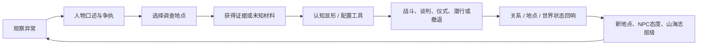

# 第一卷《黑雨》10—12小时章节扩展蓝图

## 结论与目标

现有内容 v1.3.0 应被定义为“约3—5小时的高密度调查/探索母稿 + 正在扩充的完整章节骨架”，而非已经实测完成的十小时第一卷。第一卷目标保持为：

- **主线首通**：3—4小时。
- **完成核心NPC线与三个副本**：6—8小时。
- **全探索、材料洞彻、山海志、可回访状态与四条结局复看**：10—12小时。

时长来自可读场景、调查回路、战斗/谈判/仪式多解、回访和分支差异，不来自重复刷怪、拉长同一句对话或无意义跑图。

## 章节节奏

| 幕 | 叙事问题 | 主要区域 | 关键可玩内容 | 主线时长 | 全探索增量 |
| --- | --- | --- | --- | ---: | ---: |
| 序幕：雨落 | 天为什么把雨变黑？ | 晒谷坪、粮仓、渡口、祠屋 | 出身开场、三选一救援、首个关系写入 | 25—35分 | 25分 |
| 第一幕：三影 | 尸体是人、日，还是道路？ | 北滩、白灰圈、旧祠、河堤 | 三线索调查、夜巡、证词保全、第一次战斗/驱散 | 40—55分 | 75分 |
| 第二幕：倒河 | 谁让黑雨进入杳湾？ | 河床、沉船、东桑林、村巷 | 河运旧案、无名桑树、梦行砚童、材料显形 | 45—60分 | 120分 |
| 第三幕：旧井 | 杳湾过去偷走了什么？ | 旧盐井、井壁层、昼盐池 | 两层井下探索、昼盐账、含晦副本、多解遭遇 | 50—70分 | 150分 |
| 第四幕：第七日 | 警告应由谁持有？ | 北滩、撤村路、盐泽岔口 | 羿/季狸/黎苇立场线、护送/谈判/潜行、最终归属 | 45—60分 | 100分 |
| 余响：十日 | 选择改变了谁的生活？ | 杳湾回访、东桑林、北地路标 | 结局余响、山海志洞彻、二周目钩子 | 10—15分 | 80分 |

## 内容量验收

| 内容类型 | 当前 | 扩展目标 | 说明 |
| --- | ---: | ---: | --- |
| StoryNode | 365 | 120—150 | 已超过节点目标；黑雨七日记、普通事、回执与初课等回访链已补入，仍须以实测时长、单节点有效文本与分支重玩差异验收。 |
| 可回访地点 | 12 | 12 | 已覆盖渡口、东桑、旧井、粮仓、染坊、北滩、盐泽棚屋、撤离岔口、村巷等雨中/雨后状态。 |
| 中型副本 | 3 | 3 | 倒船腹舱、东桑十巢、旧盐井均已具备多解、回访和终局回响。 |
| 微型遭遇 | 12 | 12 | 已完成；均提供知识、资源、关系或材料后果，不做刷怪。 |
| 核心NPC线 | 11 | 12 | 主要角色均有欲望、秘密、冲突与余响；后续可在第二卷补齐新增迟日的独立线。 |
| 山海志条目 | 32 | 28—32 | 已达目标上限。 |
| 材料/工具 | 28 | 28—36 | 已达目标下限，均进入剧情钩子或显形链。 |
| 任务 | 31 | 22—26 | 超过任务数量目标；后续应优先试玩整合，而非继续无节制增加任务。 |
| 结局余响 | 4 | 4主结局 + 18人物/地点余响 | 以组合结果呈现，不复制四套整卷剧情 |

## 核心可玩循环

## 三个中型副本

### DB-V01-01 倒船腹舱：归还者

- **进入条件**：赤水停流后；宿沙同行或获得渡工信号。
- **核心冲突**：宿沙的长子究竟是走私者、替罪者，还是被北方使者反复利用的证人。
- **空间规则**：船舱里每打开一扇门，河水就向过去倒流一刻钟；错误记忆会长成可攻击的“水客”。
- **解法**：开舱求证、听三响谈判、用囚雨芦引流、封舱保全宿沙。
- **回响**：影响北方交易路线、宿沙是否交出盐泽地图、季狸对玩家的债务轴。

### DB-V01-02 东桑十巢：无名之木

- **进入条件**：获得扶桑烬或阿禾信任。
- **核心冲突**：十只空巢中有一只承载“被删去的第十日”梦壳，砍树保村或命名保路都会失去一部分东西。
- **空间规则**：树名改变路径；没有名字的树会将玩家送回入口；每次使用扶桑烬会改写一段环境描述。
- **解法**：为树命名、引鸟归巢、带走受雨空巢、烧毁梦壳。
- **回响**：影响三影者东行路线、阿禾人物线和太阳数量预警精度。

### DB-V01-03 旧盐井：含晦

- **进入条件**：完成昼盐旧账线；可准备工具后进入或冒险直入。
- **核心冲突**：真相应被归还、封存，还是毁掉。
- **空间规则**：被遗忘的话成为敌方资源；白昼盐池既是弱点也是证据库。
- **解法**：揭言、诱离、过载、战斗、撤退。
- **回响**：决定村民记忆、证词归属、无辞舌骨/话罐，以及羿是否取得完整证据。

## 十二条人物线

| 人物线 | 中段冲突 | 玩家可选立场 | 后续回响 |
| --- | --- | --- | --- |
| 阿禾与小满 | 牲畜是否可作净雨祭品 | 救羊、献羊、以树名换羊 | 阿禾是否成为“留名者” |
| 砚伯与旧账 | 公开账会撕裂杳湾 | 公布、删改、交给季狸 | 诚实碑/清白历书 |
| 缄婆与井 | 承认罪责是否等于处死活人 | 封井、公开、替罪 | 守井人结局 |
| 宿沙与沉船 | 儿子是证人还是走私者 | 开舱、封舱、伪造记录 | 盐泽路线与宿沙余生 |
| 青芽与黑粟 | 饥荒下能否试种异常粮 | 隔离、试种、焚毁 | 夜谷与粮荒状态 |
| 隗青与三影 | 证人能否承受“看见” | 共同夜巡、让其撤岗、强迫作证 | 守夜人是否失去影子 |
| 砚童与梦羽 | 孩子能否从梦令中醒来 | 公开、隐瞒、入梦替换 | 梦行者/清醒者 |
| 黎苇与盐泽 | 流民是否再被交易 | 护送、交换、结盟 | 九黎路线入口 |
| 季狸与真印 | 秩序的承诺是否可相信 | 交易、揭印、设局 | 北方阵营态度 |
| 羿与空箭囊 | 未来罪名是否能拒绝 | 交箭、共证、隐瞒证据 | 第二卷对话与路线 |
| 三影者与日名 | 有无权利选择自己的名字 | 追问、保密、替其命名 | 迟日/东行/解体 |
| 玩家与被删记忆 | 为真相付出何种私人代价 | 使用扶桑烬、拒用、交换记忆 | 洞彻/二周目既视感 |

## 生产顺序

1. 先补齐第一、二幕的12个地点节点和6条短支线，形成约2小时可玩的调查网。
2. 再实现倒船腹舱、东桑十巢、旧盐井三个副本，形成可配置、多解法的3—4小时核心中段。
3. 补全第七日阵营对抗、撤村/东行/折箭/交羿四条结局路线。
4. 最后写回访、山海志第三层、人物余响与二周目入口；它们负责把“首通3—4小时”扩展为“完整探索10—12小时”。

## 验收方法

- 从新档按最短路线计时，目标3—4小时，不要求刷资源。
- 从新档完成所有中型副本、核心NPC线与山海志洞彻，目标10—12小时。
- 每个中型副本至少两种完成方式；含晦至少三种。
- 每次关键选择在30分钟内、至少一次在卷末，产生可见的NPC或地点变化。
- 任何失败只转化为伤势、时间、资源、关系、地点状态或后续入口变化，不阻断主线。
